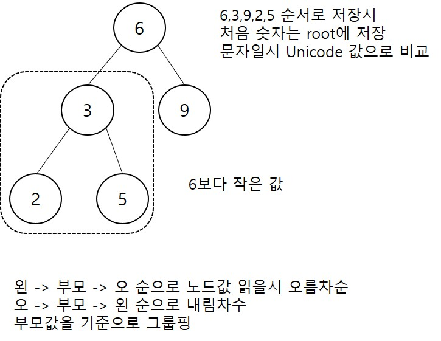
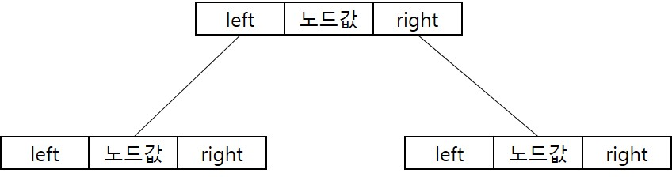
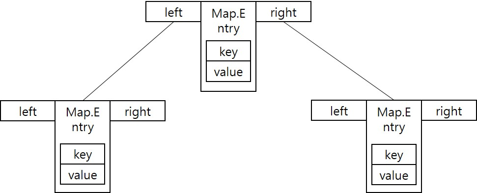

<div id="page">

<div id="main" class="aui-page-panel">

<div id="main-header">

<div id="breadcrumb-section">

1.  [Programming](index.html)
2.  [Programming](Programming_98307.html)
3.  [Java](Java_25001989.html)
4.  [Java Basic](Java-Basic_399278081.html)
5.  [Collections](Collections_25002006.html)

</div>

# <span id="title-text"> Programming : 검색기능 Collection </span>

</div>

<div id="content" class="view">

<div class="page-metadata">

Created by <span class="author"> Dongwook Han</span>, last modified on 8월 23, 2020

</div>

<div id="main-content" class="wiki-content group">

- 종류 : TreeSet, TreeMap

- 이진트리구조(binary tree)

- root로 시작, 부모 노드는 최대 2개의 자식 노드와 연결

<span class="confluence-embedded-file-wrapper image-center-wrapper"></span>

# TreeSet

- 이진트리기반의 Set Collection

- 노드는 노드값과 왼쪽,오른쪽 자식노드를 참조하기 위한 변수

<span class="confluence-embedded-file-wrapper image-center-wrapper"></span>

기본 생성\
----------

- <div class="code panel pdl" style="border-width: 1px;">

  <div class="codeContent panelContent pdl">

  ``` syntaxhighlighter-pre
  TreeSet<E> treeSet = new TreeSet<E>();
  ```

  </div>

  </div>

- TreeSet 검색 메소드

<div class="table-wrap">

|  |  |  |
|----|----|----|
| **리턴 타입** | **메소드** | **설명** |
| E | first() | 제일 낮은 객체 리턴 |
| E | last() | 제일 높은 객체 리턴 |
| E | lower(E e) | 주어진 객체보다 바로 아래 |
| E | higher(E e) | 주어진 객체보다 바로 위 |
| E | floor(E e) | 주어진 객체와 동등한 객체가 있으면 리턴, 바로 아래 객체 리턴 |
| E | ceiling(E e) | 주어진 객체와 동등 객체 or 바로 위 객체 리턴 |
| E | pollFirst() | 제일 낮은 객체 리턴하고 collection 에서 제거 |
| E | pollLast() | 제일 높은 객체 리턴하고 collection에서 제거 |

</div>

- 에제\

  <div class="code panel pdl" style="border-width: 1px;">

  <div class="codeContent panelContent pdl">

  ``` syntaxhighlighter-pre
  TreeSet<Integer> scores = new TreeSet<Integer>();
  scores.add(new Integer(87));
  scores.add(new Integer(98));
  scores.add(new Integer(75));

  score = scores.first(); //75
  score = scores.last();  //98
  score = scores.lower(new Integer(95)); //87
  score = scores.higher(new Integer(95)); //98
  score = scores.floor(new Integer(95)); //95
  score = scores.ceiling(new Integer(85)); //87

  while(scores.isEmpty()){
    socre = scores.pollFirst(); // 75 -> 80 -> 87 -> 95 -> 98
  }
  ```

  </div>

  </div>

## 정렬 메소드

<div class="table-wrap">

|  |  |  |
|----|----|----|
| **리턴 타입** | **메소드** | **설명** |
| Iterator\<E\> | descendingIterator() | 내림차순으로 정렬된 iterator 리턴 |
| NavigableSet\<e\> | descendingSet() | 내림차순으로 정렬된 NavigableSet 리턴 |

</div>

- 오름차순으로 정렬시 descendingSet() 두번 호출\

  <div class="code panel pdl" style="border-width: 1px;">

  <div class="codeContent panelContent pdl">

  ``` syntaxhighlighter-pre
  NavigableSet<E> descendingSet = treeSet.descendingSet();
  NavigableSet<E> ascendingSet = descendingSet.descendingSet();
  ```

  </div>

  </div>

<!-- -->

- 정렬 예제

  <div class="code panel pdl" style="border-width: 1px;">

  <div class="codeContent panelContent pdl">

  ``` syntaxhighlighter-pre
  TreeSet<Integer> treeSet = new TreeSet<Integer>();
  treeSet.add(new Integer(95));
  treeSet.add(new Integer(73));
  treeSet.add(new Integer(87));

  NavigableSet<Integer> descendingSet = treeSet.descendingSet();

  for(integer score: descendingSet){
    System.out.println(score); // 95 -> 87 -> 73
  }
  ```

  </div>

  </div>

## 범위 검색

<div class="table-wrap">

|  |  |  |
|----|----|----|
| **리턴 타입** | **메소드** | **설명** |
| NavigableSet\<E\> | headSet(E toElement, boolean inclusive) | 주어진 객체보다 낮은 객체들을 리턴, inclusive는 주어진 객체 포함여부 |
| NavigableSet\<E\> | tailSet\<E fromElement, boolean inclusive) | 주어진 객체보다 노ㅠ은 객체들을 리턴, inclusive는 주어진 객체 포함여부 |
| NavigableSet\<E\> | subset(E fromElement, boolean inclusive, E toElement, boolean toIncluve) | 시작과 긑으로 주어진 객체 사이의 객체들을 리턴, inclusive와 toInclusive는 주어진 객체 포함 여부 |

</div>

- 범위 검색 예제

  <div class="code panel pdl" style="border-width: 1px;">

  <div class="codeContent panelContent pdl">

  ``` syntaxhighlighter-pre
  TreeSet<String> treeSet = new TreeSet<String>();
  treeSet.add("apple");
  treeSet.add("forever");
  treeSet.add("description');
  treeSet.add("ever");
  treeSet.add("zoo");

  NavigableSet<String> rangeSet = treeSet.subSet("c", true, "f", true);

  for(String word : rangeSet){
    System.out.println(word);
  }
  ```

  </div>

  </div>

# TreeMap

- 이진트리기반의 Map Collection

- 키와 값이 저장된 Map.Entry 저장

- TreeMap 에 객체 저장시 자동 정렬(왼쪽 낮은 키값, 오른쪽 높은 키값)

<span class="confluence-embedded-file-wrapper image-center-wrapper"></span>

## 기본 생성

<div class="code panel pdl" style="border-width: 1px;">

<div class="codeContent panelContent pdl">

``` syntaxhighlighter-pre
TreeMap<K,V> treeMap = new TreeMap<K,V>();
```

</div>

</div>

- 메소드

<div class="table-wrap">

|                  |                       |                               |
|------------------|-----------------------|-------------------------------|
| **리턴 타입**    | **메소드**            | **설명**                      |
| Map.Entry\<K,V\> | firstEntry()          | 제일 낮은 Entry               |
| Map.Entry\<K,V\> | lastEntry()           | 제일 높은 Entry               |
| Map.Entry\<K,V\> | lowerEntry\*Key key)  | 주어진 키보다 바로 아래 Entry |
| Map.Entry\<K,V\> | higherEntry(Key key)  | 주어진 키보다 바로 위 Entry   |
| Map.Entry\<K,V\> | floorEntry(Key key)   | 동등하거나 바로 아래 Entry    |
| Map.Entry\<K,V\> | ceilingEntry(Key key) | 동등하거나 바로 위 Entry      |
| Map.Entry\<K,V\> | pollFirstEntry()      | 제일 낮은 Entry 리턴 후 제거  |
| Map.Entry\<K,V\> | pollLastEntry()       | 제일 높은 Entry 리턴 후 제거  |

</div>

- 사용 예제

  <div class="code panel pdl" style="border-width: 1px;">

  <div class="codeContent panelContent pdl">

  ``` syntaxhighlighter-pre
  TreeMap<Integer, String> scores = new TreeMap<>();
  scores.put(87,"홍길동");
  scores.put(98,"이동수");
  scores.put(75,"박길순");

  Map.Entry<Integer, String> entry = null;
  entry = scores.firstEntry(); // 가장 낮은 키
  System.out.println(entry.getKey() + "-" + entry.getValue());
  entry = scores.lastEntry(); // 가장 높은 키
  System.out.println(entry.getKey() + "-" + entry.getValue());

  while(!socres.isEmpty()){
    entry = scores.pollFirstEntry(); // 제일 낮은 리턴후 삭제
    System.out.println(entry.getKey() + "-" + entry.getValue());
  }
  ```

  </div>

  </div>

## TreeMap 정렬 메소드

<div class="table-wrap">

|                     |                    |                         |
|---------------------|--------------------|-------------------------|
| **리턴 타입**       | **메소드**         | **설명**                |
| NavigableSet\<K\>   | descendingKeySet() | 내림차순으로 키 정렬    |
| NavigableSet\<K,V\> | descendingMap()    | 내림차순으로 정렬된 Map |

</div>

- 오름차순으로 정렬(descendingMap) 두 번 호출\

  <div class="code panel pdl" style="border-width: 1px;">

  <div class="codeContent panelContent pdl">

  ``` syntaxhighlighter-pre
  NavigableMap<K,V> descendingMap = treeMap.descendingMap();
  NavigableMap<K,V> ascendingMap = descendingMap.descendingMap();
  ```

  </div>

  </div>

<!-- -->

- 정렬 예제\

  <div class="code panel pdl" style="border-width: 1px;">

  <div class="codeContent panelContent pdl">

  ``` syntaxhighlighter-pre
  public class TreeMapSort {

      public static void main(String[] args) {
          TreeMap<String,Integer> treeMap = new TreeMap<String,Integer>();
          treeMap.put("apple",97);
          treeMap.put("forever",87);
          treeMap.put("description",76);
          treeMap.put("ever",66);
          treeMap.put("zoo",44);

          NavigableMap<String, Integer> descendingMap = treeMap.descendingMap();
          Set<Map.Entry<String,Integer>> descendingSet = descendingMap.entrySet();
          
          for(Map.Entry<String, Integer> entry: descendingSet) {
              System.out.println(entry.getKey() + "-" + entry.getValue());
          }
      }
  }
  ```

  </div>

  </div>

## TreeMap 범위 검색

- 메소드

<div class="table-wrap">

<table class="confluenceTable" data-layout="default">
<colgroup>
<col style="width: 33%" />
<col style="width: 33%" />
<col style="width: 33%" />
</colgroup>
<tbody>
<tr>
<th class="confluenceTh"><p><strong>리턴 타입</strong></p></th>
<th class="confluenceTh"><p><strong>메소드</strong></p></th>
<th class="confluenceTh"><p><strong>설명</strong></p></th>
</tr>
&#10;<tr>
<td class="confluenceTd"><p>NavigableMap&lt;K,V&gt;</p></td>
<td class="confluenceTd"><p>headMap&lt;K toKey, boolean inclusive)</p></td>
<td class="confluenceTd"><p>주어진 키보다 낮은 Entry 리턴, inclusive 주어진 키 포함여부</p></td>
</tr>
<tr>
<td class="confluenceTd"><p>NavigableMap&lt;K,V&gt;</p></td>
<td class="confluenceTd"><p>tailMap,K fromKey, boolean inclusive)</p></td>
<td class="confluenceTd"><p>주어진 키보다 높은 Entry 리턴, inclusive 는 주어진 키 포함여부</p></td>
</tr>
<tr>
<td class="confluenceTd"><p>NavigableMap&lt;K,V&gt;</p></td>
<td class="confluenceTd"><p>subMap(K fromKey, boolean inclusive, K toKey, boolean inclusive)</p></td>
<td class="confluenceTd"><p>범위 검색</p>
<p>inclusive 는 각각의 키에 대한 포함여부</p></td>
</tr>
</tbody>
</table>

</div>

- 사용예제\

  <div class="code panel pdl" style="border-width: 1px;">

  <div class="codeContent panelContent pdl">

  ``` syntaxhighlighter-pre
  public class TreeMapRange {
      public static void main(String[] args) {
          TreeMap<String,Integer> treeMap = new TreeMap<String,Integer>();
          treeMap.put("apple",97);
          treeMap.put("forever",87);
          treeMap.put("description",76);
          treeMap.put("ever",66);
          treeMap.put("zoo",44);

          NavigableMap<String, Integer> rangeMap = treeMap.subMap("c", true,"f",true);
          
          for(Map.Entry<String, Integer> entry:rangeMap.entrySet()) {
              System.out.println(entry.getKey() + "-" + entry.getValue());
          }
      }
  }
  ```

  </div>

  </div>

# Comparable, Comparator

## Comparable

- TreeSet, TreeMap 객체의 정렬을 위해 Comparable 인터페이스 구현

- 사용자 정의 클래스의 정렬을 위해 comparable의 compareTo() 오버라이딩 필요

<div class="table-wrap">

<table class="confluenceTable" data-layout="default">
<colgroup>
<col style="width: 33%" />
<col style="width: 33%" />
<col style="width: 33%" />
</colgroup>
<tbody>
<tr>
<th class="confluenceTh"><p><strong>리턴 타입</strong></p></th>
<th class="confluenceTh"><p><strong>메소드</strong></p></th>
<th class="confluenceTh"><p><strong>설명</strong></p></th>
</tr>
&#10;<tr>
<td class="confluenceTd"><p>int</p></td>
<td class="confluenceTd"><p>compareTo(T o)</p></td>
<td class="confluenceTd"><p>주어진 객체와 같으면 0</p>
<p>주어진 객체와 적으면 음수</p>
<p>주어진 객체와 크면 양수</p></td>
</tr>
</tbody>
</table>

</div>

- Comparable 예제\

  <div class="code panel pdl" style="border-width: 1px;">

  <div class="codeContent panelContent pdl">

  ``` syntaxhighlighter-pre
  public class Person implements Comparable<Person>{
    String name;
    int age;
    
    @Override
    public int compareTo(Person o){
      if(age < o.age) return -1;
      else if(age == o.age) return 0;
      else return 1;
    }
  }
  ```

  </div>

  </div>

  \

  <div class="code panel pdl" style="border-width: 1px;">

  <div class="codeContent panelContent pdl">

  ``` syntaxhighlighter-pre
  public class PersonExample {

      public static void main(String[] args) {        
          TreeSet<Person> treeSet = new TreeSet<>();
          
          treeSet.add(new Person("홍길동",33));
          treeSet.add(new Person("김길순",23));
          treeSet.add(new Person("이길동",53));
          treeSet.add(new Person("성동일",33));
          
          System.out.println(treeSet.size());
          NavigableSet<Person> descendingSet = treeSet.descendingSet();
          
          for(Person person : descendingSet) {
              System.out.println(person.name + "-" + person.age);
          }
      }
  }
  ```

  </div>

  </div>

## Comparator

- Comparable 비구현 객체 정렬시 Comparator 를 구현하여 정렬\

  <div class="code panel pdl" style="border-width: 1px;">

  <div class="codeContent panelContent pdl">

  ``` syntaxhighlighter-pre
  TreeSet<E> treeSet = new TreeSet<E>(new AscendingComparator());
  TreeMap<K,V> treeMap = new TreMap<K,V>(new DescendingComparator());
  ```

  </div>

  </div>

- AscendingComparator 와 DescendingComparator는 Comparator 인터페이스를 구현하고 compare() 메소드 재정의\

<div class="table-wrap">

<table class="confluenceTable" data-layout="default">
<colgroup>
<col style="width: 33%" />
<col style="width: 33%" />
<col style="width: 33%" />
</colgroup>
<tbody>
<tr>
<th class="confluenceTh"><p><strong>리턴타입</strong></p></th>
<th class="confluenceTh"><p><strong>메소드</strong></p></th>
<th class="confluenceTh"><p><strong>설명</strong></p></th>
</tr>
&#10;<tr>
<td class="confluenceTd"><p>int</p></td>
<td class="confluenceTd"><p>compare(T o1, T o2)</p></td>
<td class="confluenceTd"><p>o1 == o2 0 리턴</p>
<p>o1 &lt; o2 -1 리턴</p>
<p>o1 &gt; o2 1 리턴</p></td>
</tr>
</tbody>
</table>

</div>

- 사용 예제\

  <div class="code panel pdl" style="border-width: 1px;">

  <div class="codeContent panelContent pdl">

  ``` syntaxhighlighter-pre
  public class Fruit {
      String name;
      int price;
      
      public Fruit(String name, int price) {
          this.name = name;
          this.price = price;
      }
  }
  ```

  </div>

  </div>

  \

  <div class="code panel pdl" style="border-width: 1px;">

  <div class="codeContent panelContent pdl">

  ``` syntaxhighlighter-pre
  public class AscendingComparator implements Comparator<Fruit>{
          @Override
          public int compare(Fruit f1, Fruit f2) {
              if(f1.price < f2.price) return -1;
              else if (f1.price == f2.price) return 0;
              else return 1;
          }
  }
  ```

  </div>

  </div>

  \

  <div class="code panel pdl" style="border-width: 1px;">

  <div class="codeContent panelContent pdl">

  ``` syntaxhighlighter-pre
  public class DescendingComparator implements Comparator<Fruit>{
    @OVerride
    public int compare(Fruit o1, Fruit o2){
      if(o1.price < o2.price) return 1; // 가격이 적을 수록 뒤로 정렬하도록 함
      else if(o1,price == o2.price) return 0;
      else return -1;
    }
  ```

  </div>

  </div>

  \

  <div class="code panel pdl" style="border-width: 1px;">

  <div class="codeContent panelContent pdl">

  ``` syntaxhighlighter-pre
  public class ComparatorExample {

      public static void main(String[] args) {
  //       TreeSet<Fruit> treeSet = new TreeSet<Fruit>(new DescendingComparator());
         TreeSet<Fruit> treeSet = new TreeSet<Fruit>(new AscendingComparator());
          
          treeSet.add(new Fruit("사과",1000));
          treeSet.add(new Fruit("포도",1500));
          treeSet.add(new Fruit("자몽",2000));
          treeSet.add(new Fruit("자두",900));

          System.out.println(treeSet.size());
          System.out.println();
          NavigableSet<Fruit> descendingSet = treeSet.descendingSet();
          
          for(Fruit fruit : descendingSet) {
              System.out.println(fruit.name + ":" + fruit.price);
          }
      }

  }
  ```

  </div>

  </div>

</div>

<div class="pageSection group">

<div class="pageSectionHeader">

## Attachments:

</div>

<div class="greybox" align="left">

 [binary_tree.jpg](attachments/25100370/25002205.jpg) (image/jpeg)\
 [TreeSet.jpg](attachments/25100370/25002215.jpg) (image/jpeg)\
 [Treemap.jpg](attachments/25100370/25264154.jpg) (image/jpeg)\

</div>

</div>

</div>

</div>

<div id="footer" role="contentinfo">

<div class="section footer-body">

Document generated by Confluence on 4월 05, 2026 17:57

<div id="footer-logo">

[Atlassian](http://www.atlassian.com/)

</div>

</div>

</div>

</div>
