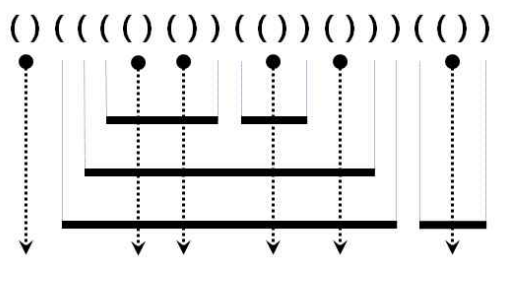

<div id="page">

<div id="main" class="aui-page-panel">

<div id="main-header">

<div id="breadcrumb-section">

1.  [Programming](README.md)
2.  [Programming](Programming_98307.md)
3.  [Java](Java_25001989.md)
4.  [알고리즘](32959.md)
5.  [문제 풀이](28868609.md)

</div>

# <span id="title-text"> Programming : Stack/Queue </span>

</div>

<div id="content" class="view">

<div class="page-metadata">

Created by <span class="author"> Dongwook Han</span>, last modified on 8월 30, 2020

</div>

<div id="main-content" class="wiki-content group">

# 다리를 지나는 트럭(2)

문제 설명

트럭 여러 대가 강을 가로지르는 일 차선 다리를 정해진 순으로 건너려 합니다. 모든 트럭이 다리를 건너려면 최소 몇 초가 걸리는지 알아내야 합니다. 트럭은 1초에 1만큼 움직이며, 다리 길이는 bridge_length이고 다리는 무게 weight까지 견딥니다.\
※ 트럭이 다리에 완전히 오르지 않은 경우, 이 트럭의 무게는 고려하지 않습니다.

예를 들어, 길이가 2이고 10kg 무게를 견디는 다리가 있습니다. 무게가 \[7, 4, 5, 6\]kg인 트럭이 순서대로 최단 시간 안에 다리를 건너려면 다음과 같이 건너야 합니다.

<div class="table-wrap">

|  |  |  |  |
|----|----|----|----|
| <span class="legacy-color-text-inverse">**경과 시간**</span> | <span class="legacy-color-text-inverse">**다리를 지난 트럭**</span> | <span class="legacy-color-text-inverse">**다리를 건너는 트럭**</span> | <span class="legacy-color-text-inverse">**대기 트럭**</span> |
| <span class="legacy-color-text-inverse">0</span> | <span class="legacy-color-text-inverse">\[\]</span> | <span class="legacy-color-text-inverse">\[\]</span> | <span class="legacy-color-text-inverse">\[7,4,5,6\]</span> |
| <span class="legacy-color-text-inverse">1~2</span> | <span class="legacy-color-text-inverse">\[\]</span> | <span class="legacy-color-text-inverse">\[7\]</span> | <span class="legacy-color-text-inverse">\[4,5,6\]</span> |
| <span class="legacy-color-text-inverse">3</span> | <span class="legacy-color-text-inverse">\[7\]</span> | <span class="legacy-color-text-inverse">\[4\]</span> | <span class="legacy-color-text-inverse">\[5,6\]</span> |
| <span class="legacy-color-text-inverse">4</span> | <span class="legacy-color-text-inverse">\[7\]</span> | <span class="legacy-color-text-inverse">\[4,5\]</span> | <span class="legacy-color-text-inverse">\[6\]</span> |
| <span class="legacy-color-text-inverse">5</span> | <span class="legacy-color-text-inverse">\[7,4\]</span> | <span class="legacy-color-text-inverse">\[5\]</span> | <span class="legacy-color-text-inverse">\[6\]</span> |
| <span class="legacy-color-text-inverse">6~7</span> | <span class="legacy-color-text-inverse">\[7,4,5\]</span> | <span class="legacy-color-text-inverse">\[6\]</span> | <span class="legacy-color-text-inverse">\[\]</span> |
| <span class="legacy-color-text-inverse">8</span> | <span class="legacy-color-text-inverse">\[7,4,5,6\]</span> | <span class="legacy-color-text-inverse">\[\]</span> | <span class="legacy-color-text-inverse">\[\]</span> |

</div>

따라서, 모든 트럭이 다리를 지나려면 최소 8초가 걸립니다.

solution 함수의 매개변수로 다리 길이 bridge_length, 다리가 견딜 수 있는 무게 weight, 트럭별 무게 truck_weights가 주어집니다. 이때 모든 트럭이 다리를 건너려면 최소 몇 초가 걸리는지 return 하도록 solution 함수를 완성하세요.

##### 제한 조건

- bridge_length는 1 이상 10,000 이하입니다.

- weight는 1 이상 10,000 이하입니다.

- truck_weights의 길이는 1 이상 10,000 이하입니다.

- 모든 트럭의 무게는 1 이상 weight 이하입니다.

##### 입출력 예

<div class="table-wrap">

|  |  |  |  |
|----|----|----|----|
| <span class="legacy-color-text-inverse">**bridge_length**</span> | <span class="legacy-color-text-inverse">**weight**</span> | <span class="legacy-color-text-inverse">**truck_weights**</span> | <span class="legacy-color-text-inverse">**return**</span> |
| <span class="legacy-color-text-inverse">2</span> | <span class="legacy-color-text-inverse">10</span> | <span class="legacy-color-text-inverse">\[7,4,5,6\]</span> | <span class="legacy-color-text-inverse">8</span> |
| <span class="legacy-color-text-inverse">100</span> | <span class="legacy-color-text-inverse">100</span> | <span class="legacy-color-text-inverse">\[10\]</span> | <span class="legacy-color-text-inverse">101</span> |
| <span class="legacy-color-text-inverse">100</span> | <span class="legacy-color-text-inverse">100</span> | <span class="legacy-color-text-inverse">\[10,10,10,10,10,10,10,10,10,10\]</span> | <span class="legacy-color-text-inverse">110</span> |

</div>

<a href="http://icpckorea.org/2016/ONLINE/problem.pdf" class="external-link" rel="nofollow">출처</a>

※ 공지 - 2020년 4월 06일 테스트케이스가 추가되었습니다.

## 풀이1

<div class="code panel pdl" style="border-width: 1px;">

<div class="codeContent panelContent pdl">

``` syntaxhighlighter-pre
import java.util.Iterator;
import java.util.linkedList;
import java.util.Queue;

public class TruckPassExample{
    Queue<Integer> bridge = new LinkedList<>();
    Queue<integer> truck = new LinkedList<>();
    int second;
    
    class Solution {
    Queue<Integer> bridge = new LinkedList<>();
    Queue<Integer> truck = new LinkedList<>();
    int answer;
    
    public int solution(int bridge_length, int weight, int[] truck_weights){
        for(int i : truck_weights){
            truck.offer(i);
        }
        
        while(!truck.isEmpty()){
            if(bridge.size() < bridge_length){
                if(calculateSum(bridge) < weight){
                    if(calculateSum(bridge) + truck.peek() <= weight){
                        bridge.offer(truck.poll());
                    }else{
                        bridge.offer(0);
                    }
                    answer++;
                }
            }else{
                bridge.poll();
                if((calculateSum(bridge) + truck.peek() <= weight)){
                    bridge.offer(truck.poll());
                }else{
                    bridge.offer(0);
                }
                answer++;
            }
        }
        
        while(!bridge.isEmpty()){
            if(bridge.size() < bridge_length){
                if(calculateSum(bridge) > 0){
                    bridge.offer(0);
                    answer++;
                }else{
                    bridge.poll();
                    answer++;
                    if(calculateSum(bridge) > 0){
                        bridge.offer(0);
                    }else{
                        break;
                    }
                }
            }
        }
        return answer;
    }
    
    private static int calculateSum(Queue queue){
        int result = 0;
        Iterator<Integer> iterator = queue.iterator();
        while(iterator.hasNext()){
            result += iterator.next();
        }
        return result;
    }
}
```

</div>

</div>

- 시간이 많이 걸림(풀이3 추천)

## 풀이2

<div class="code panel pdl" style="border-width: 1px;">

<div class="codeContent panelContent pdl">

``` syntaxhighlighter-pre
public class Solution{
    class Truck{
        int weight;
        int entry;
        
        Truck(int weight, int entry){
            this.weight = weight;
            this.entry = entry;
        }
    }
    
    int solution(int bridge_length, int weight, int[] truck_weights) {
        Queue<Truck> waiting = new LinkedList<>();
        Queue<Truck> bridge = new LinkedList<>();   
        
        for(int i: truck_weights) {
            waiting.offer(new Truck(i,0));
        }
        
        int time = 0;
        int totalWeight = 0;
        
        while(!waiting.isEmpty() || !bridge.isEmpty()) {
            time++;
            
            if(!bridge.isEmpty()) {
                Truck t = bridge.peek();
                if(time - t.entry >= bridge_length) {
                    totalWeight -= t.weight;
                    bridge.poll();
                }
            }
            
            if(!waiting.isEmpty()) {
                if(totalWeight + waiting.peek().weight <= weight) {
                    Truck t = waiting.poll();
                    totalWeight += t.weight;
                    
                    bridge.offer(new Truck(t.weight,time));
                }
            }
        }
        return time;
    }
}
```

</div>

</div>

## 풀이3

<div class="code panel pdl" style="border-width: 1px;">

<div class="codeContent panelContent pdl">

``` syntaxhighlighter-pre
public class Solution{
class Truck{
        int weight;
        int move;
        
        Truck(int weight){
            this.weight = weight;
            this.move = 1;
        }
        
        public void moving() {
            move++;
        }
    }
    
    int solution(int bridge_length, int weight, int[] truck_weights) {
        Queue<Truck> waiting = new LinkedList<>();
        Queue<Truck> bridge = new LinkedList<>();   
        
        for(int i: truck_weights) {
            waiting.offer(new Truck(i));
        }
        
        int answer = 0;
        int totalWeight = 0;
        
        while(!waiting.isEmpty() || !bridge.isEmpty()) {
            answer++;
            
            if(bridge.isEmpty()) {
                Truck t = waiting.poll();
                totalWeight += t.weight;
                bridge.offer(t);
                continue;
            }
            
            for(Truck t : bridge) {
                t.moving();
            }
            
            if(bridge.peek().move > bridge_length) {
                Truck t = bridge.poll();
                totalWeight -= t.weight;
            }
            
            if(!waiting.isEmpty() && totalWeight + waiting.peek().weight <= weight) {
                Truck t = waiting.poll();
                totalWeight += t.weight;
                bridge.offer(t);
            }
            
        }
        return answer;
    }
}
```

</div>

</div>

# 탑(2)

문제 설명

수평 직선에 탑 N대를 세웠습니다. 모든 탑의 꼭대기에는 신호를 송/수신하는 장치를 설치했습니다. 발사한 신호는 신호를 보낸 탑보다 높은 탑에서만 수신합니다. 또한, 한 번 수신된 신호는 다른 탑으로 송신되지 않습니다.

예를 들어 높이가 6, 9, 5, 7, 4인 다섯 탑이 왼쪽으로 동시에 레이저 신호를 발사합니다. 그러면, 탑은 다음과 같이 신호를 주고받습니다. 높이가 4인 다섯 번째 탑에서 발사한 신호는 높이가 7인 네 번째 탑이 수신하고, 높이가 7인 네 번째 탑의 신호는 높이가 9인 두 번째 탑이, 높이가 5인 세 번째 탑의 신호도 높이가 9인 두 번째 탑이 수신합니다. 높이가 9인 두 번째 탑과 높이가 6인 첫 번째 탑이 보낸 레이저 신호는 어떤 탑에서도 수신할 수 없습니다.

<div class="table-wrap">

<table class="confluenceTable" data-layout="default">
<colgroup>
<col style="width: 50%" />
<col style="width: 50%" />
</colgroup>
<tbody>
<tr>
<th class="confluenceTh" data-highlight-colour="#202b3d"><p><span class="legacy-color-text-inverse"><strong>송신 탑(높이)</strong></span></p></th>
<th class="confluenceTh" data-highlight-colour="#202b3d"><p><span class="legacy-color-text-inverse"><strong>수신 탑(높이)</strong></span></p></th>
</tr>
&#10;<tr>
<td class="confluenceTd" data-highlight-colour="#202b3d"><p><span class="legacy-color-text-inverse">5(4)</span></p></td>
<td class="confluenceTd" data-highlight-colour="#202b3d"><p><span class="legacy-color-text-inverse">4(7)</span></p></td>
</tr>
<tr>
<td class="confluenceTd" data-highlight-colour="#202b3d"><p><span class="legacy-color-text-inverse">4(7)</span></p></td>
<td class="confluenceTd" data-highlight-colour="#202b3d"><p><span class="legacy-color-text-inverse">2(9)</span></p></td>
</tr>
<tr>
<td class="confluenceTd" data-highlight-colour="#202b3d"><p><span class="legacy-color-text-inverse">3(5)</span></p></td>
<td class="confluenceTd" data-highlight-colour="#202b3d"><p><span class="legacy-color-text-inverse">2(9)</span></p></td>
</tr>
<tr>
<td class="confluenceTd" data-highlight-colour="#202b3d"><p><span class="legacy-color-text-inverse">2(9)</span></p></td>
<td class="confluenceTd" data-highlight-colour="#202b3d"><ul>
<li></li>
</ul></td>
</tr>
<tr>
<td class="confluenceTd" data-highlight-colour="#202b3d"><p><span class="legacy-color-text-inverse">1(6)</span></p></td>
<td class="confluenceTd" data-highlight-colour="#202b3d"><ul>
<li></li>
</ul></td>
</tr>
</tbody>
</table>

</div>

맨 왼쪽부터 순서대로 탑의 높이를 담은 배열 heights가 매개변수로 주어질 때 각 탑이 쏜 신호를 어느 탑에서 받았는지 기록한 배열을 return 하도록 solution 함수를 작성해주세요.

##### 제한 사항

- heights는 길이 2 이상 100 이하인 정수 배열입니다.

- 모든 탑의 높이는 1 이상 100 이하입니다.

- 신호를 수신하는 탑이 없으면 0으로 표시합니다.

##### 입출력 예

<div class="table-wrap">

|  |  |
|----|----|
| <span class="legacy-color-text-inverse">**heights**</span> | <span class="legacy-color-text-inverse">**return**</span> |
| <span class="legacy-color-text-inverse">\[6,9,5,7,4\]</span> | <span class="legacy-color-text-inverse">\[0,0,2,2,4\]</span> |
| <span class="legacy-color-text-inverse">\[3,9,9,3,5,7,2\]</span> | <span class="legacy-color-text-inverse">\[0,0,0,3,3,3,6\]</span> |
| <span class="legacy-color-text-inverse">\[1,5,3,6,7,6,5\]</span> | <span class="legacy-color-text-inverse">\[0,0,2,0,0,5,6\]</span> |

</div>

##### 입출력 예 설명

입출력 예 \#1\
앞서 설명한 예와 같습니다.

입출력 예 \#2

\[1,2,3\] 번째 탑이 쏜 신호는 아무도 수신하지 않습니다.\
\[4,5,6\] 번째 탑이 쏜 신호는 3번째 탑이 수신합니다.\
\[7\] 번째 탑이 쏜 신호는 6번째 탑이 수신합니다.

입출력 예 \#3

\[1,2,4,5\] 번째 탑이 쏜 신호는 아무도 수신하지 않습니다.\
\[3\] 번째 탑이 쏜 신호는 2번째 탑이 수신합니다.\
\[6\] 번째 탑이 쏜 신호는 5번째 탑이 수신합니다.\
\[7\] 번째 탑이 쏜 신호는 6번째 탑이 수신합니다.

## 풀이1

<div class="code panel pdl" style="border-width: 1px;">

<div class="codeContent panelContent pdl">

``` syntaxhighlighter-pre
public class TopExample{
    int[] solution(int[] heights){
        Stack<Integer> topStack = new Stack<>();
        int[] result = new int[heights.length];
        
        for(int i : heights){
            topStack.push(i);
        }
        
        int idx = heights.length-1;
        
        while(!topStack.isEmpty()){
            int send = topStack.pop();
            
            for(int i = idx -1; i > 0; i--){
                if(send < heights[i]){
                    result[idx] = (i+1);
                    break;
                }
            }
            idex--;
        }
        return result;
    }   
}
```

</div>

</div>

# 프린터(2)

문제 설명

일반적인 프린터는 인쇄 요청이 들어온 순서대로 인쇄합니다. 그렇기 때문에 중요한 문서가 나중에 인쇄될 수 있습니다. 이런 문제를 보완하기 위해 중요도가 높은 문서를 먼저 인쇄하는 프린터를 개발했습니다. 이 새롭게 개발한 프린터는 아래와 같은 방식으로 인쇄 작업을 수행합니다.

<div class="code panel pdl" style="border-width: 1px;">

<div class="codeContent panelContent pdl">

``` syntaxhighlighter-pre
1. 인쇄 대기목록의 가장 앞에 있는 문서(J)를 대기목록에서 꺼냅니다.
2. 나머지 인쇄 대기목록에서 J보다 중요도가 높은 문서가 한 개라도 존재하면 J를 대기목록의 가장 마지막에 넣습니다.
3. 그렇지 않으면 J를 인쇄합니다.
```

</div>

</div>

예를 들어, 4개의 문서(A, B, C, D)가 순서대로 인쇄 대기목록에 있고 중요도가 2 1 3 2 라면 C D A B 순으로 인쇄하게 됩니다.

내가 인쇄를 요청한 문서가 몇 번째로 인쇄되는지 알고 싶습니다. 위의 예에서 C는 1번째로, A는 3번째로 인쇄됩니다.

현재 대기목록에 있는 문서의 중요도가 순서대로 담긴 배열 priorities와 내가 인쇄를 요청한 문서가 현재 대기목록의 어떤 위치에 있는지를 알려주는 location이 매개변수로 주어질 때, 내가 인쇄를 요청한 문서가 몇 번째로 인쇄되는지 return 하도록 solution 함수를 작성해주세요.

##### 제한사항

- 현재 대기목록에는 1개 이상 100개 이하의 문서가 있습니다.

- 인쇄 작업의 중요도는 1~9로 표현하며 숫자가 클수록 중요하다는 뜻입니다.

- location은 0 이상 (현재 대기목록에 있는 작업 수 - 1) 이하의 값을 가지며 대기목록의 가장 앞에 있으면 0, 두 번째에 있으면 1로 표현합니다.

##### 입출력 예

<div class="table-wrap">

|  |  |  |
|----|----|----|
| <span class="legacy-color-text-inverse">**priorities**</span> | <span class="legacy-color-text-inverse">**location**</span> | <span class="legacy-color-text-inverse">**return**</span> |
| <span class="legacy-color-text-inverse">\[2, 1, 3, 2\]</span> | <span class="legacy-color-text-inverse">2</span> | <span class="legacy-color-text-inverse">1</span> |
| <span class="legacy-color-text-inverse">\[1, 1, 9, 1, 1, 1\]</span> | <span class="legacy-color-text-inverse">0</span> | <span class="legacy-color-text-inverse">5</span> |

</div>

##### 입출력 예 설명

예제 \#1

문제에 나온 예와 같습니다.

예제 \#2

6개의 문서(A, B, C, D, E, F)가 인쇄 대기목록에 있고 중요도가 1 1 9 1 1 1 이므로 C D E F A B 순으로 인쇄합니다.

## 풀이1

<div class="code panel pdl" style="border-width: 1px;">

<div class="codeContent panelContent pdl">

``` syntaxhighlighter-pre
public class PrinterExample{
  class Print{
        int prior;
        int location;
        
        Print(int prior, int location){
            this.prior = prior;
            this.location = location;
        }
    }
    
  int solution(int[] priorities, int location){
    int answer = 0;
    Queue<Print> waiting = new LinkedList<>();
    Queue<Print> order = new LinkedList<>();
    
    for(int i = 0; i < priorities.length; i++) {
        if(i == priorities.length -1) {
            order.offer(new Print(priorities[i],i));
        }else {
            for(int j = i + 1; j < priorities.length; j++) {
                if(priorities[i] < priorities[j]) {
                    waiting.offer(new Print(priorities[i],i));
                    break;
                }else {
                    if(j == priorities.length-1 && i < priorities.length -1) {
                        order.offer(new Print(priorities[i],i));
                    }else if( i == priorities.length -1 && j == priorities.length -1){
                        order.offer(new Print(priorities[j],j));
                    }
                }
            }
        }
    }
    
   Print[] printOrder = new Print[priorities.length];
        
    int idx = 0;
    while(!order.isEmpty()) {
        printOrder[idx++] = order.poll();
    }
        
    while(!waiting.isEmpty()) {
        printOrder[idx++] = waiting.poll();
    }   
        
    for(int i = 0; i < printOrder.length; i++) {
        if(printOrder[i].location == location) {
            answer = i+1;
        }
    }
  return answer;
}
```

</div>

</div>

## 풀이2

<div class="code panel pdl" style="border-width: 1px;">

<div class="codeContent panelContent pdl">

``` syntaxhighlighter-pre
class Print{
        int prior;
        int location;
        
        Print(int prior, int location){
            this.prior = prior;
            this.location = location;
        }
    }
    
    public int solution(int[] priorities, int location) {
        int answer = 0;
        Queue<Print> waiting = new LinkedList<>();
        Queue<Print> order = new LinkedList<>();
        for(int i = 0; i < priorities.length; i++) {
            if(i == priorities.length -1) {
                order.offer(new Print(priorities[i],i));
            }else {
                for(int j = i + 1; j < priorities.length; j++) {
                    if(priorities[i] < priorities[j]) {
                        waiting.offer(new Print(priorities[i],i));
                        break;
                    }else {
                        if(j == priorities.length-1 && i < priorities.length -1) {
                            order.offer(new Print(priorities[i],i));
                        }else if( i == priorities.length -1 && j == priorities.length -1){
                            order.offer(new Print(priorities[j],j));
                        }
                    }
                }
            }
        }
        Print[] printOrder = new Print[priorities.length];
        
        int idx = 0;
        while(!order.isEmpty()) {
            printOrder[idx++] = order.poll();
        }
        
        while(!waiting.isEmpty()) {
            printOrder[idx++] = waiting.poll();
        }
        
        
        for(int i = 0; i < printOrder.length; i++) {
            if(printOrder[i].location == location) {
                answer = i+1;
            }
        }
        
        
        return answer;
    }
```

</div>

</div>

- 정확도 점수를 잘 못받은 풀이

## 풀이3

<div class="code panel pdl" style="border-width: 1px;">

<div class="codeContent panelContent pdl">

``` syntaxhighlighter-pre
   class Print{
        int prior;
        int location;
        
        Print(int prior, int location){
            this.prior = prior;
            this.location = location;
        }
    }
    
    int solution(int[] priorities, int location) {
        int answer = 0;
        Queue<Print> queue = new LinkedList<>();
        
        int max = 0;
        
        for(int i = 0; i < priorities.length;i++) {
            queue.add(new Print(priorities[i],i));
            max = Math.max(max, priorities[i]);
        }
        
        int idx = 0;
        
        while(!queue.isEmpty()) {
            Print p = queue.poll();
            if(max == p.prior) {
                answer++;
                if(p.location == location)
                    break;
                idx = 0;
            }else {
                queue.add(p);
                idx++;
                if(idx == queue.size()) {
                    idx = 0;
                    max--;
                }
            }
        }
        return answer;
    }
```

</div>

</div>

- 이 풀이로 제출

## 풀이4

<div class="code panel pdl" style="border-width: 1px;">

<div class="codeContent panelContent pdl">

``` syntaxhighlighter-pre
public int solution(int[] priorities, int location) {
         int answer = 0;
         int l = location;

         Queue<Integer> que = new LinkedList<Integer>();
         for(int i : priorities){
             que.add(i);
         }

         Arrays.sort(priorities);
         int size = priorities.length-1;

         while(!que.isEmpty()){
             Integer i = que.poll();
             if(i == priorities[size - answer]){
                 answer++;
                 l--;
                 if(l <0)
                     break;
             }else{
                 que.add(i);
                 l--;
                 if(l<0)
                     l=que.size()-1;
             }
         }
         return answer;
    }
```

</div>

</div>

- 모범 답안이라는데 실제 실행해 보면 문제에서 제시한 답과 다른 결과가 나옴.

# 쇠막대기(2)

문제 설명

여러 개의 쇠막대기를 레이저로 절단하려고 합니다. 효율적인 작업을 위해서 쇠막대기를 아래에서 위로 겹쳐 놓고, 레이저를 위에서 수직으로 발사하여 쇠막대기들을 자릅니다. 쇠막대기와 레이저의 배치는 다음 조건을 만족합니다.

<div class="code panel pdl" style="border-width: 1px;">

<div class="codeContent panelContent pdl">

``` syntaxhighlighter-pre
- 쇠막대기는 자신보다 긴 쇠막대기 위에만 놓일 수 있습니다.
- 쇠막대기를 다른 쇠막대기 위에 놓는 경우 완전히 포함되도록 놓되, 끝점은 겹치지 않도록 놓습니다.
- 각 쇠막대기를 자르는 레이저는 적어도 하나 존재합니다.
- 레이저는 어떤 쇠막대기의 양 끝점과도 겹치지 않습니다.
```

</div>

</div>

아래 그림은 위 조건을 만족하는 예를 보여줍니다. 수평으로 그려진 굵은 실선은 쇠막대기이고, 점은 레이저의 위치, 수직으로 그려진 점선 화살표는 레이저의 발사 방향입니다.

<span class="confluence-embedded-file-wrapper image-center-wrapper"></span>

이러한 레이저와 쇠막대기의 배치는 다음과 같이 괄호를 이용하여 왼쪽부터 순서대로 표현할 수 있습니다.

<div class="code panel pdl" style="border-width: 1px;">

<div class="codeContent panelContent pdl">

``` syntaxhighlighter-pre
(a) 레이저는 여는 괄호와 닫는 괄호의 인접한 쌍 '()'으로 표현합니다. 또한 모든 '()'는 반드시 레이저를 표현합니다.
(b) 쇠막대기의 왼쪽 끝은 여는 괄호 '('로, 오른쪽 끝은 닫힌 괄호 ')'로 표현됩니다.
```

</div>

</div>

위 예의 괄호 표현은 그림 위에 주어져 있습니다.\
쇠막대기는 레이저에 의해 몇 개의 조각으로 잘리는데, 위 예에서 가장 위에 있는 두 개의 쇠막대기는 각각 3개와 2개의 조각으로 잘리고, 이와 같은 방식으로 주어진 쇠막대기들은 총 17개의 조각으로 잘립니다.

쇠막대기와 레이저의 배치를 표현한 문자열 arrangement가 매개변수로 주어질 때, 잘린 쇠막대기 조각의 총 개수를 return 하도록 solution 함수를 작성해주세요.

##### 제한사항

- arrangement의 길이는 최대 100,000입니다.

- arrangement의 여는 괄호와 닫는 괄호는 항상 쌍을 이룹니다.

##### 입출력 예

<div class="table-wrap">

|  |  |
|----|----|
| <span class="legacy-color-text-inverse">**arrangement**</span> | <span class="legacy-color-text-inverse">**return**</span> |
| <span class="legacy-color-text-inverse">()(((()())(())()))(())</span> | <span class="legacy-color-text-inverse">17</span> |

</div>

##### 입출력 예 설명

문제에 나온 예와 같습니다.

## 풀이1

<div class="code panel pdl" style="border-width: 1px;">

<div class="codeContent panelContent pdl">

``` syntaxhighlighter-pre
int solution(String arrangement){
  int answer = 0;
  Stack<integer> stack = new Stack<>();
  
  for(int i = 0; i < arrangement.toCharArray().length; i++){
    if(arrangement.charAt(i) == '('){
      if(arrangement.charAt( i +1) == ')'){
        answer += stack.size();
        i++;
      }else {
        stack.push(1);
      }
    }else {
      stack.pop();
      answer++;
    }
  }
  return answer;
}
```

</div>

</div>

# 주식가격(2)

문제 설명

초 단위로 기록된 주식가격이 담긴 배열 prices가 매개변수로 주어질 때, 가격이 떨어지지 않은 기간은 몇 초인지를 return 하도록 solution 함수를 완성하세요.

##### 제한사항

- prices의 각 가격은 1 이상 10,000 이하인 자연수입니다.

- prices의 길이는 2 이상 100,000 이하입니다.

##### 입출력 예

<div class="table-wrap">

|  |  |
|----|----|
| <u><span class="legacy-color-text-inverse">**prices**</span></u> | <span class="legacy-color-text-inverse">**return**</span> |
| <span class="legacy-color-text-inverse">\[1, 2, 3, 2, 3\]</span> | <span class="legacy-color-text-inverse">\[4, 3, 1, 1, 0\]</span> |

</div>

##### 입출력 예 설명

- 1초 시점의 ₩1은 끝까지 가격이 떨어지지 않았습니다.

- 2초 시점의 ₩2은 끝까지 가격이 떨어지지 않았습니다.

- 3초 시점의 ₩3은 1초뒤에 가격이 떨어집니다. 따라서 1초간 가격이 떨어지지 않은 것으로 봅니다.

- 4초 시점의 ₩2은 1초간 가격이 떨어지지 않았습니다.

- 5초 시점의 ₩3은 0초간 가격이 떨어지지 않았습니다.

## 풀이1

<div class="code panel pdl" style="border-width: 1px;">

<div class="codeContent panelContent pdl">

``` syntaxhighlighter-pre
public int[] solution(int[] prices){
    int[] answer = new int[prices.length];
    int second;
  
    for(int i = 0; i < prices.length-1; i++){
        second = 0;
        for(int j = i +1; j < prices.length; j++){
            if(prices[i] > prices[j]) {
                second++;
                break;
            }else {
                second++;
            }
        }
        answer[i] = second;
    }
  return answer;
}
```

</div>

</div>

# 기능개발(2)

문제 설명

프로그래머스 팀에서는 기능 개선 작업을 수행 중입니다. 각 기능은 진도가 100%일 때 서비스에 반영할 수 있습니다.

또, 각 기능의 개발속도는 모두 다르기 때문에 뒤에 있는 기능이 앞에 있는 기능보다 먼저 개발될 수 있고, 이때 뒤에 있는 기능은 앞에 있는 기능이 배포될 때 함께 배포됩니다.

먼저 배포되어야 하는 순서대로 작업의 진도가 적힌 정수 배열 progresses와 각 작업의 개발 속도가 적힌 정수 배열 speeds가 주어질 때 각 배포마다 몇 개의 기능이 배포되는지를 return 하도록 solution 함수를 완성하세요.

##### 제한 사항

- 작업의 개수(progresses, speeds배열의 길이)는 100개 이하입니다.

- 작업 진도는 100 미만의 자연수입니다.

- 작업 속도는 100 이하의 자연수입니다.

- 배포는 하루에 한 번만 할 수 있으며, 하루의 끝에 이루어진다고 가정합니다. 예를 들어 진도율이 95%인 작업의 개발 속도가 하루에 4%라면 배포는 2일 뒤에 이루어집니다.

##### 입출력 예

<div class="table-wrap">

|  |  |  |
|----|----|----|
| <u><span class="legacy-color-text-inverse">**progresses**</span></u> | <span class="legacy-color-text-inverse">**speeds**</span> | <span class="legacy-color-text-inverse">**return**</span> |
| <span class="legacy-color-text-inverse">\[93,30,55\]</span> | <span class="legacy-color-text-inverse">\[1,30,5\]</span> | <span class="legacy-color-text-inverse">\[2,1\]</span> |

</div>

##### 입출력 예 설명

첫 번째 기능은 93% 완료되어 있고 하루에 1%씩 작업이 가능하므로 7일간 작업 후 배포가 가능합니다.\
두 번째 기능은 30%가 완료되어 있고 하루에 30%씩 작업이 가능하므로 3일간 작업 후 배포가 가능합니다. 하지만 이전 첫 번째 기능이 아직 완성된 상태가 아니기 때문에 첫 번째 기능이 배포되는 7일째 배포됩니다.\
세 번째 기능은 55%가 완료되어 있고 하루에 5%씩 작업이 가능하므로 9일간 작업 후 배포가 가능합니다.

따라서 7일째에 2개의 기능, 9일째에 1개의 기능이 배포됩니다.

## 풀이1

<div class="code panel pdl" style="border-width: 1px;">

<div class="codeContent panelContent pdl">

``` syntaxhighlighter-pre
int[] solution(int[] progress, int[] speeds){
    int[] answer = null;
    Queue<Integer> queue = new LinkedList<>();
    ArrayList<Integer> result = new ArrayList<>();
  
    for(int i = 0; i < progresses.length; i++) {
        // double 로 계산해서 소숫점 아래는 무조건 1일 추가
        double day = (double)Math.ceil(100 - progresses[i]) / speeds[i];
        queue.offer((int)Math.ceil(day));
    }
  
    while(!queue.isEmpty()) {
        int temp = queue.peek();
        int days = 0;
        while(queue.peek() <= temp) {
            days++;
            queue.poll();
            if(queue.isEmpty()) break;
        }
        result.add(days);
    }
  answer = new int[result.size()];
        
   for(int i = 0; i < result.size(); i++) {
        answer[i] = result.get(i);
    }
    return answer;
}
```

</div>

</div>

- 잔여 날짜를 구할때 int 로 계산이 되어 버리면 소숫점 아래는 절삭이 되어 버림

- 계산 결과를 double 로 처리하고 Math.Ceil() 으로 올림 처리하여 잔여 일수를 구함(계산 오류가 난 이유)

## 풀이2

<div class="code panel pdl" style="border-width: 1px;">

<div class="codeContent panelContent pdl">

``` syntaxhighlighter-pre
import java.util.ArrayList;
import java.util.Arrays;
class Solution {
    public int[] solution(int[] progresses, int[] speeds) {
        int[] dayOfend = new int[100];
        int day = -1;
        for(int i=0; i<progresses.length; i++) {
            while(progresses[i] + (day*speeds[i]) < 100) {
                day++;
            }
            dayOfend[day]++;
        }
        return Arrays.stream(dayOfend).filter(i -> i!=0).toArray();
    }
}
```

</div>

</div>

- 문제 조건에 100일의 한도가 달려 있어서 100일치 배열을 만들어 놓고 해당 일자에 완성되는 프로그램 수를 추가하여 최종적으로 프로그램 수가 0이 아닌 수만 출력

</div>

</div>

</div>

<div id="footer" role="contentinfo">

<div class="section footer-body">

Document generated by Confluence on 4월 05, 2026 17:57


</div>

</div>

</div>
