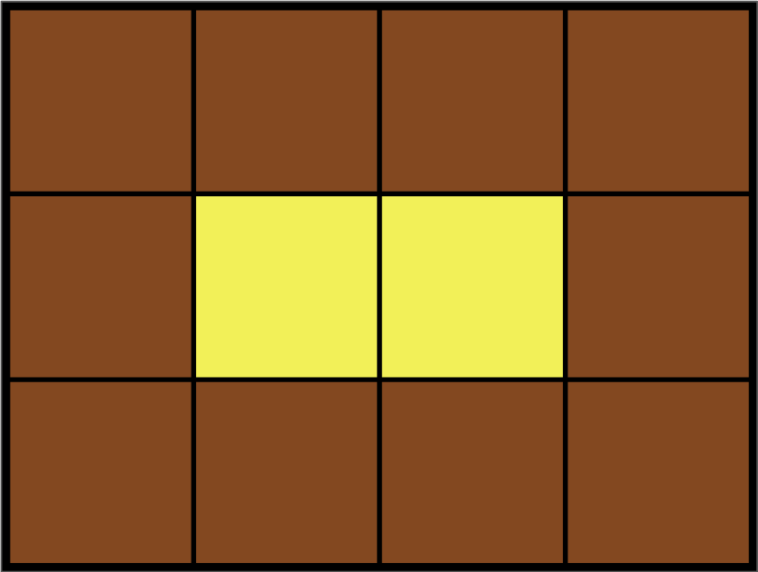

<div id="page">

<div id="main" class="aui-page-panel">

<div id="main-header">

<div id="breadcrumb-section">

1.  [Programming](README.md)
2.  [Programming](Programming_98307.md)
3.  [Java](Java_25001989.md)
4.  [알고리즘](32959.md)
5.  [문제 풀이](28868609.md)

</div>

# <span id="title-text"> Programming : 완전탐색 </span>

</div>

<div id="content" class="view">

<div class="page-metadata">

Created by <span class="author"> Dongwook Han</span>, last modified on 8월 30, 2020

</div>

<div id="main-content" class="wiki-content group">

# 모의고사(1)

문제 설명

수포자는 수학을 포기한 사람의 준말입니다. 수포자 삼인방은 모의고사에 수학 문제를 전부 찍으려 합니다. 수포자는 1번 문제부터 마지막 문제까지 다음과 같이 찍습니다.

1번 수포자가 찍는 방식: 1, 2, 3, 4, 5, 1, 2, 3, 4, 5, ...\
2번 수포자가 찍는 방식: 2, 1, 2, 3, 2, 4, 2, 5, 2, 1, 2, 3, 2, 4, 2, 5, ...\
3번 수포자가 찍는 방식: 3, 3, 1, 1, 2, 2, 4, 4, 5, 5, 3, 3, 1, 1, 2, 2, 4, 4, 5, 5, ...

1번 문제부터 마지막 문제까지의 정답이 순서대로 들은 배열 answers가 주어졌을 때, 가장 많은 문제를 맞힌 사람이 누구인지 배열에 담아 return 하도록 solution 함수를 작성해주세요.

##### 제한 조건

- 시험은 최대 10,000 문제로 구성되어있습니다.

- 문제의 정답은 1, 2, 3, 4, 5중 하나입니다.

- 가장 높은 점수를 받은 사람이 여럿일 경우, return하는 값을 오름차순 정렬해주세요.

##### 입출력 예

<div class="table-wrap">

|  |  |
|----|----|
| <span class="legacy-color-text-inverse">**answers**</span> | <span class="legacy-color-text-inverse">**return**</span> |
| <span class="legacy-color-text-inverse">\[1,2,3,4,5\]</span> | <span class="legacy-color-text-inverse">\[1\]</span> |
| <span class="legacy-color-text-inverse">\[1,3,2,4,2\]</span> | <span class="legacy-color-text-inverse">\[1,2,3\]</span> |

</div>

##### 입출력 예 설명

입출력 예 \#1

- 수포자 1은 모든 문제를 맞혔습니다.

- 수포자 2는 모든 문제를 틀렸습니다.

- 수포자 3은 모든 문제를 틀렸습니다.

따라서 가장 문제를 많이 맞힌 사람은 수포자 1입니다.

입출력 예 \#2

- 모든 사람이 2문제씩을 맞췄습니다.

## 풀이1

<div class="code panel pdl" style="border-width: 1px;">

<div class="codeContent panelContent pdl">

``` syntaxhighlighter-pre
import java.util.Arrays;
class Solution {
    public int[] solution(int[] answers) {
        int[] answer;
        int[] temp = new int[3];
        int[] person1 = {1,2,3,4,5};
        int[] person2 = {2,1,2,3,2,4,2,5};
        int[] person3 = {3,3,1,1,2,2,4,4,5,5};
        
        int sumOfPerson1 = 0;
        int sumOfPerson2 = 0;
        int sumOfPerson3 = 0;
        
        for(int i =0; i < answers.length; i++){
            if(answers[i] == person1[i%5]){
                sumOfPerson1++;
            }
            if(answers[i] == person2[i%8]){
                sumOfPerson2++;
            }
            if(answers[i] == person3[i%10]){
                sumOfPerson3++;
            }
        }
        
        temp[0] = sumOfPerson1;
        temp[1] = sumOfPerson2;
        temp[2] = sumOfPerson3;
        
        int[] temp2 = new int[3];
        System.arraycopy(temp, 0, temp2, 0,3);
        
        Arrays.sort(temp2);
        int max = 0;
        int count = 0;
        
        for(int k = temp2.length-1; k >= 0; k--){
            if(max < temp2[k]){
                max = temp2[k];
            }
            
            if(max == temp2[k]){
                count++;
            }
        }
        
        if(count > 1){
            answer = new int[count];
            int l = 0;
            while(l < count){
                for(int m = 0; m < temp.length; m++){
                    if(max == temp[m]){
                        answer[l] = m +1;
                        ++l;
                    }
                }
            }
        }else{
            answer = new int[1];
            for(int m = 0; m < temp.length; m++){
                    if(max == temp[m]){
                        answer[0] = m +1;
                    }
                }
        }
        return answer;
    }
}
```

</div>

</div>

## 풀이2

<div class="code panel pdl" style="border-width: 1px;">

<div class="codeContent panelContent pdl">

``` syntaxhighlighter-pre
import java.util.ArrayList;
class Solution {
    public int[] solution(int[] answer) {
        int[] a = {1, 2, 3, 4, 5};
        int[] b = {2, 1, 2, 3, 2, 4, 2, 5};
        int[] c = {3, 3, 1, 1, 2, 2, 4, 4, 5, 5};
        int[] score = new int[3];
        for(int i=0; i<answer.length; i++) {
            if(answer[i] == a[i%a.length]) {score[0]++;}
            if(answer[i] == b[i%b.length]) {score[1]++;}
            if(answer[i] == c[i%c.length]) {score[2]++;}
        }
        int maxScore = Math.max(score[0], Math.max(score[1], score[2]));
        ArrayList<Integer> list = new ArrayList<>();
        if(maxScore == score[0]) {list.add(1);}
        if(maxScore == score[1]) {list.add(2);}
        if(maxScore == score[2]) {list.add(3);}
        return list.stream().mapToInt(i->i.intValue()).toArray();
    }
}
```

</div>

</div>

# 소수찾기(2)

문제 설명

한자리 숫자가 적힌 종이 조각이 흩어져있습니다. 흩어진 종이 조각을 붙여 소수를 몇 개 만들 수 있는지 알아내려 합니다.

각 종이 조각에 적힌 숫자가 적힌 문자열 numbers가 주어졌을 때, 종이 조각으로 만들 수 있는 소수가 몇 개인지 return 하도록 solution 함수를 완성해주세요.

##### 제한사항

- numbers는 길이 1 이상 7 이하인 문자열입니다.

- numbers는 0~9까지 숫자만으로 이루어져 있습니다.

- 013은 0, 1, 3 숫자가 적힌 종이 조각이 흩어져있다는 의미입니다.

##### 입출력 예

<div class="table-wrap">

|  |  |
|----|----|
| <span class="legacy-color-text-inverse">**numbers**</span> | <span class="legacy-color-text-inverse">**return**</span> |
| <span class="legacy-color-text-inverse">17</span> | <span class="legacy-color-text-inverse">3</span> |
| <span class="legacy-color-text-inverse">011</span> | <span class="legacy-color-text-inverse">2</span> |

</div>

##### 입출력 예 설명

예제 \#1\
\[1, 7\]으로는 소수 \[7, 17, 71\]를 만들 수 있습니다.

예제 \#2\
\[0, 1, 1\]으로는 소수 \[11, 101\]를 만들 수 있습니다.

- 11과 011은 같은 숫자로 취급합니다.

# 숫자야구(2)

문제 설명

숫자 야구 게임이란 2명이 서로가 생각한 숫자를 맞추는 게임입니다. <a href="https://scratch.mit.edu/projects/131352991/" class="external-link" rel="nofollow">게임해보기</a>

각자 서로 다른 1~9까지 3자리 임의의 숫자를 정한 뒤 서로에게 3자리의 숫자를 불러서 결과를 확인합니다. 그리고 그 결과를 토대로 상대가 정한 숫자를 예상한 뒤 맞힙니다.

<div class="code panel pdl" style="border-width: 1px;">

<div class="codeContent panelContent pdl">

``` syntaxhighlighter-pre
* 숫자는 맞지만, 위치가 틀렸을 때는 볼
* 숫자와 위치가 모두 맞을 때는 스트라이크
* 숫자와 위치가 모두 틀렸을 때는 아웃
```

</div>

</div>

예를 들어, 아래의 경우가 있으면

<div class="code panel pdl" style="border-width: 1px;">

<div class="codeContent panelContent pdl">

``` syntaxhighlighter-pre
A : 123
B : 1스트라이크 1볼.
A : 356
B : 1스트라이크 0볼.
A : 327
B : 2스트라이크 0볼.
A : 489
B : 0스트라이크 1볼.
```

</div>

</div>

이때 가능한 답은 324와 328 두 가지입니다.

질문한 세 자리의 수, 스트라이크의 수, 볼의 수를 담은 2차원 배열 baseball이 매개변수로 주어질 때, 가능한 답의 개수를 return 하도록 solution 함수를 작성해주세요.

##### 제한사항

- 질문의 수는 1 이상 100 이하의 자연수입니다.

- baseball의 각 행은 \[세 자리의 수, 스트라이크의 수, 볼의 수\] 를 담고 있습니다.

##### 입출력 예

<div class="table-wrap">

|  |  |
|----|----|
| <span class="legacy-color-text-inverse">**baseball**</span> | <span class="legacy-color-text-inverse">**return**</span> |
| <span class="legacy-color-text-inverse">\[\[123, 1, 1\], \[356, 1, 0\], \[327, 2, 0\], \[489, 0, 1\]\]</span> | <span class="legacy-color-text-inverse">2</span> |

</div>

##### 입출력 예 설명

문제에 나온 예와 같습니다.

# 카펫(2)

문제 설명

Leo는 카펫을 사러 갔다가 아래 그림과 같이 중앙에는 노란색으로 칠해져 있고 테두리 1줄은 갈색으로 칠해져 있는 격자 모양 카펫을 봤습니다.

<span class="confluence-embedded-file-wrapper image-center-wrapper"></span>

Leo는 집으로 돌아와서 아까 본 카펫의 노란색과 갈색으로 색칠된 격자의 개수는 기억했지만, 전체 카펫의 크기는 기억하지 못했습니다.

Leo가 본 카펫에서 갈색 격자의 수 brown, 노란색 격자의 수 yellow가 매개변수로 주어질 때 카펫의 가로, 세로 크기를 순서대로 배열에 담아 return 하도록 solution 함수를 작성해주세요.

##### 제한사항

- 갈색 격자의 수 brown은 8 이상 5,000 이하인 자연수입니다.

- 노란색 격자의 수 yellow는 1 이상 2,000,000 이하인 자연수입니다.

- 카펫의 가로 길이는 세로 길이와 같거나, 세로 길이보다 깁니다.

##### 입출력 예

<div class="table-wrap">

|  |  |  |
|----|----|----|
| <span class="legacy-color-text-inverse">**brown**</span> | <span class="legacy-color-text-inverse">**yellow**</span> | <span class="legacy-color-text-inverse">**return**</span> |
| <span class="legacy-color-text-inverse">10</span> | <span class="legacy-color-text-inverse">2</span> | <span class="legacy-color-text-inverse">\[4, 3\]</span> |
| <span class="legacy-color-text-inverse">8</span> | <span class="legacy-color-text-inverse">1</span> | <span class="legacy-color-text-inverse">\[3, 3\]</span> |
| <span class="legacy-color-text-inverse">24</span> | <span class="legacy-color-text-inverse">24</span> | <span class="legacy-color-text-inverse">\[8, 6\]</span> |

</div>

<a href="http://hsin.hr/coci/archive/2010_2011/contest4_tasks.pdf" class="external-link" rel="nofollow">출처</a>

</div>

</div>

</div>

<div id="footer" role="contentinfo">

<div class="section footer-body">

Document generated by Confluence on 4월 05, 2026 17:57

<div id="footer-logo">

[Atlassian](http://www.atlassian.com/)

</div>

</div>

</div>

</div>
