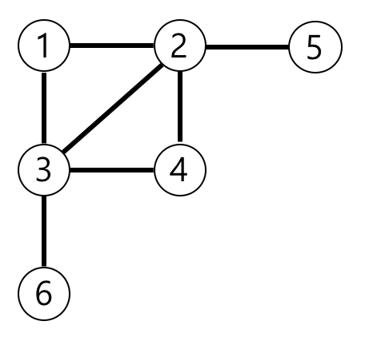
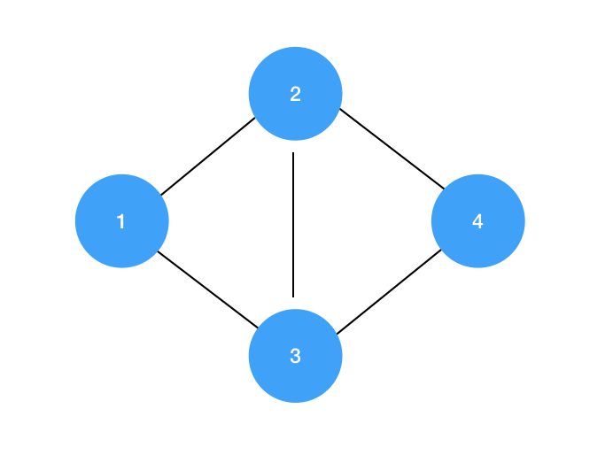
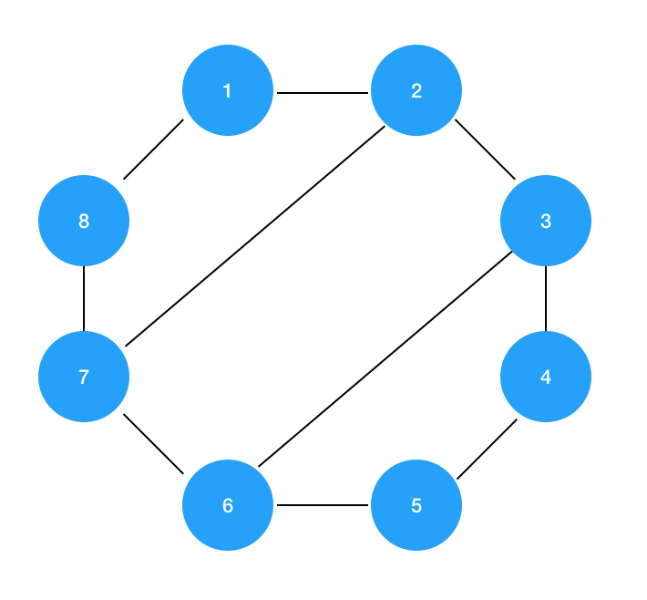
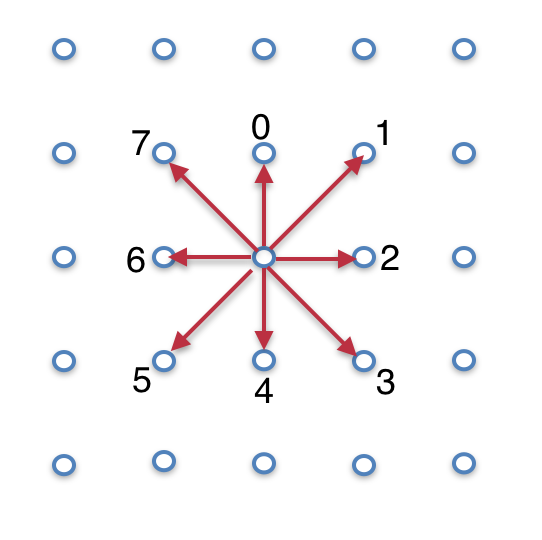
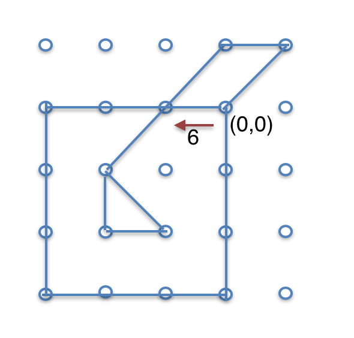

1.  [Programming](README.md)
2.  [Programming](Programming_98307.md)
3.  [Java](Java_25001989.md)
4.  [알고리즘](32959.md)
5.  [문제 풀이](28868609.md)

#  Programming : 그래프 

Created by  Dongwook Han, last modified on 8월 30, 2020

# 가장 먼 노드(3)

문제 설명

n개의 노드가 있는 그래프가 있습니다. 각 노드는 1부터 n까지 번호가 적혀있습니다. 1번 노드에서 가장 멀리 떨어진 노드의 갯수를 구하려고 합니다. 가장 멀리 떨어진 노드란 최단경로로 이동했을 때 간선의 개수가 가장 많은 노드들을 의미합니다.

노드의 개수 n, 간선에 대한 정보가 담긴 2차원 배열 vertex가 매개변수로 주어질 때, 1번 노드로부터 가장 멀리 떨어진 노드가 몇 개인지를 return 하도록 solution 함수를 작성해주세요.

##### 제한사항

- 노드의 개수 n은 2 이상 20,000 이하입니다.

- 간선은 양방향이며 총 1개 이상 50,000개 이하의 간선이 있습니다.

- vertex 배열 각 행 \[a, b\]는 a번 노드와 b번 노드 사이에 간선이 있다는 의미입니다.

##### 입출력 예

|  |  |  |
|----|----|----|
| **n** | **vertex** | **return** |
| 6 | \[\[3, 6\], \[4, 3\], \[3, 2\], \[1, 3\], \[1, 2\], \[2, 4\], \[5, 2\]\] | 3 |

##### 입출력 예 설명

예제의 그래프를 표현하면 아래 그림과 같고, 1번 노드에서 가장 멀리 떨어진 노드는 4,5,6번 노드입니다.

# 순위(3)

문제 설명

n명의 권투선수가 권투 대회에 참여했고 각각 1번부터 n번까지 번호를 받았습니다. 권투 경기는 1대1 방식으로 진행이 되고, 만약 A 선수가 B 선수보다 실력이 좋다면 A 선수는 B 선수를 항상 이깁니다. 심판은 주어진 경기 결과를 가지고 선수들의 순위를 매기려 합니다. 하지만 몇몇 경기 결과를 분실하여 정확하게 순위를 매길 수 없습니다.

선수의 수 n, 경기 결과를 담은 2차원 배열 results가 매개변수로 주어질 때 정확하게 순위를 매길 수 있는 선수의 수를 return 하도록 solution 함수를 작성해주세요.

##### 제한사항

- 선수의 수는 1명 이상 100명 이하입니다.

- 경기 결과는 1개 이상 4,500개 이하입니다.

- results 배열 각 행 \[A, B\]는 A 선수가 B 선수를 이겼다는 의미입니다.

- 모든 경기 결과에는 모순이 없습니다.

##### 입출력 예

|  |  |  |
|----|----|----|
| **n** | **results** | **return** |
| 5 | \[\[4, 3\], \[4, 2\], \[3, 2\], \[1, 2\], \[2, 5\]\] | 2 |

##### 입출력 예 설명

2번 선수는 \[1, 3, 4\] 선수에게 패배했고 5번 선수에게 승리했기 때문에 4위입니다.\
5번 선수는 4위인 2번 선수에게 패배했기 때문에 5위입니다.

# 사이클 제거(4)

문제 설명

n개의 노드로 구성된 그래프에서 하나의 노드만을 제거해서 사이클이 없도록 만들고 싶습니다.

노드의 개수 n, 노드간의 연결 edges가 매개변수로 주어질 때, 노드를 딱 **하나** 제거해서 그래프를 사이클이 없도록 만들 수 있다면 해당 노드의 번호를 return 하도록 solution 함수를 완성하세요.\
단, 그런 노드가 없다면 0을 return하고, 여러 개라면 노드의 번호의 합을 return하세요.

**제한사항**

- 노드 번호는 1 부터 시작합니다.

- 주어진 그래프에 반드시 하나 이상의 사이클은 있습니다.

- 노드간의 연결에는 방향이 없습니다.

- 주어지는 노드의 수는 2개 이상 5,000개 이하입니다.

- 연결의 수는 1개 이상 `n(n + 1)/2`개 이하입니다.

**입출력 예**

|  |  |  |
|----|----|----|
| **n** | **edges** | **result** |
| 4 | \[\[1,2\],\[1,3\],\[2,3\],\[2,4\],\[3,4\]\] | 5 |
| 8 | \[\[1,2\],\[2,3\],\[3,4\],\[4,5\],\[5,6\],\[6,7\],\[7,8\],\[8,1\],\[2,7\],\[3,6\]\] | 0 |

**입출력 예 설명**

예제 \#1

아래 그림과 같이 표현할 수 있으며 2번 또는 3번 노드를 제거하면 사이클이 없어지므로 2+3인 5를 리턴하면 됩니다.

예제 \#2

아래 그림과 같이 표현할 수 있으며 어떤 노드를 제거하더라도 사이클이 남아있으므로 0을 리턴하면 됩니다.

# 방의 개수(5)

문제 설명

원점(0,0)에서 시작해서 아래처럼 숫자가 적힌 방향으로 이동하며 선을 긋습니다.

ex) 1일때는 `오른쪽 위`로 이동

그림을 그릴 때, 사방이 막히면 방하나로 샙니다.\
이동하는 방향이 담긴 배열 arrows가 매개변수로 주어질 때, 방의 갯수를 return 하도록 solution 함수를 작성하세요.

##### 제한사항

- 배열 arrows의 크기는 1 이상 100,000 이하 입니다.

- arrows의 원소는 0 이상 7 이하 입니다.

- 방은 다른 방으로 둘러 싸여질 수 있습니다.

##### 입출력 예

|  |  |
|----|----|
| **arrows** | **return** |
| \[6, 6, 6, 4, 4, 4, 2, 2, 2, 0, 0, 0, 1, 6, 5, 5, 3, 6, 0\] | 3 |

##### 입출력 예 설명

- (0,0) 부터 시작해서 6(왼쪽) 으로 3번 이동합니다. 그 이후 주어진 arrows 를 따라 그립니다.

- 삼각형 (1), 큰 사각형(1), 평행사변형(1) = 3

Document generated by Confluence on 4월 05, 2026 17:57

[Atlassian](http://www.atlassian.com/)

