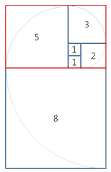
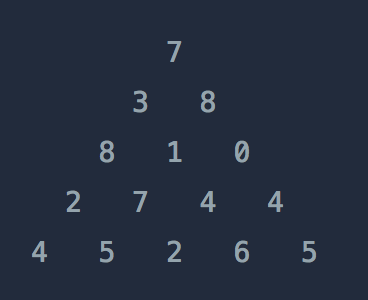
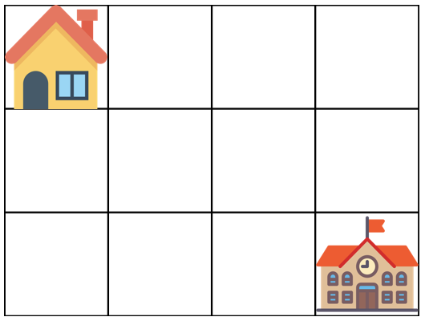
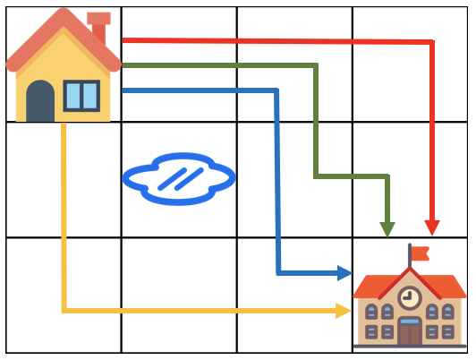
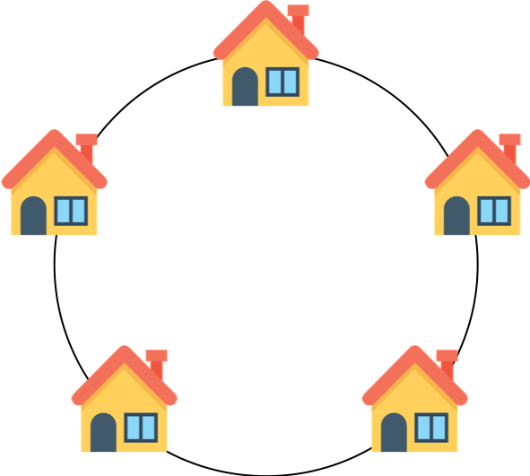
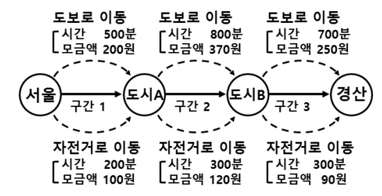

<div id="page">

<div id="main" class="aui-page-panel">

<div id="main-header">

<div id="breadcrumb-section">

1.  [Programming](index.html)
2.  [Programming](Programming_98307.html)
3.  [Java](Java_25001989.html)
4.  [알고리즘](32959.html)
5.  [문제 풀이](28868609.html)

</div>

# <span id="title-text"> Programming : 동적 프로그래밍(Dynamic Programming) </span>

</div>

<div id="content" class="view">

<div class="page-metadata">

Created by <span class="author"> Dongwook Han</span>, last modified on 9월 03, 2020

</div>

<div id="main-content" class="wiki-content group">

# N 으로 표현(3)

문제 설명

아래와 같이 5와 사칙연산만으로 12를 표현할 수 있습니다.

12 = 5 + 5 + (5 / 5) + (5 / 5)\
12 = 55 / 5 + 5 / 5\
12 = (55 + 5) / 5

5를 사용한 횟수는 각각 6,5,4 입니다. 그리고 이중 가장 작은 경우는 4입니다.\
이처럼 숫자 N과 number가 주어질 때, N과 사칙연산만 사용해서 표현 할 수 있는 방법 중 N 사용횟수의 최솟값을 return 하도록 solution 함수를 작성하세요.

##### 제한사항

- N은 1 이상 9 이하입니다.

- number는 1 이상 32,000 이하입니다.

- 수식에는 괄호와 사칙연산만 가능하며 나누기 연산에서 나머지는 무시합니다.

- 최솟값이 8보다 크면 -1을 return 합니다.

##### 입출력 예

<div class="table-wrap">

|  |  |  |
|----|----|----|
| <span class="legacy-color-text-inverse">**N**</span> | <span class="legacy-color-text-inverse">**number**</span> | <span class="legacy-color-text-inverse">**return**</span> |
| <span class="legacy-color-text-inverse">5</span> | <span class="legacy-color-text-inverse">12</span> | <span class="legacy-color-text-inverse">4</span> |
| <span class="legacy-color-text-inverse">2</span> | <span class="legacy-color-text-inverse">11</span> | <span class="legacy-color-text-inverse">3</span> |

</div>

##### 입출력 예 설명

예제 \#1\
문제에 나온 예와 같습니다.

예제 \#2\
`11 = 22 / 2`와 같이 2를 3번만 사용하여 표현할 수 있습니다.

# 타일 장식물(3)

문제 설명

대구 달성공원에 놀러 온 지수는 최근에 새로 만든 타일 장식물을 보게 되었다. 타일 장식물은 정사각형 타일을 붙여 만든 형태였는데, 한 변이 1인 정사각형 타일부터 시작하여 마치 앵무조개의 나선 모양처럼 점점 큰 타일을 붙인 형태였다. 타일 장식물의 일부를 그리면 다음과 같다.

<span class="confluence-embedded-file-wrapper image-center-wrapper"></span>

그림에서 타일에 적힌 수는 각 타일의 한 변의 길이를 나타낸다. 타일 장식물을 구성하는 정사각형 타일 한 변의 길이를 안쪽 타일부터 시작하여 차례로 적으면 다음과 같다.\
\[1, 1, 2, 3, 5, 8, .\]\
지수는 문득 이러한 타일들로 구성되는 큰 직사각형의 둘레가 궁금해졌다. 예를 들어, 처음 다섯 개의 타일이 구성하는 직사각형(위에서 빨간색으로 표시한 직사각형)의 둘레는 26이다.

타일의 개수 N이 주어질 때, N개의 타일로 구성된 직사각형의 둘레를 return 하도록 solution 함수를 작성하시오.

##### 제한 사항

- N은 1 이상 80 이하인 자연수이다.

##### 입출력 예

<div class="table-wrap">

|  |  |
|----|----|
| <span class="legacy-color-text-inverse">**N**</span> | <span class="legacy-color-text-inverse">**return**</span> |
| <span class="legacy-color-text-inverse">5</span> | <span class="legacy-color-text-inverse">26</span> |
| <span class="legacy-color-text-inverse">6</span> | <span class="legacy-color-text-inverse">42</span> |

</div>

# 정수 삼각형(3)

문제 설명

<span class="confluence-embedded-file-wrapper image-center-wrapper"></span>

위와 같은 삼각형의 꼭대기에서 바닥까지 이어지는 경로 중, 거쳐간 숫자의 합이 가장 큰 경우를 찾아보려고 합니다. 아래 칸으로 이동할 때는 대각선 방향으로 한 칸 오른쪽 또는 왼쪽으로만 이동 가능합니다. 예를 들어 3에서는 그 아래칸의 8 또는 1로만 이동이 가능합니다.

삼각형의 정보가 담긴 배열 triangle이 매개변수로 주어질 때, 거쳐간 숫자의 최댓값을 return 하도록 solution 함수를 완성하세요.

##### 제한사항

- 삼각형의 높이는 1 이상 500 이하입니다.

- 삼각형을 이루고 있는 숫자는 0 이상 9,999 이하의 정수입니다.

##### 입출력 예

<div class="table-wrap">

|  |  |
|----|----|
| <span class="legacy-color-text-inverse">**triangle**</span> | <span class="legacy-color-text-inverse">**result**</span> |
| <span class="legacy-color-text-inverse">\[\[7\], \[3, 8\], \[8, 1, 0\], \[2, 7, 4, 4\], \[4, 5, 2, 6, 5\]\]</span> | <span class="legacy-color-text-inverse">30</span> |

</div>

# 등굣길(3)

문제 설명

계속되는 폭우로 일부 지역이 물에 잠겼습니다. 물에 잠기지 않은 지역을 통해 학교를 가려고 합니다. 집에서 학교까지 가는 길은 m x n 크기의 격자모양으로 나타낼 수 있습니다.

아래 그림은 m = 4, n = 3 인 경우입니다.

<span class="confluence-embedded-file-wrapper image-center-wrapper"></span>

가장 왼쪽 위, 즉 집이 있는 곳의 좌표는 (1, 1)로 나타내고 가장 오른쪽 아래, 즉 학교가 있는 곳의 좌표는 (m, n)으로 나타냅니다.

격자의 크기 m, n과 물이 잠긴 지역의 좌표를 담은 2차원 배열 puddles이 매개변수로 주어집니다. 집에서 학교까지 갈 수 있는 최단경로의 개수를 1,000,000,007로 나눈 나머지를 return 하도록 solution 함수를 작성해주세요.

##### 제한사항

- 격자의 크기 m, n은 1 이상 100 이하인 자연수입니다.

  - m과 n이 모두 1인 경우는 입력으로 주어지지 않습니다.

- 물에 잠긴 지역은 0개 이상 10개 이하입니다.

- 집과 학교가 물에 잠긴 경우는 입력으로 주어지지 않습니다.

##### 입출력 예

<div class="table-wrap">

|  |  |  |  |
|----|----|----|----|
| <span class="legacy-color-text-inverse">**m**</span> | <span class="legacy-color-text-inverse">**n**</span> | <span class="legacy-color-text-inverse">**puddles**</span> | <span class="legacy-color-text-inverse">**return**</span> |
| <span class="legacy-color-text-inverse">4</span> | <span class="legacy-color-text-inverse">3</span> | <span class="legacy-color-text-inverse">\[\[2, 2\]\]</span> | <span class="legacy-color-text-inverse">4</span> |

</div>

##### 입출력 예 설명

<span class="confluence-embedded-file-wrapper image-center-wrapper"></span>

# 카드 게임(4)

문제 설명

카드게임이 있다. 게임에 사용하는 각 카드에는 양의 정수 하나가 적혀있고 같은 숫자가 적힌 카드는 여러 장 있을 수 있다. 게임방법은 우선 짝수개의 카드를 무작위로 섞은 뒤 같은 개수의 두 더미로 나누어 하나는 왼쪽에 다른 하나는 오른쪽에 둔다.

각 더미의 제일 위에 있는 카드끼리 서로 비교하며 게임을 한다. 게임 규칙은 다음과 같다. 지금부터 왼쪽 더미의 제일 위 카드를 왼쪽 카드로, 오른쪽 더미의 제일 위 카드를 오른쪽 카드로 부르겠다.

<div class="code panel pdl" style="border-width: 1px;">

<div class="codeContent panelContent pdl">

``` syntaxhighlighter-pre
1. 언제든지 왼쪽 카드만 통에 버릴 수도 있고 왼쪽 카드와 오른쪽 카드를 둘 다 통에 버릴 수도 있다. 이때 얻는 점수는 없다.
2. 오른쪽 카드에 적힌 수가 왼쪽 카드에 적힌 수보다 작은 경우에는 오른쪽 카드만 통에 버릴 수도 있다. 오른쪽 카드만 버리는 경우에는 오른쪽 카드에 적힌 수만큼 점수를 얻는다.
3. (1)과 (2)의 규칙에 따라 게임을 진행하다가 어느 쪽 더미든 남은 카드가 없다면 게임이 끝나며 그때까지 얻은 점수의 합이 최종 점수가 된다.
```

</div>

</div>

왼쪽 더미의 카드에 적힌 정수가 담긴 배열 left와 오른쪽 더미의 카드에 적힌 정수가 담긴 배열 right가 매개변수로 주어질 때, 얻을 수 있는 최종 점수의 최대값을 return 하도록 solution 함수를 작성하시오.

##### 제한 사항

- 한 더미에는 1장 이상 2,000장 이하의 카드가 있다.

- 각 카드에 적힌 정수는 1 이상 2,000 이하이다.

##### 입출력 예

<div class="table-wrap">

|  |  |  |
|----|----|----|
| <span class="legacy-color-text-inverse">**left**</span> | <span class="legacy-color-text-inverse">**right**</span> | <span class="legacy-color-text-inverse">**return**</span> |
| <span class="legacy-color-text-inverse">\[3, 2, 5\]</span> | <span class="legacy-color-text-inverse">\[2, 4, 1\]</span> | <span class="legacy-color-text-inverse">7</span> |

</div>

##### 입출력 예 설명

먼저 오른쪽 카드를 버려서 2점을 획득한다.\
그 뒤 왼쪽 카드를 두 장 버리고 오른쪽 카드를 버려서 4점을 획득한다.\
마지막으로 오른쪽 카드를 버려서 1점을 획득한다.\
총 얻을 수 있는 점수는 7점이다.

<a href="https://www.digitalculture.or.kr/koi/selectOlymPiadDissentList.do" class="external-link" rel="nofollow">출처</a>

# 도둑질(4)

문제 설명

도둑이 어느 마을을 털 계획을 하고 있습니다. 이 마을의 모든 집들은 아래 그림과 같이 동그랗게 배치되어 있습니다.

<span class="confluence-embedded-file-wrapper image-center-wrapper"></span>

각 집들은 서로 인접한 집들과 방범장치가 연결되어 있기 때문에 인접한 두 집을 털면 경보가 울립니다.

각 집에 있는 돈이 담긴 배열 money가 주어질 때, 도둑이 훔칠 수 있는 돈의 최댓값을 return 하도록 solution 함수를 작성하세요.

##### 제한사항

- 이 마을에 있는 집은 3개 이상 1,000,000개 이하입니다.

- money 배열의 각 원소는 0 이상 1,000 이하인 정수입니다.

##### 입출력 예

<div class="table-wrap">

|  |  |
|----|----|
| <span class="legacy-color-text-inverse">**money**</span> | <span class="legacy-color-text-inverse">**return**</span> |
| <span class="legacy-color-text-inverse">\[1, 2, 3, 1\]</span> | <span class="legacy-color-text-inverse">4</span> |

</div>

# 서울에서 경산까지(4)

문제 설명

서울에서 경산까지 여행을 하면서 모금 활동을 하려 합니다. 여행은 서울에서 출발해 다른 도시를 정해진 순서대로 딱 한 번 방문한 후 경산으로 도착할 예정입니다. 도시를 이동할 때에는 도보 혹은 자전거를 이용합니다. 이때 도보 이동에 걸리는 시간, 도보 이동 시 얻을 모금액, 자전거 이동에 걸리는 시간, 자전거 이동 시 얻을 모금액이 정해져 있습니다. K시간 이내로 여행할 때 모을 수 있는 최대 모금액을 알아보려 합니다.

예를 들어 여행 루트가 다음과 같고 K = 1,650 일 때

<span class="confluence-embedded-file-wrapper image-center-wrapper"></span>

1, 2번 구간은 도보로, 3번 구간은 자전거로 이동해 모금액을 660으로 하는 것이 가장 좋은 방법입니다. 이때, 1,600시간이 소요됩니다.

solution 함수의 매개변수로 각 도시를 이동할 때 이동 수단별로 걸리는 시간과 모금액을 담은 2차원 배열 travel과 제한시간 K가 주어집니다. 제한시간 안에 서울에서 경산까지 여행을 하며 모을 수 있는 최대 모금액을 return 하도록 solution 함수를 작성하세요.

##### 제한사항

- travel 배열의 각 행은 순서대로 \[도보 이동에 걸리는 시간, 도보 이동 시 얻을 모금액, 자전거 이동에 걸리는 시간, 자전거 이동 시 얻을 모금액\]입니다.

- travel 배열 행의 개수는 3 이상 100 이하인 정수입니다.

- travel 배열에서 시간을 나타내는 숫자(각 행의 첫 번째, 세 번째 숫자)는 10,000 이하의 자연수, 모금액을 나타내는 숫자(각 행의 두 번째, 네 번째 숫자)는 1,000,000 이하의 자연수입니다.

- K는 0보다 크고 100,000보다 작거나 같은 자연수입니다.

##### 입출력 예

<div class="table-wrap">

|  |  |  |
|----|----|----|
| <span class="legacy-color-text-inverse">**K**</span> | <span class="legacy-color-text-inverse">**travel**</span> | <span class="legacy-color-text-inverse">**return**</span> |
| <span class="legacy-color-text-inverse">1650</span> | <span class="legacy-color-text-inverse">\[\[500, 200, 200, 100\], \[800, 370, 300, 120\], \[700, 250, 300, 90\]\]</span> | <span class="legacy-color-text-inverse">660</span> |
| <span class="legacy-color-text-inverse">3000</span> | <span class="legacy-color-text-inverse">\[\[1000, 2000, 300, 700\], \[1100, 1900, 400, 900\], \[900, 1800, 400, 700\], \[1200, 2300, 500, 1200\]\]</span> | <span class="legacy-color-text-inverse">5900</span> |

</div>

##### 입출력 예 설명

입출력 예#1\
앞서 설명한 예와 같습니다.

입출력 예#2\
1, 4번 구간은 도보로 이동하고 2, 3번 구간은 자전거로 이동하여 모금액을 5,900원으로 하는 것이 가장 좋은 방법입니다. 이때 걸리는 시간은 3,000시간입니다.

</div>

</div>

</div>

<div id="footer" role="contentinfo">

<div class="section footer-body">

Document generated by Confluence on 4월 05, 2026 17:57

<div id="footer-logo">

[Atlassian](http://www.atlassian.com/)

</div>

</div>

</div>

</div>
