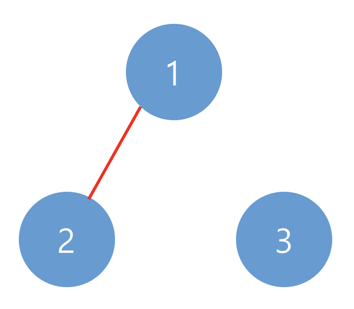
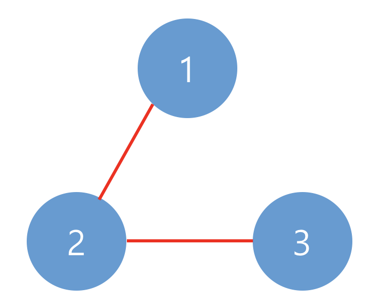

<div id="page">

<div id="main" class="aui-page-panel">

<div id="main-header">

<div id="breadcrumb-section">

1.  [Programming](README.md)
2.  [Programming](Programming_98307.md)
3.  [Java](Java_25001989.md)
4.  [알고리즘](32959.md)
5.  [문제 풀이](28868609.md)

</div>

# <span id="title-text"> Programming : 깊이/너비 우선탐색(DFS/BFS) </span>

</div>

<div id="content" class="view">

<div class="page-metadata">

Created by <span class="author"> Dongwook Han</span>, last modified on 8월 30, 2020

</div>

<div id="main-content" class="wiki-content group">

# 타겟 넘버(2)

문제 설명

n개의 음이 아닌 정수가 있습니다. 이 수를 적절히 더하거나 빼서 타겟 넘버를 만들려고 합니다. 예를 들어 \[1, 1, 1, 1, 1\]로 숫자 3을 만들려면 다음 다섯 방법을 쓸 수 있습니다.

<div class="code panel pdl" style="border-width: 1px;">

<div class="codeContent panelContent pdl">

``` syntaxhighlighter-pre
-1+1+1+1+1 = 3
+1-1+1+1+1 = 3
+1+1-1+1+1 = 3
+1+1+1-1+1 = 3
+1+1+1+1-1 = 3
```

</div>

</div>

사용할 수 있는 숫자가 담긴 배열 numbers, 타겟 넘버 target이 매개변수로 주어질 때 숫자를 적절히 더하고 빼서 타겟 넘버를 만드는 방법의 수를 return 하도록 solution 함수를 작성해주세요.

##### 제한사항

- 주어지는 숫자의 개수는 2개 이상 20개 이하입니다.

- 각 숫자는 1 이상 50 이하인 자연수입니다.

- 타겟 넘버는 1 이상 1000 이하인 자연수입니다.

##### 입출력 예

<div class="table-wrap">

|  |  |  |
|----|----|----|
| <span class="legacy-color-text-inverse">**numbers**</span> | <span class="legacy-color-text-inverse">**target**</span> | <span class="legacy-color-text-inverse">**return**</span> |
| <span class="legacy-color-text-inverse">\[1, 1, 1, 1, 1\]</span> | <span class="legacy-color-text-inverse">3</span> | <span class="legacy-color-text-inverse">5</span> |

</div>

##### 입출력 예 설명

문제에 나온 예와 같습니다.

# 네트워크(3)

문제 설명

네트워크란 컴퓨터 상호 간에 정보를 교환할 수 있도록 연결된 형태를 의미합니다. 예를 들어, 컴퓨터 A와 컴퓨터 B가 직접적으로 연결되어있고, 컴퓨터 B와 컴퓨터 C가 직접적으로 연결되어 있을 때 컴퓨터 A와 컴퓨터 C도 간접적으로 연결되어 정보를 교환할 수 있습니다. 따라서 컴퓨터 A, B, C는 모두 같은 네트워크 상에 있다고 할 수 있습니다.

컴퓨터의 개수 n, 연결에 대한 정보가 담긴 2차원 배열 computers가 매개변수로 주어질 때, 네트워크의 개수를 return 하도록 solution 함수를 작성하시오.

##### 제한사항

- 컴퓨터의 개수 n은 1 이상 200 이하인 자연수입니다.

- 각 컴퓨터는 0부터 `n-1`인 정수로 표현합니다.

- i번 컴퓨터와 j번 컴퓨터가 연결되어 있으면 computers\[i\]\[j\]를 1로 표현합니다.

- computer\[i\]\[i\]는 항상 1입니다.

##### 입출력 예

<div class="table-wrap">

|  |  |  |
|----|----|----|
| <span class="legacy-color-text-inverse">**n**</span> | <span class="legacy-color-text-inverse">**computers**</span> | <span class="legacy-color-text-inverse">**return**</span> |
| <span class="legacy-color-text-inverse">3</span> | <span class="legacy-color-text-inverse">\[\[1, 1, 0\], \[1, 1, 0\], \[0, 0, 1\]\]</span> | <span class="legacy-color-text-inverse">2</span> |
| <span class="legacy-color-text-inverse">3</span> | <span class="legacy-color-text-inverse">\[\[1, 1, 0\], \[1, 1, 1\], \[0, 1, 1\]\]</span> | <span class="legacy-color-text-inverse">1</span> |

</div>

##### 입출력 예 설명

예제 \#1아래와 같이 2개의 네트워크가 있습니다.

<span class="confluence-embedded-file-wrapper image-center-wrapper"></span><span class="confluence-embedded-file-wrapper image-center-wrapper"></span>

예제 \#2아래와 같이 1개의 네트워크가 있습니다.

# 단어 변환(3)

문제 설명

두 개의 단어 begin, target과 단어의 집합 words가 있습니다. 아래와 같은 규칙을 이용하여 begin에서 target으로 변환하는 가장 짧은 변환 과정을 찾으려고 합니다.

<div class="code panel pdl" style="border-width: 1px;">

<div class="codeContent panelContent pdl">

``` syntaxhighlighter-pre
1. 한 번에 한 개의 알파벳만 바꿀 수 있습니다.
2. words에 있는 단어로만 변환할 수 있습니다.
```

</div>

</div>

예를 들어 begin이 hit, target가 cog, words가 \[hot,dot,dog,lot,log,cog\]라면 hit -\> hot -\> dot -\> dog -\> cog와 같이 4단계를 거쳐 변환할 수 있습니다.

두 개의 단어 begin, target과 단어의 집합 words가 매개변수로 주어질 때, 최소 몇 단계의 과정을 거쳐 begin을 target으로 변환할 수 있는지 return 하도록 solution 함수를 작성해주세요.

##### 제한사항

- 각 단어는 알파벳 소문자로만 이루어져 있습니다.

- 각 단어의 길이는 3 이상 10 이하이며 모든 단어의 길이는 같습니다.

- words에는 3개 이상 50개 이하의 단어가 있으며 중복되는 단어는 없습니다.

- begin과 target은 같지 않습니다.

- 변환할 수 없는 경우에는 0를 return 합니다.

##### 입출력 예

<div class="table-wrap">

|  |  |  |  |
|----|----|----|----|
| <span class="legacy-color-text-inverse">**begin**</span> | <span class="legacy-color-text-inverse">**target**</span> | <span class="legacy-color-text-inverse">**words**</span> | <span class="legacy-color-text-inverse">**return**</span> |
| <span class="legacy-color-text-inverse">hit</span> | <span class="legacy-color-text-inverse">cog</span> | <span class="legacy-color-text-inverse">\[hot, dot, dog, lot, log, cog\]</span> | <span class="legacy-color-text-inverse">4</span> |
| <span class="legacy-color-text-inverse">hit</span> | <span class="legacy-color-text-inverse">cog</span> | <span class="legacy-color-text-inverse">\[hot, dot, dog, lot, log\]</span> | <span class="legacy-color-text-inverse">0</span> |

</div>

##### 입출력 예 설명

예제 \#1\
문제에 나온 예와 같습니다.

예제 \#2\
target인 cog는 words 안에 없기 때문에 변환할 수 없습니다.

# 여행경로(3)

문제 설명

주어진 항공권을 모두 이용하여 여행경로를 짜려고 합니다. 항상 ICN 공항에서 출발합니다.

항공권 정보가 담긴 2차원 배열 tickets가 매개변수로 주어질 때, 방문하는 공항 경로를 배열에 담아 return 하도록 solution 함수를 작성해주세요.

##### 제한사항

- 모든 공항은 알파벳 대문자 3글자로 이루어집니다.

- 주어진 공항 수는 3개 이상 10,000개 이하입니다.

- tickets의 각 행 \[a, b\]는 a 공항에서 b 공항으로 가는 항공권이 있다는 의미입니다.

- 주어진 항공권은 모두 사용해야 합니다.

- 만일 가능한 경로가 2개 이상일 경우 알파벳 순서가 앞서는 경로를 return 합니다.

- 모든 도시를 방문할 수 없는 경우는 주어지지 않습니다.

##### 입출력 예

<div class="table-wrap">

|  |  |
|----|----|
| <span class="legacy-color-text-inverse">**tickets**</span> | <span class="legacy-color-text-inverse">**return**</span> |
| <span class="legacy-color-text-inverse">\[\[ICN, JFK\], \[HND, IAD\], \[JFK, HND\]\]</span> | <span class="legacy-color-text-inverse">\[ICN, JFK, HND, IAD\]</span> |
| <span class="legacy-color-text-inverse">\[\[ICN, SFO\], \[ICN, ATL\], \[SFO, ATL\], \[ATL, ICN\], \[ATL,SFO\]\]</span> | <span class="legacy-color-text-inverse">\[ICN, ATL, ICN, SFO, ATL, SFO\]</span> |

</div>

##### 입출력 예 설명

예제 \#1

\[ICN, JFK, HND, IAD\] 순으로 방문할 수 있습니다.

예제 \#2

\[ICN, SFO, ATL, ICN, ATL, SFO\] 순으로 방문할 수도 있지만 \[ICN, ATL, ICN, SFO, ATL, SFO\] 가 알파벳 순으로 앞섭니다.

</div>

</div>

</div>

<div id="footer" role="contentinfo">

<div class="section footer-body">

Document generated by Confluence on 4월 05, 2026 17:57


</div>

</div>

</div>
