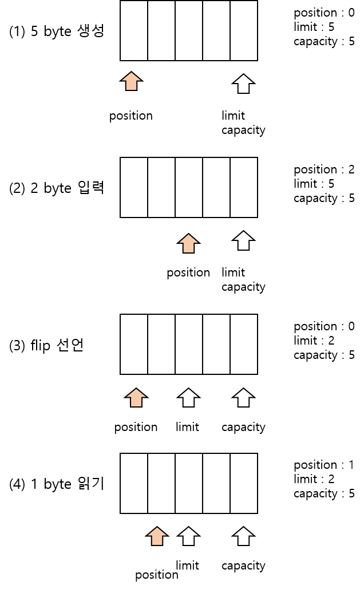
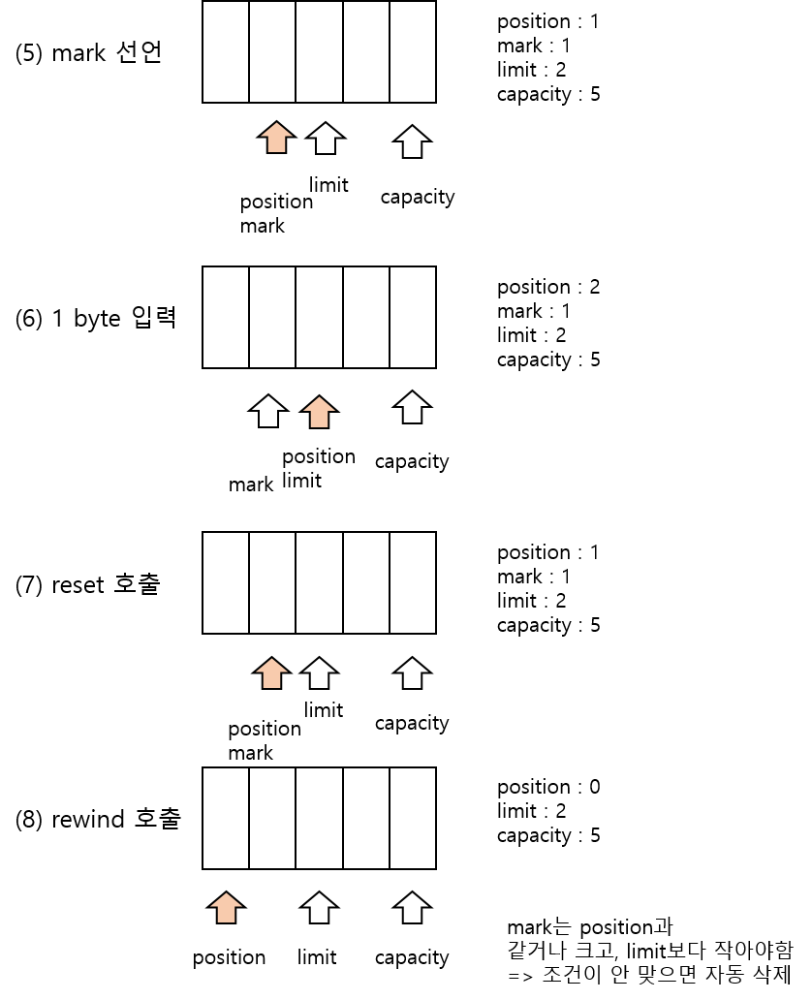
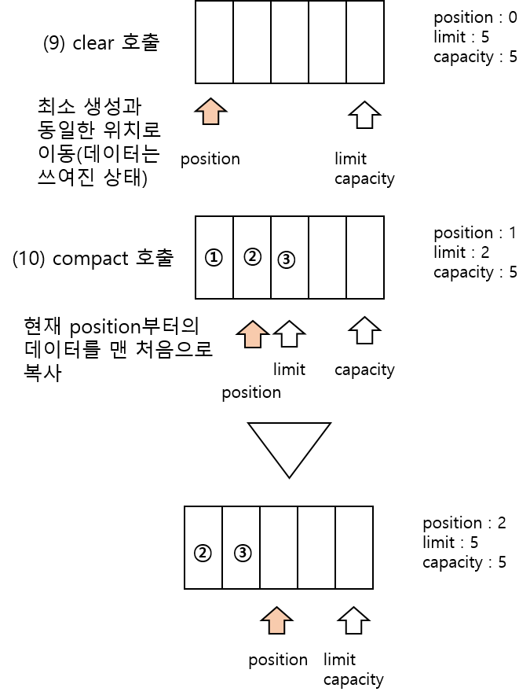

<div id="page">

<div id="main" class="aui-page-panel">

<div id="main-header">

<div id="breadcrumb-section">

1.  [Programming](README.md)
2.  [Programming](Programming_98307.md)
3.  [Java](Java_25001989.md)
4.  [Java Basic](Java-Basic_399278081.md)
5.  [NIO](NIO_36470785.md)

</div>

# <span id="title-text"> Programming : 3. Buffer </span>

</div>

<div id="content" class="view">

<div class="page-metadata">

Created by <span class="author"> Dongwook Han</span>, last modified on 7월 29, 2023

</div>

<div id="main-content" class="wiki-content group">

# 버퍼(Buffer)

- 읽고 쓰기가 가능한 메모리 배열

## Buffer 종류

- 저장되는 데이터 타입에 따라 분류

  - ByteBuffer, MappedByteBuffer(파일의 내용을 메모리와 맵핑시킨 버퍼)

  - CharBuffer, ShortBuffer, IntBuffer, LongBuffer

  - FloatBuffer, DoubleBuffer

- 어떤 메모리를 사용하냐에 따라 분류

  - Direct : 운영체제가 관리하는 메모리 공간 이용

  - NonDirect : JVM이 관리하는 heap 메모리 공간 이용

<div class="table-wrap">

|                      |                      |                                |
|----------------------|----------------------|--------------------------------|
| **구분**             | **NonDirect Buffer** | **Direct Buffer**              |
| 사용하는 메모리 공간 | JVM Heap memory      | OS 메모리                      |
| 버퍼 생성 시간       | 버퍼 생성이 빠르다.  | 버퍼 생성이 느리다             |
| 버퍼 크기            | 작다                 | 크다(큰 데이터 처리할 때 유리) |
| 입출력 성능          | 낮다                 | 높다(입출력 빈번할 때 유리)    |

</div>

## Direct vs NonDirect 성능 비교 예제

- 예제 프로그램

  <div class="code panel pdl" style="border-width: 1px;">

  <div class="codeContent panelContent pdl">

  ``` syntaxhighlighter-pre
  public class PerfomanceExample {
    public static void main(String[] args) {
      Path from = Paths.get("src/main/resource/house.jpg");
      Path to1 = Paths.get("src/main/resource/house2.jpg");
      Path to2= Paths.get("src/main/resource/house3.jpg");
      
      long size = Files.size(from);
      
      FileChannel fileChannel_from = FileChannel.open(from);
      FileChannel fileChannel_to1 = FileChannel.open(to1, EnumSet.of(StandardOption.CREATE, StandardOpenOption.WRITE));
      FileChannel fileChannel_to2 = FileChannel.open(to2, EnumSet.of(StandardOption.CREATE, StandardOpenOption.WRITE));
      
      ByteBuffer nondirectBuffer = ByteBuffer.allocate((int) size);
      ByteBuffer directBuffer = ByteBuffer.allocateDirect((int) size);
      
      long start, end;
      
      start = System.nanoTime();
      for(int i = 0; i < 100; i++) {
        fileChannel_from.read(nonDirectBuffer);
        nonDirectBuffer.flip();
        fileChannel_to1.write(nonDirectBuffer);
        nonDirectBuffer.clear();
      }
      end = System.nanoTime();
      System.out.println("nondirect:\t" + (end-start) + " ns");
      
      fileChannel_from.position(0);
      
      start = System.nanoTime();
      for(int i = 0; i < 100; i++) {
        fileChannel_from.read(directBuffer);
        directBuffer.flip();
        fileChannel_to2.write(directBuffer);
        directBuffer.clear();
      }
      end = System.nanoTime();
      System.out.println("direct:\t" + (end-start) + " ns");
      
      fileChannel_from.close();
      fileChannel_to1.close();
      fileChannel_to2.close();
    }
  }
  ```

  </div>

  </div>

## Buffer 생성

- non-direct buffer : **allocate()**, **wrap()** 호출

- direct buffer : **allocateDirect()** 호출

### allocate()

- 각 data 유형별 buffer 마다 allocate() 메소드 호출

- 예제

  <div class="code panel pdl" style="border-width: 1px;">

  <div class="codeContent panelContent pdl">

  ``` syntaxhighlighter-pre
  ```

  </div>

  </div>

### wrap()

- 각 타입별 Buffer 클래스 wrap() 메소드 호출

- 이미 생성되어 있는 자바 배열을 wrapping 하여 Buffer 객체 생성

- 사용 예

  <div class="code panel pdl" style="border-width: 1px;">

  <div class="codeContent panelContent pdl">

  ``` syntaxhighlighter-pre
  ByteBuffer byteBuffer = ByteBuffer.allocate(100);
  CharBuffer charBuffer = CharBuffer.allocate(100);
  ```

  </div>

  </div>

- 일부 데이터로 생성 예

  <div class="code panel pdl" style="border-width: 1px;">

  <div class="codeContent panelContent pdl">

  ``` syntaxhighlighter-pre
  byte[] byteArray = new byte[100];
  ByteBuffer byteBuffer = ByteBuffer.wrap(byteArray, 0, 50); // 일부 데이터로 생성
  ```

  </div>

  </div>

- CharSequence 타입의 매개값을 갖는 wrap() 메소드 예제

  <div class="code panel pdl" style="border-width: 1px;">

  <div class="codeContent panelContent pdl">

  ``` syntaxhighlighter-pre
  CharBuffer charBuffer = CharBuffer.wrap("NIO 입출력은 버퍼를 이용합니다.");
  ```

  </div>

  </div>

### allocateDirect()

- ByteBuffer에서만 제공됨

- 각 타입별로 사용시 asCharBuffer() 와 같이 타입별 메소드 사용

  <div class="code panel pdl" style="border-width: 1px;">

  <div class="codeContent panelContent pdl">

  ``` syntaxhighlighter-pre
  ByteBuffer byteBuffer = ByteBuffer.allocateDirect(100);
  CharBuffer charBuffer = ByteBuffer.allocateDirect(100).asCharBuffer();  // char 2 byte. 50 size char buffer
  IntBuffer intBuffer = ByteBuffer.allocateDirect(100).asIntBuffer(); // int 4 byte. 25 int buffer
  ```

  </div>

  </div>

- direct buffer 저장 용량 확인 예제

  <div class="code panel pdl" style="border-width: 1px;">

  <div class="codeContent panelContent pdl">

  ``` syntaxhighlighter-pre
  public class DirectBufferCapacityExample {
    public static void main(Sring[] args) {
      ByteBuffer byteBuffer = ByteBuffer.allocateDirect(100);
      System.out.println("저장용량: " + byteBuffer.capacity + " 바이트");
      
      CharBuffer charBuffer = ByteBuffer.allocateDirect(100).asCharBuffer();
      System.out.println("저장용량: " + charBuffer.capacity + " 문자");
      
      IntBuffer intBuffer = ByteBuffer.allocateDirect(100).asIntBuffer();
      System.out.println("저장용량: " + intBuffer.capacity + " 정수");
    }
  }
  ```

  </div>

  </div>

### ByteOrder

- 바이트 처리순서는 운영체제마다 다름

  - Big endian

  - Little endian

- JRE가 설치된 어떤 환경이든 JVM은 무조건 Big endian 으로 동작

- 컴퓨터의 운영체제 종류와 바이트를 해석하는 순서에 대한 예제

  <div class="code panel pdl" style="border-width: 1px;">

  <div class="codeContent panelContent pdl">

  ``` syntaxhighlighter-pre
  public class ComputerByteOrderExample {
    public static void main(Stirng[] args) {
      System.out.println("os : "+ System.getProperty("os.name"));
      System.out.println("byteOrder : " + ByteOrder.nativeOrder());
    }
  }
  ```

  </div>

  </div>

- 운영체제와 JVM의 바이트 해석 순서가 다를 시 JVM이 자동으로 처리

- direct buffer 사용시 운영체제의 native I/O를 사용하므로 운영체제의 기본 순서로 JVM의 순서를 맞추는 것이 성능에 도움이 됨

- 운영체제 order로 리턴하는 예제

  <div class="code panel pdl" style="border-width: 1px;">

  <div class="codeContent panelContent pdl">

  ``` syntaxhighlighter-pre
  ByteBuffer byteBuffer = ByteBuffer.allocateDirect(100).order(ByteOrder.nativeOrder());
  ```

  </div>

  </div>

## Buffer의 Position

- buffer는 읽고 쓰기가 가능한 메모리 배열 → 위치를 이동하며 처리 가능

- position : 현재 읽거나 쓰는 위치값

- limit : 버퍼에서 읽거나 쓸 수 있는 위치의 한계

- capacity : 버퍼의 최대 데이터 개수(메모리 크기)

- mark : reset() 을 실행했을 때 돌아오는 위치를 지정하는 인덱스

- 상세 설명

  - position, limit, capacity, mark, reset, clear

    <span class="confluence-embedded-file-wrapper image-center-wrapper"></span><span class="confluence-embedded-file-wrapper image-center-wrapper"></span><span class="confluence-embedded-file-wrapper image-center-wrapper"></span>

- flip()

## Buffer 메소드

- 각 타입별 Buffer 클래스는 Buffer 추상 클래스 상속 : flip(), rewind(), clear(), mark(), reset() 공통 메소드

- 데이터 저장 및 읽기 메소드 : put(), get()

  - 상대적 저장/읽기 : index 정보 전달없이 get(), put() 메소드 호출

  - 절대적 저장/읽기 : get(), put() 인자로 index 정보 전달

  - 상대적 저장/읽기 호출시 position 이 변경, 절대적 저장/읽기 호출시 position 변경없음 =\> 상대적 메소드 호출시 Underflow/overflow Exception 발생

- Buffer 메소드 호출시 위치 값 변화 예제

  <div class="code panel pdl" style="border-width: 1px;">

  <div class="codeContent panelContent pdl">

  ``` syntaxhighlighter-pre
  public class BufferExample {
    public static void main(String[] args) {
      System.out.println("[7바이트 크기로 버퍼 생성]");
      ByteBuffer buffer = ByteBuffer.allocateDirect(7);
      printState(buffer);
      
      buffer.put((byte)10);
      buffer.put((byte)11);
      System.out.println("[2바이트 저장후]");
      printState(buffer);
      
      buffer.put((byte)12);
      buffer.put((byte)13);
      buffer.put((byte)14);
      System.out.println("[3바이트 저장후]");
      printState(buffer);
      
      buffer.flip();
      System.out.println("[flip() 실행후]");
      printState(buffer);
      
      buffer.get(new byte[3]);
      System.out.println("[3바이트 읽은후]");
      printState(buffer);
      
      buffer.mark();
      System.out.println("-----[현재 위치를 마크 해 놓음]");
      
      buffer.get(new byte[2]);
      System.out.println("[2바이트 읽은후]");
      printState(buffer);
      
      buffer.reset();
      System.out.println("-----[position을 마크 위치로 옮김]");
      printState(buffer);
      
      buffer.rewind();
      System.out.println("[rewind() 실행후]");
      printState(buffer);
      
      buffer.clear();
      System.out.println("[clear() 실행후]");
      printState(buffer);
    }
    
    public static void printState(Buffer buffer) {
      System.out.println("\tpositoin: "+ buffer.position() + ", ");
      System.out.println("\tlimit:" + buffer.limit() + ", ");
      System.out.println("\tcapacity:" + buffer.capacity());
    }
  }
  ```

  </div>

  </div>

### Buffer Exception 의 종류

- BufferOverflowException : position이 limit에 도달했을 때 put() 호출시 발생

- BufferUnderflowException : position 이 limit에 도달했을 때 get()호출하면 발생

- InvalidMarkException : mark가 없는 상태에서 reset() 메소드 호출시 발생

- ReadOnlyBufferException : 읽기 전용 buffer에서 put() 또는 compact() 메소드 호출시 발생

## Buffer 변환

- channel이 데이터를 읽고 쓰는 버퍼는 모두 ByteBuffer

- Channel을 통해 읽은 데이터를 복원하려면 ByteBuffer를 문자열 또는 다른 타입의 버퍼로 변환 필요

- 또는 Channel 를 통해 데이터를 쓰려면 문자열이나 다른 타입의 버퍼를 ByteBuffer로 변환 필요

### 타입별 변환

- 문자셋 인코딩하여 변환하기

  <div class="code panel pdl" style="border-width: 1px;">

  <div class="codeContent panelContent pdl">

  ``` syntaxhighlighter-pre
  Charset charset = Charset.forName("UTF-8");
  //Charset charset = Charset.defaultCharset();  // defulat Charset 사용

  String data = "테스트";
  ByteBuffer byteBuffer = charset.encode(data);  // String -> ByteBuffer

  String reverse = charset.decode(byteBuffer).toString();
  ```

  </div>

  </div>

- int 변환

  <div class="code panel pdl" style="border-width: 1px;">

  <div class="codeContent panelContent pdl">

  ``` syntaxhighlighter-pre
  int[] data = new int[]{10,20};
  IntBuffer intBuffer = IntBuffer.wrap(data);
  ByteBuffer byteBuffer = ByteBuffer.allocate(intBuffer.capacity() *4);
  for(int i = 0; i < intBuffer.capacity(); i++) {
    byteBufer.putInt(intBuffer.get(i));
  }
  byteBuffer.flip();

  IntBuffer toBuffer = byteBuffer.asIntBuffer();
  int[] result = new int[intBuffer.capacity()];
  intBuffer.get(data);
  ```

  </div>

  </div>

#### API

- java.nio.Buffer

- primitive : CharBuffer, DoubleBuffer, FloatBuffer, IntBuffer, LongBuffer, ShortBuffer, CharBuffer

- ByteBuffer에 할당된 정보를 각 Buffer로 변환시

  <div class="code panel pdl" style="border-width: 1px;">

  <div class="codeContent panelContent pdl">

  ``` syntaxhighlighter-pre
  int[] intArray = new int[]{1,2,3};
  IntBuffer intBuffer = IntBuffer.wrap(intArray);
  ```

  </div>

  </div>

- buffer read/write

  - 상대적 : position에 데이터를 읽고 씀 read(), write()

  - 절대적 : 데이터를 읽고 쓰는 위치를 지정 get(i), put(i)

- Exception

  - position = limit 시 get() 호출 : BufferUnderflowException

  - position = limit 시 put() 호출 : BufferOverflowException

  - mark가 없는 상태에서 reset() 호출 : InvalidMarkException

  - 읽기 전용 버퍼에 put(), compact() 호출 : ReadOnlyBufferException

#### ByteOrder

- OS 마다 버퍼를 읽는 순서가 다름

- OS별 Byte order 정보 조회

  - ByteOrder.nativeOrder()

- OS에 맞쳐 order 정렬

  <div class="code panel pdl" style="border-width: 1px;">

  <div class="codeContent panelContent pdl">

  ``` syntaxhighlighter-pre
  ByteBuffer byteBufer = ByteBuffer.allocateDirect(100).order(ByteOrder.nativeOrder()); 
  ```

  </div>

  </div>

- nondirect는 JVM 내에 buffer를 생성하며 JVM 내의 ByteOrder는 OS에 상관없이 동일

</div>

<div class="pageSection group">

<div class="pageSectionHeader">

## Attachments:

</div>

<div class="greybox" align="left">

 [bytebyffer_01.png](attachments/403767319/403701829.png) (image/png)\
 [bytebuffer_02.png](attachments/403767319/403701835.png) (image/png)\
 [bytebyffer_03.png](attachments/403767319/403701841.png) (image/png)\

</div>

</div>

</div>

</div>

<div id="footer" role="contentinfo">

<div class="section footer-body">

Document generated by Confluence on 4월 05, 2026 17:57


</div>

</div>

</div>
