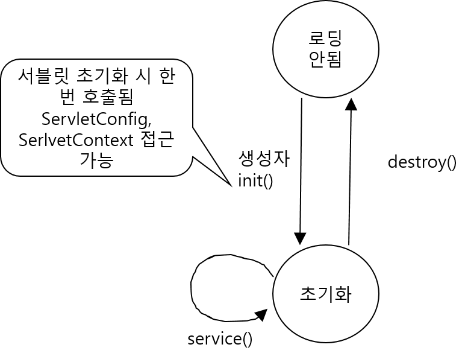
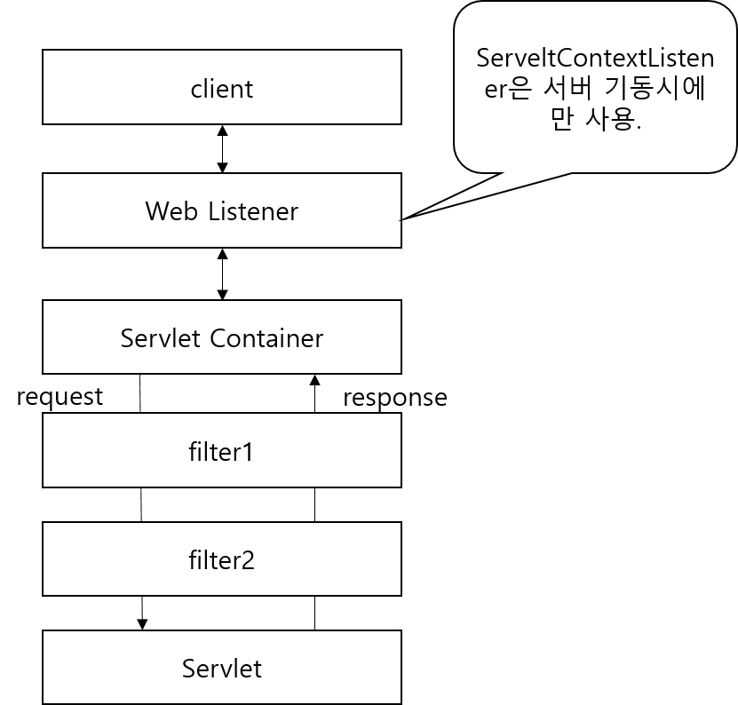

<div id="page">

<div id="main" class="aui-page-panel">

<div id="main-header">

<div id="breadcrumb-section">

1.  [Programming](README.md)
2.  [Programming](Programming_98307.md)
3.  [Java](Java_25001989.md)

</div>

# <span id="title-text"> Programming : Servlet/Jsp </span>

</div>

<div id="content" class="view">

<div class="page-metadata">

Created by <span class="author"> Dongwook Han</span>, last modified on 7월 20, 2023

</div>

<div id="main-content" class="wiki-content group">

------------------------------------------------------------------------

<div class="toc-macro rbtoc1775379448181">

- [HTTP](#Servlet/Jsp-HTTP)
  - [Method](#Servlet/Jsp-Method)
- [Servlet](#Servlet/Jsp-Servlet)
  - [개념](#Servlet/Jsp-개념)
  - [흐름](#Servlet/Jsp-흐름)
  - [Deployment Descriptor(web.xml)](#Servlet/Jsp-DeploymentDescriptor(web.xml))
  - [APIs](#Servlet/Jsp-APIs)
  - [Redirect](#Servlet/Jsp-Redirect)
  - [Dispatch](#Servlet/Jsp-Dispatch)
  - [Servlet 초기화 파라미터](#Servlet/Jsp-Servlet초기화파라미터)
  - [ServletConfig](#Servlet/Jsp-ServletConfig)
  - [ServletContext](#Servlet/Jsp-ServletContext)
  - [Request](#Servlet/Jsp-Request)
  - [Response](#Servlet/Jsp-Response)
  - [Listener](#Servlet/Jsp-Listener)
  - [Filter](#Servlet/Jsp-Filter)
  - [HttpSession](#Servlet/Jsp-HttpSession)
  - [Cookie](#Servlet/Jsp-Cookie)
  - [기타](#Servlet/Jsp-기타)

</div>

------------------------------------------------------------------------

# HTTP

## Method

- GET

- POST

- HEAD

- TRACE

- PUT

- DELETE

- CONNECT

# Servlet

## 개념

- Request, Response는 컨테이너가 처리

## 흐름

1.  요청 시 HttpServletRequest, HttpServletResponse 객체 생성

2.  Servlet service() 호출

3.  GET/POST 방식에 따라 doGet(), doPost() 호출

4.  HttpServletReponse 로 응답 후 HttpServletRequest, HttpServletResponse 폐기

## Deployment Descriptor(web.xml)

- Servlet 정의\

  <div class="code panel pdl" style="border-width: 1px;">

  <div class="codeContent panelContent pdl">

  ``` syntaxhighlighter-pre
  <web-app>
    <serlvet>
      <servlet-name>HelloServlet</servlet-name>
      <servlet-class>com.nettoall.servlet.HelloServlet</servlet-class>
    </servlet>

    <servlet-mapping>
      <servlet-name>HelloServlet</servlet-name>
      <url-pattern>/Hello</url-pattern>
    </servlet-mapping>

  </web-app>
  ```

  </div>

  </div>

## APIs

<span class="confluence-embedded-file-wrapper image-center-wrapper"></span>

## Redirect

- 브라우저에서 처리(클라이언트)

- reponse.sendRecirect() 호출 → 서블릿 처리 완료

## Dispatch

- 서버에서 처리

  <div class="code panel pdl" style="border-width: 1px;">

  <div class="codeContent panelContent pdl">

  ``` syntaxhighlighter-pre
  RequestDispatcher view = new request.getRequestDispatcher("result.jsp");
  view.forward(request, response);
  ```

  </div>

  </div>

## Servlet 초기화 파라미터

- DD에 초기화 파라미터 설정

  <div class="code panel pdl" style="border-width: 1px;">

  <div class="codeContent panelContent pdl">

  ``` syntaxhighlighter-pre
  <web-app>
    <servlet>
      <servlet-name>HelloServlet</servlet-name>
      <servlet-class>com.nettoall.HelloServlet</servlet-class>
      
      <init-param>
        <param-name>customerName</param-name>
        <param-value>tom</param-value>
      </init-param>
    </servlet>
  </web-app>
  ```

  </div>

  </div>

- Servlet 에서 사용하기

  <div class="code panel pdl" style="border-width: 1px;">

  <div class="codeContent panelContent pdl">

  ``` syntaxhighlighter-pre
  String name = getServletConfig().getInitParameter("customerName")
  ```

  </div>

  </div>

- WAS 컨테이너가 서블릿을 초기화 할 때만 DD의 초기화 파라미터를 읽음

<span class="confluence-embedded-file-wrapper image-center-wrapper"></span>

- init() : ServletConfig, ServletContext 객체 접근 가능

  - 서블릿에 대한 클라이언트 요청은 별개의 thread에서 처리

  - 하나의 JVM 내에 servlet instance는 하나만 존재

## ServletConfig

- Serlvet 당 하나씩 생성

- web.xml 의 \<servlet\>\</servlet\> 정의된 단위로 생성되고 Servlet 태그 안의 init param만 load

- ServletConfig의 값을 다른 컴포넌트(예: jsp 등)에서 사용시 setAttribute로 속성을 저장해서 사용해야 함.

## ServletContext

- web.xml 내 \<context-param\>\</context-param\> 으로 정의된 항목을 모든 Application 에서 사용

  <div class="code panel pdl" style="border-width: 1px;">

  <div class="codeContent panelContent pdl">

  ``` syntaxhighlighter-pre
  ServletContext context = getServletcontext();
  String key = context.getInitParameter("key");
  ```

  </div>

  </div>

- Context-safe를 보장하기 위해 context 에 값을 저장할 때 synchronized 로 정의(**<span colorid="w5ghwmjf6e">보충</span>**)

  <div class="code panel pdl" style="border-width: 1px;">

  <div class="codeContent panelContent pdl">

  ``` syntaxhighlighter-pre
  synchronized(getServletContext()){
    getServletContext().setAttribute("id", value);
  }
  ```

  </div>

  </div>

## Request

- Post 요청에는 Body가 Get 요청에는 Query String 이 있음

- Get 멱등 메소드 : 서버에 부작용을 발생시키지 않고 여러번 실행 가능

- Html Form에 default method는 GET

- getParameterValues(“id”) : id에 대한 값을 배열로 리턴

- getParameter(“id”) : id에 대한 값(String)

- 헤더, 쿠키, 세션, 쿼리 스트링, 입력 스스팀 관련 메소드 사용 가능

## Response

- setContentType(), getWriter()는 꼭 사용

- getWriter()로 html 작성 등 문자 I/O 작업 처리

- getOutputStream() 은 바이너리 스트림 메소드

- 헤더에 값 설정 : addHeader(), setHeader()

- Response 객체에 헤더 설정, 오류전송, 쿠키 추가 가능(메소드 지원)

- 받은 요청을 다른 URL로 보내 처리하도록 하는 sendRedirect(URL) → client에서 다른 URL 정보를 받아 처리 : 세션 처리에 주의

  <div class="code panel pdl" style="border-width: 1px;">

  <div class="codeContent panelContent pdl">

  ``` syntaxhighlighter-pre
  response.sendRedirect(URL);
  ```

  </div>

  </div>

  \

- 받은 요청을 다른 컴포넌트가 처리하도록 넘기는 request.getRequestDispatcher() → 서버에서 처리하여 client에 결과 리턴

  <div class="code panel pdl" style="border-width: 1px;">

  <div class="codeContent panelContent pdl">

  ``` syntaxhighlighter-pre
  RequestDispatcher view = request.getRequestDispatcher(URL);
  view.forward(request, response);
  ```

  </div>

  </div>

## Listener

- Servlet이 초기화 되기 전에 초기 파라미터 설정 및 읽기 위해 사용

- ServletContextListener 를 상속 받아 구현

- web.xml 에 listener 등록

  <div class="code panel pdl" style="border-width: 1px;">

  <div class="codeContent panelContent pdl">

  ``` syntaxhighlighter-pre
  <web-app>
    <listener>
      <listener-class>
        com.nettoall.MyServletContextListener
      </listener-class>
  </web-app>
  ```

  </div>

  </div>

- 종류

  - ServletContextAttributeListener : 웹 어플리케이션 컨텍스트에 속성 추가, 제거, 수정

  - HttpSessionListener : 활성화된 세션 정보 조회

  - ServletRequestListener : 요청 모니터링

  - ServletRequestAttributeListener : request 속성 추가, 제거, 수정 모니터링

  - HttpSessionBindingListener: 세션에 속성 바이딩, 제거 모니터링

  - HttpSessionAttributeListener : 세션 속성 추가, 제거, 수정 모니터링

  - ServletContextListener : 컨텍스트 생성, 소멸 모니터링

    - contextInitialized(ServletContextEvent)

    - contextDestroyed(ServletContextEvent)

  - HttpSessionActivationListener : 세션 내 Attribute 자신이 추가, 제거 되었는지 모니터링

## Filter

- 서블릿으로 요청이 넘어가기전, 서블릿 이 응답을 클라이언트에 전달하기 전에 작동

- DD에 필터를 선언

  <div class="code panel pdl" style="border-width: 1px;">

  <div class="codeContent panelContent pdl">

  ``` syntaxhighlighter-pre
  <filter>
    <filter-name>MonitorFilter</filter-name>
    <filter-class>com.nettoall.web.MonitorFilter</filter-class>
    <init-param>
      <param-name>monitorName</param-name>
      <param-value>WAS</param-value>
    </init-param>
  </filter>

  <!-- url pattern 에 필터 매핑 -->
  <filter-mapping>
    <filter-name>MonitorFilter</filter-name>
    <url-pattern>*.do</url-pattern>
  </filter>

  <!-- servlet 이름에 필터 매핑 -->
  <filter-mapping>
    <filter-name>MonitorFilter</filter-name>
    <servlet-name>HelloServlet</servlet-name>
  </filter-mapping>
  ```

  </div>

  </div>

- 필터 적용 순서(필터가 여러개 있는 경우)

  1.  URL 패턴 중 DD에 정의된 순서대로 적용

  2.  Servlet-name에 일치하는 필터 중 DD에 정의된 순서대로 적용

- Serlvet 2.4부터 forward, include, requestdispatch 에도 filter 적용 가능\

  <div class="code panel pdl" style="border-width: 1px;">

  <div class="codeContent panelContent pdl">

  ``` syntaxhighlighter-pre
  <filter>
    <filter-name>MonitorFilter</filter-name>
    <filter-class>com.nettoall.web.MonitorFilter</filter-class>
    <init-param>
      <param-name>monitorName</param-name>
      <param-value>WAS</param-value>
    </init-param>
  </filter>

  <!-- url pattern 에 필터 매핑 -->
  <filter-mapping>
    <filter-name>MonitorFilter</filter-name>
    <url-pattern>*.do</url-pattern>
    <dispatcher>REQUEST</dispatcher>
    <!-- <dispatcher>INCLUDE</dispatcher> -->
    <!-- <dispatcher>FORWARD</dispatcher> -->
    <!-- <dispatcher>ERROR</dispatcher> -->
  </filter>
  ```

  </div>

  </div>

필터 추가 page 747 부터

<span class="confluence-embedded-file-wrapper image-center-wrapper"></span>

5/9 page 235

interceptor

## HttpSession

- 선언

  <div class="code panel pdl" style="border-width: 1px;">

  <div class="codeContent panelContent pdl">

  ``` syntaxhighlighter-pre
  HttpSession session = request.getSession(); // 최초 접속시 세션 생성, 기존 세션 정보 가져옴
  ```

  </div>

  </div>

- httpSession에 값을 저장시 synchronized 로 선언하여 처리해야 함.

- request 속성과 지역 변수만이 thread-safe 함.

- 세션 유효 시간 관련 메소드

  - getCreationTime()

  - getLastAccessedTime()

  - getMaxInactiveInterval()

  - getMaxInactiveInterval()

  - invalidate()

- 세선 Timeout 설정

  - DD내 \<session-config\>\<session-timeout\> 설정

    <div class="code panel pdl" style="border-width: 1px;">

    <div class="codeContent panelContent pdl">

    ``` syntaxhighlighter-pre
    <session-config>
      <session-timeout>
      </session-timeout>
    </session-config>
    ```

    </div>

    </div>

  - 특정 세션(특정 주기동안 비활성화)만 타임 아웃 설정

    <div class="code panel pdl" style="border-width: 1px;">

    <div class="codeContent panelContent pdl">

    ``` syntaxhighlighter-pre
    session.setMaxInactiveIntervla(20 * 60)
    ```

    </div>

    </div>

## Cookie

- 선언

  <div class="code panel pdl" style="border-width: 1px;">

  <div class="codeContent panelContent pdl">

  ``` syntaxhighlighter-pre
  //response에 쿠키에 저장하고자 하는 값을 설정 
  Cookie cookie = new Cookie("id", value);
  cookie.setMaxAge(20 * 60);
  response.addCookie(cookie);

  // 다음 request 들어 왔을 때 전에 저장한 값을 가져옴
  Cookie[] cookies = request.getCookies();
  for(Cookie cookie: cookies) {
    if(cookie.getName().equelas("id"))
      ......
  }
  ```

  </div>

  </div>

## 기타

- 브라우저에서 쿠키 사용 안함 설정시 대처

  - URL rewrite : 세션ID 정보를 모든 URL 뒤에 추가

    <div class="code panel pdl" style="border-width: 1px;">

    <div class="codeContent panelContent pdl">

    ``` syntaxhighlighter-pre
    // url + sessionID=12345
    response.encodeURL("/test.do") + "sessionid"); // URL 뒤에 세션 ID 추가
    ```

    </div>

    </div>

  - 쿠키 사용과 URL rewrite로 최초에 세션을 보낸 뒤, 다시 들어오는 request의 세션 정보가 있는지 확인하여 브라우저 쿠키 사용여부 확인

  - sendRedirect의 URL rewrite 메소드\
    ex) response.encodeRedirectURL()

</div>

<div class="pageSection group">

<div class="pageSectionHeader">

## Attachments:

</div>

<div class="greybox" align="left">

 [Servlet_Apis.png](attachments/352845825/353075218.png) (image/png)\
 [servlet_lifecycle.png](attachments/352845825/353009687.png) (image/png)\
 [servlet_listener_filter.png](attachments/352845825/353075228.png) (image/png)\

</div>

</div>

</div>

</div>

<div id="footer" role="contentinfo">

<div class="section footer-body">

Document generated by Confluence on 4월 05, 2026 17:57

<div id="footer-logo">

[Atlassian](http://www.atlassian.com/)

</div>

</div>

</div>

</div>
