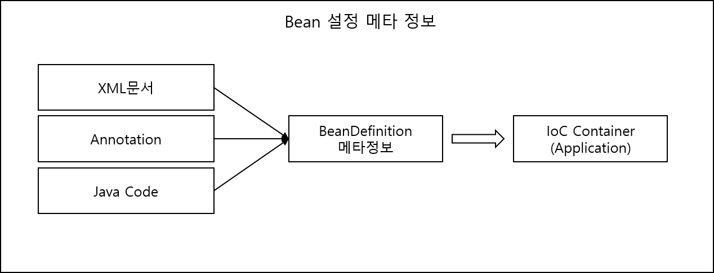

<div id="page">

<div id="main" class="aui-page-panel">

<div id="main-header">

<div id="breadcrumb-section">

1.  [Programming](README.md)
2.  [Programming](Programming_98307.md)
3.  [Spring](Spring_120848385.md)
4.  [토비의 Spring 정리](376569861.md)
5.  [Ch01.Spring IoC Container와 DI](376406017.md)

</div>

# <span id="title-text"> Programming : 1.2 IoC/DI를 위한 Bean 설정 메타정보 작성 </span>

</div>

<div id="content" class="view">

<div class="page-metadata">

Created by <span class="author"> Dongwook Han</span>, last modified on 2월 20, 2023

</div>

<div id="main-content" class="wiki-content group">

<div class="contentLayout2">

<div class="columnLayout two-left-sidebar" layout="two-left-sidebar">

<div class="cell aside" data-type="aside">

<div class="innerCell">

<style type="text/css">/**/
div.rbtoc1775379451615 {padding: 0px;}
div.rbtoc1775379451615 ul {list-style: disc;margin-left: 0px;}
div.rbtoc1775379451615 li {margin-left: 0px;padding-left: 0px;}

/**/</style>

<div class="toc-macro rbtoc1775379451615">

- [Bean 설정 메타 정보](#id-1.2IoC/DI를위한Bean설정메타정보작성-Bean설정메타정보)
  - [Bean 설정 메타 정보 항목(필수 항목)](#id-1.2IoC/DI를위한Bean설정메타정보작성-Bean설정메타정보항목(필수항목))
- [Bean 등록 방법](#id-1.2IoC/DI를위한Bean설정메타정보작성-Bean등록방법)
  - [Bean 등록 5가지 방법](#id-1.2IoC/DI를위한Bean설정메타정보작성-Bean등록5가지방법)
  - [Bean 등록 메타 정보 구성 전략](#id-1.2IoC/DI를위한Bean설정메타정보작성-Bean등록메타정보구성전략)
- [Bean 의존관계 설정 방법](#id-1.2IoC/DI를위한Bean설정메타정보작성-Bean의존관계설정방법)
  - [Bean DI 방식](#id-1.2IoC/DI를위한Bean설정메타정보작성-BeanDI방식)
    - [XML : \<property\>, \<constructor-arg\>](#id-1.2IoC/DI를위한Bean설정메타정보작성-XML:%3Cproperty%3E,%3Cconstructor-arg%3E)
    - [XML : autowiring](#id-1.2IoC/DI를위한Bean설정메타정보작성-XML:autowiring)
    - [XML : namespace와 전용 태그](#id-1.2IoC/DI를위한Bean설정메타정보작성-XML:namespace와전용태그)
    - [Annotation : @Resource](#id-1.2IoC/DI를위한Bean설정메타정보작성-Annotation:@Resource)
      - [수정자method](#id-1.2IoC/DI를위한Bean설정메타정보작성-수정자method)
      - [field](#id-1.2IoC/DI를위한Bean설정메타정보작성-field)
    - [Annotation: @Autowired/@Inject](#id-1.2IoC/DI를위한Bean설정메타정보작성-Annotation:@Autowired/@Inject)
      - [@Autowired](#id-1.2IoC/DI를위한Bean설정메타정보작성-@Autowired)
    - [@Aurowired 와 getBean(), Spring Test](#id-1.2IoC/DI를위한Bean설정메타정보작성-@Aurowired와getBean(),SpringTest)
    - [Java code에 의한 bean 등록시 의존관계 설정](#id-1.2IoC/DI를위한Bean설정메타정보작성-Javacode에의한bean등록시의존관계설정)
      - [annotation에 의한 설정](#id-1.2IoC/DI를위한Bean설정메타정보작성-annotation에의한설정)
      - [@Bean 메소드 호출](#id-1.2IoC/DI를위한Bean설정메타정보작성-@Bean메소드호출)
      - [@Bean과 메소드 autowire](#id-1.2IoC/DI를위한Bean설정메타정보작성-@Bean과메소드autowire)
    - [Bean 의존관계 설정 전략](#id-1.2IoC/DI를위한Bean설정메타정보작성-Bean의존관계설정전략)
      - [XML 단독](#id-1.2IoC/DI를위한Bean설정메타정보작성-XML단독)
      - [XML과 annotation 설정의 혼합](#id-1.2IoC/DI를위한Bean설정메타정보작성-XML과annotation설정의혼합)
      - [Annotation 단독](#id-1.2IoC/DI를위한Bean설정메타정보작성-Annotation단독)
- [프로퍼티 값 설정 방법](#id-1.2IoC/DI를위한Bean설정메타정보작성-프로퍼티값설정방법)
  - [메타정보 종류에 따른 값 설정 방법](#id-1.2IoC/DI를위한Bean설정메타정보작성-메타정보종류에따른값설정방법)
    - [XML:\<property\>와 전용 태그 사용](#id-1.2IoC/DI를위한Bean설정메타정보작성-XML:%3Cproperty%3E와전용태그사용)
    - [annotation : @Value](#id-1.2IoC/DI를위한Bean설정메타정보작성-annotation:@Value)
    - [Java code : @Value](#id-1.2IoC/DI를위한Bean설정메타정보작성-Javacode:@Value)
  - [PropertyEditor와 ConversionService](#id-1.2IoC/DI를위한Bean설정메타정보작성-PropertyEditor와ConversionService)
    - [PropertyEditor](#id-1.2IoC/DI를위한Bean설정메타정보작성-PropertyEditor)
    - [ConversionService](#id-1.2IoC/DI를위한Bean설정메타정보작성-ConversionService)
  - [컬렉션](#id-1.2IoC/DI를위한Bean설정메타정보작성-컬렉션)
    - [List, Set](#id-1.2IoC/DI를위한Bean설정메타정보작성-List,Set)
    - [Map](#id-1.2IoC/DI를위한Bean설정메타정보작성-Map)
    - [Properteis](#id-1.2IoC/DI를위한Bean설정메타정보작성-Properteis)
    - [\<util:list\>, \<util:set\>](#id-1.2IoC/DI를위한Bean설정메타정보작성-%3Cutil:list%3E,%3Cutil:set%3E)
    - [\<util:map\>](#id-1.2IoC/DI를위한Bean설정메타정보작성-%3Cutil:map%3E)
    - [\<util:properties\>](#id-1.2IoC/DI를위한Bean설정메타정보작성-%3Cutil:properties%3E)
  - [Null과 빈 문자열](#id-1.2IoC/DI를위한Bean설정메타정보작성-Null과빈문자열)
  - [프로퍼티 파일을 이용한 값 설정](#id-1.2IoC/DI를위한Bean설정메타정보작성-프로퍼티파일을이용한값설정)
    - [Property 파일 가져오는 방법](#id-1.2IoC/DI를위한Bean설정메타정보작성-Property파일가져오는방법)
      - [수동변환](#id-1.2IoC/DI를위한Bean설정메타정보작성-수동변환)
      - [능동변환 : SpEL(Spring Expression Language)](#id-1.2IoC/DI를위한Bean설정메타정보작성-능동변환:SpEL(SpringExpressionLanguage))
- [Container가 자동등록하는 bean](#id-1.2IoC/DI를위한Bean설정메타정보작성-Container가자동등록하는bean)
  - [ApplicationContext, BeanFactory](#id-1.2IoC/DI를위한Bean설정메타정보작성-ApplicationContext,BeanFactory)
  - [ResourceLoader, ApplicationEventPublisher](#id-1.2IoC/DI를위한Bean설정메타정보작성-ResourceLoader,ApplicationEventPublisher)
    - [ApplicationEventPublisher](#id-1.2IoC/DI를위한Bean설정메타정보작성-ApplicationEventPublisher)
  - [systemProperties, systemEnvironment](#id-1.2IoC/DI를위한Bean설정메타정보작성-systemProperties,systemEnvironment)

</div>

</div>

</div>

<div class="cell normal" data-type="normal">

<div class="innerCell">

- IoC Container : 코드를 대신하여 aplication을 구성하는 Object 생성관리(일반적으로 코드로 생성)

- bean을 만들기 위한 설정 메타 정보는 파일이나 annotation 같은 리소스로부터 전용 reader를 통해 읽혀서 BeanDefinition 타입의 Object로 변환

<span class="confluence-embedded-file-wrapper image-center-wrapper"></span>

# Bean 설정 메타 정보

- BeanDefinition : Bean을 만들 때 필요한 핵심정보, 필수 항목외에 container에 미리 설정된 defulat 값이 적용됨

- 설정 메타 정보는 같지만 이름이라 ID가 다른 여러 개의 Bean Object 생성 가능

## Bean 설정 메타 정보 항목(필수 항목)

<div class="table-wrap">

|  |  |  |
|----|----|----|
| **bean class name** | **class 명** | **기본값 /필수항목** |
| parentName | 부모 BeanDefinition 이름 |  |
| factoryBeanName | factory 역할을 하는 bean을 이용해 bean 생성시 factory bean 이름 지정 |  |
| factoryMethodName | bean을 생성하는 method 이름 |  |
| scope | bean object 생명주기, Singleton과 비singleton | singleton |
| lazyInit | Bean Object 생성을 최대한 지연할 것인지 여부. true이면 container는 bean 생성을 필요한 시점까지 미름 | false |
| dependsOn | 먼저 만들어져야 하는 bean 지정, 하나 이상의 bean 이름 지정 가능 |  |
| autowireCandidate | 미리 정해진 규칙을 가지고 자동으로 DI 후보를 결정하는 autowire의 대상으로 포함여부 | true |
| primary | autowire 중 여러 개의 DI 대상 후보가 있을 시 우선적으로 선택할 권리를 줄지 여부 | false |
| abstract | 메타 정보 상속에만 사용할 abstract bean 생성여부, abstract가 되면 생성되지 않고 다른 bean의 부모 bean으로만 사용됨 | false |
| autowireMode | autowire 전략, 이름, 타입,생성자, 자동인식 등 |  |
| dependencyCheck | property value or reference가 모두 설정되었는지 검증하는 작업의 종류 |  |
| initMethod | bean이 생성되고 DI를 마친 뒤 실행할 초기화 메소드 이름 |  |
| destroyMethod | Bean의 lifecycle이 끝날때 호출할 메소드 명 |  |
| propertyValues | property 이름, 설정값 reference, 수정자 method DI시 |  |
| constructorArgumentValues | 생성자명, 설정값, reference 생성자를 통한 DI시 |  |
| annotationMetadata | Bean class에 담긴 annotation과 그 attribute 값. annotation을 이용하는 설정에서 활용 |  |

</div>

# Bean 등록 방법

- BeanDefinition 구현 Object 생성

- XML문서, property 파일, annotation을 이용한 생성

## Bean 등록 5가지 방법

1.  XML : \<bean\> 태그로 bean 등록

    <div class="code panel pdl" style="border-width: 1px;">

    <div class="codeContent panelContent pdl">

    ``` syntaxhighlighter-pre
    <bean id="hello" class="...Hello">
      <property name="printer">
        <bean class="...StringPrinter"/>
      </property>
    </bean>
    ```

    </div>

    </div>

2.  XML : namespace와 전용 태그

    - Spring Bean 종류

      - Application 핵심 코드를 구분한 컴포넌트 ex) Hello

      - 서비스 또는 Container 설정을 위한 bean

    - 서비스 또는 Container 설정을 위한 bean 등록 예제

      <div class="code panel pdl" style="border-width: 1px;">

      <div class="codeContent panelContent pdl">

      ``` syntaxhighlighter-pre
      <bean id="mypointcut" class="org.springframework...AspectJExpressionPointcut">
        <property name="expression" value="execution(**...*ServiceImpl.upgrade*(..))"/>
      </bean> <!-- Containenr 설정을 위한 Bean 등록 -->
      ```

      </div>

      </div>

    - 일반 bean과 구분하기 위해 의미가 잘 나타내는 namespace와 전용 태그 사용

      <div class="code panel pdl" style="border-width: 1px;">

      <div class="codeContent panelContent pdl">

      ``` syntaxhighlighter-pre
      <aop:pointcut id="mypointcut" expression="execution...." />
      ```

      </div>

      </div>

    - 커스텀 태그를 만들어서 Bean 정의도 가능

3.  자동 인식을 이용한 bean 등록 : stereotype annotation와 bean scanner

    - Bean으로 사용될 class에 특별한 annotation을 부여하여 자동으로 클래스를 인식하여 bean 등록 : Bean Scanning을 통한 Bean 등록

      - Bean scanner : Scanning을 담당하는 Object

      - 지정된 classpath 아래에 있는 모든 패키지의 클래스를 대상

      - 빈 스캐너에 내장된 default filter는 @Component 또는 @Commponent를 메타 annotation으로 가진 annotationd이 부여된 클래스 선택

      - @Component를 포함해 default filter에 적용되는 annotation을 Stereotype annotion

        <div class="code panel pdl" style="border-width: 1px;">

        <div class="codeContent panelContent pdl">

        ``` syntaxhighlighter-pre
        package com.test;

        import org.springframework.sterotype.Component;

        @Component
        public class AnnotatedHello {
        }
        ```

        </div>

        </div>

    - annotation 부여한 class가 bean으로 등록되는지 검증

      - AnnotationConfigApplicationContext는 bean scanner를 내장하고 있는 application Context 구현 클래스

      - 예제 (package를 지정하여 자동으로 annotation 정의된 bean 등록)

        <div class="code panel pdl" style="border-width: 1px;">

        <div class="codeContent panelContent pdl">

        ``` syntaxhighlighter-pre
        @Test
        public void simpleBeanScanning {
          ApplicationContext ctx = new AnnotationConfigApplicationContext("com.text");
          AnnotatedHello hello = ctx.getBean("annotatedHello", AnnotatedHello.class);
          
          assertThat(hello, is(notNullValue()));
        }
        ```

        </div>

        </div>

    - bean id 정의

      <div class="code panel pdl" style="border-width: 1px;">

      <div class="codeContent panelContent pdl">

      ``` syntaxhighlighter-pre
      @Component("myAnnotatedHello")
      public class AnnotatedHello {}
      ```

      </div>

      </div>

    - XML Bean 등록은 Bean의 세밀한 제어 및 관리가 가능

      - annotation으로 진행할 bean 등록과 xml로 등록한 bean을 구분하는게 나은 방법

      - 단순 bean 등록만 해도 되는 class(ex: controller, service 등)를 굳이 xml 등록할 필요 없음

4.  XML을 이용한 Bean Scanner 등록

    - 코드로 AnnotationConfigApplicationContext 구현 대신 XML 로 정의

      <div class="code panel pdl" style="border-width: 1px;">

      <div class="codeContent panelContent pdl">

      ``` syntaxhighlighter-pre
      <context:component-scan base-package="com.text" />
      ```

      </div>

      </div>

    - <u>@Controller, @Service 는 @Component를 메타 Annotation으로 가진 annotation 인가?</u>

5.  Bean Scanner를 내장한 ApplicationContext 사용

    - 웹에서 AnnotationConfigWebApplicationContext를 root Context 나 servlet context가 사용하도록 context parameter 변경

    - 샘플 테스트에서는 AnnotationConfigApplicationContext 사용

    - web 설정 내역

      <div class="code panel pdl" style="border-width: 1px;">

      <div class="codeContent panelContent pdl">

      ``` syntaxhighlighter-pre
      <context-param>
        <param-name>contextClass</param-name>
        <param-value>org.springframework.web.context.support.AnnotationConfigWebApplicationContext</param-value>
      </context-param>

      <context-param>
        <param-name>contextConfigLocation</param-name>
        <param-value>com.text</param-value>
      </context-param>
      ```

      </div>

      </div>

    - Servlet context 인 경우, \<init-param\> 에 contextClass와 contextConfigLocation 정의

    - Bean Class 자동 인식 대상 stereotype annotation

      - @Repository : 데이터 엑세스 계층의 DAO or Repository 클래스

      - @Service : 서비스 계층의 클래스

      - @Controller : MVC Controller

    - 필요시 Stereotype Annotation 직접 정의

    - 예제

      <div class="code panel pdl" style="border-width: 1px;">

      <div class="codeContent panelContent pdl">

      ``` syntaxhighlighter-pre
      @Target({ElementType.TYPE})
      @Retention(RetentionPolicy.RUNTIME)
      @Documented
      @Component 
      public @interface BusinessRule {
        String value() default "";
      }
      ```

      </div>

      </div>

      - **<u>@Component를 클래스에 부여, 메타 annotation으로 선언해주면 Bean scanner Default filter의 자동 인식 대상이 됨</u>**

6.  자바 코드에 의한 bean 등록 : @Configuration 클래스의 @Bean 메소드

    - Spring Container 정의 재정리

      - Obejct 생성과 의존관계 주입을 담당하는 Object : Object Factory

      - Object Factory의 기능을 일반화해서 Container로 만든 것 : Spring Container(Bean Factory)

    - 일반 사용법 : XML 처럼 간략한 표현이 가능한 문서로 메타 정보 작성 → 컨테이너가 참고하여 Object 생성 및 DI 처리

    - Java Code로 Object 생성하고 DI 진행하는 방식 설명 → <u>Spring Boot 에서는 이 방법을 사용 하나?</u>

    - Java Code에 의한 bean 등록 기능은 factory bean과 달리 하나의 클래스 안에 여러 개의 bean 정의 가능. annotatoin을 이용해 bean object의 메타 정보 추가 가능

    - 예제코드

      <div class="code panel pdl" style="border-width: 1px;">

      <div class="codeContent panelContent pdl">

      ``` syntaxhighlighter-pre
      @Configuration
      public class AnnotatedHelloConfig {
        @Bean // @Bean이 붙은 메소드 하나가 하나의 bean 정의, 메소드 이름이 bean 이름이 됨
        public AnnotatedHello annotatedhello() {
          return new AnnotatedHello(); // bean object를 만들고 초기화한 뒤 리턴
        }
      }
      ```

      </div>

      </div>

      - Spring container가 인식할 수 있는 bean 메타 정보 겸 Bean Object Factory

      - FactoryBean과의 차이점

        - FactoryBean은 하나의 Bean만 생성가능

      - <u>@Configuratoin, @Bean을 정의한 클래스는 메소드마다 Bean 생성 가능</u>

    - AnnotationConfigApplicationContext에 패키지 인자 대신 @Configuratoin @Bean을 정의한 클래스 정의 가능 → **<u>@Bean 정의된 메소드 별로 Bean 등록이 가능</u>**하다는 말

      <div class="code panel pdl" style="border-width: 1px;">

      <div class="codeContent panelContent pdl">

      ``` syntaxhighlighter-pre
      ApplicationContext ctx = new AnnotationConfigApplicationContext(AnnotatedHelloConfig.class);
      // @Bean 정의된 메소드를 하나의 bean 으로 처리함
      AnnotatedHello hello = ctx.getBean("annotatedHello", AnnotatedHello.class);
      assertThat(hello, is(notNulValue()));
      ```

      </div>

      </div>

    - <u>@Configuratoin을 정의한 클래스 Bean으로 자동 등록됨</u>

      <div class="code panel pdl" style="border-width: 1px;">

      <div class="codeContent panelContent pdl">

      ``` syntaxhighlighter-pre
      // @Configuratoin 정의된 AnnotatedHelloConfig bean 으로 가져옴
      AnnotatedHelloConfig config = ctx.getBean("annotatedHelloConfig", AnnotatedHelloConfig.class);
      assertThat(config, is(notNullValue()));
      ```

      </div>

      </div>

    - Java Code를 이용한 Bean 등록 이점

      - 단순한 Bean Scanning을 통한 자동 인식으로는 등록하기 힘들 기술서비스 Bean의 등록이나 Container 설정용 Bean을 XML 없이 등록할 때 유용

      - 예로 다음 XML로 설정한 DataSource 설정을 XML 없이 등록할 때 (XML 예제)

        <div class="code panel pdl" style="border-width: 1px;">

        <div class="codeContent panelContent pdl">

        ``` syntaxhighlighter-pre
        <bean id="dataSource" class="org.springframework...SimpleDriverDataSource">
          <property name="driverClass" value="com.mysql.jdbc.Driver.class" />
          <property name="url" value="jdbc:mysql://localhost/testdb" />
          <property name="username" value="spring" />
          <property name="password" value="book" />
        </bean>
        ```

        </div>

        </div>

        1.  SimpleDriverDataSource를 이름 패턴 필터를 사용하며 등록할 수 있으나 <u>매번 Property 값 설정 필요</u>

        2.  @Component를 구현한 SimpleDriverDataSource를 상속받은 클래스 내에 DB 설정 정보를 내장하여 Bean Scanner에 의해 등록

        3.  @Configuration 클래스로 만들어 Bean 설정 메타 정보를 담도록 구현(java code 로 bean 등록)

            <div class="code panel pdl" style="border-width: 1px;">

            <div class="codeContent panelContent pdl">

            ``` syntaxhighlighter-pre
            @Configuration
            public class ServiceConfig {
              @Bean
              public DataSource dataSource() {
                SimpleDriverDataSource dataSource = new SimpleDriverDataSource();
                dataSource.setDriverClass(com.mysql.jdbc.Driver.class);
                dataSource.setUrl("jdbc:mysql://localhost/testdb");
                dataSource.setUsername("spring");
                dataSource.setPassword("book");
                
                return dataSource;
              }
            }
            ```

            </div>

            </div>

      - 컴파일러나 IDE를 통합 타입 검증 가능

      - 자동완성과 같은 IDE 지원 기능 이용 가능

      - 이해하기 쉽다

      - 복잡한 bean 설정이나 초기화 작업을 손쉽게 적용

7.  자바코드에 의한 Bean 등록 : 일반 Bean 클래스의 @Bean 메소드

    - @Configuraton이 없는 클래스의 @Bean 메소드 정의

    - **<u>@Configuration 클래스의 @Bean 메소드에서 사용되는 DI된 Bean은 Singletone으로 하나의 Object를 사용하는 것이 보장됨</u>**

      <div class="code panel pdl" style="border-width: 1px;">

      <div class="codeContent panelContent pdl">

      ``` syntaxhighlighter-pre
      @Configuration
      public class HelloService {
        @Bean
        public Hello hello() {
          Hello hello = new Hello();
          hello.setPrinter(printer()); // 동일한 Object 사용
          return hello;
        }

        @Bean
        public Hello hello2() {
          Hello hello = new Hello();
          hello.setPrinter(printer()); // 동일한 Object 사용
          return hello;
        }

        // Singletone 으로 사용됨 
        @Bean
        public Printer printer() { return new StringPrinter();}
      }
      ```

      </div>

      </div>

    - @Configuration이 없는 클래스의 @Bean 메소드는 DI 설정을 위해 호출되면 각기 다른 Object를 전달받음

      - 잘못된 @Bean 설정 정보 사용

        <div class="code panel pdl" style="border-width: 1px;">

        <div class="codeContent panelContent pdl">

        ``` syntaxhighlighter-pre
        public class HelloService {
          @Bean
          public Hello hello() {
            Hello hello = new Hello();
            hello.setPrinter(printer()); // 각각 Object가 생성됨
            return hello;
          }

          @Bean
          public Hello hello2() {
            Hello hello = new Hello();
            hello.setPrinter(printer()); // 각각 Object가 생성됨
            return hello;
          }

          @Bean
            public Printer printer() { return new StringPrinter();}
          }
        }
        ```

        </div>

        </div>

      - 일반 Bean 클래스에서 동일한 Object 사용하는 @Bean 설정 정보 사용

        <div class="code panel pdl" style="border-width: 1px;">

        <div class="codeContent panelContent pdl">

        ``` syntaxhighlighter-pre
        public class HelloService {
          private Printer printer;
          
          public void setPrinter(Printer printer) {
            this.printer = printer;
          }
          
          @Bean
          public Hello hello() {
            Hello hello = new Hello();
            hello.setPrinter(this.printer); // 동일한 Object 사용
            return hello;
          }

          @Bean
          public Hello hello2() {
            Hello hello = new Hello();
            hello.setPrinter(this.printer); // 동일한 Object 사용
            return hello;
          }

          @Bean
            public Printer printer() { return new StringPrinter();}
          }
        }
        ```

        </div>

        </div>

        - 설정정보가 설정정보가 내부에 정의되므로 유연성이 떨어지며 수정을 위해 직접 Bean 클래스 변경해야 함.

## Bean 등록 메타 정보 구성 전략

Bean 등록방법 중 자주 사용되는 설정 방법

1.  XML 단독 사용

    - 모든 Bean을 명시적으로 XML에 등록하는 방법

    - 커스텀 스키마와 전용 태그를 만들면 XML 설정 내역을 줄일 수 있음

2.  XML과 Bean scanning 혼용

    - application 3 계층의 핵심 로직 Bean 클래스는 복잡한 Bean Meta 정보가 없기 때문에 Bean scanning 대상으로 적합

    - 기술서비스, 기반 서비스, Container 설정 등은 복잡하고 property가 있으므로 XML 사용이 적합

    - Schema에 정의된 전용 태그 사용하여 AOP, Transanction 속성, 내장형 DB 등을 손쉽게 등록 가능

    - Bean Scanning을 하기 위해 Scan 대상 클래스의 패키지를 모으는 등 정의 필요

    - 웹 기반의 Spring은 두 개의 Application Context(Root ApplicationContext, Servlet ApplicationContext)가 등록되어 사용되므로 Bean scanning할 패키지 정의를 주의해서 해야 함

      - ex: root ctx 에서 transaction 설정을 …Service 클래스에 적용시 동일한 Service 를 Servlet ctx 에서 bean scanning 하도록 적용하면 transaction이 적용 안 됨(child ctx 에 설정되면 부모 ctx가 사용 못하는 규칙에 의해)

3.  Bean Scanning 단독 사용

    - @Configuration 자바 코드를 이용한 설정 메타 정보 구현(반드시 필요)

    - @Configuration 클래스를 모둔 bean 스캔 대상 포함. 성격에 맞춰 적절한 패키지 구조를 나누는게 좋음

    - 웹 어플리케이션에 적용시 Root ApplicationContext, Servlet ApplicationContext 모두 contextClass 파라미터 추가하여 AnnotationConfigWebApplicationContext로 contextClass를 변경, contextLocations 파라미터에는 scan 대상 패키지를 정의

    - XML 전용 태그 사용 못함

# Bean 의존관계 설정 방법

- Bean Object 사이의 DI를 위한 의존관계 메타정보 작성하는 방법

  - 명시적으로 Bean 지정

  - 일정한 규칙, type에 따라 자동으로 선정(autowiring)

## Bean DI 방식

### XML : \<property\>, \<constructor-arg\>

- property : 수정자 method

  - 의존관계 설정 예제

    <div class="code panel pdl" style="border-width: 1px;">

    <div class="codeContent panelContent pdl">

    ``` syntaxhighlighter-pre
    <bean ...>
      <property name="printer" ref="defaultPrinter" />
    </bean>
    <bean id="defaultName" class="..." />
    <property name="id" value="My"/> // 단순값 Bean이 아닌 Java Object(java.lang.String)
    ```

    </div>

    </div>

- constructor-arg : 클래스 생성자 사용

  - 이름보다는 순서나 타입을 명시

  - 의존관계 설정 예제

    <div class="code panel pdl" style="border-width: 1px;">

    <div class="codeContent panelContent pdl">

    ``` syntaxhighlighter-pre
    <bean id="hello" class="..." >
      <!-- 순서로 지정 -->
      <constructor-arg index="0" value="spring" />
      <constructor-arg index="1" ref="printer"/>
    </bean>

    <!-- tpe 지정 -->
    <constructor-arg type="java.lang.String" value="spring" />
    <constructor-arg type="...Printer" ref="printer" />

    <!-- 파라미터 이름을 이용 -->
    <constructor-arg name="name" value="spring" />
    <constructor-arg name="printer" ref="printer" />
    ```

    </div>

    </div>

### XML : autowiring

- bean 이름 autowiring (byName)

  - autowiring할 interface를 정의해서 해당 interface를 구현한 Bean을 autowiring하는 것인 일반적인 방법

    <div class="code panel pdl" style="border-width: 1px;">

    <div class="codeContent panelContent pdl">

    ``` syntaxhighlighter-pre
    <!-- 일반적인 property di 방식, name과 참조 bean이름이 동일(printer) --> 
    <bean id="hello" ...>
      <property name="printer" ref="printer" />
    </bean>

    <!-- autowire byName -->
    <bean id="hello" class="...Hello" autowire="byName">
      <property name="name" value="spring"/> <!-- <property name="printer" /> 를 생략해도 container가 자동으로 추가해줌 -->
    </bean>

    <bean id="printer" class="...StringPrinter" />
    ```

    </div>

    </div>

  - 전역으로 autowiring 시에는 다음과 같이 정의

    <div class="code panel pdl" style="border-width: 1px;">

    <div class="codeContent panelContent pdl">

    ``` syntaxhighlighter-pre
    <beans default-autowire="byName"> </beans>
    ```

    </div>

    </div>

- 타입에 의한 autowiring(byType)

  - 예제코드

    <div class="code panel pdl" style="border-width: 1px;">

    <div class="codeContent panelContent pdl">

    ``` syntaxhighlighter-pre
    <bean id="hello" class="...Hello" autowire="byType">...</bean>
    <bean id="mainPrinter" class="...StringPrinter" />
    ```

    </div>

    </div>

  - setMethod와 이름이 같아야 DI되는 byName 대신 Type을 체크해 DI 됨

  - Type이 같은 Bean이 두 개 이상이면 적용 안 됨(두 개 이상이면 Spring이 어떤 bean을 DI할지 선택 못함)

  - byName보다 성능이 떨어짐. 따라서 autowire할 대상이 많을 때는 고려 필요

  - autowire=”constructor”: 생성자를 지정할 수 있음

  - 하나의 Bean에 한가지 autowire 방식만 사용 가능(byName, byType 등)

  - 전역으로 autowire 적용시 \<beans default-autowire=”byType”\> 으로 적용

  - 단점 : 빈 사이의 의존 관계 파악 어려움

### XML : namespace와 전용 태그

- 전용 태그의 의존관계지정은 \<bean\>과 같이 \<property\>, \<constructor-arg\> 등 지정한 태그가 고정되어 있지 않음

- 전용태그로 만들어진 bean이 다른 bean에 DI 될 수 있음. 일반적으로 id로 DI 됨

  <div class="code panel pdl" style="border-width: 1px;">

  <div class="codeContent panelContent pdl">

  ``` syntaxhighlighter-pre
  <oxm:jaxb2-marshaller id="unmarshaller" contextPath="..."/> <!-- id unmarshaller 로 DI 됨 -->

  <bean id="sqlService" class="...">
    <property name="unmarshaller" ref="unmarshaller"/>
    <property ... />
  </bean>
  ```

  </div>

  </div>

- 일반 bean의 id를 전용 태그의 DI 시 (-ref) 에 정의함

  <div class="code panel pdl" style="border-width: 1px;">

  <div class="codeContent panelContent pdl">

  ``` syntaxhighlighter-pre
  <aop:config>
    <aop:advisor advice-ref="transactionAdvice" pointcut="bean(*Service)"/>
  </aop:config>

  <bean id="transactionAdvice" ...> <!-- 일반 Bean id로 전용 태그에 DI -->
  ```

  </div>

  </div>

### Annotation : @Resource

- @Resource 는 \<property\> 선언과 비슷하게 주입할 bean을 id로 지정하는 방법

- @Resource는 Java class의 수정자 뿐만 아니라 field 에도 부여

#### 수정자method

- setMethod와 클래스 내부 field 에 DI

  <div class="code panel pdl" style="border-width: 1px;">

  <div class="codeContent panelContent pdl">

  ``` syntaxhighlighter-pre
  public class Hello {
    private Printer printer;
    ...
    @Resource(name="printer")  // <property name="printer" ref="printer" /> 와 동일한 의존관레 메타 정보로 변환
    public void setPrinter(Printer printer) {
      this.printer = printer;
    }
  }
  ```

  </div>

  </div>

  - \<property name=”printer” ref=”printer”/\> 태그에 대응됨

- Annotion으로 정의된 의존관계 정보를 읽어서 사용하려면 다음과 같이 정의 필요

  - XML 에 \<context:annotationn-config /\> 정의 : Bean 후처리기 등록, annotation을 읽어 의존관계 메타 정보를 추가

  - XML에 \<context:component-scane/\> 정의 : Bean Scanning을 통한 Bean 등록

    - Hello 와 StringPrinter 클래스에 @Component 부여 필요

  - AnnotationConfigApplicationContext 또는 AnnotationConfigWebApplicationContext

#### field

- 예제 코드

  <div class="code panel pdl" style="border-width: 1px;">

  <div class="codeContent panelContent pdl">

  ``` syntaxhighlighter-pre
  @Component
  public class Hello {
    @Resource(name="printer")
    private Printer printer;
    
    // setPrinter 메소드 없음
  }
  ```

  </div>

  </div>

### Annotation: @Autowired/@Inject

- Type에 의한 autowire 방식으로 동작

- @Autowired Spring2.5부터 적용된 Spring 전용 annotation

- @Inject는 JavaEE6의 표준 스펙 JSR-330에 정의

#### @Autowired

- 생성자, 필드, 수정자 메소드, 일반 메소드에 부여

- 예제 코드

  <div class="code panel pdl" style="border-width: 1px;">

  <div class="codeContent panelContent pdl">

  ``` syntaxhighlighter-pre
  // 필드
  @Autowired
  private Printer printer;

  // 수정자 메소드
  @Autowired
  public void setPrinter(Printer printer){...}

  //생성자
  @Autowired
  public Hello(String name, Printer printer) {
  }

  // 일반 메소드
  @Aurowired
  public void config(String name, Printer printer) {
  }
  ```

  </div>

  </div>

- Collection과 배열

  - 같은 타입의 bean이 하나 이상 존재시 Autowired 대상이 되는 필드, 프로퍼티, 메소드의 파라미터를 Collection이나 배열로 선언

  - 예제코드

    <div class="code panel pdl" style="border-width: 1px;">

    <div class="codeContent panelContent pdl">

    ``` syntaxhighlighter-pre
    @Autowired
    Collection<Printer> printers;

    or 배열
    @Autowired
    Printer[] printers;

    @Autowired
    Map<String, Printer> printerMap;
    ```

    </div>

    </div>

  - DI 대상이 Collection 인 경우는 @Autowired 사용 안됨 → @Resource 사용

  - Bean이 여러 개 잇을 때만 @Autowired 해서 모두 DI 처리

- @Qualifier

  - Type 외의 정보를 추가하여 autowire를 정밀하게 제어

  - 서로 다른 DB type을 사용하는 DataSource를 autowired 한다면 추가 정보가 필요함.

  - @Qualifier 사용하지 않는 예제코드

    - XML 정의

      <div class="code panel pdl" style="border-width: 1px;">

      <div class="codeContent panelContent pdl">

      ``` syntaxhighlighter-pre
      <bean id="oracleDataSource" class="..."></bean>
      <bean id="mysqlDatasource" class="..."></bean>
      ```

      </div>

      </div>

    - Java 코드

      <div class="code panel pdl" style="border-width: 1px;">

      <div class="codeContent panelContent pdl">

      ``` syntaxhighlighter-pre
      @Resource("oracleDataSource")
      DataSource dataSource; // DataSource는 타입이 같기에 @Resource 로 지정하면 사용 가능
      ```

      </div>

      </div>

  - @Qualifier 사용하는 예제코드

    - XML 정의

      <div class="code panel pdl" style="border-width: 1px;">

      <div class="codeContent panelContent pdl">

      ``` syntaxhighlighter-pre
      <bean id="oracleDataSource" class="...">
        <qualifier value="mainDB"/>
      </bean>
      ```

      </div>

      </div>

    - Java 코드

      <div class="code panel pdl" style="border-width: 1px;">

      <div class="codeContent panelContent pdl">

      ``` syntaxhighlighter-pre
      @Autowired
      @Qualifier("mainDB") // 정의 
      DataSource dataSource; 
      ```

      </div>

      </div>

  - XML 대신 Java Code 로 정의시

    <div class="code panel pdl" style="border-width: 1px;">

    <div class="codeContent panelContent pdl">

    ``` syntaxhighlighter-pre
    @Component
    @Qualifier("mainDB")
    public class OracleDataSource {}
    ```

    </div>

    </div>

  - @Qualifier 를 메타 annotaion 으로 갖는 annotation 정의 예제

    <div class="code panel pdl" style="border-width: 1px;">

    <div class="codeContent panelContent pdl">

    ``` syntaxhighlighter-pre
    @Target({ElementType.FIELD, ElementType.PARAMETER})
    @Retention(RetentionPolicy.RUNTIME)
    @Qualifier
    public @interface Database {
      String value();
    }
    ```

    </div>

    </div>

    - @Qualifier 를 메타 annotation 으로 갖는 annotation 도 @Qualifier 와 동일하게 취급

  - @Qualifier 는 부여 대상이 필드와 수정자, 파라미터 뿐임

    - 파라미터 직접 부여 방법 예제

      <div class="code panel pdl" style="border-width: 1px;">

      <div class="codeContent panelContent pdl">

      ``` syntaxhighlighter-pre
      @Autowired
      public void config(@Qualifier("mainDB") DataSource dataSource, Printer printer){}
      ```

      </div>

      </div>

  - Aurowired로 Bean을 찾지 못해도 상관 없을시 option ( 일반적으로 못 찾을시 autowire exception 발생)

    - @Autowired(required=false) Printer printer; 설정

- @javax.inject.Inject

  - JSR-330 annotation : 필드, 수정자, 생성자 와 임의의 설정 메소드에 사용

  - 타입에 의한 autowire 지원

- @javax.inject.Qualifier

  - Spring의 @Qualifier와 패키지 및 사용 방법 다름

  - 권장사항 : JSR-330 의 @Inject 와 @Qualifier 는 Spring @Autowired 와 @Qualifier 와 같이 사용하지 않도록 한다.

### @Aurowired 와 getBean(), Spring Test

- @Autowired : type에 의한 auto wire.

  - Spring에서 가장 유연하면서 가장 강력한 기능을 가진 의존관계 설정 방법

- ApplicationContext 에서 bean을 가져오는 일반적인 방법

  <div class="code panel pdl" style="border-width: 1px;">

  <div class="codeContent panelContent pdl">

  ``` syntaxhighlighter-pre
  Printer printer = ac.getBean("myPrinter", Printer.class);
  ```

  </div>

  </div>

  - bean 이름으로 가져오는 방식 사용

- type으로 가져오는 방식(동일한 타입이 하나만 있을 경우에만 사용 가능)

  <div class="code panel pdl" style="border-width: 1px;">

  <div class="codeContent panelContent pdl">

  ``` syntaxhighlighter-pre
  Printer printer = ac.getBean(Printer.class);
  ```

  </div>

  </div>

### Java code에 의한 bean 등록시 의존관계 설정

#### annotation에 의한 설정

- @Autowired, @Resource

- 예제 코드

  <div class="code panel pdl" style="border-width: 1px;">

  <div class="codeContent panelContent pdl">

  ``` syntaxhighlighter-pre
  public class Hello {
    @Autowired Printer printer; // Bean 등록 후에 후처리기로 별도설정됨 
  }

  @Configuration  // Java code 로 Bean 등록 (XML 등록 대신) 여기서 Hello에 Printer를 DI 해주지 않음
  public class Config {
    @Bean public Hello hello() {
      return new Hello();
    }
    
    @Bean public Printer printer() {  
      return new Printer();
    }
  }
  ```

  </div>

  </div>

  - Config 로 Hello 클래스를 Bean 으로 등록하고 나서 별도로 Hello bean에 printer를 DI를 해주지 않아도 됨

  - Bean 등록 후에 후처리기가 @Autowired 를 보고 bean 등록된 printer 를 Hello.printer에 DI 함

#### @Bean 메소드 호출

- @Configuratoin과 @Bean을 사용하는 Java Code 에서 @Bean 정의된 메소드 호출로 Bean 참조

- 예제코드

  <div class="code panel pdl" style="border-width: 1px;">

  <div class="codeContent panelContent pdl">

  ``` syntaxhighlighter-pre
  @Configuration
  public class Config {
    @Bean 
    public Hello hello() {
      Hello hello = new Hello();
      hello.setPrinter(printer()); // 수동 DI 방식. Singleton 으로 동작됨
      return hello;
    }
    
    @Bean 
    public Printer printer() {
      return new Printer();
    }
  }
  ```

  </div>

  </div>

- @Configuration이 붙지 않는 @Bean 에서 수동 DI 방식 사용시 singletone 방식으로 동작 안함

#### @Bean과 메소드 autowire

- @Bean 메소드 호출의 단점을 극복하기 위해 사용

- @Bean 이 붙은 메소드를 호출하는 대신 그 bean의 reference를 파라미터로 주입

- 예제 코드

  <div class="code panel pdl" style="border-width: 1px;">

  <div class="codeContent panelContent pdl">

  ``` syntaxhighlighter-pre
  @Configuration
  public class Config {
    @Bean // 기본적으로 @Autowired가 붙은 메소드 처럼 동작
    public Hello hello(Printer printer) { // hello() 메소드가 실행될 때 printer 파라미터에 Printer 타입의 bean이 자동 주입됨 
      Hello hello = new Hello();
      hello.setPrinter(printer); 
      return hello;
    }
    
    @Bean 
    public Printer printer() { 
      return new Printer();
    }
  }
  ```

  </div>

  </div>

### Bean 의존관계 설정 전략

#### XML 단독

- Bean 등록 의존관계 설정을 XML로 구성

- 네임스페이스와 전용 태그 사용 필수

- 등록되는 bean의 개수에 따른 XML 관리의 수월함을 고려해야 함.

- 이름에 의한 XML Autowire 권장

#### XML과 annotation 설정의 혼합

- Bean은 XML 등록, 의존관계 정보는 @Autowired 나 @Resource 를 사용

#### Annotation 단독

- @Component 로 scanner 로 bean 등록

- 의존관계 @Autowired 로 설정

- 일부 기술 서비스 bean은 @Configuration java code로 bean 등록, 설정 등 (Spring Boot )

# 프로퍼티 값 설정 방법

## 메타정보 종류에 따른 값 설정 방법

### XML:\<property\>와 전용 태그 사용

<div class="code panel pdl" style="border-width: 1px;">

<div class="codeContent panelContent pdl">

``` syntaxhighlighter-pre
<bean id="hello", ...>
  <property name="name" value="..."/>
</bean>
```

</div>

</div>

- ref attribute : 다른 bean의 id 지정

- value attribute : 값 지정

### annotation : @Value

- 값은 자동으로 설정할 방법이 없음

- 항상 명시적으로 지정해줘야 하며 XML과 같은 외부 설정이 간편함

- 소스코드에서 지정하는 방법 : @Value("everyone") → \<property … value=”everyone'/\>과 동일한 설정

- 초기값 설정 정도의 의미

- 시스템 프로퍼티 설정 예

  - @Value("#{systemProperties\['os.name'\]}")

- 프로퍼티 설정 예

  - @Value("\${database.username}")

  - \<context:property-placeholder location=”classpath:database-properties”/\>

  - 설정 정보(database-properties) 에서 값 가져오기

### Java code : @Value

- @Configuratoin과 @Bean 을 사용하면서 property 값을 외부에서 가져와서 사용하는 방법

- @Configuration와 @Bean 으로 정의된 클래스는 자체가 메타 정보이므로 설정 변경시 코드 컴파일하는 번거로움은 문제가 되지 않음

- DB 정보나 계정, 비밀번호 등의 외부 정보는 외부 파일 등의 리소스에서 불러오도록 설정하는 것이 유용함

- 사용 예

  <div class="code panel pdl" style="border-width: 1px;">

  <div class="codeContent panelContent pdl">

  ``` syntaxhighlighter-pre
  @Configuration
  public class Config {
    @Value("${database.username}")
    private String name;
    
    @Bean
    public Hello hello() {
      Hello hello = new Hello();
      hello.setName(this.name);
      return hello;
    }
  }
  ```

  </div>

  </div>

- 사용 예 2

  <div class="code panel pdl" style="border-width: 1px;">

  <div class="codeContent panelContent pdl">

  ``` syntaxhighlighter-pre
  @Bean
  public Hello hello(@Value("${database.usernmae")) String name) {
    Hello hello = new Hello();
    hello.setName(name);
    return hello;
  }
  ```

  </div>

  </div>

## PropertyEditor와 ConversionService

- xml의 value attribute나 @Value 의 element는 모두 텍스트 문자로 구성

- Value에 대한 타입 변환이 필요함.

- spring에서 PropertyEditor와 ConversionService 두개의 변환 서비스 제공

- default로 PropertEditor 사용

### PropertyEditor

- GUI 개발환경에서 java bean object property 값을 넣기 위해 사용

- java.beans interface 구현

- 변환 가능한 타입

  - 기본 타입 : 값의 형식과 범위만 지키면 자동으로 변환됨

    - boolean

    - Boolean

    - byte

    - Byte

    - short

    - Short

    - int

    - Integer

    - long

    - Long

    - float

    - Float

    - double

    - Double

    - BigDecimal

    - BigInteger

    - char

    - Character

    - String

  - XML 변환 정의

    - \<property name=”flag” value=”true”/\>

  - @Value 변환 정의

    - @Value("1.2") doublt rate

  - 배열 변환 정의

    - @Value("1,2,3,4") int\[\] intarr;

  - 기타

    - 각 타입별 각 property 에디터로 변환 처리함

    - Spring에서 제공하는 propertyeditor(charset, class, currency, File, InputStream, Locale, Pattern, Resource, Timezone, URI, URL)

      - ex) CharsetEditor

    - Spring이 지원하지 않는 타입은 PropertyEditor interface를 상속받아 구현 가능

### ConversionService

- Spring 3.1 부터 지원(PropertyEditor 대신 사용)

- 변환기 작성이 간편

- 멀티 스레드 환경에서 공유하여 사용 가능

- 컨테이너가 Spring Bean의 값을 주입하는 작업에는 PropertyEditor로 충분. 그럼 ConversionService는 언제 사용 하나?

- 사용 예

  <div class="code panel pdl" style="border-width: 1px;">

  <div class="codeContent panelContent pdl">

  ``` syntaxhighlighter-pre
  <bean id="conversionService" class="org.springframework...ConversionServiceFactoryBean">
    <property name="converters">
      <list>
        <bean class="springbook.converter.MyTypeConverter"/>
      </list>
    </property>
  </bean>
  ```

  </div>

  </div>

## 컬렉션

- java의 collection 타입의 값을 주입하는 방법

- collection 타입의 값이 주입될 때 자동 변환이 되기 위해서 list의 타입 값을 꼭 정의해준다. (ex: List\<String\> names)

### List, Set

- xml 로 정의

- 예 (java code)

  <div class="code panel pdl" style="border-width: 1px;">

  <div class="codeContent panelContent pdl">

  ``` syntaxhighlighter-pre
  List<String> names;
  ```

  </div>

  </div>

- 예(xml 정의)

  <div class="code panel pdl" style="border-width: 1px;">

  <div class="codeContent panelContent pdl">

  ``` syntaxhighlighter-pre
  <property name="names">
    <list>
      <value>Spring</value>
      <value>IoC</value>
    </list>
  </property>
  ```

  </div>

  </div>

- property가 Set 이면 List 대신 대체하여 사용 가능

- list 에 값 대신 bean 도 정의 가능

  <div class="code panel pdl" style="border-width: 1px;">

  <div class="codeContent panelContent pdl">

  ``` syntaxhighlighter-pre
  <property name="names">
    <list>
      <ref bean="beanA"/>
      <ref bean="beanB"/>
    </list>
  </property>
  ```

  </div>

  </div>

### Map

- map 사용법

- 예제

  <div class="code panel pdl" style="border-width: 1px;">

  <div class="codeContent panelContent pdl">

  ``` syntaxhighlighter-pre
  Map<String, interger> ages;

  <property name="ages">
    <map>
      <entry key="kim" value="30" />
      <entry key="Lee" value="25"/>
      <entry key="Ahn" value="30"/>
    </map>
  </property>
  ```

  </div>

  </div>

### Properteis

- \<props\>와 \<prop\> 사용하여 정의

- 예제

  <div class="code panel pdl" style="border-width: 1px;">

  <div class="codeContent panelContent pdl">

  ``` syntaxhighlighter-pre
  Properteis settings;

  <property name="settings">
    <props>
      <prop key="username">Spring</prop>
      <prop key="password">book</prop>
    </props>
  </property>
  ```

  </div>

  </div>

### \<util:list\>, \<util:set\>

- list를 Bean으로 선언

- 여러 bean 에서 list bean 의 id를 가져와 사용 가능

- 예제

  <div class="code panel pdl" style="border-width: 1px;">

  <div class="codeContent panelContent pdl">

  ``` syntaxhighlighter-pre
  <util:list id="names">
    <value>Spring</value>
    <value>IoC</value>
    <value>DI</value>
  </util:list>
  ```

  </div>

  </div>

- \<util:list\> 를 사용하여 list 구현 클래스를 직접 지정

  <div class="code panel pdl" style="border-width: 1px;">

  <div class="codeContent panelContent pdl">

  ``` syntaxhighlighter-pre
  <util:list id="names" list-class="java.util.LinkedList">
  ```

  </div>

  </div>

### \<util:map\>

- \<util:list\> 와 동일

- 예제

  <div class="code panel pdl" style="border-width: 1px;">

  <div class="codeContent panelContent pdl">

  ``` syntaxhighlighter-pre
  <util:map id="ages" map-class="java.util.TreeMap">
    <entry key="Kim" value="30"/>
    <entry key="Lee" value="35"/>
    <entry key="Ahn" value="40"/>
  </util:map>
  ```

  </div>

  </div>

### \<util:properties\>

- \<util:list\>와 동일

- 예제

  <div class="code panel pdl" style="border-width: 1px;">

  <div class="codeContent panelContent pdl">

  ``` syntaxhighlighter-pre
  <util:properties id="settings">
    <prop key="username">Spring</prop>
    <prop key="password">Book</prop>
  </util:properties>
  ```

  </div>

  </div>

- 외부 property 파일 지정 정의

  <div class="code panel pdl" style="border-width: 1px;">

  <div class="codeContent panelContent pdl">

  ``` syntaxhighlighter-pre
  <util:properties id="settings" location="classpath:settings.properties"/>
  ```

  </div>

  </div>

## Null과 빈 문자열

- null와 빈문자열 구분하여 값 주입

- 빈문자열 주입 예제

  <div class="code panel pdl" style="border-width: 1px;">

  <div class="codeContent panelContent pdl">

  ``` syntaxhighlighter-pre
  <property name="name" value=""/>
  ```

  </div>

  </div>

- null 주입 예제

  <div class="code panel pdl" style="border-width: 1px;">

  <div class="codeContent panelContent pdl">

  ``` syntaxhighlighter-pre
  <property name="name"><null /></property>
  ```

  </div>

  </div>

## 프로퍼티 파일을 이용한 값 설정

- 변경 가능한 값. xml의 property나 properties 파일로 저장 : 선호하는 방식

- XML의 Value에 설정하는 것이외에 정보의 특성상 별도의 파일로 관리가 용이한 경우 프로퍼티 파일 사용 (예: 서버 환경에 따라 변하는 값)

- @Value 등으로 설정 가능 \<= Xml이 아닌 별도의 프로퍼티 파일의 내용을 참조하게 하면 값 변경시 매번 컴파일 할 필요가 없이 property 파일의 내용만 바꾸면 됨

- 예제(XML Value로 DB 접속 정보 관리)

  <div class="code panel pdl" style="border-width: 1px;">

  <div class="codeContent panelContent pdl">

  ``` syntaxhighlighter-pre
  <bean id="dataSource" class="...">
    <property name="driverClass" value="com.mysql.jdbc.Driver"/>
    <property name="url" value="jdbc:mysql://localhost/testdb"/>
    ...
  </bean>
  ```

  </div>

  </div>

- 예제(property 파일로 변경: property 파일읜 key=value 방식으로 관리됨)

  <div class="code panel pdl" style="border-width: 1px;">

  <div class="codeContent panelContent pdl">

  ``` syntaxhighlighter-pre
  <bean id="dataSource" class="...">
    <property name="driverClass" value="com.mysql.jdbc.Driver"/>
    <property name="url" value="jdbc:mysql://localhost/testdb"/>
    ...
  </bean>
  ```

  </div>

  </div>

### Property 파일 가져오는 방법

#### 수동변환

- PropertyPlaceHolderConfigurer 사용 (property 치환자)

- Bean Factory 후처리기(PropertyPlaceHolderConfigurer) : 빈 설정 메타 정보가 모두 준비됐을 때 bean 메타 정보 조작

- DB 설정 정보 프로퍼티 치환 예제

  <div class="code panel pdl" style="border-width: 1px;">

  <div class="codeContent panelContent pdl">

  ``` syntaxhighlighter-pre
  <bean id="dataSource" class="...">
    <property name="driverClass" value="${db.driverclass}"/>
    <property name="url" value="${db.url}"/>
    ...
  </bean>
  ```

  </div>

  </div>

- Bean Factory 후처리기 등록 - 치환하도록 후처리기를 동작시키기 위해

  <div class="code panel pdl" style="border-width: 1px;">

  <div class="codeContent panelContent pdl">

  ``` syntaxhighlighter-pre
  <context:property-placeholder location="classpath:database.properties"/>
  ```

  </div>

  </div>

- @Value 사용시 Java Code 예제

  <div class="code panel pdl" style="border-width: 1px;">

  <div class="codeContent panelContent pdl">

  ``` syntaxhighlighter-pre
  @Value("${db.username}") String username;
  ```

  </div>

  </div>

#### 능동변환 : SpEL(Spring Expression Language)

- Spring 3.0에 소개됨

- 다른 Bean Object에 직접 접근할 수 있는 표현식을 이용해 원하는 property 값을 능동적으로 가져옴

- \#{}:SpEL 선언

- XML 정의 예제

  <div class="code panel pdl" style="border-width: 1px;">

  <div class="codeContent panelContent pdl">

  ``` syntaxhighlighter-pre
  <bean id="hello">
    <property name="name" value="Spring"/>
  </bean>

  <bean id="names">
    <property name="helloname" value="#{hello.name}"/>
  </bean>
  ```

  </div>

  </div>

  - \#{<a href="http://hello.name" class="external-link" rel="nofollow">hello.name</a>} 은 앞에서 정의한 hello의 name 으로 대체가 된다. “Spring”

- property 파일을 읽어 bean 으로 등록 예제

  <div class="code panel pdl" style="border-width: 1px;">

  <div class="codeContent panelContent pdl">

  ``` syntaxhighlighter-pre
  <util:properties id="dbprops" location="classpath:database.properties"/>
  ```

  </div>

  </div>

  - database.properties 파일을 읽어 dbprops bean 등록

- SpEL을 이용해 property 파일 내용을 XML에 주입 예제

  <div class="code panel pdl" style="border-width: 1px;">

  <div class="codeContent panelContent pdl">

  ``` syntaxhighlighter-pre
  <bean id="dataSource" class="...">
    <property name="driverClass" value="#{dbprops['db.driverclass']}"/>
    <property name="url" value="#{dbprops['db.url']}"/>
    ...
  </bean>
  ```

  </div>

  </div>

- SpEL은 프로그래밍 언어 수준에 가까운 강력한 표현식 기능 지원

- SpEL은 에러 검증 가능. PropertyPalceHolderConfigurer은 에러 검증 불가능

# Container가 자동등록하는 bean

- 내용 참고만 하고 어플리케이션 프레임워크를 구현하지 않는 이상 사용할 일 없음

## ApplicationContext, BeanFactory

- Spring Container는 ApplicationContext 이다.(Application interface 를 구현함)

- ApplicationContext는 Bean 으로 등록 가능하며 다른 Bean 에 DI 가능하다.

- Context 는 이름으로 등록되어 있지 않기 때문에 type 으로 접근함(@Autowired 사용하는 것이 간편, @Resource 도 사용가능)

  <div class="code panel pdl" style="border-width: 1px;">

  <div class="codeContent panelContent pdl">

  ``` syntaxhighlighter-pre
  @Autowired ApplicationContext context;
  ```

  </div>

  </div>

- Annotation을 이용한 의존관계 설정을 사용 안하고 Java code로 사용시 AC 가져오려면 ApplicationContextAware interface 구현하여 사용

  <div class="code panel pdl" style="border-width: 1px;">

  <div class="codeContent panelContent pdl">

  ``` syntaxhighlighter-pre
  ApplicationContextAware.setApplicationContext() : Spring 이 DI 함
  ```

  </div>

  </div>

- BeanFactory ← ApplicationContext ← ApplicationContext구현클래스 : 일반적으로 Bean Factory 기능 구현 안 함. BeanFactory Object를 별도로 만들어 놓고 위임하는 방식 사용(예제)

  <div class="code panel pdl" style="border-width: 1px;">

  <div class="codeContent panelContent pdl">

  ``` syntaxhighlighter-pre
  @Autowired BeanFactory beanFactory; 
  ```

  </div>

  </div>

  - beanFactory를 주입받고 주입받은 beanFactory를 사용하여 getBean 등을 처리

  - BeanFactory를 주입받아 사용하도록 구현한 ApplicationContext 구현 클래스의 주입받은 BeanFactory와 클래스 내부 BeanFactory 는 다른 객체임

  - Page 154 복잡하게 말을 꼬아 놓아서 이해가 힘듬

## ResourceLoader, ApplicationEventPublisher

- Spring Container는 Resoure Loader 이기도 함

- WebApplication 으로 배포된 Spring은 기본적으로 ServletContext의 resource를 이용할 수 있도록 ResourceLoader가 구성됨

- 자바코드내에서 ResourceLoader 사용시 예제1

  <div class="code panel pdl" style="border-width: 1px;">

  <div class="codeContent panelContent pdl">

  ``` syntaxhighlighter-pre
  @Autowired ResourceLoader resourceLoader;

  public void loadDataFile(){
    Resource resource = this.resourceLoader.getResource("WEB-INF/info.dat");
  }
  ```

  </div>

  </div>

- 예제2 (ResourceLoaderAware interface 구현하여 사용)

- 참고 : ApplicationContext는 ResourceLoader를 상속받은 인터페이스이며 getResource() 로 접근이 가능하나 예제1, 예제2 와 같이 사용

  - 리소르를 읽어 오려는 목적이라면 용도도 맞게 적절한 인터페이스 타입으로 DI받아 사용하는 것이 바람직

  - 클라이언트가 필요로 하는 기능을 정의한 세분화된 인터페이스를 통해 오브젝트에 접근해야 한다는 인터페이스 분리 원칙에 따라 Spring Container는 다양한 인터페이스로 세분화해서 구현함

### ApplicationEventPublisher

- ApplicationListener interface를 구현한 bean에게 event를 시킬 수 있는 PublishEvent() 메소드를 가진 interface

- ApplicationContext 가 ApplicationEventPublisher 인터페이스를 상속받았지만 앞에서 설명했듯이 인터페이스 분리 원칙에 따라 ApplicationEventPublisher를 상속받은 구현 클래스를 이용

**결론 : ApplicationContext는 여러 interface를 상속받았으나 해당 기능들을 ApplicationContext의 내부 함수를 가지고 사용하기 보다는 인터페이스 분리 원칙에 따라 용도에 따라 각 interface를 구현한 Object를 DI받아 사용하라**

## systemProperties, systemEnvironment

- Spring Container 에서 Type이 아닌 이름을 통해 접근하는 Bean

- SystemProperties : System.getProperties()로 돌려주는 Properties 타입의 object

- Java code 내 사용 예제

  <div class="code panel pdl" style="border-width: 1px;">

  <div class="codeContent panelContent pdl">

  ``` syntaxhighlighter-pre
  @Resource Properties systemProperties;  //  이름을 통해 Bean에 접근 systemProperteis 통째로 가져오는 방법
  @Value("#{systemProperties['os.name']}") String osName;  // 특정 프로퍼티 값만 가져오는 방법
  ```

  </div>

  </div>

- systemEnvironmenr는 System.getEnv() 에서 제공하는 Map Object

- Java Code 내 사용 예제

  <div class="code panel pdl" style="border-width: 1px;">

  <div class="codeContent panelContent pdl">

  ``` syntaxhighlighter-pre
  @Value("#{systemEnvironment['Path']}") String path;
  ```

  </div>

  </div>

</div>

</div>

</div>

</div>

</div>

<div class="pageSection group">

<div class="pageSectionHeader">

## Attachments:

</div>

<div class="greybox" align="left">

 [IoC07.png](attachments/376766619/376864994.png) (image/png)\

</div>

</div>

</div>

</div>

<div id="footer" role="contentinfo">

<div class="section footer-body">

Document generated by Confluence on 4월 05, 2026 17:57

<div id="footer-logo">

[Atlassian](http://www.atlassian.com/)

</div>

</div>

</div>

</div>
