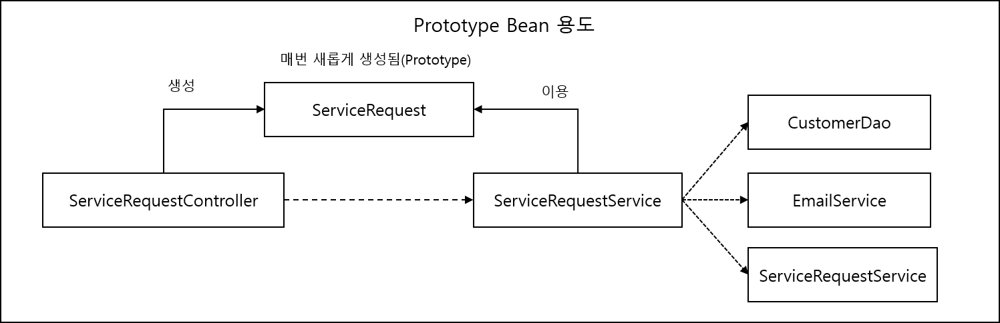
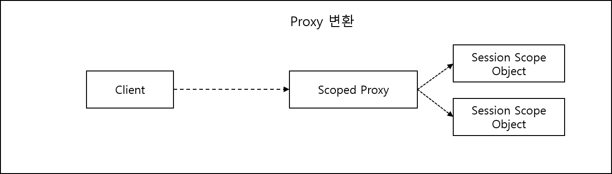

<div id="page">

<div id="main" class="aui-page-panel">

<div id="main-header">

<div id="breadcrumb-section">

1.  [Programming](README.md)
2.  [Programming](Programming_98307.md)
3.  [Spring](Spring_120848385.md)
4.  [토비의 Spring 정리](376569861.md)
5.  [Ch01.Spring IoC Container와 DI](376406017.md)

</div>

# <span id="title-text"> Programming : 1.3 Prototype과 scope </span>

</div>

<div id="content" class="view">

<div class="page-metadata">

Created by <span class="author"> Dongwook Han</span>, last modified on 3월 27, 2023

</div>

<div id="main-content" class="wiki-content group">

<div class="contentLayout2">

<div class="columnLayout two-left-sidebar" layout="two-left-sidebar">

<div class="cell aside" data-type="aside">

<div class="innerCell">

------------------------------------------------------------------------

<div class="toc-macro rbtoc1775379451927">

- [Prototype scope](#id-1.3Prototype과scope-Prototypescope)
  - [정의](#id-1.3Prototype과scope-정의)
  - [Prototype Bean의 생명주기 와 종속성](#id-1.3Prototype과scope-PrototypeBean의생명주기와종속성)
  - [Prototype Bean의 용도](#id-1.3Prototype과scope-PrototypeBean의용도)
  - [DI, DL](#id-1.3Prototype과scope-DI,DL)
  - [Prototype Bean의 DL 전략](#id-1.3Prototype과scope-PrototypeBean의DL전략)
- [Scope](#id-1.3Prototype과scope-Scope)
  - [Request Scope Bean](#id-1.3Prototype과scope-RequestScopeBean)
  - [Session, Global Session](#id-1.3Prototype과scope-Session,GlobalSession)
  - [application scope](#id-1.3Prototype과scope-applicationscope)
  - [scope bean의 사용 방법](#id-1.3Prototype과scope-scopebean의사용방법)
    - [session scope bean](#id-1.3Prototype과scope-sessionscopebean)
- [custom scope와 상태를 저장하는 bean](#id-1.3Prototype과scope-customscope와상태를저장하는bean)

</div>

------------------------------------------------------------------------

</div>

</div>

<div class="cell normal" data-type="normal">

<div class="innerCell">

- Spring의 Bean은 기본적으로 Singleton으로 동작

- Singleton이 아닌 여러 개의 Object를 만들어야 할 때는 다음 Bean 정의

  - Prototype Bean

  - Scope Bean

- Scope - 적용 범위. Singleton Bean 은 container scope bean 임

# Prototype scope

## 정의

- @scope("prototype”) 을 Bean class 위에 정의

  <div class="code panel pdl" style="border-width: 1px;">

  <div class="codeContent panelContent pdl">

  ``` syntaxhighlighter-pre
  @Scope("prototype")
  static class PrototypeBean {}
  ```

  </div>

  </div>

- 예제(Singleton bean 테스트) : 동일한 객체만 나옴

  <div class="code panel pdl" style="border-width: 1px;">

  <div class="codeContent panelContent pdl">

  ``` syntaxhighlighter-pre
  @Test
  public void singletonScope() {
    ApplicationContext ac = new AnnotationConfigApplicationContext(SingletoneBean.class, SingletonClientBean.class);
    // Set은 중복 허용 안함. 따라서 같은 object는 하나만 남음
    Set<SingletonBean> beans = new HashSet<SingletonBean>();
    // DL에서 singleton 확인
    beans.add(ac.getBean(SingletonBean.class));
    beans.add(ac.getBean(SingletonBean.class));
    assertThat(beans.size(), is(1));
    
    beans.add(ac.getBean(SingletonClientBean.class).bean1);
    beans.add(ac.getBean(SingletonClientBean.class).bean2);
    assertThat(beans.size(), is(1));
  }

  // Singleton scope bean
  static class SingletonBean{}
  // 한 번 이상 DI가 일어날 수 있도록 두 개의 DI용 property 선언
  static class SingletonClientBean {
    @Autowired SingletonBean bean1;
    @Autowired SingletonBean bean2;
  }
  ```

  </div>

  </div>

- 예제(Prototype bean 테스트)

  <div class="code panel pdl" style="border-width: 1px;">

  <div class="codeContent panelContent pdl">

  ``` syntaxhighlighter-pre
  @Test
  public void prototypeScope() {
    ApplicationContext ac = new AnnotationConfigApplicationContext(PrototypeBean.class, PrototypeClientBean.class);
    // Set은 중복 허용 안함. 따라서 같은 object는 하나만 남음
    Set<PrototypeBean> beans = new HashSet<PrototypeBean>();
    
    beans.add(ac.getBean(PrototypeBean.class));
    assertThat(beans.size(), is(1));
    beans.add(ac.getBean(PrototypeBean.class));
    assertThat(beans.size(), is(2));
    
    beans.add(ac.getBean(PrototypeClientBean.class).bean1);
    assertThat(beans.size(), is(3));
    beans.add(ac.getBean(PrototypeClientBean.class).bean2);
    assertThat(beans.size(), is(4));
  }

  @Scope("prototype")
  static class PrototypeBean{}

  static class PrototypeClientBean {
    @Autowired PrototypeBean bean1;
    @Autowired PrototypeBean bean2;
  }
  ```

  </div>

  </div>

## Prototype Bean의 생명주기 와 종속성

- IoC 기본 개념 : 어플리케이션을 구성하는 핵심 Object를 Container가 관리, 생성, 의존관계 주입(DI), 초기화, DI와 DL을 통한 사용, 제거 까지의 모든 생명 주기를 Container가 관리

- Prototype 은 Container가 생성만 하고 나머지 주기를 관리 안 함

- Prototype Bean은 생성 후, 주입받은 Object에 종속적

- Prototype Bean을 주입받은 Bean이 Singleton 인 경우, Container에 의해 Singletone Bean이 종료시 Prototype Bean도 종료

- 주입받은 Bean이 Prototype 인 경우, 그 lifecycle에 의해 적용

## Prototype Bean의 용도

- 서버가 요청에 따라 독립적으로 Object를 생성해서 상태를 저장해 둬야 하는 경우, Domain Object 나 DTO를 new 키워드로 생성하고 파라미터를 전달해서 사용

- Code 내에서 new 생성하고 사용하는 것은 괜챦으나, **<u>새롭게 만들어지는 Object가 Container의 Bean을 사용해야 하는 경우</u>**, 결국 Container가 새롭게 만들어져야 하는 Object를 생성해야 함 → prototype bean 사용

<span class="confluence-embedded-file-wrapper image-center-wrapper"></span>

- 코드 예제

  <div class="code panel pdl" style="border-width: 1px;">

  <div class="codeContent panelContent pdl">

  ``` syntaxhighlighter-pre
  public class ServiceRequest {
    String CustomerNo;
    String ProductNo;
    ...
  }
  ```

  </div>

  </div>

- ServiceRequestController

  <div class="code panel pdl" style="border-width: 1px;">

  <div class="codeContent panelContent pdl">

  ``` syntaxhighlighter-pre
  public void serviceRequestFormSubmit(HttpServletRequest request) {
    // 매 요청마다 새로운 ServiceRequest Object를 생성
    ServiceRequest serviceRequest = new ServiceRequest();
    serviceRequest.setCustomerNo(request.getParameter("custno");
    ...
    this.serviceRequestService.addNewServiceRequest(serviceRequest);
    ...
  }
  ```

  </div>

  </div>

- ServiceRequestService

  <div class="code panel pdl" style="border-width: 1px;">

  <div class="codeContent panelContent pdl">

  ``` syntaxhighlighter-pre
  public void addNewServiceRequest(ServiceRequest serviceRequest) {
    Customer customer = this.customerDao.findCustomerByNo(serviceRequest.getCustomerNo());
    ...
    this.serviceRequestDao.add(serviceRequest, customer);
    
    this.emailService.sendEmail(customer.getEmail(), "A/S 접수가 정상적으로 처리되었습니다.");
  }
  ```

  </div>

  </div>

- Web form 에서 전달한 custno 라는 String이 CustomerDao까지 연결되어 있음 =\> 전형적인 데이터 중심의 아키텍처가 만들어내는 구조이며 좀더 객체지향적, Object 중심의 구조로 만들어야 한다.

  - 입력방식(form 이건 ajax이건 간에 ) 휘둘리지 않고 고객 정보를 Customer Object로 전달받아야 함

- 객체 지향적, Object 중심의 구조로 변경

  - ServiceRequest

    <div class="code panel pdl" style="border-width: 1px;">

    <div class="codeContent panelContent pdl">

    ``` syntaxhighlighter-pre
    public class ServiceRequest {
      Customer customer;
      String ProductNo;
      ...
    }
    ```

    </div>

    </div>

  - ServiceRequestService

    <div class="code panel pdl" style="border-width: 1px;">

    <div class="codeContent panelContent pdl">

    ``` syntaxhighlighter-pre
    public void addNewServiceRequest(ServiceRequest serviceRequest) {

      this.serviceRequestDao.add(serviceRequest);
      
      this.emailService.sendEmail(customer.getEmail(), "A/S 접수가 정상적으로 처리되었습니다.");
    }
    ```

    </div>

    </div>

  - ServiceRequest에 Customer Model을 정의함으로써 form에서 받은 고객번호를 Customer로 변환하는 작업이 필요 =\> ServiceRequest에서 처리하도록 수정

  - 차후 입력방식이 ajax 라도 동일하게 ServiceRequest에서 변환 로직을 넣으면 됨

  - custno로 Customer 모델을 가져오도록 수정 코드

    <div class="code panel pdl" style="border-width: 1px;">

    <div class="codeContent panelContent pdl">

    ``` syntaxhighlighter-pre
    public class ServiceRequest {
      Customer customer;
      String ProductNo;
      ...
      @Autowired CustomerDao customerDao;
      
      public void setCustomerByCustomerNo(String customerNo) {
        this.customer = customerDao.findCustomerByNo(customerNo);
      }
    }
    ```

    </div>

    </div>

  - Controller 코드 수정

    <div class="code panel pdl" style="border-width: 1px;">

    <div class="codeContent panelContent pdl">

    ``` syntaxhighlighter-pre
    public void serviceRequestFormSubmit(HttpServletRequest request) {
      // 매 요청마다 새로운 ServiceRequest Object를 생성
      ServiceRequest serviceRequest = new ServiceRequest();
      serviceRequest.setCustomerByCustomerNo(request.getParameter("custno");
      ...
      this.serviceRequestService.addNewServiceRequest(serviceRequest);
      ...
    }
    ```

    </div>

    </div>

  - ServiceRequest가 CustomerDao를 DI받아 사용하도록 수정도 가능 =\> 파라미터(form or ajax)를 받아 Customer를 저장하는 구조

- Controller에서 ServiceRequest를 DI 적용 예제(prototype bean 생성)

  - ServiceRequest bean 정의

    <div class="code panel pdl" style="border-width: 1px;">

    <div class="codeContent panelContent pdl">

    ``` syntaxhighlighter-pre
    @Component
    @Scope("prototype")
    public class ServiceRequest {
      ...
    }
    ```

    </div>

    </div>

  - XML 정의

    <div class="code panel pdl" style="border-width: 1px;">

    <div class="codeContent panelContent pdl">

    ``` syntaxhighlighter-pre
    <bean id="serviceRequest" class="...ServiceRequest" scope="prototype">
      ...
    </bean>
    ```

    </div>

    </div>

  - Controller 정의

    <div class="code panel pdl" style="border-width: 1px;">

    <div class="codeContent panelContent pdl">

    ``` syntaxhighlighter-pre
    @Autowired ApplicationContext context;
    public void serviceRequestFormSubmit(HttpServletRequest request) {
      ServiceRequest serviceRequest = this.context.getBean(ServiceRequest.class);
      serviceRequest.setCustomerByCustomerNo(request.getParameter("custno"));
      ...
    }
    ```

    </div>

    </div>

- 참고 Page 165 ~ 168

- 고급 AOP 기능을 사용하면 새로운 Request를 Prototype Bean으로 만들어 DI 처리 가능

- 데이터 중심의 설계와 개발방식을 선호하면 new를 정의해서 구현

- Object 중심적이고 유연한 확장을 고려한다면 Prototype Bean을 이용하여 구현

## DI, DL

- ServiceRequest를 prototype bean 등록. Controller에서 ApplicationContext에서 getBean()으로 호출 =\> DL 사용 예

- DI 방식으로 변환 예제(Controller 코드)

  <div class="code panel pdl" style="border-width: 1px;">

  <div class="codeContent panelContent pdl">

  ``` syntaxhighlighter-pre
  @Autowired ServiceRequest serviceRequest;

  public void serviceRequestFormSubmit(...) {
    this.serviceRequest.setCustomerNo(...);
  }
  ```

  </div>

  </div>

  - 실행시 오류 발생되는 코드. Controller 가 singleton 이기 때문에 Controller에 DI 되기 위해서는 ServiceRequest가 딱 한번만 Object 생성됨(prototype 으로 정의했더라도). 앞서 prototype 생명 주기에서 prototype 은 종속된 bean의 생명주기를 따라간다고 정의함

  - 즉, DI는 Prototype Bean을 사용하기에 적합한 방식이 아님. 코드 내에서 필요할 때마다 Container에게 요청해서 새로운 Object를 만들어야 함 : **DL 방식**

## Prototype Bean의 DL 전략

- ApplicationContext를 코드에 직접 사용하는 것 이외의 다른 방법 소개

- ApplicationContext, BeanFactory 사용

  - ac.getBean()

  - xml만 사용시 ApplicationContextAware, BeanFactoryAware 사용

  - 앞서 설명한 방법과 동일 : Spring API가 Code에 등장함(되도록 이면 Spring API 가 Code 에 안 나오는 것을 선호)

- ObjectFactory, ObjectFactoryCreatingFactoryBean

  - 직접 ApplicationContext를 사용하지 않도록 중간에 Context에 GetBean()을 호출해주는 역할을 맡은 Object를 두는 방식(Page 170 그림 1-12).

  - 샘플 코드 Page 170 ~ 172

- ServiceLocatorFactoryBean

  - Factory interface를 정의해서 사용

  - 샘플 코드 Page 172 ~ 173

- Method 주입

  - ObjectFactory나 ServiceLocatorFactoryBean은 Bean을 새로 추가해야 하는 제약이 있음 =\> 그런 제약없이 사용할 수 있도록 하는게 Method 주입 방법

  - 메소드 코드 자체를 주입하는 방식으로 일정한 규픽을 따르는 추상 메소드를 작성해 주면 ApplicationContext와 getBean() 메소드를 사용해서 새로운 prototype bean을 가져오는 기능을 담당하는 메소드를 runtime 시에 추가해 주는 기술

  - Controller 클래스에 추상 메소드 선언

    <div class="code panel pdl" style="border-width: 1px;">

    <div class="codeContent panelContent pdl">

    ``` syntaxhighlighter-pre
    abstract public ServiceRequest getServiceRequest();

    public void serviceRequestFormSubmit(...){
      ServviceRequest serviceRequest = this.getServiceRequest();
      ...
    }
    ```

    </div>

    </div>

  - XML 추상 메소드를 가진 추상 클래스로 정의

    <div class="code panel pdl" style="border-width: 1px;">

    <div class="codeContent panelContent pdl">

    ``` syntaxhighlighter-pre
    <bean id="serviceRequestController" class="...ServiceRequestController">
      <lookup-method name="getServiceRequest" bean="serviceRequest"/>
    </bean>
    ```

    </div>

    </div>

- Provider\<T\>

  - @Inject와 함께 JSR-330(DIJ)에 추가된 표준 인터페이스 Provider 이용

  - Provider \<T\> 타입 parameter와 get() Factory method를 가진 인터페이스

  - ObjectFactory와 유사하지만 ObjectFactoryCreatingFactoryBean을 이용새 Bean을 등록하지 않아도 됨

  - Provider interface를 @Autowired @Inject @Resource 중 하나를 이용해 DI되도록 지정하면 Spring에서 자동 주입

  - Controller 예제

    <div class="code panel pdl" style="border-width: 1px;">

    <div class="codeContent panelContent pdl">

    ``` syntaxhighlighter-pre
    @Inject Provider<ServiceRequest> serviceRequestProvider;

    public void serviceRequestFormSubmit(...){
      ServiceRequest serviceRequest = this.serviceRequestProvider.get();
      ...
    }
    ```

    </div>

    </div>

  - ApplicationContext를 직접 호출해서 DL하는 방식은 되도록 사용하지 않도록 한다.

# Scope

- Spring 제공 Scope 종류

  - Singleton

  - Prototype

  - Request(Web 환경에서만 의미 있음)

  - Session(Web 환경에서만 의미 있음)

  - globalsession(Web 환경에서만 의미 있음)

  - application(Web 환경에서만 의미 있음)

- request, session, globalsession : 독립적인 상태를 저장해 주도 사용하는데 필요

## Request Scope Bean

- Web Request 안에서 만들어 지고 해당 쵸엉이 끝날 때 제거

- 하나의 웹 요청을 처리하는 동안에 참조하는 Web Request scope bean은 항상 동일한 object 임을 보장

- 주요 용도 : 어플리케이션 코드에서 생성된 정보를 프레임워크 레벨의 서비스나 인터셉터 등에 전달하는 것

- 현재 요청에 관련된 정보 또는 생성된 정보를 이 요청내에서 참조할 수 있도록 하는 용도(내 생각)

## Session, Global Session

- Http 세션과 같은 존재 범위를 갖는 Bean으로 만들어 주는 scope

- 로그인 정보나 사용자별 선택 옵션 등을 저장하기에 유용

- Http 세션에 있는 정보를 서비스 Layer 나 Persistence Layer 에서 직접 엑세스하기 위해 세션 정보를 넘기는 것보다는 웹 기술에 종속적이지 않은 objecct에 저장하고 session scope로 만들면 됨

- Global Session scope는 portlet에만 존재하는 global session 에 저장되는 Bean

## application scope

- Servlet context 에 저장되는 bean object

- singleton과 마찬가지로 상태를 갖지 않거나 상태가 있더라도 읽기 전용으로 만들거나 멀티 스레드 환겨에서 안전하도록 만들어야 함

## scope bean의 사용 방법

- request, session, global session은 prototype과 같이 한개 이상의 bean object가 생성됨 - request 마다, 사용자 마다 생성

- Spring이 Bean life cycle을 관리

- Singleton bean에 DI 하지 못함 - 상태값이 고정되서

- 어플리케이션 context 초기화시 요청, 세션은 만들어져 있지 않기 때문에 DI 해 놓으면 에러가 발생

- provider나 object factory 같은 DL 방식 사용해야 함

- scope bean에 대한 proxy를 DI할 수 있음

### session scope bean

- 예제

  <div class="code panel pdl" style="border-width: 1px;">

  <div class="codeContent panelContent pdl">

  ``` syntaxhighlighter-pre
  @scope("session")
  public class LoginUser {
    String loginId;
    Sring loginNm;
    ....
  }
  ```

  </div>

  </div>

- 사용예제

  <div class="code panel pdl" style="border-width: 1px;">

  <div class="codeContent panelContent pdl">

  ``` syntaxhighlighter-pre
  public class LoginService {
    @Autowired Provider<LoginUser> loginUserProvider;
    public void login(Login login) {
      LoginUser loginUser = loginUserProvider.get();
      ...
    }
  } // provider를 이용하여 DL 방식으로 scope bean 사용
  ```

  </div>

  </div>

- proxy로 변환

  - 개념

    <span class="confluence-embedded-file-wrapper image-center-wrapper"></span>

  - proxy pattern

    - 일반적으로 지연된 로딩이나 원격 오브젝트 접속 등과 같은 보편적인 응용 방법 : Proxy를 쓰는 일반적인 이유?

- Scope에 따라 다른 Object를 사용하게 해주는 독특한 목적을 위해 Prox사용

  - 첫번째 방법

    - Proxy bean이 interface 구현

    - 클라이언트(여기선 LoginService)에서 interface를 DI 받는 다면 Proxy Mode를 ScopedProxyMode.INTERFACES로 지정(샘플 코드가 없어 이해하기 어려움)

  - 두번째 방법

    - Proxy Bean 클래스를 직접 DI 한다면 Scoped ProxyMode.TARGET_CLASS로 지정

      <div class="code panel pdl" style="border-width: 1px;">

      <div class="codeContent panelContent pdl">

      ``` syntaxhighlighter-pre
      @Scope(value="Session", proxyMode =ScopedProxyMode.TARGET_CLASS)
      public class LoginUser {

      }

      public class LoginService {
        @Autowired LoginUser loginUser; // scope에 따라서 다른 object로 연결되는 proxy 주입됨
        public void login(Login login) {
          this.loginUser.setLoginId(...);
        }
      }

      // xml 로 scope proxy 설정
      <bean id="loginUser" class="...LoginUser" scope="session">
        <aop:scoped_proxy proxy-target-class="true"/>
      </bean>
      ```

      </div>

      </div>

    - Proxy 방식의 DI를 적용하면 scope bean 이지만 singletone처럼 DL이 아닌 DI로 편하게 쓸 수 있다는 장점

    - scope를 모르고 사용하면 어려움이 있을 수 있어 주의 필요

# custom scope와 상태를 저장하는 bean

- custom scope bean 구현 가능

- 사용자별 일정한 작업 단위동안 유지되는 정보 저장용 등

- 방법

  - scope interface 구현하여 생성

  - 편하게 custom scope bean을 생성하는데 도움을 주는 framework, spring web flow, jboss seam 참고

  - bean에 상태를 저장해주는 방식 선호하지 않을 경우 stateless singleton bean을 사용하고 상태 정보는 URL 파라미터, 쿠키, from hidden field, DB, HTTP session 에 분산해 저장하고 코드로 관리 : 제목에는 상태를 저장하는 bean 사용하기라 써 놓고 정작 내용은 없으 다른 방식 사용하라고 서술

</div>

</div>

</div>

</div>

</div>

<div class="pageSection group">

<div class="pageSectionHeader">

## Attachments:

</div>

<div class="greybox" align="left">

 [prototypebean_usage.png](attachments/376799402/381550617.png) (image/png)\
 [proxy_scope.png](attachments/376799402/383549441.png) (image/png)\
 [propertySourcce.png](attachments/376799402/386596912.png) (image/png)\

</div>

</div>

</div>

</div>

<div id="footer" role="contentinfo">

<div class="section footer-body">

Document generated by Confluence on 4월 05, 2026 17:57

<div id="footer-logo">

[Atlassian](http://www.atlassian.com/)

</div>

</div>

</div>

</div>
