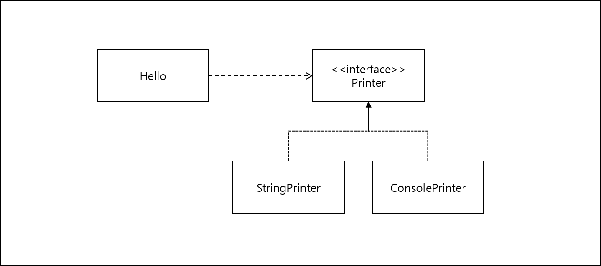
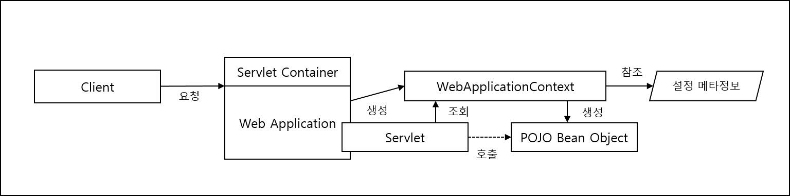
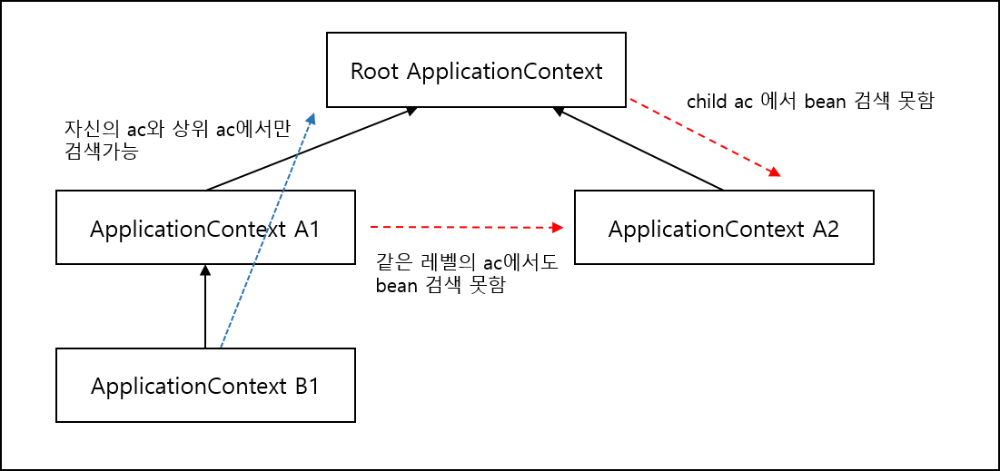
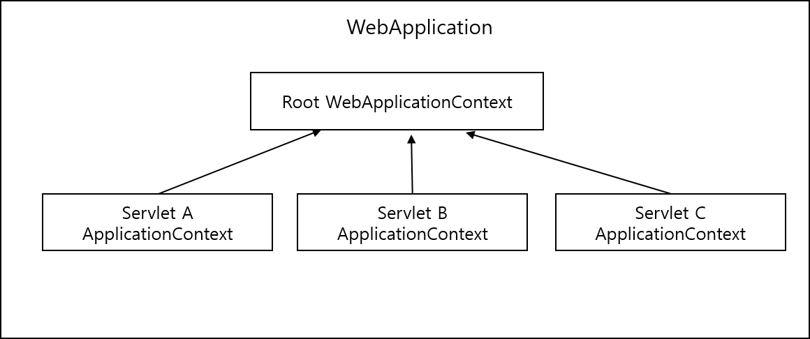
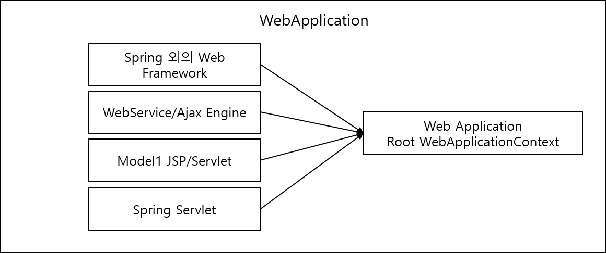

<div id="page">

<div id="main" class="aui-page-panel">

<div id="main-header">

<div id="breadcrumb-section">

1.  [Programming](README.md)
2.  [Programming](Programming_98307.md)
3.  [Spring](Spring_120848385.md)
4.  [토비의 Spring 정리](376569861.md)
5.  [Ch01.Spring IoC Container와 DI](376406017.md)

</div>

# <span id="title-text"> Programming : 1.1 IoC Container : Bean Factory와 ApplicationContext </span>

</div>

<div id="content" class="view">

<div class="page-metadata">

Created by <span class="author"> Dongwook Han</span>, last modified on 12월 31, 2022

</div>

<div id="main-content" class="wiki-content group">

<div class="contentLayout2">

<div class="columnLayout two-left-sidebar" layout="two-left-sidebar">

<div class="cell aside" data-type="aside">

<div class="innerCell">

<style type="text/css">/**/
div.rbtoc1775379450404 {padding: 0px;}
div.rbtoc1775379450404 ul {list-style: disc;margin-left: 0px;}
div.rbtoc1775379450404 li {margin-left: 0px;padding-left: 0px;}

/**/</style>

<div class="toc-macro rbtoc1775379450404">

- [IoC Container를 이용해 Application 만들기](#id-1.1IoCContainer:BeanFactory와ApplicationContext-IoCContainer를이용해Application만들기)
  - [POJO Class](#id-1.1IoCContainer:BeanFactory와ApplicationContext-POJOClass)
  - [설정 메타 정보](#id-1.1IoCContainer:BeanFactory와ApplicationContext-설정메타정보)
    - [IoC Container 설정 및 동작 예제 샘플](#id-1.1IoCContainer:BeanFactory와ApplicationContext-IoCContainer설정및동작예제샘플)
- [IoC Container 종류와 사용 방법](#id-1.1IoCContainer:BeanFactory와ApplicationContext-IoCContainer종류와사용방법)
- [IoC Container 계층 구조](#id-1.1IoCContainer:BeanFactory와ApplicationContext-IoCContainer계층구조)
  - [부모 Context를 이용한 계층 구조 효과](#id-1.1IoCContainer:BeanFactory와ApplicationContext-부모Context를이용한계층구조효과)
  - [Context 계층 구조 Test](#id-1.1IoCContainer:BeanFactory와ApplicationContext-Context계층구조Test)
- [Web Application의 IoC Container 구성](#id-1.1IoCContainer:BeanFactory와ApplicationContext-WebApplication의IoCContainer구성)
  - [Web Application의 Context 계층 구조](#id-1.1IoCContainer:BeanFactory와ApplicationContext-WebApplication의Context계층구조)
  - [Web Application의 Context 구성 방법](#id-1.1IoCContainer:BeanFactory와ApplicationContext-WebApplication의Context구성방법)
  - [Root Application Context 등록](#id-1.1IoCContainer:BeanFactory와ApplicationContext-RootApplicationContext등록)
  - [Servlet Application Context 등록](#id-1.1IoCContainer:BeanFactory와ApplicationContext-ServletApplicationContext등록)

</div>

</div>

</div>

<div class="cell normal" data-type="normal">

<div class="innerCell">

- Container 가 Object의 생성과 관계 설정, 사용, 제거 등의 작업 담당

- Spring에서 Bean Factory(Object 생성과 Object 사이의 관계 설정 DI관점) 또는 Application Context(Bean Factory 기능에 Application 을 개발하는 여러가지 Container 기능을 추가한 것)라고 부름(관점의 차이)

- Bean Factory : BeanFactory interface

- Application Context : ApplicationContext interface → BeanFactory 상속

  <div class="code panel pdl" style="border-width: 1px;">

  <div class="codeContent panelContent pdl">

  ``` syntaxhighlighter-pre
  public interface ApplicationContext extends ListableBeanFactory, HierachicalBeanFactory, 
  MessageSouce, ApplicationEventPublisher, ResourcePatternResolver {
  }
  ```

  </div>

  </div>

# IoC Container를 이용해 Application 만들기

- IoC Container를 만드는 것은 ApplicationContext 구현 class의 instance를 만드는 것

  <div class="code panel pdl" style="border-width: 1px;">

  <div class="codeContent panelContent pdl">

  ``` syntaxhighlighter-pre
  StaticApplicationContext ac = new StaticApplicationContext();
  ```

  </div>

  </div>

- IoC Container로 동작하려면 POJO class와 설정 메타 정보 필요

## POJO Class

- 특정 기술과 스펙에서 독립적이고 의존 관게에 있는 다른 POJO와 느슨한 결합을 갖도록 구현

  - POJO(Plain Old Java Object) : 오래된 방식의 간단한 Java Object. Java EE 등의 중량 프레임워크에 종속되지 않는 객체, 특정 기술에 종속되지 않는 순수한 자바 객체

- 느슨한 결합을 갖는 Class의 다이어그램

  <span class="confluence-embedded-file-wrapper image-center-wrapper"></span>

## 설정 메타 정보

- 정의 : Bean을 어떻게 만들고 어떻게 동작하게 할 것인가에 대한 정보

- 설명 : Printer interface를 구현하는 여러 Class 중 Application에서 사용할 것은 선정하고 이를 IoC Container가 제어할 수 있도록 적절한 Meta 정보 만들어 제공

- Spring의 설정 메타 정보 : BeanDefinition interface로 표현되는 순수한 추상 정보

- ApplicationContext는 BeanDefinition interface를 구현한 메타정보 Object를 사용해 IoD와 DI 작업 수행

- XML, Annotation, Java Code, Property File 등을 BeanDefinitionReader가 읽어 BeanDefinition Object 로 변환

- Bean Meta 정보

  - Bean id, name, alias : Bean Object를 구분할 수 있는 식별자

  - class or class name : Bean으로 만들 POJO class 또는 service class 정보

  - scope : Singleton, Prototype 과 같은 Bean의 생성 방식 과 존재 범위

  - property 또는 reference : DI에 사용할 Property name와 값 또는 참조하는 Bean의 이름

  - constructor parameter 또는 reference : DI에 사용할 생성자 파라미터 이름과 값 또는 참조할 Bean의 이름

  - lazy loading 여부, 우선 빈 여부, autowiring 여부, parent bean 정보, Beanfactory 이름 등

#### IoC Container 설정 및 동작 예제 샘플

- java code 로 Hello Class를 IoC Container에 Bean으로 등록

  <div class="code panel pdl" style="border-width: 1px;">

  <div class="codeContent panelContent pdl">

  ``` syntaxhighlighter-pre
  StaticApplication ac = new StaticApplicationContext();
  ac.registerSingletone("hello", Hello.class);

  Hello hello1 = ac.getBean("hello1", Hello.class);
  assertThat(hello1, is(notNullValue()));
  ```

  </div>

  </div>

  - StaticApplicationContext는 java code로 메타 정보를 등록하는 기능을 제공하는 ApplicationContext

- IoC Container가 관리하는 Bean은 Object 단위임(Class 단위 아님)

  - 똑같은 DataSource class로 여러 DB 접속 정보를 가진 Multi DataSource를 설정하는 것을 보면 Object 단위임

- 직접 BeanDefinition type의 설정 메타 정보 만들어서 IoC Container 등록

  <div class="code panel pdl" style="border-width: 1px;">

  <div class="codeContent panelContent pdl">

  ``` syntaxhighlighter-pre
  // Bean 메타 정보를 담은 Object 생성 
  BeanDefinition helloDef = new RootBeanDefinition(Hello.class);
  // Bean의 name property에 들어갈 값 지정
  helloDef.getPropertyValues().addPropertyValue("name", "Spring");
  // 앞에서 생성된 bean 메타 정보를 hello2라는 이름을 가진 bean 으로 등록
  ac.registerBeanDefinition("hello2", helloDef);
  ```

  </div>

  </div>

- hello1과 hello2 검증

  <div class="code panel pdl" style="border-width: 1px;">

  <div class="codeContent panelContent pdl">

  ``` syntaxhighlighter-pre
  // BeanDefinition으로 등록된 bean이 container에 의해 만들어지고 설정이 되었는지 확인
  Hello hello2 = ac.getBean("hello2", Hello.class);
  assertThat(hello2.sayHello(), is("Hello Spring"));
  // 처음 등록한 bean과 두번째 등록한 bean이 모두 동일한 Hello object 인지 확인
  assertThat(hello1, is(not(hello2)));
  // IoC  Container에 등록된 Bean 설정 메타 정보 개수가 2개인지 체크
  assetThat(ac.getBeanFactory().getBeanDefinitionCount(), is(2));
  ```

  </div>

  </div>

- BeanDefinition에 다른 Bean의 ID를 reference로 DI 넣어주기 예제

  <div class="code panel pdl" style="border-width: 1px;">

  <div class="codeContent panelContent pdl">

  ``` syntaxhighlighter-pre
  StaticApplicationContext ac = new StaticApplicationContext();
  // StringPrinter 클래스 타입이면 "printer"라는 이름을 가진 bean 등록
  ac.registerBeanDefinition("printer", new RootBeanDefinition(StringPrinter.class));

  BeanDefinition helloDef = new RootBeanDefinition(Hello.class);
  helloDef.getPropertyValues().addPropertyValue("name", "Spring");
  // hello bean 에 id가 printer 인 bean에 대한 reference를 property로 등록
  helloDef.getPropertyValues().addPropertyValue("printer", new RuntimeBeanReference("printer"));

  ac.registerBeanDefinition("hello", helloDef);

  Hello hello = ac.getBean("hello", Hello.class);
  hello.print();
  // Hello 클래스의 print() 메소드는 DI된 Printer 타입의 object에게 요청해서 출력
  assertThat(ac.getBean("printer").toString(), is("Hello Spring"));
  ```

  </div>

  </div>

# IoC Container 종류와 사용 방법

- StaticApplicationContext

  - 코드로 Bean 메타 정보 등록

  - test목적으로만 사용 권장

- GenericApplicationContext

  - 가장 일반적인 구현 클래스

  - XML와 같은 외부 리소스에 있는 bean 설정 메타 정보를 reader로 읽어 변환

  - XmlBeanDefinitionReader(xml reader)

  - xml reader 사용 예제

    <div class="code panel pdl" style="border-width: 1px;">

    <div class="codeContent panelContent pdl">

    ``` syntaxhighlighter-pre
    GenericApplicationContext ac = new GenericApplicationContext();
    XmlBeanDefinitionReader reader = new XmlBeanDefinitionReader(ac);
    reader.loadBeanDefinitino("spring/context-common.xml");
    ac.refresh();
    ```

    </div>

    </div>

  - property file에서 Bean 메타 정보 reader : PropertiesBeanDefinitionReader

  - Spring 대표 Bean 설정 방식 : xml 파일, Java source Code Annotation, Java Class

  - GenericApplicationContext 를 코드에서 직접 만들고 초기화할 이유는 없음. 내부적으로 자주 사용됨

  - 테스트 클래스 구현시 테스트 실행시 GenericApplicationContext가 내부적으로 생성되어 사용됨

    <div class="code panel pdl" style="border-width: 1px;">

    <div class="codeContent panelContent pdl">

    ``` syntaxhighlighter-pre
    @RunWith(SpringJunit4ClassRunner.class) // Junit4 에서만 사용됨
    @ContextConfiguration(locations="/test-applicationContext.xml") 
    public class UserServiceTest {
      @Autowired ApplicationContext applicationContext;
    }
    ```

    </div>

    </div>

- GenericXmlApplicationContext

  - XmlBeanDefinitionReader 내장(Xml 파일을 읽고 refresh까지 처리 간단)

  - 예제 코드

    <div class="code panel pdl" style="border-width: 1px;">

    <div class="codeContent panelContent pdl">

    ``` syntaxhighlighter-pre
    GenericXmlApplicationContext ac = new GenericXmlApplicationContext("spring/context.xml");
    ```

    </div>

    </div>

- WebApplicationContext

  - 가장 많이 사용되는 Application Context interface

  - XML 사용 : XmlWebApplicationContext

  - annotation 사용 : AnnotationConfigWebApplicationContext

- 웹 환경에서 Spring Application이 기동하는 방식

<span class="confluence-embedded-file-wrapper image-center-wrapper"></span>

- Spring이 제공하는 DispatcherServet 이 ApplicationContext 생성하고 설정 메타 정보로 초기화하고 요청마다 적절한 Bean을 찾아 호출해줌

# IoC Container 계층 구조

## 부모 Context를 이용한 계층 구조 효과

<span class="confluence-embedded-file-wrapper image-center-wrapper"></span>

- 계층 구조 규칙

  - Bean 정보 검색시 자신의 ApplicationContext와 Root ApplicationContext 에서만 검색가능

  - 자식 ApplicationContext 나 같은 레벨의 ApplicationContext 는 bean 검색 못함

  - 자신과 Root ApplicationContext에 동일한 Bean 으로 검색될 시 자신의 Bean 설정이 우선

- 부모 Context를 사용하여 계층 구조로 구성하는 목적

  - 미리 만들어진 ApplicationContext 의 설정을 그대로 가져다 쓰면서 일부 bean의 설정만 바꾸고자 할 때

  - 여러 ApplicationContext가 공유하는 설정을 만들기 위해서

- Bean을 담아둘 IoC Container는 Application 마다 하나로 충분

  - 관리하는 Bean의 개수가 많아지면 여러 개의 설정파일 사용(context-common, context-config 등)

- 한 개 이상의 IoC Container를 만들고 사용해야 할 떄 → 계층 구조를 사용 (어떤 케이스?)

## Context 계층 구조 Test

- 학습용으로 테스트

- 부모 Context 예제

  <div class="code panel pdl" style="border-width: 1px;">

  <div class="codeContent panelContent pdl">

  ``` syntaxhighlighter-pre
  <?xml version="1.0" encoding="UTF-8"?>
    <beans xmlns="http://www.springframework.org/schema/beans"
           xmlns:xsi="http://www.w3.org/2001/XMLSchema-instance"
          xsi:schemaLocation="http://www.springframework.org/schema/beans
          http://www.springframework.org/schema/beans/spring-beans-3.0.xsd">
    <bean id="printer"
         class="....StringPrinter"/>
         
    <bean id="hello" class="... Hello">
      <property name="name" value="Parent" />
      <property name="printer" ref="printer" />
    </bean>
  </beans>
  ```

  </div>

  </div>

- 자식 Context 예제

  <div class="code panel pdl" style="border-width: 1px;">

  <div class="codeContent panelContent pdl">

  ``` syntaxhighlighter-pre
  <?xml version="1.0" encoding="UTF-8"?>
    <beans xmlns="http://www.springframework.org/schema/beans"
           xmlns:xsi="http://www.w3.org/2001/XMLSchema-instance"
          xsi:schemaLocation="http://www.springframework.org/schema/beans
          http://www.springframework.org/schema/beans/spring-beans-3.0.xsd">
         
    <bean id="hello" class="... Hello">
      <property name="name" value="Child" />
      <property name="printer" ref="printer" /> <!-- 부모 설정에서 printer 찾음 -->
    </bean>
  </beans>
  ```

  </div>

  </div>

- 부모 Context 생성 자바 코드

  <div class="code panel pdl" style="border-width: 1px;">

  <div class="codeContent panelContent pdl">

  ``` syntaxhighlighter-pre
  ApplicationContext parent = new GenericXmlApplicationContext(basePath + "parentContext.xml");
  ```

  </div>

  </div>

- 자식 Context 생성 자바 코드

  <div class="code panel pdl" style="border-width: 1px;">

  <div class="codeContent panelContent pdl">

  ``` syntaxhighlighter-pre
  // 부모 Context 를 설정 child는 parent를 부모 Context로 가지게 됨  
  GenericApplicationContext child = new GenericApplicationContext(parent);
  XmlBeanDefinitionReader reader = new XmlBeanDefinitionReader(child);
  reader.loadBeanDefinitions(basePath + "childContext.xml");
  child.refresh();
  ```

  </div>

  </div>

- child ApplicationContext 에서 printer를 검색하는 예제

  <div class="code panel pdl" style="border-width: 1px;">

  <div class="codeContent panelContent pdl">

  ``` syntaxhighlighter-pre
  Printer printer = child.getBean("printer", Printer.class);
  assertThat(printer, is(notNullValue()));
  ```

  </div>

  </div>

- Hello Bean 검증

  <div class="code panel pdl" style="border-width: 1px;">

  <div class="codeContent panelContent pdl">

  ``` syntaxhighlighter-pre
  Hello hello = child.getBean("hello", Hello.class);
  assetThat(hello, is(notNullValue()));

  hello.print();
  assertThat(printer.toString(), is("Hello Child")); // childContext 메타 정보를 참조하므로 Hello Child가 출력되야 함 
  ```

  </div>

  </div>

# Web Application의 IoC Container 구성

- Server에서 동작하는 Application에서 IoC 사용방법

  - 웹 기술 추세

    - Front Controller Pattern : 대표 Servlet을 등록해 두고 공통적인 선행 작업을 수행하게 한 후에 몇 개의 Servlet이 중앙집중식으로 모든 요청을 다 받아서 처리하는 방식

    - Spring 도 Front Controller Pattern 사용

  - IoC Container 생성 : Spring Application 요청을 처리하는 Servlet 안에서 생성, Web Application에 Container 생성, Enterprise Application 레벨에 IoC Container 두는 방법 세가지임

  - 일반적으로 Servlet 안에서 IoC Container 생성과 Web Application 안에 Container 생성 두 가지 방식 다 사용 : Spring Web Application 에는 두개의 Container, 즉 WebApplicationContext Object가 만들어짐

  - Front Controller Servlet 이 한 개 이상 등록되면 그만큼 전체 Container 개수 증가함 (Servlet 개수만큼 IoC Container 가 존재함)

## Web Application의 Context 계층 구조

- Web Application 레벨에 등록되는 IoC Container 는 Root WebApplicationContext

- Root WebApplicationContext는 Servlet 레벨에 등록되는 모든 Container 들의 부모 Container, 최상단에 위치함 Root Context 임

  <span class="confluence-embedded-file-wrapper image-center-wrapper"></span>

- Front Controller 역할을 하는 Servlet 마다 ApplicationContext 가 만들어짐

- Servlet 마다 공유하게 되는 공통적인 Bean 들을 WebApplication 에 등록하여 중복 방지가능

- 각 Servlet Context에는 개별적인 Bean을 등록

- Servlet을 나누는 케이스: Web 기술 외 다른 서비스 지원 (WebService, Ajax 등 Spring의 웹 기술 외의 기술 사용시 나눔)

  - ex : struts 라 JSF 같은 웹프레임워크 사용 등

- 다른 기술이나 Servlet Context 에서 Root Application Context에 접근하는 코드

  <div class="code panel pdl" style="border-width: 1px;">

  <div class="codeContent panelContent pdl">

  ``` syntaxhighlighter-pre
  WebApplicationContextUtils.getWebApplicationContext(ServletContext sc);
  ```

  </div>

  </div>

<span class="confluence-embedded-file-wrapper image-center-wrapper"></span>

## Web Application의 Context 구성 방법

- Servlet Context와 Root Application Context 계층 구조

  - Spring Web기술 사용시 : Web 관련 Bean은 Servlet Context에 등록하고 , 나머지는 Root Application Context에 등록

- Root Application Context 단일 구조

  - Spring Web 기술 사용하지 않을 때 Servlet Context 사용 안함

- Servlet Context 단일 구조

  - Spring 웹 기술 사용하면서 Spring 외의 Framework나 서비스엔진(Ajax)에서 Spring Bean을 사용 안할 때, Servlet Context만 사용

## Root Application Context 등록

- Web Application 레벨에 만들어지는 Root Web Application Context 등록하는 가장 간단한 방법

  - Servlet Event Listener 사용

  - Web Application의 시작과 종료시 발생하는 event를 처리하는 listener : ServletContextListener interface 이용

  - Spring은 ContextLoaderListener 제공(ServletContextListener interface 구현)

  - Web.xml에 등록 예제

    <div class="code panel pdl" style="border-width: 1px;">

    <div class="codeContent panelContent pdl">

    ``` syntaxhighlighter-pre
    <listener>
      <listener-class>org.springframework.web.context.ContextLoaderListener</listener-class>
    </listener>
    ```

    </div>

    </div>

- ContextLoaderListener가 만드는 Default Application Context class는 XmlWebApplicationContext

- XML 설정 파일 위치 : /WEB-INF/applicationContext.xml

- 설정 정보

  - contextConfigLocation : context 설정 파일 경로 변경 요소명

    <div class="code panel pdl" style="border-width: 1px;">

    <div class="codeContent panelContent pdl">

    ``` syntaxhighlighter-pre
    <context-param>
      <param-name>contextConfigLocation</param-name>
      <param-value>
        /WEB-INF/daoContext.xml
        /WEB-INF/applicationContext.xml
      </param-value>
    </context-param>
    ```

    </div>

    </div>

    - 설정경로 예약어

      - 클래스 패스 : classpath:

        - classpath:/config/context-\*.xml : 클래스 패스 밑의 /config/ 디렉토리의 context-로 시작하는 모든 xml

      - ANT 스타일의 경료 표시 방법 사용 가능

        - /WEB-INF/\*Context.xml : WEB-INF 밑의 Context.xml로 끝나는 모든 파일

  - contextClass

    - 자동으로 생성하는 Context class 정보 설정 key

    - default는 XmlWebApplicationContext

    - 설정변경 예제

      <div class="code panel pdl" style="border-width: 1px;">

      <div class="codeContent panelContent pdl">

      ``` syntaxhighlighter-pre
      <context-param>
        <param-name>contextClass</param-name>
        <param-value>org.springframework.web.context.support.AnnotationConfigWebApplicationContext</param-value>
      </context-param>
      ```

      </div>

      </div>

      - AnnotationConfigWebApplicationContext 로 변경

      - AnnotationConfigWebApplicationContext 는 contextConfigLocation 파라미터 반드시 선언 필요

## Servlet Application Context 등록

- Spring Front Controller Servlet : DispatcherServlet

  - web.xml에 Servlet 이름만 다르게 여러 Servlet 설정 가능 → Servlet Context가 여러개 등록됨

  - 등록 예제

    <div class="code panel pdl" style="border-width: 1px;">

    <div class="codeContent panelContent pdl">

    ``` syntaxhighlighter-pre
    <servlet>
      <servlet-name>spring</servlet-name>
      <servlet-class>org.springframeowrk.web.servlet.DispatcherServlet</servlet-class>
      <load-on-startup>1</load-on-startup>
    </servlet>
    ```

    </div>

    </div>

- \<servlet-name\>

  - Servlet Application Context는 독립적인 namespace를 가짐(ex : spring-servlet)

  - default XML 설정파일 위치를 namespace를 이용해 만듬 : /WEB-INF/Servletnamespace+'.xml'

  - 예제에서 지정한 Servlet-name 으로 생성된 설정 파일위치는 /WEB-INF/spring-servlet.xml

- \<load-on-startup\>

  - Servlet Container 가 언제 Servlet을 생성하고 초기화할지 시점 정의

  - 생략 or 음수 : 임의로 정한 시점에 생성, 초기화

  - 0 이상의 값 : Web Application 시작되는 시점에 생성, 초기화

- DispatcherServlet의 Default 설정을 변경하고자 하려면 \<servlet\> 내 \<init-param\> 을 사용하여 정의

  <div class="code panel pdl" style="border-width: 1px;">

  <div class="codeContent panelContent pdl">

  ``` syntaxhighlighter-pre
  <servlet>
    <servlet-name>spring</servlet-name>
    <servlet-class>org.springframework.web.servlet.DispatcherServlet</servlet-class>
    <init-param>
      <!-- Servlet Context 위치 및 파일 변경 -->
      <param-name>conntextConfigLocation</param-name>
      <param-value>
        /WEB-INF/applicationContext.xml
        /WEB-INF/spring-servlet.xml
      </param-value>
      </init-param>
      <load-on-startup>1</load-on-startup>
    </servlet>
  ```

  </div>

  </div>

</div>

</div>

</div>

</div>

</div>

<div class="pageSection group">

<div class="pageSectionHeader">

## Attachments:

</div>

<div class="greybox" align="left">

 [IoC01.png](attachments/376864885/376799457.png) (image/png)\
 [IoC02.png](attachments/376864885/376799463.png) (image/png)\
 [IoC04.png](attachments/376864885/376799469.png) (image/png)\
 [IoC05.png](attachments/376864885/376799475.png) (image/png)\
 [IoC06.png](attachments/376864885/376799481.png) (image/png)\

</div>

</div>

</div>

</div>

<div id="footer" role="contentinfo">

<div class="section footer-body">

Document generated by Confluence on 4월 05, 2026 17:57


</div>

</div>

</div>
