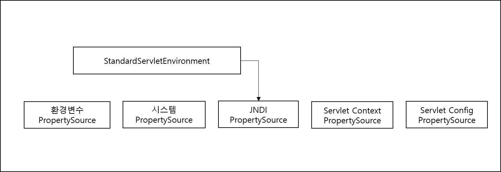

<div id="page">

<div id="main" class="aui-page-panel">

<div id="main-header">

<div id="breadcrumb-section">

1.  [Programming](README.md)
2.  [Programming](Programming_98307.md)
3.  [Spring](Spring_120848385.md)
4.  [토비의 Spring 정리](376569861.md)
5.  [Ch01.Spring IoC Container와 DI](376406017.md)

</div>

# <span id="title-text"> Programming : 1.5 Spring3.1의 IoC Container와 DI </span>

</div>

<div id="content" class="view">

<div class="page-metadata">

Created by <span class="author"> Dongwook Han</span>, last modified on 3월 27, 2023

</div>

<div id="main-content" class="wiki-content group">

# Spring 3.1의 Ioc container와 DI

page 189

## 3.1에 새롭게 도입된 IoC DI 기술

- 강화된 자바코드 빈 설정 : 자바코드를 이용한 설정 메타 정보 작성이 쉽다. XML을 사용하지 않거나 최소화한채 자동인식, 관례를 최대한 활용

- 런타임 환경 추상과, 개발과 테스트, 운영단계에서 IoC/ID 구성이 달라질 때 이를 효과적으로 관리할 수 있게 해주는 런티임 환경정보 관리기능

## Bean의 역할과 구분

### Bean의 종류

- Application Login Bean : data Logic, Dao, Service Object, Controller Object 등

- Application Infra Bean : dataSourcce, TransactionManager, 로직이 없이 설정, 연결 관리를 담당

- Container Infra Bean

  - Proxy 생성, IoC/ID 컨테이너의 기능을 확장하도록 확장 기능을 가진 Object를 SPring Bean으로 등록 ex) BeanPostProcessor, BeanFactoryPostProcessor

- 정의 : spring container 의 기능을 확장해서 bean의 등록, 생성, 관계 설정, 초기화 등이 작업에 참여하는 bean을 contianer infrastructure bean

## Container Infra Bean과 전용 태그

- DefaultAdvisorAutoProxyCreator

- AnnotationAwareAspectJAutoProxyCreator 같이 이름이 긴것도 있음

- 전용 태그로 Bean 간접 등록 권장 → \<context:annotation-config/\> 같은 태그

- \<context:component-scan/\> : 자동 인식을 이용한 bean 등록

- 대상 : @Component

- 사례2: @Configuration 은 자신이 bean으로 등록되면서 @Bean이 붙은 메소드의 return object 로 bean 으로 등록

  <div class="code panel pdl" style="border-width: 1px;">

  <div class="codeContent panelContent pdl">

  ``` syntaxhighlighter-pre
  @Configuration
  public class SimpleConfig {
    @Autowired 
    Hello hello;
    // hello() 메소드 bean 으로 등록 
    @Bean 
    Hello hello() {
      return new Hello();
    }
  }

  public class Hello {
    @PostConstruct
    public void init() {
      ...
    }
  }
  ```

  </div>

  </div>

  - @Configuration이 붙은 SimpleConfig만 Bean 등록, annotation을 이용한 bean 등록은 컨테이너 확장 기능으로 XML에 \<context:annotation-config/\> 정의 필요

  - Context의 namespace의 태그를 처리하는 핸들러를 통해 특정 bean이 등록하게 해줌 =\> Container infra bean이 등록됨

  - 6개의 container infra bean이 등록됨

  - ConfigurationClassPostProcessor\$ImportAwareBeanPostProcessor, ConfiguratoinClassPostProcessor, AutowireAnnotationBeanPostProcessor, RequiredAnnotationBeanPostProcessor, PersistenceAnnotationBeanPostProcessor : 후처리기

- \<context:annotation-config/\> : @Autowired나 @PostConstruct 처리

- \<context:component-scan/\> : @Component 처리

  - bean scanner 겸 \<context:annotation-config\>에 의해 등록되는 bean 등록 따라서 \<context:component-scan\> 하나만 사용해도 됨

page 196

bean 등록정보 조회 유틸리티 클래스 코드

## Bean의 역할

- 참고 page 196의 리스트 1-100 왼쪽의 정수 의미

  <div class="code panel pdl" style="border-width: 1px;">

  <div class="codeContent panelContent pdl">

  ``` syntaxhighlighter-pre
  int ROLE_APPLICATION = 0
  int ROLE_SUPPORT = 1
  int ROLE_INFRASTRUCTURE = 2
  ```

  </div>

  </div>

  - App logic bean, app infra bean 등 bean의 종류?

  - 복합 구조의 bean?

  - container infra bean 무시해도 됨, 거의 사용 안함

- Spring 3.1부터는 개발자가 Bean을 정의할 때 bean의 역할 값을 직접 지정할 수 있도록 @Role annotation 도입됨 =\> 3.0 이전은 역할값은 container 내부 값으로만 사용됨(최종적으로 어플리케이션 bean(logic bean, infra bean), 컨테이너 인프라 bean 으로 역할 나눌 수 있음)

# 컨테이너 인프라 bean을 위한 자바코드 메타 정보

- bean을 세가지 역할로 나누는 것은 각 역할별로 bean 설정 메타 정보를 작성하는 방법과 전략을 다르게 가져갈 수 있기 때문이다.

- 3.1부터는 container infra bean 도 java code로 등록 가능하다

- Spring 버전과 bean 등록 방식(참고)

- 

<div class="table-wrap">

|  |  |  |  |
|----|----|----|----|
| **버전** | **App Logic Bean** | **App Infra Bean** | **container Infra Bean** |
| 1.x | \<bean\> | \<bean\> | \<bean\> |
| 2.0 | \<bean\> | \<bean\> | 전용태그 |
| 2.5 | \<bean\>, 빈 스캔 | \<bean\> | 전용태그 |
| 3.0 | \<bean\>, 빈 스캔, 자바코드 | \<bean\>, 자바코드 | 전용태그 |
| 3.1 | \<bean\>, 빈 스캔, 자바코드 | \<bean\>, 자바코드 | 전용태그, 자바코드 |

</div>

- 자바코드를 이용한 container infra bean 등록

  - @ComponentScan

    - \<context:component-scan\> 과 동일하게 bean 스캔 등록

    - 예제

      <div class="code panel pdl" style="border-width: 1px;">

      <div class="codeContent panelContent pdl">

      ``` syntaxhighlighter-pre
      @Configuration
      @ComponentScan("springbook.learning.scanner")
      public class AppConfig {
      }
      ```

      </div>

      </div>

    - ComponentScan에 패키지 이름 대시 marker class나 interface 사용 방법

      1.  스캔할 기반 패키지에 bean interface 생성

          <div class="code panel pdl" style="border-width: 1px;">

          <div class="codeContent panelContent pdl">

          ``` syntaxhighlighter-pre
          public interfae ServiceMarker {}
          ```

          </div>

          </div>

      2.  @ComponentScan 에 marker interface 입력

          <div class="code panel pdl" style="border-width: 1px;">

          <div class="codeContent panelContent pdl">

          ``` syntaxhighlighter-pre
          @Configuration
          @ComponentScan(basePackageClasses=ServiceMarker.class)
          public class AppConfig {}
          ```

          </div>

          </div>

          - ServiceMarker.class 가 속한 패키지가 bean scanning할 기본 패키지가 됨

          - 왜 marker interface나 class를 사용 하나 : 패키지 이름, 오타나 패키지 경로가 긴 경우, 패키지 수정 등에 의해 변경이 되더라도 marker interface나 class가 있는 경우 영향받지 않고 base package 지정 가능

  - 스캔대상 패키지 제외 : excludes

    <div class="code panel pdl" style="border-width: 1px;">

    <div class="codeContent panelContent pdl">

    ``` syntaxhighlighter-pre
    @Configurationi
    @ComponentScan(basePackages="myProject", excludeFilters=@Filter(Configuration.class))
    public class AutoConfig {}
    ```

    </div>

    </div>

    - 제외할 클래스에 붙는 annotation

    - 특정 클래스 제외시 예제

      <div class="code panel pdl" style="border-width: 1px;">

      <div class="codeContent panelContent pdl">

      ``` syntaxhighlighter-pre
      @ComponentScan(basePackages="myproject", excludeFilters=@Filter(type=FilterType.ASSIGNABLE_TYPE,value=AppConfig.class))
      ...
      ```

      </div>

      </div>

  - @Import

    - 다른 @Configuration 클래스를 Bean Meta 정보에 추가할 때 사용

      <div class="code panel pdl" style="border-width: 1px;">

      <div class="codeContent panelContent pdl">

      ``` syntaxhighlighter-pre
      @Configuration
      @Import(DataConfig.class)
      public class AppConfig{
      }
      @Configuration
      public class DataConfig {
      }
      ```

      </div>

      </div>

  - @ImportResource

    - Spring 3.1은 이전 XML에서 사용되던 주요 전용 태그를 자바 클래스에서 annotation과 코드로 대체할 수 있게 해줌

    - 아직 XML만 지원되는 일부 전용 태그도 있음(Spring Security 등, 3.1 이후는 확인 필요)

    - XML이 꼭 필요한 bean 설정만 별도의 파일로 작성한 뒤에 @Configuration 클래스에서 @ImportResource 를 이용해 XML의 Bean 설정 가져옴

      <div class="code panel pdl" style="border-width: 1px;">

      <div class="codeContent panelContent pdl">

      ``` syntaxhighlighter-pre
      @Configuration
      @ImportResource("/myproject/config/security.xml")
      public class AppConfig {
      }
      ```

      </div>

      </div>

  - @EnableTransactionManagement

    - XML의 \<tx:annotation-driven/\>과 동일한 기능 수행

    - @Transactional 로 트랜잭션 속성을 지정할 수 있게 해주는 AOP 관련 Bean 등록해줌

  - 기타 Spring3.1 전용 태그 대체 가능한 annotation

    - @EnableAspectJAutoProxy

    - @EnableAsync

    - @EnableCaching

    - @EnableLoadTimeWeaving

    - @EnableScheduling

    - @EnableSpringConfigured

    - @EnableWebMvc

# Web Application의 새로운 IoC 컨테이너 구성

page 206

- 부제 Spring 3.1이 제공하는 자바코드 설정 방식을 적용한 IoC 컨테이너 구성

- 일반적 web.xml에 설정된 spring에 한해서 사용

  - root application context \<Listener\>

  - Servlet application context \<servlet\>

1.  XML 설정 파일을 보는 Default인 XmlWebApplicationContext 변경

    <div class="code panel pdl" style="border-width: 1px;">

    <div class="codeContent panelContent pdl">

    ``` syntaxhighlighter-pre
    <context-param>
      <param-name>contextClass</param-name>
      <param-value>
        org.springframework.web.context.support.AnnotationConfigWebApplicationContext
      </param-value>
    </context-param>
    ```

    </div>

    </div>

    - AnnotationConfigWebApplicationContext는 @Configuration class를 설정 정보로 사용한다.

      - @Configuration class를 설정 정보로 지정

        <div class="code panel pdl" style="border-width: 1px;">

        <div class="codeContent panelContent pdl">

        ``` syntaxhighlighter-pre
        <context-param>
          <param-name>contextConfigLocation</param-name>
          <param-value>myproject.config.AppConfig</param-value>
        </context-param>
        ```

        </div>

        </div>

    - @Configuration class가 여러 개일 경우 패키지 지정하고 그 패키지에 @Configuration class를 모아 둔다. ex) myproject.config

2.  Servlet Config

    - Default는 XmlWebApplicationContext 이며 변경 하려면 \<Servlet\>의 \<init-param\> 을 수정

      <div class="code panel pdl" style="border-width: 1px;">

      <div class="codeContent panelContent pdl">

      ``` syntaxhighlighter-pre
      <init-param>
        <param-name>contextClass</param-name>
        <param-value>...AnnotationConfigWebApplicationContext</param-value>
      </init-param>
      <init-param>
        <param-name>contextConfigLocation</param-name>
        <param-value>myproject.config.WebConfig</param-value>
      </init-param>
      ```

      </div>

      </div>

    - @Configuration 은 xml 기반 설정에서 \<context:annotation-config /\> 전용 태그로 등록됨

    - AnnotationConfigWebApplicationContext는 자바 코드 기반 설정에서 @Configuration class 등옥은 기본적으로 제공함

    - \<context:component-scan …\> 은 @Component-scan을 가진 @Configuration 클래스 정의. root Application Context의 contextConfigLocation 으로 지정

      <div class="code panel pdl" style="border-width: 1px;">

      <div class="codeContent panelContent pdl">

      ``` syntaxhighlighter-pre
      @Configuration
      @ComponentScan("myproject")
      public class AppConfig{
      }
      ```

      </div>

      </div>

    - XML 전용 태그 =\> spring3.1 제공 @EnableTransactionManagement 값은 annotation으로 대치

    - \<bean\> =\> @bean 으로 대체

    - Spring Security나 Spring 외의 라이브러리가 제공하는 전용 태그는 별도의 XML을 만들고 @Configuration class 에서 @ImportResource 로 해당 XML을 가져와 사용하는 구조로 구현

      <div class="code panel pdl" style="border-width: 1px;">

      <div class="codeContent panelContent pdl">

      ``` syntaxhighlighter-pre
      @Configuration
      @ImportResource("/myproject/security.xml")
      public class AppConfig
      ```

      </div>

      </div>

# 런타임 환경 추상화와 profile

- 환경변화에 따른 빈 설정정보 변경 방법

  1.  빈 설정 파일의 변경

      - 메타 정보를 담은 XML class 따로 준비

      - 환경마다 빈 설정파일을(정보)를 따로 가져가는 것은 권장 안함

  2.  프로퍼티 파일 활용

      - 환경에 따라 달라지는 정보를 담은 property 파일 활용

        - ex) DB 설정 정보만 Property로 관리

          <div class="code panel pdl" style="border-width: 1px;">

          <div class="codeContent panelContent pdl">

          ``` syntaxhighlighter-pre
          <property name="driverClass" value="${db.driverClass"}/>
          ```

          </div>

          </div>

      - Spring 3.0까지 관리하던 방식

      - XML은 매번 update 되어 반영되고 property는 반영을 안 하거나 환경에 따라 올리기도 함

      - 환경에 따라 Bean 클래스가 바뀌거나 Bean 구성이 달라지는 경우, 같은 환경인데 수동 테스트나 자동 테스트시 DB 연결 정보가 바뀌거나 하는 경우 , 그외 여러가지 경우, property 파일만으로 해결 못하는 경우가 발생할 수 있음

## Spring3.1에서 런타임 환경 추상화

- context 내부에 Environment 인터페이스를 구현한 runtime 환경 object가 만들어져서 빈을 생성하거나 의존관계를 주입할 때 사용됨

- 프로파일의 개념 : 환경에 따라 다르게 구성되는 빈들을 다른 이름을 가진 프로파일 안에 정의

- 어플리케이션 컨텍스트가 시작될때 지정된 프로파일에 속한 bean들만 생성

- 프로파일, XML, 자바클래스 설정 모두 가능

### XML 사용

- 환경에 따라 변하지 않을 bean

  <div class="code panel pdl" style="border-width: 1px;">

  <div class="codeContent panelContent pdl">

  ``` syntaxhighlighter-pre
  <bean id="userDao" ...>
    <property name="..." />
  </bean>
  ```

  </div>

  </div>

- 환경에 따라 선택해야 하는 bean

  <div class="code panel pdl" style="border-width: 1px;">

  <div class="codeContent panelContent pdl">

  ``` syntaxhighlighter-pre
  <beans profile="dev">
    <bean id="dataSource" class="...">
      <property .../>
    </
    <bean>
  </beans>
  <beans profile="test">
    ...
  </bean>
  ```

  </div>

  </div>

  - \<beans profile=”환경별”\>\</beans\> 정의함

### 활성화할 profile 지정

- 직접 코드로 지정

  <div class="code panel pdl" style="border-width: 1px;">

  <div class="codeContent panelContent pdl">

  ``` syntaxhighlighter-pre
  GenericXmlApplicationContext ac = new GenericXmlApplicationContext();
  ac.getEnvironment().setActiveProfiles("de");
  ac.load(getClass(), "applicationContext.xml");
  ac.refresh();
  ```

  </div>

  </div>

  - xml loading refresh보다 먼저 setActiveProfiles()가 지정되어야 함

### VM에 설정

- -Dspring.profiles.active=dev

### web.xml의 \<context-param\>에 설정

<div class="code panel pdl" style="border-width: 1px;">

<div class="codeContent panelContent pdl">

``` syntaxhighlighter-pre
 <context-param>
  <param-name>spring.profiles.active</param-name>
  <param-value>dev</param-value>
<context-param>
```

</div>

</div>

- 서블릿 컨텍스트에서 지정시 \<servlet\> 태그 안에 정의

  <div class="code panel pdl" style="border-width: 1px;">

  <div class="codeContent panelContent pdl">

  ``` syntaxhighlighter-pre
  <servlet>
    ...
    <init-param>
      <param-name>spring.profiles.active</param-name>
      <param-value>dev</param-value>
    </init-param>
  </servlet>
  ```

  </div>

  </div>

- web.xml 수정은 권장하지 않음 : 환경마다 web.xml 을 수정 필요

- 대안으로 WAS의 JNDI 환경 값을 이용 =\> was는 환경별로 바뀌지 않으니, String 타입의 JNDI 값에 profile 지정해 두면 됨

- profile 설정방법에는 우선 순위가 있어 두가지 방법을 동시 사용해서 우선 순위를 가진 설정이 적용됨

  1.  \<init-param\>

  2.  Servlet Context param

  3.  JNDI property 값

  4.  System property

  5.  환경변수

## 프로파일 활용 전략

- profile을 한번에 두가지 이상 활성화 가능

  - 기능별로 구분해서 적용시 예로 DB는 개발, 메일은 Mock or 실제 조합해서 사용할 경우

  - 활성 프로파일에 다음과 같이 두 개의 설정을 모두 넣음

- \<beans profile\> 에도 환경별 적용한 bean이 동일할 경우 같이 정의 가능

  <div class="code panel pdl" style="border-width: 1px;">

  <div class="codeContent panelContent pdl">

  ``` syntaxhighlighter-pre
  <beans profile="dev, test" >
  ```

  </div>

  </div>

### Java code로 profile 지정

- @Configuration 클래스로 구현

  <div class="code panel pdl" style="border-width: 1px;">

  <div class="codeContent panelContent pdl">

  ``` syntaxhighlighter-pre
  @Configuration
  @Profile("dev")
  public class DevConfig{}
  ```

  </div>

  </div>

- AnnotationConfigWebApplicationContext 사용해 context-configLocation을 패키지로 지정. 패키지 내 @Connfiguration 클래스 중 @Profile 적용된 것 중 활성화된 것만 그리고 @configuration 클래스만(@profiles 이 없는) 등록됨

- ContextConfigLocation에서 패키지 기준 @Configuration 클래스 직접 지정되는 경우 AppConfig 클래스에 @import를 사용해 3개의 클래스를 가져오게 만듬@Profile이 있으면 활성Profile 의 메타 정보 가져옴

### 마지막 방법

- profile이 붙은 3개의 클래스를 AppConfig의 static 중첩 클래스로 정의

  <div class="code panel pdl" style="border-width: 1px;">

  <div class="codeContent panelContent pdl">

  ``` syntaxhighlighter-pre
  @Configuration
  public class AppConfig {
    @Bean UserDao userDao{}
    @Configuration
    @Profile("spring-test")
    public static class SpringTestConfig{}
    
    @Configuration
    @Profile("dev")
    public static DevConfig{}
    
    @Configuration
    @Profile("production")
    public static ProductionConfig{}
  }
  ```

  </div>

  </div>

# Property Source

- 외부 파일로 분리

  - \<context:property-placeholder\> : \${} 치환자 사용하여 property로부터 정보 가져옴

  - spring 전용 태그로 property 파일 내용 읽어 오는 bean 정의 : \<util:properties id=”dbProperties” location=”database.properties”/\>

  - property 키에 대해 치환해 주는 기능 선언 : \<context:property--placeholder location=”database.properties”/\>

  - properties는 기본적으로 ISO-8859-1 인코딩 사용

  - 영문외 문자는 유니코드 값 사용

  - spring은 UTF-8 지원하는 XML 형식의 property 파일 지원

  - 사용법 통일 - property 파일과 \<util:properties\> , \<context:property-place\>

## Spring에서 사용되는 property 종류

### 환경변수

- java - system.getEnv()

  - Spring System Environment bean 으로 환경변수 Map 가져옴

- 시스템 프로퍼티

  - JVM에 정의됨. -D 옵션도 포함

  - <a href="http://os.name" class="external-link" rel="nofollow">os.name</a>, user.home, java.home 등 코드, System.getProperties()

  - Spring SystemProperties Bean 으로 접근

- JDNI

  - JNDI Property, JDNI 환경값

  - \<jee:jndi-lookup id=”db.username” jndi-name=”db.username”/\>

- Servlet Context Parameter

  - web.xml 에 \<context-param\> 사용 정의

    1.  ServletContext Object를 직접 Bean에 주입받은 뒤 ServletContext를 통해 parameter를 가져오기. ServletContextAware 인터페이스를 Bean에 사용하거나 @Autowired로 가져와서 사용

        <div class="code panel pdl" style="border-width: 1px;">

        <div class="codeContent panelContent pdl">

        ``` syntaxhighlighter-pre
        @Autowired
        ServletContext servletContext;
        ServletContext.getInitParameter()
        ```

        </div>

        </div>

    2.  ServletContext Property PlaceholderConfigures 사용

- ServletCconfigr Paramter

  - ServletConfig : 개별 Servlet 을 위한 설정

    <div class="code panel pdl" style="border-width: 1px;">

    <div class="codeContent panelContent pdl">

    ``` syntaxhighlighter-pre
    <servlet>
      <servlet-name>...</servlet-name>
      <servlet-class>...</servlet-class>
      <init-param>
        ...
      </init-param>
      ...
    </servlet>
    ```

    </div>

    </div>

  - 값 가져오는 방법 : ServletConfigAware interface 구현

    <div class="code panel pdl" style="border-width: 1px;">

    <div class="codeContent panelContent pdl">

    ``` syntaxhighlighter-pre
    @Autowired Servletconfig servletConfig;
    servletConfig.getInitParameter("");
    ```

    </div>

    </div>

## profile 통합과 추상화

- spring 3.0

  - property 종류를 저장하는 방식이 다르면 사용하는 방식도 다름

    - property file =\> \<context:property-placeholder\>

    - jndi 저장 =\> \<jee:jndi-lookup\>

- spring 3.1

  - 다양한 property 종류가 있더라도 property source 라는 개념으로 추상화하고 동일한 API로 가져올 수 있게 해줌

    - property source

    - Environment 타입의 runtime object

    - standardEnvironment는 독립형 applicatoin용 context에 사용되는 Runtime object : 무슨 의미?

    - 두가지 종류의 property source 제공

      - system property source

      - 환경변수 property source

    - property 가져오는 예제 =\> Environment.getProperty()로 가져옴

      <div class="code panel pdl" style="border-width: 1px;">

      <div class="codeContent panelContent pdl">

      ``` syntaxhighlighter-pre
      AnnotationConfigApplicationContext ac = new AnnotationConfigApplicationContext(...);
      System.out.println(ac.getEnvironment().getProperty("os.name")); // 시스템 프로퍼티
      System.out.println(ac.getEnvironment().getProperty("Path"));  // 환경변수
      ```

      </div>

      </div>

    - 동일한 key가 중복 사용시 우선순위가 높은 property 값 가져옴

      - 시스템 프로퍼티 \> 환경변수 프로퍼티

## Java Code로 property 직접 추가하여 Application Context에 추가

- 예제

  <div class="code panel pdl" style="border-width: 1px;">

  <div class="codeContent panelContent pdl">

  ``` syntaxhighlighter-pre
  Properties p = new Properties();
  p.put("db.username","spring");
  PropertySource<?> ps = new PropertiesPropertySource("customPropertySource", p);

  AnnotationConfigApplicationContext ac = new AnnotationConfigApplicationContext(...);
  ac.getEnvironment().getPropertySource().addFirst(ps);
  ```

  </div>

  </div>

- PropertySource를 환경 Object에 직접 추가할 때는 우선 순위를 함께 지정해 주어야 한다.

- addFirst() : 현재 등록된 property source 보다 우선 순위 높게

- addLast(): 우선순위 낮게

- addBefore(), addAfter() 특정 프로퍼티 소스를 기준으로 우선 순위 지정

## PropertySource의 사용

### Environment.getProperty()

- 예제

  <div class="code panel pdl" style="border-width: 1px;">

  <div class="codeContent panelContent pdl">

  ``` syntaxhighlighter-pre
  @Autowired Environment env;
  String serverOS = env.getProperty("os.name");
  ```

  </div>

  </div>

- 반복적으로 propertysource로부터 가져와야 할 경우 @PostConstruct 메소드 정의하여 필드값에 지정

  <div class="code panel pdl" style="border-width: 1px;">

  <div class="codeContent panelContent pdl">

  ``` syntaxhighlighter-pre
  @PostConstruct
  public void init() {
    this.adminEmail = env.getProperty("admin.email");
  }
  ```

  </div>

  </div>

### PropertySourceConfigurerPlaceholder

- 앞에서 @Postconstruct 메소드에서 필드값에 정의하는 방법 대체 방안

  <div class="code panel pdl" style="border-width: 1px;">

  <div class="codeContent panelContent pdl">

  ``` syntaxhighlighter-pre
  @Value("{admin.email}") private String adminEmail;
  ```

  </div>

  </div>

  - @Value 와 \${} 로 대체하려면 PropertySourceConfiurerPlaceholder가 등록되어 있어야 함

  - XML에서 property 파일의 정보를 프로퍼티 치환자에게 넘겨주는 propertyplaceholderConfigurer와 유사, 동작 방식과 기능이 다름. Spring3.0의 \<context:property-placeholder\>와 동일한 기능

- Bean 등록

  <div class="code panel pdl" style="border-width: 1px;">

  <div class="codeContent panelContent pdl">

  ``` syntaxhighlighter-pre
  @Bean
  public static PropertySourcesPlaceholderConfigurer pspc() {
    return new PropertySourcesPlaceholderConfigurer();
  }
  ```

  </div>

  </div>

  - PropertySourcePlaceolderConfigurer(pspc)가 BeanFactoryPostProcessor 후처리기로 되어 있는데 @Bean 메소드를 처리하는 기능도 BeanFactoryPostProcessor로 되어 있어서 @Bean 메소드에서 다른 후처리기를 만들어서 다시 @Bean 메소드가 있는 클래스의 Bean 설정을 가공하도록 만들 수 없기 때문이다. 그래서 Spring은 bean 후처리리가 만들어지기 전에 static으로 정의된 Bean을 먼저 만들게 해서 이 문제를 해결(자세한 설명은 page 230 에 정의된 블로그 링크 참고)

  - XML 설정만을 사용하거나 XML설정과 @Configuration 을 함께 사용하는 경우라면 \<context:property-placeholder\> 전용 태그 사용 가능

  - Spring3.0과 3.1에서의 \<context:property-placeholder\> 동작 방식이 다름

    - Spring 3.0은 \<context:property-placeholder\> 전용 태그 사용시 PropertyPlaceholderConfigurer 등록

    - Spring3.1은 PropertySourcePlaceholderConfigurer 빈 등록 프로퍼티 파일을 지정한 전용 태그는 Spring 3.0에서와 같이 동작함

## @PropertySource와 프로퍼티 파일

- 프로퍼티 파일을 사용할 때 @PropertySource 사용

  <div class="code panel pdl" style="border-width: 1px;">

  <div class="codeContent panelContent pdl">

  ``` syntaxhighlighter-pre
  @Configuration
  @PropertySource("database.properties")
  public class AppConfig{
  }
  ```

  </div>

  </div>

  - 프로퍼티 파일 여러 개 지정가능

    - @PropertSource(name="myPropertySource", value={“d.properties”,”c.xml”})

    - 컨텍스트에 기본적으로 등록되는 프로퍼티 소스보다 우선 순위 낮음

- 웹 환경에서 사용되는 PropertySource와 PropertySource 초기화 Object

  - root web context, servlet web context =\> Web Application Context 생성하고 (StandardServletEnvironment) Runtime environment objecct를 사용

    <span class="confluence-embedded-file-wrapper image-center-wrapper"></span>

  - property sourcce 우선순위

    - 서블릿 Config \> 서블릿 Context \> JDNI \> 시스템 \> 환경변수

- 자바코드로 PropertySource 추가하려면 ApplicationContextinitializer interface를 구현하여 작성

  <div class="code panel pdl" style="border-width: 1px;">

  <div class="codeContent panelContent pdl">

  ``` syntaxhighlighter-pre
  public interface ApplicationContextInitializer<C extends ConfigurableApplicationContext> {
  void initialize(C applicationContext);
  }
  ```

  </div>

  </div>

  - 컨텍스트가 생성된 후에 초기화 작업을 진행하는 object를 만들 때 사용

- Map 타입 PropertySource 추가하는 ApplicationContextInitializer를 구현 예제

- ApplicationContextInitializer interface는 타입 파라미터로 ConfigurableApplicationContext의 sub 타입을 받음

  - 만약 interface를 구현하여 클래스를 작성할 때 context를 AnnotationConfigWebApplicationContext를 쓴다면 Configurable…을 정의하지 말고 바로 Annotation..을 쓰면 casting 등 할 필요 없다는 말

- ApplicationContextInitializer를 구현하여 만든 클래스를 사용하기 위해선 Root Context 라면 다음과 같이 정의

  <div class="code panel pdl" style="border-width: 1px;">

  <div class="codeContent panelContent pdl">

  ``` syntaxhighlighter-pre
  <context-param>
    <param-name>contextInitializerClasses</param-name>
    <param-value>yContextInitializer</param-value>
  </context-param>
  ```

  </div>

  </div>

- Servlet Context 라면 다음과 같이 정의

  <div class="code panel pdl" style="border-width: 1px;">

  <div class="codeContent panelContent pdl">

  ``` syntaxhighlighter-pre
  <init-param>
    <param-name>contextInitializerClasses</param-name>
    <param-value>MyContextInitializer</param-value>
  </init-param>
  ```

  </div>

  </div>

- 필요시 Spring reference manual 참고

</div>

<div class="pageSection group">

<div class="pageSectionHeader">

## Attachments:

</div>

<div class="greybox" align="left">

 [propertySourcce.png](attachments/376864906/386596954.png) (image/png)\

</div>

</div>

</div>

</div>

<div id="footer" role="contentinfo">

<div class="section footer-body">

Document generated by Confluence on 4월 05, 2026 17:57

<div id="footer-logo">

[Atlassian](http://www.atlassian.com/)

</div>

</div>

</div>

</div>
