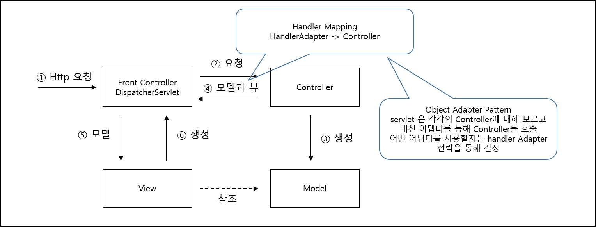
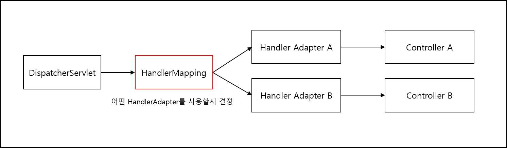

1.  [Programming](README.md)
2.  [Programming](Programming_98307.md)
3.  [Spring](Spring_120848385.md)
4.  [토비의 Spring 정리](376569861.md)
5.  [Ch03.Spring Web 기술과 Spring MVC](366804993.md)

#  Programming : 3.1 Spring의 Web Presentation Layer 기술 

Created by  Dongwook Han, last modified on 2월 28, 2023

------------------------------------------------------------------------

- [Spring Web Framework](#id-3.1Spring의WebPresentationLayer기술-SpringWebFramework)
  - [Spring Servlet/Spring MVC](#id-3.1Spring의WebPresentationLayer기술-SpringServlet/SpringMVC)
  - [Spring portfolio Web Framework](#id-3.1Spring의WebPresentationLayer기술-SpringportfolioWebFramework)
    - [Spring Web Flow](#id-3.1Spring의WebPresentationLayer기술-SpringWebFlow)
    - [Spring JavaScript](#id-3.1Spring의WebPresentationLayer기술-SpringJavaScript)
    - [Spring Faces](#id-3.1Spring의WebPresentationLayer기술-SpringFaces)
    - [Spring Web Service](#id-3.1Spring의WebPresentationLayer기술-SpringWebService)
    - [Spring BlazeDS Integration](#id-3.1Spring의WebPresentationLayer기술-SpringBlazeDSIntegration)
- [Spring MVC Architecture](#id-3.1Spring의WebPresentationLayer기술-SpringMVCArchitecture)
  - [HandlerMapping](#id-3.1Spring의WebPresentationLayer기술-HandlerMapping)
  - [HandlerAdapter](#id-3.1Spring의WebPresentationLayer기술-HandlerAdapter)
  - [HandlerExceptionResolver](#id-3.1Spring의WebPresentationLayer기술-HandlerExceptionResolver)
  - [View Resolver](#id-3.1Spring의WebPresentationLayer기술-ViewResolver)
  - [LocaleResolver](#id-3.1Spring의WebPresentationLayer기술-LocaleResolver)
  - [RequestToViewNameTranslator](#id-3.1Spring의WebPresentationLayer기술-RequestToViewNameTranslator)

------------------------------------------------------------------------

# Spring Web Framework

## Spring Servlet/Spring MVC

- Servlet 기반의 MVC 프레임워크

  - Front Controller 역할을 하는 DispatcherServlet 을 핵심 엔진으로 사용

  - 루트 컨텍스트와 서블릿 어플리케이션 컨텍스트 관리

- Spring Portlet

  - 자바 표준 기술 JSR-168, 286을 따르는 자바표준 기술인 Portlet MVC 프레임워크

  - Portlet : 자유로운 조합이 가능한 작은 단위의 Presentation 컴포넌트를 Portlet을 지원하는 Portal 서버에 배치하여 사용

  - Portlet Application Context 가짐

## Spring portfolio Web Framework

- page 351

### Spring Web Flow

- Spring Servlet을 기반으로 상태 유지 스타일의 웹 어플리케이션을 작성하게 해주는 프레임워크

### Spring JavaScript

- 자바스크립트 툴킷 Dojo를 추상화한것으로 스프링 서블릿과 스프링 웹 플로우에 연동해서 손쉽게 Ajax 기능을 구축할 수 있도록 함.

### Spring Faces

- JSF를 스프링 MVC와 스프링 SWF의 뷰로 손쉽게 사용할 수 있게 해주는 프레임워크

### Spring Web Service

- SOAP 기반의 웹 서비스 개발을 가능하게 해주는 프레임워크

### Spring BlazeDS Integration

- Adobe Flex의 BlazeDS와 스프링을 통합해서 빠르고 쉽게 플렉스를 지원하는 스프링 어플리케이션을 개발할 수 있도록 해주는 연동 프레임워크

 

# Spring MVC Architecture

## HandlerMapping

- URL과 요청 정보를 기준으로 어떤 Handler Object를 사용할 것인지 결정

  - DispatcherServlet은 하나 이상의 HandlerMapping을 가질 수 있음

  - Default HandlerMapping 은 다음과 같음

    - BeanNameUrlHandlerMapping

    - DefaultAnnotationHandlerMapping

## HandlerAdapter

- 

- DispatcherServlet은 Controller를 직접 호출하지 않고 HandlerAdapter를 호출 → Adaptor에서 각 Controller type 별로 데이터 변환 등을 수행

- default Handler Adapter

  - HttpRequestHandlerAdapter

  - SimpleControllerHandlerAdapter

  - AnnotationMethodHandlerAdapter

- 예 : @RequestMapping, @Controller에 대응하는 Controller는 DefaultAnnotationHandlerMapping에 의해 Handler 결정 → AnnotationMethodHandlerAdapter에서 해당 Controller 호출

- 조건에 따란 다른 HandlerMapping 이더라고 동일한 Handler Adapter를 호출할 수 있음

## HandlerExceptionResolver

- error page 표시, 관리자 통보 등의 기능은 DispatcherServlet 에서 처리

- 예외 처리를 HandlerExceptionResolver 중 적합한 것을 찾아 위임

- default HandlerExceptionResolver

  - AnnotationMethodHandlerExceptionResolver

  - ResponseStatusExceptionResolver

  - DefaultHandlerExceptionResolver

## View Resolver

- default

  - InternalResourceViewResolver

## LocaleResolver

- default

  - AcceptHeaderLocaleResolver

## RequestToViewNameTranslator

- Controller에서 View 이름이나 View object 전달 안할 때 URL 등 요청 정보를 참고해서 View이름을 생성해주는 전략

- default

  - DefaultRequestToViewNameTranslator

 

DispatcherServet의 Default 전략의 설정은 DispatcherServlet.properties에 정의됨

default외에 추가로 설정이 필요하면 ApplicationContext에 정의해서 대체함

## Attachments:

 [spring_mvc.png](attachments/382304428/382566429.png) (image/png)\
 [HandlerAdapter.png](attachments/382304428/382566435.png) (image/png)\

Document generated by Confluence on 4월 05, 2026 17:57

