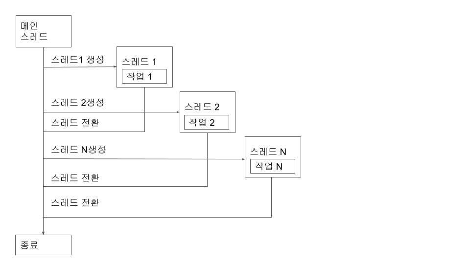
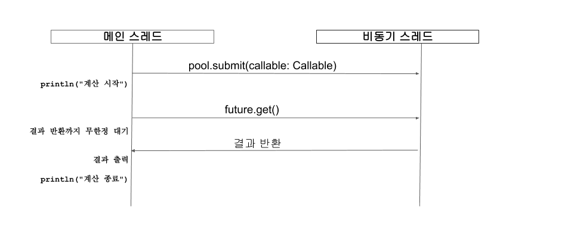
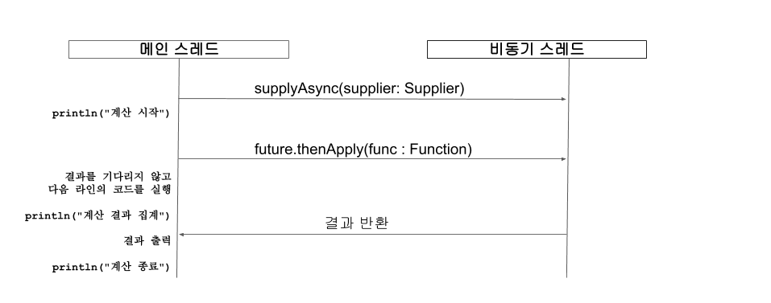
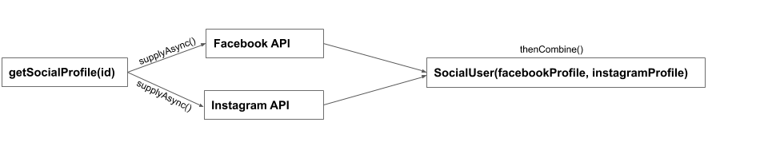

<div id="page">

<div id="main" class="aui-page-panel">

<div id="main-header">

<div id="breadcrumb-section">

1.  [Programming](README.md)
2.  [Programming](Programming_98307.md)
3.  [Reacive Programming](Reacive-Programming_383746171.md)

</div>

# <span id="title-text"> Programming : 기초2 </span>

</div>

<div id="content" class="view">

<div class="page-metadata">

Created by <span class="author"> Dongwook Han</span> on 3월 16, 2023

</div>

<div id="main-content" class="wiki-content group">

**동기(Synchronous)**방식의 프로그램에서 작업의 실행 흐름은 순차적으로 동작합니다. 순차적으로 동작하는 프로그램은 코드를 파악하기 쉽고 결과를 예측하기 쉽다는 장점이 있지만 특정 작업을 실행하는 동안에는 다른 작업을 할 수 없다는 단점이 있습니다. 이에 반해 비동기 처리 방식은 현재 실행 중인 작업이 끝나는 것을 기다리지 않고 다른 작업을 할 수 있습니다. 이러한 특징을 가진 비동기 프로그래밍은 서버, 모바일, 데스크톱 등 어떤 환경의  애플리케이션을 개발하더라도 유용하게 사용됩니다.

예를 들어 트위터나 페이스북 같은 SNS 서비스를 개발한다면 외부의 다양한 데이터 소스 또는 원격 서비스로부터 데이터를 가져온 뒤 적절하게 가공하고 하나로 합쳐서 클라이언트에게 응답하게 되는데 이런 경우 비동기 프로그래밍이 유용할 수 있습니다. 또 UI 애플리케이션의 경우 특정 이벤트에 반응하는 동작을 구현해야 하는데  이럴 때 필수적으로 비동기 프로그래밍을 사용하게 됩니다.대부분의 프로그래밍 언어들은 각 언어의 철학에 맞는 다양한 비동기 처리 방법들을 지원합니다. 비동기 처리 방법에는 대표적으로 스레드(Thread), 콜백(Callback), 프로미스(Promise), 퓨처(Future), 코루틴(Coroutine) 등이 있고 각각의 방법들은 장점과 단점이 존재하고 언어와 라이브러리에 따라 지원되지 않는 경우도 있습니다.리액티브 프로그래밍에 대한 학습에 앞서 기본적인 비동기 프로그래밍 지식은 필수입니다. 리액티브 프로그래밍에서 비동기 처리를 적용하면 콜백 헬에서 벗어날 수 있으며 퓨처를 사용했을때 성능 하락을 유발하는 블로킹 문제를 논 블로킹 형태로 쉽게 변경할 수 있습니다. 이번 절에서는 비동기 프로그래밍에 대한 기본적인 지식과 문제점에 대해 알아보겠습니다.

 

#### **스레드**

스레드는 서버 프로그래밍에서 가장 기본이 되는 비동기 처리 방식입니다. 하나의 프로세스(Process)에는 최소한 하나 이상의 스레드가 존재하고 프로세스 내의 스레드들은 동일한 메모리를 공유합니다. 일반적으로 하나의 프로세스에서 스레드가 1개인 경우 싱글 스레드(Single Thread)라고 부르고 하나 이상 존재하는 경우 멀티 스레드(Multi Thread)라고 부릅니다. 멀티 스레드를 사용하면 애플리케이션에서 여러 개의 작업을 동시에 할 수 있게 됩니다.

이번에는 스레드 자신의 이름을 출력하는 기능을 가진 5개의 스레드를 사용하는 간단한 멀티 스레드 예제를 만들어보겠습니다.

 

**예제 1.3 현재 스레드의 이름을 반환하는 예제**

<div class="code panel pdl" style="border-width: 1px;">

<div class="codeContent panelContent pdl">

``` syntaxhighlighter-pre
package thread
 
class PrintRunnable : Runnable {
    override fun run() {
         println("current-thread-name : ${Thread.currentThread().name}")
    }
}
```

</div>

</div>

예제 1.3의 PrintRunnable은 java.lang 패키지의 Runnable 인터페이스를 구현하는 클래스입니다. **러너블(Runnable)** 인터페이스를 사용하려면 run 함수를 필수로 구현해야합니다. run 내부에는 스레드 자신의 이름을 출력하도록 하였습니다. 그다음 메인 함수에서 5번 반복문을 수행하면서 PrintRunnable을 감싼 스레드를 생성하고 스레드를 동작시킵니다. 마지막엔 마찬가지로 현재 동작 중인 스레드 이름을 출력하는 print 함수를 호출합니다.

 

<div class="code panel pdl" style="border-width: 1px;">

<div class="codeContent panelContent pdl">

``` syntaxhighlighter-pre
package thread
 
fun main(args: Array<String>) {
    for (i in 0..5) {
         val thread = Thread(PrintRunnable())
         thread.start()
    }
    println("current-thread-name : ${Thread.currentThread().name}")
}
 
--------------------
출력 결과)
--------------------
current-thread-name : Thread-0
current-thread-name : Thread-3
current-thread-name : Thread-2
current-thread-name : Thread-1
current-thread-name : main
current-thread-name : Thread-4
current-thread-name : Thread-5
```

</div>

</div>

예제 1.4에서 출력된 결과는 예제를 실행할 때마다 달라지는 걸 확인할 수 있습니다. 만약 멀티 스레드를 사용하지 않고 예제를 출력하면 current-thread-name은 모두 main으로 출력됩니다. main은 메인 스레드로 불리며 JVM 기반의 언어에서 가장 기본이 되는 스레드를 말합니다. 

앞서 멀티 스레드 스레드는 생성한 순서대로 동작하지 않고 무작위로 동작하는걸 확인했습니다. 다수의 스레드를 사용하면 스레드가 전환되면서 **컨텍스트 스위칭(Context Switching)**이 발생합니다.

<span class="confluence-embedded-file-wrapper image-center-wrapper"></span>

**그림 1.3 멀티 스레드의 동작 방식**

 

멀티 스레드를 사용하면 스케쥴링 알고리즘에 의해 컨텍스트 스위칭이 일어나면서 특정 스레드가 작업을 실행하다가 다른 스레드로 전환되면서 새로운 작업을 하고 다시 원래 스레드로 돌아와서 일시 중지했던 작업을 이어서 완료합니다. 멀티 스레드를 사용하면 스레드마다 작업을 나눠서 처리할 수 있기 때문에 여러 개의 작업을 효율적으로 처리할 수 있습니다. 또한 스레드는 프로세스보다 가볍고 하나의 프로세스 내에서 여러 개의 스레드를 생성하면 메모리 자원을 공유할 수 있다는 장점을 가지고 있습니다.

 

하지만 스레드가 무한정 많아지면 생성된 스레드로 인해 메모리 사용량이 높아지게 되어 OutOfMemoryError가 발생할 수 있고 동시 처리량이 높아야 하는 시스템의 경우 스레드를 생성하면서 발생하는 대기 시간 때문에 클라이언트에게 빠른 응답을 줄 수 없게 됩니다. 이러한 문제를 극복하려면 스레드 풀(Thread Pool)을 사용해야 합니다. 스레드 풀을 사용하면 애플리케이션 내에서 사용할 총 스레드 수를 제한할 수 있고 이미 생성된 스레드를 재사용하므로 클라이언트는 빠른 응답을 받을 수 있습니다. 

 

스레드 풀은 직접 만드는 것보다 검증된 라이브러리를 사용하는 것이 좋습니다. 그러므로 java.util.concurrent 패키지가 제공하는 ExecutorService를 사용하면 쉽고 안정적으로 스레드 풀을 사용할 수 있습니다. 

 

**예제 1.5 ExecutorService를 사용해 스레드 실행하기**

<div class="code panel pdl" style="border-width: 1px;">

<div class="codeContent panelContent pdl">

``` syntaxhighlighter-pre
package thread
 
import java.util.concurrent.ExecutorService
import java.util.concurrent.Executors
 
fun main(args: Array<String>) {
    val pool: ExecutorService = Executors.newFixedThreadPool(5)
    try {
         for (i in 0..5) {
              pool.execute(PrintRunnable())
         }
    } catch (e: Exception) {
         pool.shutdown()
    }
    println("current-thread-name : ${Thread.currentThread().name}")
}
 
--------------------
출력 결과)
--------------------
current-thread-name : pool-1-thread-1
current-thread-name : pool-1-thread-2
current-thread-name : pool-1-thread-3
current-thread-name : pool-1-thread-4
current-thread-name : main
current-thread-name : pool-1-thread-5
current-thread-name : pool-1-thread-5
```

</div>

</div>

** **

- Executors.newFixedThreadPool을 사용하면 주어진 수만큼의 스레드를 생성하고 유지합니다. 즉 5로 값을 설정하면 5개의 스레드는 항상 유지되는 걸 보장합니다.

- pool.execute는 러너블 인터페이스를 받아서 단순히 실행합니다. execute는 별도의 반환형이 없기 때문에 작업의 결과나 상태를 알 수 없습니다.

예제 1.5에서 출력된 결과를 보면 스레드 이름에 pool-1로 시작하는 것을 확인할 수 있습니다. 이름에서 유추할 수 있듯이 pool-1로 시작되는 스레드는 스레드 풀에서 관리되는 스레드라는 것 을 알 수 있습니다.  또 한 가지 스레드 풀을 사용하면서 다른 점은 마지막 두 개 작업은 pool-1-thread-5라는 동일한 스레드에서 처리되었습니다. 그러므로 스레드를 새로 생성한 게 아니라 스레드 풀에 이미 생성된 스레드를 재사용했다는 것을 알 수 있습니다.

#### **퓨처**

**퓨처(Future)**는 비동기 작업에 대한 결과를 얻고 싶은 경우 사용되는 인터페이스입니다. 퓨처를 사용하면 스레드를 직접 사용하는 것보다 직관적이기 때문에 이해하기 쉽고 모든 작업이 끝나면 작업에 대한 결과를 얻어서 별도의 처리를 할 수 있게 됩니다. 예를 들어 수행 시간이 오래 걸리는 작업이나 작업에 대한 결과를 기다리면서 다른 작업을 병행해서 수행하고 싶은 경우에 유용합니다.퓨처를 사용해 처리 결과를 얻기 위해선 콜러블(Callable)을 사용해야 합니다. 앞선 예제에서 사용한 러너블은 결과 반환을 지원하지 않으므로 콜러블을 사용해 완료된 결과를 퓨처에 넘길 수 있습니다. 다음 예제는 퓨처를 사용해 비동기적으로 계산하고 결과를 리턴합니다.\

**예제 1.6  정해진 시간만큼 대기한 후 계산하는 계산기**

<div class="code panel pdl" style="border-width: 1px;">

<div class="codeContent panelContent pdl">

``` syntaxhighlighter-pre
package future
 
object Calculator {
    fun sum(a: Int, b: Int, delay: Long = 0): Int {
         Thread.sleep(delay)
         return a + b
    }
}
```

</div>

</div>

** **

**예제 1.7 퓨처를 사용해 작업을 실행**

<div class="code panel pdl" style="border-width: 1px;">

<div class="codeContent panelContent pdl">

``` syntaxhighlighter-pre
package future
 
import java.util.concurrent.Callable
import java.util.concurrent.ExecutorService
import java.util.concurrent.Executors
import java.util.concurrent.Future
 
fun main(args: Array<String>) {
    val pool: ExecutorService = Executors.newSingleThreadExecutor()
    val future: Future<*> = pool.submit(Callable {
        Calculator.sum(100, 200, delay = 1000)
    })
    println("계산 시작")
    val futureResult = future.get() // 비동기 작업의 결과를 기다린다.
    println(futureResult)
    val result = Calculator.sum(1, 5)
    println(result)
    println("계산 종료")
}
 
--------------------
출력 결과)
--------------------
계산 시작
300
6
계산 종료
```

</div>

</div>

예제 1.7의 ExecutorService의 submit은 콜러블을 인자로 받아 실행합니다. 콜러블 내부에 선언된 Calculator는 sum 함수의 인자로 전달받은 delay=1000를 이용해 스레드를 1초간 일시 정지한 후 두 개 정수의 합을 계산하여 퓨처로 반환합니다. 콜러블 내부의 코드는 스레드 풀에서 전달받은 스레드를 사용해 비동기적으로 작업을 수행하게 됩니다. 비동기 작업을 수행하는 동안에 Calculator.sum(1, 5, delay = 0)의 결과는 즉시 출력되고 future.get()에서 비동기 작업에 대한 결과를 가져오게 됩니다. 이때 비동기 작업이 완료되었다면 결과를 get 함수에서 즉시 가져올 수 있지만 작업이 완료되지 않았다면 작업이 완료될 때까지 스레드는 블로킹 상태에서 결과를 기다립니다.\

퓨처를 사용하면 비동기 작업을 쉽게 구현할 수 있지만 몇 가지 단점을 가지고 있습니다. 우선 퓨처를 사용하면 동시에 실행되는 한 개 이상의 비동기 작업에 대한 결과를 하나로 조합하여 처리하거나 수동으로 완료 처리(completion)  할 수 있는 방법을 지원하지 않습니다. 또한 퓨처의 get 함수는 비동기 작업의 처리가 완료될 때까지 다음 코드로 넘어가지 않고 무한정 대기하거나 지정해둔 타임아웃 시간까지 블로킹됩니다. 

<span class="confluence-embedded-file-wrapper image-center-wrapper"></span>

**그림 1.4 블로킹 흐름**

 

퓨처의 이러한 단점을 극복하기 극복하기 위해 JDK8부터 제공되는 컴플리터블 퓨처(CompletableFuture)를 사용하여 비동기 작업의 결과를 논블로킹으로 가져올 수 있는 API를 사용할 수 있습니다. 다음 예제에서는 이전에 작성했던 예제를 컴플리터블 퓨처로 변경하여 실행해보겠습니다.

 

**예제 1.8 컴플리터블 퓨처를 사용해 작업을 실행**

<div class="code panel pdl" style="border-width: 1px;">

<div class="codeContent panelContent pdl">

``` syntaxhighlighter-pre
package future
 
import java.util.concurrent.*
 
fun main(args: Array<String>) {
    val completableFuture = CompletableFuture.supplyAsync { // (1)
         Calculator.sum(100, 200, delay = 2000)
    }
 
    println("계산 시작")
    val futureResult = completableFuture.get() // (2)
    println(futureResult)
 
    while (!completableFuture.isDone) { // (3)
         Thread.sleep(500)
         println("계산 결과를 집계 중입니다.")
    }
    println("계산 종료")
}
 
--------------------
출력 결과)
--------------------
계산 시작
300
계산 종료
```

</div>

</div>

1.  컴플리터블 퓨처는 퓨처와 달리 ExecutorService를 사용할 필요가 없기 때문에 컴플리터블 퓨처의 팩토리 함수인 supplyAsync를 사용해 비동기 작업을 수행했습니다. 컴플리터블 퓨처가 제공하는 supplyAsync와 같은 팩토리 함수는 명시적으로 Executor 스레드 풀을 제공하지 않으면 기본 스레드 풀로 포크-조인풀을 사용합니다. 

2.  퓨처를 사용할때와 마찬가지로 비동기 작업이 완료될때까지 블록됩니다.

3.  isDone 속성은 말그대로 컴플리터블 퓨처가 수행 중인 비동기 작업이 완료된 상태인지를 체크합니다. 컴플리터블 퓨처는 isDone외에도  취소상태를 나타내는 isCancelled 그리고 비동기 작업 도중에 에러가 발생한 상태를 나타내는 isCompletedExceptionally도 제공합니다.

예제 1.8을 실행해보면 “계산 결과를 집계 중입니다.”라는 메시지는 출력되지 않고 계산 결과인 300이 출력된 것을 확인할 수 있습니다. 컴플리터블 퓨처를 사용해도 get 함수를 사용하면 퓨처를 사용하는 것과 동일하게 해당 라인에서 결과를 리턴할 때까지 블로킹됩니다. 컴플리터블 퓨처를 사용하는 가장 큰 이유 중 하나는 비동기 작업을 블로킹하지 않고 사용하기 위함입니다. 그러므로 thenApply 함수를 사용하면 작업이 완료될 때까지 기다리지 않고 결과를 전달받을 수 있습니다.**예제 1.9 thenApply를 사용해 논블로킹 코드로 변경**

<div class="code panel pdl" style="border-width: 1px;">

<div class="codeContent panelContent pdl">

``` syntaxhighlighter-pre
package future
 
import java.util.concurrent.*
 
fun main(args: Array<String>) {
   val completableFuture = CompletableFuture.supplyAsync {
       Calculator.sum(100, 200, delay = 2000)
   }
 
   println("계산 시작")
   completableFuture.thenApply(::println) // 논블로킹으로 동작
 
   while (!completableFuture.isDone) {
       Thread.sleep(500)
       println("계산 결과를 집계 중입니다.")
   }
   println("계산 종료")
}
 
--------------------
출력 결과)
--------------------
계산 시작
계산 결과를 집계 중입니다.
계산 결과를 집계 중입니다.
계산 결과를 집계 중입니다.
300
계산 결과를 집계 중입니다.
계산 종료
```

</div>

</div>

예제 1.9를 실행해보면 get을 thenApply로 변경한 후 결과가 완료되는 것을 기다리지 않고 다음 라인의 “계산 결과를 집계 중입니다.”를 출력하는 것을 확인할 수 있습니다. 이후 계산 작업이 완료 된 후 계산 결과를 출력하고 “계산 종료"를 출력한 뒤 애플리케이션이 종료됩니다. 

<span class="confluence-embedded-file-wrapper image-center-wrapper confluence-embedded-manual-size"></span>

**그림 1.5 논블로킹 흐름**

 

thenApply는 코드가 블록 되지 않기 때문에 예제 1.10과 같이 while (!completableFuture.isDone)을 주석 처리해버리면 애플리케이션은 결과를 반환하지 않고 종료됩니다. 

 

**예제 1.10 계산 결과 완료 코드 주석 처리 **

<div class="code panel pdl" style="border-width: 1px;">

<div class="codeContent panelContent pdl">

``` syntaxhighlighter-pre
package future
 
import java.util.concurrent.*
 
fun main(args: Array<String>) {
   val completableFuture = CompletableFuture.supplyAsync {
       Calculator.sum(100, 200, delay = 2000)
   }
 
   println("계산 시작")
   completableFuture.thenApply(::println) // 논블로킹으로 동작
 
//    while (!completableFuture.isDone) {
//        Thread.sleep(500)
//        println("계산 결과를 집계 중입니다.")
//    }
   println("계산 종료")
}
 
--------------------
출력 결과)
--------------------
계산 시작
계산 종료
```

</div>

</div>

예상대로 계산 결과는 출력되지 않고 바로 종료된것을 확인 할 수 있습니다. 논블로킹으로 동작하는 코드를 작성할때는 이러한 특징에 대해 이해하고 개발하지 않으면 의도치 않은 버그를 만들 수 있다는 단점이 있습니다. 이번엔 컴플리터블 퓨처를 활용해 다수의 작업을 병렬로 처리하는 예제에 대해 알아보겠습니다. 예제 1.11에선 의도대로 병렬 처리가 되는지 또한 얼마나 시간이 소요되는지 확인하기 위해 소요 시간을 측정하는 코드를 추가하였습니다.

 

** 예제 1.11 계산 소요 시간 측정 **

<div class="code panel pdl" style="border-width: 1px;">

<div class="codeContent panelContent pdl">

``` syntaxhighlighter-pre
val startTime = System.nanoTime()
println("계산 시작")
println("계산 종료")
val elapsedTime = (System.nanoTime() - startTime) / 1_000_000
println("수행시간 : $elapsedTime msecs")
```

</div>

</div>

다음 예제는 비동기 작업을 5번 반복하면서 결과를 출력하는 코드입니다.

 

** 예제 1.12 병렬 처리 구현1**

<div class="code panel pdl" style="border-width: 1px;">

<div class="codeContent panelContent pdl">

``` syntaxhighlighter-pre
package future
 
import java.util.concurrent.*
 
fun main(args: Array<String>) {
    val startTime = System.nanoTime()
    println("계산 시작")
    (0 until 5).forEach {
         val supplier = {
             println("current-thread-name:${Thread.currentThread().name}")
             Calculator.sum(100, 200, delay = 2000)
         }
         val result = CompletableFuture.supplyAsync(supplier).join()
         println(result)
    }
    println("계산 종료")
    val elapsedTime = (System.nanoTime() - startTime) / 1_000_000
    println("수행시간 : $elapsedTime msecs")
}
 
--------------------
출력 결과)
--------------------
계산 시작
current-thread-name : ForkJoinPool.commonPool-worker-9
300
current-thread-name : ForkJoinPool.commonPool-worker-9
300
current-thread-name : ForkJoinPool.commonPool-worker-9
300
current-thread-name : ForkJoinPool.commonPool-worker-9
300
current-thread-name : ForkJoinPool.commonPool-worker-9
300
계산 종료
수행시간 : 10021 msecs
```

</div>

</div>

우선 (0 until 5).forEach 내부에서 이전 예제와 동일하게 비동기 계산 로직을 추가하고 join을 사용해 결과를 받아온 뒤 출력합니다. 이번에 사용한 join은 get과 동일하게 비동기 작업의 결과를 받아옵니다. 하지만 get은 익셉션이 발생하면 throw를 사용해 익셉션을 외부로 전파해서 try-catch 구문으로 예외 처리를 해야 하는데 반해 join은 익셉션을 외부로 전파시키지 않는다는 차이점이 있습니다.예제 1.12의 실행 결과는 예상과 다르게 10초가 소요되었고 current-thread-name에 5번 모두 동일한 스레드가 찍힌 것을 확인할 수 있습니다. 그러므로 작성한 예제가 병렬로 처리되지 않고 순차 처리되었단 걸 알 수 있습니다. 이런 결과가 발생한 이유는 join 역시 get과 마찬가지로 작업의 결과를 가져올때 블로킹되는데 join을 반복문 내부에서 수행했기 때문에 의도와는 다르게 순차적으로 처리되었습니다. 이제 이유를 알았으니 예제를 개선해보겠습니다. 

 

** 예제 1.13 병렬 처리 구현2**

<div class="code panel pdl" style="border-width: 1px;">

<div class="codeContent panelContent pdl">

``` syntaxhighlighter-pre
package future
 
import java.util.concurrent.*
 
fun main(args: Array<String>) {
    val startTime = System.nanoTime()
    println("계산 시작")
    (0 until 5).map {
         val supplier = {              
             println("current-thread-name:${Thread.currentThread().name}")
             Calculator.sum(100, 200, delay = 2000)
         }
         CompletableFuture.supplyAsync(supplier)
    }.map(CompletableFuture<Int>::join).forEach(::println)
    println("계산 종료")
    val elapsedTime = (System.nanoTime() - startTime) / 1_000_000
    println("수행시간 : $elapsedTime msecs")
}
 
--------------------
출력 결과)
--------------------
계산 시작
current-thread-name : ForkJoinPool.commonPool-worker-9
current-thread-name : ForkJoinPool.commonPool-worker-2
current-thread-name : ForkJoinPool.commonPool-worker-11
current-thread-name : ForkJoinPool.commonPool-worker-4
current-thread-name : ForkJoinPool.commonPool-worker-6
300
300
300
300
300
계산 종료
수행시간 : 2034 msecs
```

</div>

</div>

마지막으로 개선한 예제 1.13에선 map 함수를 사용해서 5개의 CompletableFuture\<Int\>를 가지는 리스트로 변환하고 그다음 map에선 join으로 가져온 결과를 모아서 List\<Int\>로 변환하였습니다. 그리고 마지막 forEach에선 전달받은 정수형 리스트를 가지고 println을 출력하도록 수정했습니다.예제의 실행 결과를 보면 의도대로 각기 다른 스레드가 계산 작업을 병렬로 나눠 처리한 것을 확인할 수 있습니다. 또한 기존 코드 보다 약 5배 빠른 2초 만에 처리가 완료되었습니다. 이처럼 컴플리터블 퓨처를 사용하면 논블로킹으로 동작하거나 수행 결과를 조합하는 코드도 어렵지 않게 구현할 수 있습니다. 

이번 장에선 다양한 방법을 사용해 비동기 프로그래밍을 구현해봤습니다. 특히 컴플리터블 퓨처는   기존의 비동기 처리 방법에 비해 우아하고 편리합니다. 컴플리터블 퓨처가 만능 해결사는 아니지만 대다수의 비동기 처리 시나리오에서 유용하게 사용할 수 있습니다. 예를 들면 우리가 개발한 서버에서 외부의 여러 API 서버를 호출하여 응답을 받아서 결과를 결합하고 처리해야 하는 시나리오라면 컴플리터블 퓨처는 매우 유용할 것입니다.

<span class="confluence-embedded-file-wrapper image-center-wrapper confluence-embedded-manual-size"></span>

**그림 1.6 컴플리터블 퓨처가 잘 사용된 시나리오**

 

하나의 컴플리터블 퓨처는 단순히 한 번의 비동기 작업을 정의하고 처리합니다. 반면에 리액티브 프로그래밍은 데이터의 크기가 정해지지 않고 지속적으로 생성되는 데이터를 처리하는 스트리밍 형태로써 데이터 전달의 주체인 발행자는 데이터가 준비되면 데이터를 구독자에게 통지하고 구독자는 자신이 처리할 수 있는 만큼의 데이터를 처리합니다. 이런 처리 방법은 일반적인 비동기 프로그래밍으로는 처리하기 힘들고 구현도 쉽지 않습니다. 이때 리액티브 프로그래밍을 적용하면 최소한의 노력으로 복잡한 비동기 작업을 핸들링 할 수 있습니다.

 

</div>

</div>

</div>

<div id="footer" role="contentinfo">

<div class="section footer-body">

Document generated by Confluence on 4월 05, 2026 17:57


</div>

</div>

</div>
