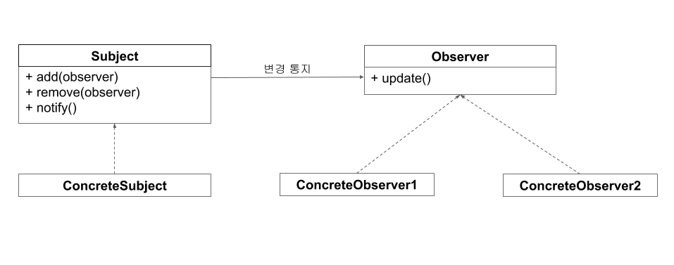
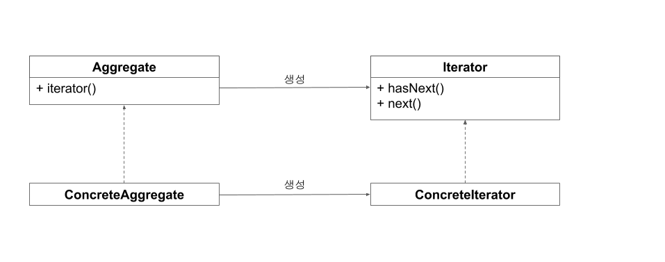

<div id="page">

<div id="main" class="aui-page-panel">

<div id="main-header">

<div id="breadcrumb-section">

1.  [Programming](README.md)
2.  [Programming](Programming_98307.md)
3.  [Reacive Programming](Reacive-Programming_383746171.md)

</div>

# <span id="title-text"> Programming : 기초1 </span>

</div>

<div id="content" class="view">

<div class="page-metadata">

Created by <span class="author"> Dongwook Han</span> on 3월 16, 2023

</div>

<div id="main-content" class="wiki-content group">

**리액티브 프로그래밍(Reactive Programming)**이란 데이터 또는 이벤트의 변경이 발생하면 이에 반응해 처리하는 프로그래밍 기법을 말합니다. 리액티브 프로그래밍은 2010년 에릭 마이어라는 프로그래머에 의해  마이크로소프트의 .NET 에코 시스템으로 정의되었습니다. 리액티브 프로그래밍의 특징은 비동기 프로그래밍을 처리하는 새로운 접근 방식이라는 것입니다. 리액티브 프로그래밍은 데이터의 통지, 완료, 에러에 대한 처리를 옵저버 패턴에 영감을 받아 설계되었고 데이터의 손쉬운 비동기 처리를 위해 함수형 언어의 접근 방식을 사용합니다.

 

리액티브 프로그래밍이 나오기 전 비동기 프로그래밍은 대부분 **콜백(Callback)** 기반의 비동기 처리 방식을 사용했습니다. 간단한 비동기 처리는 콜백 기반의 비동기 프로그래밍으로도 이해하기 쉬운 코드를 작성할 수 있지만 콜백이 많아져서 발생하는 일명 **콜백 헬(Callback Hell)**로 인해 코드의 복잡도가 늘어나서 가독성과 유지 보수성이 떨어지게 됩니다. 그동안 콜백 헬을 해결하기 위해 다양한 해결 방법들이 제시되었고 리액티브 프로그래밍을 적용하면 콜백 헬 없이 읽기 쉬운 코드를 작성할 수 있기 때문에 서버 애플리케이션 관점에서 리액티브 프로그래밍은 비동기 기반의 논-블로킹(Non-Blocking)과 이벤트 드리븐(Event-Driven) 애플리케이션 구현에 유리하여 최근 리액티브 프로그래밍을 적용한 사례가 점점 늘어나고 있습니다.리액티브 프로그래밍은 비동기 처리 외에도 **백프레셔(Back-Pressure)**이라는 특징을 포함합니다. 백프레셔는 데이터를 소비하는 측에서 처리 가능한 만큼의 양을 데이터 제공자 측에 역으로 요청하는 기능입니다. 데이터 제공자와 데이터 소비자가 다른 스레드에서 비동기로 처리될 경우 주로 사용되며 제공자 측에서 너무 빠르게 데이터를 제공하면 소비하는 측에선 빠르게 처리하지 못해서 데이터가 점점 쌓이면 시스템에 장애 요소가 될 수 있는데 백프레셔는 이런 문제를 해결할 수 있습니다.

 

#### **리액티브 프로그래밍과 디자인 패턴**

리액티브 프로그래밍을 설명할 때 빠지지 않고 등장하는 디자인 패턴이 옵저버 패턴(Observer Pattern)과 이터레이터 패턴(Iterator Pattern)입니다. 리액티브 프로그래밍은 옵저버 패턴 그리고 이터레이터 패턴과 자주 비교되며 또한 영감을 받은 걸로 알려져 있습니다. 이번 절에 선 두 개의 패턴과 리액티브 프로그래밍 간에 어떤 차이점이 있는지 알아보겠습니다.

 

#### 옵저버 패턴

옵저버 패턴이란 GoF가 소개한 디자인 패턴 중 하나로 관찰 대상이 되는 객체가 변경되면 대상 객체를 관찰하고 있는 옵저버(Observer)에게 변경사항을 통지(notify) 하는 디자인 패턴을 말합니다. 옵저버 패턴을 사용하면 객체 간의 상호작용을 쉽게 하고 효과적으로 데이터를 전달할 수 있습니다.옵저버 패턴은 관찰 대상인 서브젝트(Subject)와 서브젝트를 관찰하는 옵저버로 이뤄져 있습니다. 하나의 서브젝트에는 하나 또는 여러 개의 옵저버를 등록할 수 있고 상태가 변경되면 자신을 관찰하는 옵저버들에게 변경 사항을 통지합니다. 서브젝트로부터 통지를 받은 옵저버는 부가적인 처리를 합니다. 

<span class="confluence-embedded-file-wrapper image-center-wrapper"></span>

**그림 1.1 옵저버 패턴의 구조**

일반적으로 옵저버 패턴은 서브젝트와 옵저버를 상속하는 구체화(concrete) 클래스가 있습니다. 구체화 클래스는 서브젝트와 옵저버의 시그니처에 대한 상세 구현을 작성합니다. 구체화 클래스를 작성하기 위해 알아야 할 서브젝트와 옵저버의 필수 함수를 살펴보겠습니다.

 

**표 1.1 서브젝트의 함수**

<div class="table-wrap">

|        |                                                    |
|--------|----------------------------------------------------|
| 함수   | 설명                                               |
| add    | 서브젝트의 상태를 관찰할 옵저버 등록한다.          |
| remove | 등록된 옵저버를 삭제한다.                          |
| notify | 서브젝트 상태가 변경되면 등록된 옵저버에 통지한다. |

</div>

** **

**표 1.2 옵저버의 함수**

<div class="table-wrap">

|  |  |
|----|----|
| 함수 | 설명 |
| update | 서브젝트의 notify 내부에서 호출되며 서브젝트의 변경에 따른 부가 기능을 처리 |

</div>

** **

옵저버 패턴에 대해 간략히 알아봤으니 이번엔 JDK는 1.0 부터 포함된 Observable 클래스와 Observer 인터페이스를 사용해 간단한 커피 주문 예제를 만들어 보겠습니다. Observable은 옵저버 패턴의 서브젝트와 동일합니다.

 

**예제 1.1 옵저버 패턴으로 구현한 커피 주문 예제**

<div class="code panel pdl" style="border-width: 1px;">

<div class="codeContent panelContent pdl">

``` syntaxhighlighter-pre
import java.util.*
 
class Customer : Observer {
 
    fun orderCoffee() = "Iced Americano"
 
    override fun update(o: Observable?, arg: Any?) {
         val coffee = arg as Coffee
         println("I got a cup of ${coffee.name}")
    }
}
 
class Coffee(val name: String)
 
class Barista : Observable() {
 
    private fun makeCoffee(name: String) = Coffee(name)
 
    fun serve(name: String) {
         setChanged()
         notifyObservers(makeCoffee(name))
    }
}
 
fun main(args: Array<String>) {
    val barista = Barista()
    val customer = Customer()
 
    barista.addObserver(customer)
    barista.serve(customer.orderCoffee())
}
 
--------------------
출력 결과)
--------------------
I got a cup of Iced Americano
```

</div>

</div>

** **

- Customer 클래스는 Observer 인터페이스를 구현하여 Barista 클래스가 커피를 완성하면 통지를 받아서 update 함수에서 처리한다.

- Barista 클래스는 Observable 클래스를 상속하여 고객이 주문한 커피가 만들어지면 notifyObservers로 고객에게 만들어진 Coffee 객체를 전달한다. 이때 setChanged를 먼저 호출하여 변경 여부를 내부에 저장한다. 

- Customer 클래스가 Barista 클래스를 관찰하기 위해 addObserver로 등록한다.

예제 1.1과 같이 옵저버 패턴을 사용하지 않았다면 고객은 일정 간격으로 커피가 완성됐는지 바리스타에게 확인하는 처리가 있어야 합니다. 간격이 너무 짧으면 변경된 상태를 빠르게 확인할 수 있지만 매번 불필요한 호출이 발생하므로 성능상 문제가 발생할 수 있습니다. 또 간격이 너무 길면 변경된 상태를 즉시 확인할 수 없으므로 실시간성이 떨어질 수 있습니다. 옵저버 패턴은 관찰자인 옵저버가 서브젝트의 변화를 신경 쓰지 않고 상태 변경의 주체인 서브젝트가 변경사항을 옵저버에게 알려줌으로써 앞서 언급한 문제를 해결할 수 있습니다.옵저버 패턴에서 서브젝트와 옵저버는 관심사에 따라 역할과 책임이 분리되어 있습니다. 서브젝트는 옵저버가 어떤 작업을 하는지 옵저버의 상태가 어떤지에 대해 관심을 가질 필요가 없습니다. 오직 변경 사항을 통지하는 역할만 수행하고 하나 혹은 다수의 옵저버는 각각 맡은 작업을 스스로 하기 때문에 옵저버가 하는 일이 서브젝트에 영향을 끼치지 않고 옵저버는 단순한 데이터의 소비자로서 존재하게 됩니다.리액티브 프로그래밍은 옵저버 패턴의 서브젝트와 옵저버의 개념과 유사한 발행자와 구독자를 사용해 데이터를 통지하고 처리합니다. 데이터를 제공하는 측에서 데이터를 소비하는 측에 통지하는 방식을 일반적으로 **푸시 기반 (Push-Based)**이라고 부릅니다. 리액티브 프로그래밍은 옵저버 패턴의 단순한 데이터 통지 기능에 더해서 백프레셔라는 특징을 통해 데이터를 처리하는 측에서 데이터를 전달받는 개수를 역으로 요청할 수 있습니다. 그러므로 데이터를 통지하는 주체의 통지 속도를 제어하고 처리하는 측에서는 자신이 처리 가능한 만큼의 데이터만 받아서 처리할 수 있게 됩니다.

#### 이터레이터 패턴

이터레이터 패턴은 옵저버 패턴과 마찬가지로 GoF가 소개한 디자인 패턴 중 한 가지입니다. 이터레이터 패턴은 데이터의 집합에서 원소라고 불리는 데이터를 순차적으로 꺼내기 위해 만들어진 디자인 패턴입니다. 이터레이터 패턴을 사용하면 다른 컬렉션을 사용해도 동일한 인터페이스를 사용해 데이터를 꺼내올 수 있기 때문에 컬렉션이 변경되더라도 사용하는 쪽에서는 변경사항이 발생하지 않습니다. 이러한 장점 때문에 이터레이터 패턴을 사용하면 코드를 좀 더 유연하고 확장성 있게 만듭니다.

<span class="confluence-embedded-file-wrapper image-center-wrapper"></span>

**그림 1.2 이터레이터 패턴의 구조**

그림 1.2의 에그리게잇(Aggregate)은 자료구조의 리스트, 맵, 세트와 같은 구조가 집합체에 해당합니다. 이터레이터(Iterator)는 집합체 내부에 구현된 iterator를 이용해 생성합니다. 클라이언트는 생성된 이터레이터를 사용해 hasNext 함수에서  내부에 데이터가 존재하는지를 확인하고 next 함수를 사용해 데이터를 꺼내옵니다.

 

**표 1.3  에그리게잇의 함수**

<div class="table-wrap">

|          |                        |
|----------|------------------------|
| 함수     | 설명                   |
| iterator | 이터레이터를 생성한다. |

</div>

** **

**표 1.4 이터레이터의 함수**

<div class="table-wrap">

|         |                                                            |
|---------|------------------------------------------------------------|
| 함수    | 설명                                                       |
| hasNext | 데이터가 존재하는지를 판단하여 true 또는 false를 반환한다. |
| next    | 데이터가 존재한다면 데이터를 꺼내온다.                     |

</div>

** **

이번에는 코틀린 컬렉션 라이브러리에 포함된 Iterable과 Iterator를 사용해 간단한 이터레이터 패턴을 구현해 보겠습니다.

 

**예제 1.2 이터레이터 패턴 예제**

<div class="code panel pdl" style="border-width: 1px;">

<div class="codeContent panelContent pdl">

``` syntaxhighlighter-pre
package iterator
 
data class Car(val brand: String)
 
class Cars(val cars: List<Car> = listOf()) : Iterable<Car> {
    override fun iterator() = CarsIterator(cars)
}
 
class CarsIterator(val cars: List<Car> = listOf(), var index: Int = 0) : Iterator<Car> {
    override fun hasNext() = cars.size > index
    override fun next() = cars[index++]
}
 
fun main(args: Array<String>) {
    val cars = Cars(listOf(Car("Lamborghini"), Car("Ferrari")))
    val iterator = cars.iterator()
    while (iterator.hasNext()) {
         println("brand : ${iterator.next()}")
    }
}
 
--------------------
출력 결과)
--------------------
brand : Car(brand=Lamborghini)
brand : Car(brand=Ferrari)
```

</div>

</div>

- Cars 클래스는 Iterable 인터페이스를 구현하여 CarsIterator를 리턴하는 iterator 함수를 오버라이드 한다.

- CarsIterator 클래스는 Iterator 인터페이스를 구현하여 데이터가 존재하는지 확인하는 hasNext와 데이터가 존재하면 데이터를 가져오는 next 함수를 오버라이드 한다.

- while문 내부에선 hasNext를 사용하여 데이터를 모두 가져올때까지 반복하고 데이터를 출력한다.

데이터를 제공한다는 관점에서 이터레이터 패턴과 리액티브 프로그래밍은 유사하지만 이터레이터 패턴은 에그리게잇이 내부에 데이터를 저장하고 이터레이터를 사용해 데이터를 순차적으로 당겨오는 방식이기 때문에 **풀 기반(Pull-Based)**입니다.  이에 반해 리액티브 프로그래밍은 기본적으로 옵저버 패턴 처럼 데이터 제공자가 소비하는 측에 데이터를 통지하는 푸시 기반이기 때문에 분명한 차이점이 있습니다. 다만 구현체의 사양에 따라서 풀과 푸시를 모두 제공하는 경우도 있습니다.  

</div>

</div>

</div>

<div id="footer" role="contentinfo">

<div class="section footer-body">

Document generated by Confluence on 4월 05, 2026 17:57


</div>

</div>

</div>
