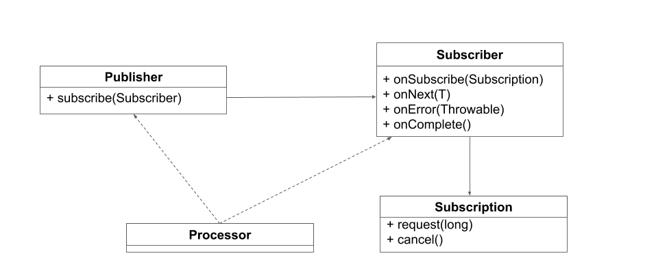
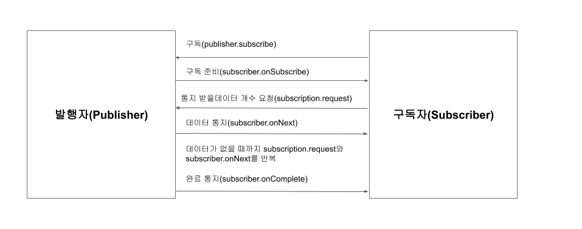

<div id="page">

<div id="main" class="aui-page-panel">

<div id="main-header">

<div id="breadcrumb-section">

1.  [Programming](README.md)
2.  [Programming](Programming_98307.md)
3.  [Reacive Programming](Reacive-Programming_383746171.md)

</div>

# <span id="title-text"> Programming : 기초3 </span>

</div>

<div id="content" class="view">

<div class="page-metadata">

Created by <span class="author"> Dongwook Han</span> on 3월 16, 2023

</div>

<div id="main-content" class="wiki-content group">

**리액티브 스트림(Reactive Streams)**은 JVM 환경에서 리액티브 프로그래밍의 표준 API 사양으로 비동기 데이터 스트림과 논블로킹 백프레셔(Back-Pressure)에 대한 사양을 제공합니다. 리액티브 스트림 이전의 비동기식 애플리케이션에서는 멀티 CPU 코어를 제대로 활용하기 위해 복잡한 병렬 처리 코드가 필요했습니다. 또한 처리할 데이터가 무한정 많아져서 시스템의 한계를 넘어서는 경우 애플리케이션은 **병목 현상(bottleneck)**이 발생하거나 심각한 경우 애플리케이션이 정지되는 경우도 발생하게 됩니다. 리액티브 스트림은 이러한 문제를 해결하기 위해 탄생했습니다. 

 

리액티브 스트림 사양이 만들어지기 전에는 표준화된 사양이 없었으므로 라이브러리마다 각자의 방식으로 구현을 해야 했습니다. 이런 이유로 2013년부터 리액티브 스트림이라는 이름으로 Netflix, Pivotal, Lightbend, Red Hat과 같은 유명 회사들이 공동으로 표준화 작업에 참여하고 있습니다. 2015년 리액티브 스트림 사양이 최초 릴리즈 된 후 현재 1.0.3까지 릴리즈 되었습니다.  몇년 사이 리액티브 스트림 표준 사양을 지원하는 라이브러리들이 많이 발표됬고 JDK9에는 Flow라는 이름으로 리액티브 스트림 구현이 추가되었습니다.

리액티브 스트림의 목표는 개발자들로 하여금 용어(Glossary)를 통일하고 라이브러리들이 리액티브 스트림 사양을 준수하여 일관성 있는 구현을 따르도록 만드는 것입니다.

#### **리액티브 스트림의 다양한 구현체들**

리액티브 스트림은 **TCK(Technology Compatibility Kit)**를 지원합니다. 기술 호환성 키트라고 불리는 TCK는 라이브러리가 정해진 사양에 맞게 구현되었는지 보장하기 위해 만들어진 테스트 도구입니다. 자바 진영에서 Java SE 표준을 따른 JDK(Java Development Kit)인지 검증하기 위해 TCK를 사용합니다. 예를 들어 오픈 소스 JDK인 AdoptOpenJDK, Amazon Corretto 등이 TCK를 사용해 사양을 검증했습니다. TCK 테스트를 통과했다면 라이브러리의 구현이 사양에 맞게 구현되었다는 의미이므로 안정성이 중요한 사용자 입장에선 믿고 사용할 수 있게 됩니다.

 

리액티브 스트림도 이와 마찬가지로 리액티브 스트림 사양을 구현한 라이브러리는 TCK에 정의된 규칙을 통과해야만 검증된 라이브러리임을 확인할 수 있도록 하였습니다. 또한 리액티브 스트림은 라이브러리가 표준 사양을 준수하는 TCK 테스트를 통과하기만 한다면 사양에 포함되지 않은 라이브러리만의 추가 기능도 자유롭게 구현할 수 있도록 하였습니다.

 리액티브 스트림을 표준 사양을 채택한 대표적인 라이브러리들

- Project Reactor

- RxJava

- JDK9 Flow

- Akka Streams

- Vert.x

#### 리액티브 스트림 사양

리액티브 스트림 사양(specification)은 핵심 인터페이스와 프로토콜로 구성됩니다. 먼저 리액티브 스트림에서 제공하는 핵심 인터페이스를 확인해보겠습니다.

<span class="confluence-embedded-file-wrapper image-center-wrapper"></span>

**그림 1.7 리액티브 스트림 인터페이스**

 

**표 1.5 리액티브 스트림 인터페이스**

<div class="table-wrap">

|  |  |
|----|----|
| 인터페이스 명 | 설명 |
| Publisher | 데이터를 생성하고 구독자에게 통지 |
| Subscriber | 데이터를 구독하고 통지 받은 데이터를 처리 |
| Subscription | Publisher, Subscriber간의 데이터를 교환하도록 연결하는 역할을 하며 전달받을 데이터의 개수와 구독을 해지할 수 있다 |
| Processor | Publisher, Subscriber을 모두 상속받은 인터페이스 |

</div>

핵심 인터페이스에 대해 요약하면 발행자(Publisher)는 데이터를 생성하고 구독자(Subscriber)에게 데이터를 통지하고 구독자는 자신이 처리할 수 있는 만큼의 데이터를 요청하고 처리합니다. 이때 발행자가 제공할 수 있는 데이터의 양은 무한(unbounded) 하고 순차적(sequential) 처리를 보장합니다. 

 

서브스크립션(Subscription)은 발행자와 구독자를 연결 하는 매개체이며 구독자가 데이터를 요청하거나 구독을 해지하는 등 데이터 조절에 관련된 역할을 담당합니다. 프로세서(Processor)는 발행자와 구독자의 기능을 모두 포함하는 인터페이스이며 데이터를 가공하는 중간 단계에서 사용합니다. 

 

간단히 리액티브 스트림의 핵심 인터페이스가 하는 일에 대해 알아봤으니 실제 자바로 작성된 코드를 보면서 리액티브 스트림에서 필수적인 사양도 같이 알아보겠습니다.\

<div class="code panel pdl" style="border-width: 1px;">

<div class="codeContent panelContent pdl">

``` syntaxhighlighter-pre
public interface Publisher<T> {
    public void subscribe(Subscriber<? super T> s);
}
```

</div>

</div>

발행자는 subscribe에서 구독자인 Subscriber를 등록하고 구독자에게 데이터를 순차적으로 통지합니다. 이때 발행자는 구독자가 요청한 만큼의 데이터를 통지합니다. 또한 발행자는 구독자가 요청한 데이터를 처리하는 중에 에러가 발생하거나 또는 완료 처리 신호가 발생하게 되면 더 이상 데이터를 통지하지 않습니다. 그리고 subscribe에서 전달받은 구독자가 null이라면 즉시 java.lang.NullPointException을 발생시킵니다.

 

구독자 인터페이스에는 4가지의 추상 메서드가 정의되있습니다.

<div class="code panel pdl" style="border-width: 1px;">

<div class="codeContent panelContent pdl">

``` syntaxhighlighter-pre
public interface Subscriber<T> {

    public void onSubscribe(Subscription s);

    public void onNext(T t);

    public void onError(Throwable t);

    public void onComplete();

}
```

</div>

</div>

구독자의 메서드들은 리액티브 스트림에서 구독자와 발행자간의 데이터 전달에 사용하는  규약(Protocol)이라고 설명하고 있습니다.

 

**표 1.6 서브스크립션에 정의된 추상 메서드**

<div class="table-wrap">

|  |  |
|----|----|
| 메서드 명 | 설명 |
| onSubscribe | 구독시 최초에 한번만 호출 |
| onNext | 구독자가 요구하는 데이터의 수 만큼 호출 (최대 java.lang.Long.MAX_VALUE) |
| onError | 에러 또는 더이상 처리할 수 없는 경우 |
| onComplete | 모든 처리가 정상적으로 완료된 경우 |

</div>

이때 각 메서드의 호출을 **시그널(Signal)**이라고 부릅니다. 각 시그널은 호출되는 순서가 다릅니다. onSubscribe는 최초 구독에 대한 초기화를 담당합니다. 구독 시 최초 한 번만 호출되기 때문에 onSubscribe 내부에서 초기화 로직을 구현할 수 있습니다. 

 

onNext는 발행자로부터 통지받을 데이터가 있는 경우 구독자가 요청하는 만큼 계속 호출됩니다. 이때 발행자가 통지하는 데이터의 수는 구독자가 요구하는 수와 같거나 적어야 합니다. 이런 사양이 있는 이유는 발행자가 너무 많은 데이터를 통지해서 구독자가 처리할 수 있는 양보다 많아지면 시스템에 문제가 발생할 수 있기 때문에 적절하게 처리량을 조절하기 위함입니다. 

 

반대로 구독자가 onNext에서 데이터를 처리하는 데 오래 걸린다면 발행자도 영향을 받을 수 있습니다. 이때는 발행자와 구독자를 분리하여 비동기적으로 처리해야 합니다.

 

발행자 측에서 처리 중 에러가 발생하면 onError를 구독자에게 통지합니다. onError 시그널이 발생하면 더 이상 데이터를 통지하지 않습니다. 구독자는 onError 시그널을 받으면 이에 대한 에러 처리를 할 수 있습니다. onComplete는 모든 데이터를 통지한 시점에 마지막에 호출되어 데이터 통지가 성공적으로 완료되었음을 통지합니다. onError와 onComplete는 반드시 둘중 하나만 호출되야하며 이후에는 어떠한 시그널도 발생해선 안됩니다. 만약 onError가 발생하고 onComplete가 발생한다면 에러가 발생한 것인지 정상적으로 완료되었는지 판단할 수 없기 때문입니다.

 

서브스크립션 인터페이스에는 request와 cancel이라는 추상 메서드가 정의돼있습니다.

<div class="code panel pdl" style="border-width: 1px;">

<div class="codeContent panelContent pdl">

``` syntaxhighlighter-pre
public interface Subscription {

    public void request(long n);

    public void cancel();

}
```

</div>

</div>

구독자가 발행자에게 통지받을 데이터의 수를 요청할 때 서브스크립션의 request(long n)를 사용하는데 onSubscribe에서 최초 통지받을 개수를 요청하기 위해 사용하고 그다음엔 onNext에서 데이터 처리 후 다음에 통지받을 데이터 개수를 재요청합니다. 만약 request(long n)에 0보다 작거나 같은 수가 전달된 경우 IllegalArgumentException가 발생합니다.cancel은 구독을 취소하기 위해 사용합니다. 구독을 취소하면 발행자와 구독자의 연결이 끊어지므로 발행자는 더 이상 데이터를 통지하지 않습니다. cancel이 호출되면 비동기적으로 시그널이 발생하여 구독 취소 여부가 지연되어 처리될 수 있습니다.

<span class="confluence-embedded-file-wrapper image-center-wrapper"></span>

**그림 1.8 리액티브 스트림에서 발행자 구독자 간의 데이터 처리 흐름**\

마지막으로 소개할 프로세서는 발행자와 구독자를 모두 상속받는 인터페이스 이며 자신만의 추상 메서드는 존재하지 않습니다.

<div class="code panel pdl" style="border-width: 1px;">

<div class="codeContent panelContent pdl">

``` syntaxhighlighter-pre
public interface Processor<T, R> extends Subscriber<T>, Publisher<R> {

}
```

</div>

</div>

프로세서는 일반적으로 데이터의 가공 단계에서 사용되어 발행자와 구독자의 모든 사양을 따릅니다.

</div>

</div>

</div>

<div id="footer" role="contentinfo">

<div class="section footer-body">

Document generated by Confluence on 4월 05, 2026 17:57


</div>

</div>

</div>
