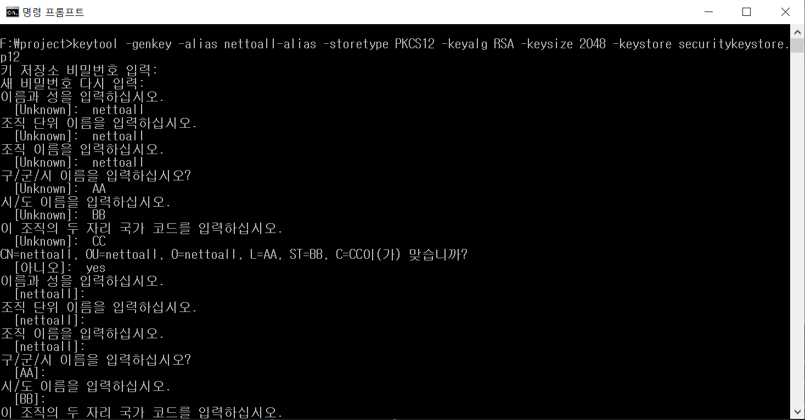
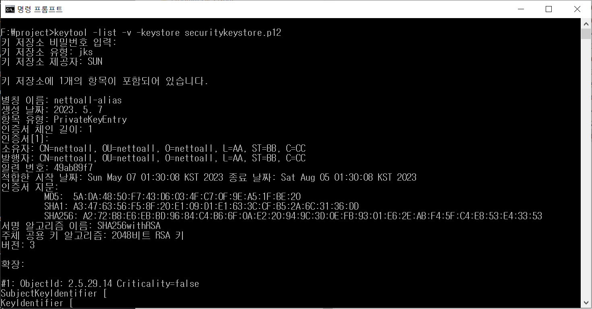

<div id="page">

<div id="main" class="aui-page-panel">

<div id="main-header">

<div id="breadcrumb-section">

1.  [Programming](README.md)
2.  [Programming](Programming_98307.md)
3.  [Spring](Spring_120848385.md)
4.  [Spring Boot](Spring-Boot_223477765.md)
5.  [Spring Boot Security](Spring-Boot-Security_392724483.md)

</div>

# <span id="title-text"> Programming : 5. HTTPS 사용 </span>

</div>

<div id="content" class="view">

<div class="page-metadata">

Created by <span class="author"> Dongwook Han</span>, last modified on 5월 12, 2023

</div>

<div id="main-content" class="wiki-content group">

# 개요

- `Spring Boot는 기본적으로 HTTP 8080 포트를 사용합니다. https를 구성하려면 아래 제공된 형식 중 하나로 자체 서명된 인증서를 생성해야 합니다.`

  1.  PKCS12 : `Public Key Cryptographic Standards는 많은 인증서와 키를 포함할 수 있는 암호로 보호되는 형식으로 업계에서 주로 사용되는 형식입니다.`

  2.  JKS : `Java KeyStore는 PKCS12와 동일하며 Java 환경으로 제한된 독점 형식입니다.`

- PKCS12와 JSK 차이점 : `사용된 기본 키 저장소 형식은 Java 8까지 JKS였습니다. 그러나 이제 Java 9 이후에는 PKCS12가 기본 키 저장소 형식이었습니다.`

- `JKS와 PKCS12의 또 다른 주요 차이점은 JKS는 Java 관련 형식인 반면 PKCS12는 암호화된 개인 키와 인증서를 표준화되고 언어 중립적인 방식으로 저장한다는 것입니다.`

# Spring Boot 에 SSL 구성

## keystore 생성

- 생성 명령어 구조

  <div class="code panel pdl" style="border-width: 1px;">

  <div class="codeContent panelContent pdl">

  ``` syntaxhighlighter-pre
  keytool -genkeypair -alias tomcat -keyalg RSA -keysize 2048 -keystore keystore.jks -validity 3650 -storepass password
  ```

  </div>

  </div>

  - **genkeypair:** 키 쌍 생성 (public key, private key)

  - **alias:** 생성된 keystroe의 별칭

  - **keyalg:** 키 쌍을 생성하는 암호화 알고리즘 정의

  - **keysize:** 키의 크기를 정의하는 프로비전 정의, 예제에서는 2048을 사용하나 운영을 위해서는 4096이 더 좋은 선택임

  - **storetype:** keystore 종류(jks, pkcs12)

  - **keystore:** keystore 이름

  - **validity:** 유효기간

  - **storepass:** keystore 패스워드

- 자체 PKCS12 키 저장소 생성

  <div class="code panel pdl" style="border-width: 1px;">

  <div class="codeContent panelContent pdl">

  ``` syntaxhighlighter-pre
  keytool -genkey -alias nettoall-alias -storetype PKCS12 -keyalg RSA -keysize 2048 -keystore securitykeystore.p12
  ```

  </div>

  </div>

  - 이름이 securitykeystore.p12 이고 별칭이 `nettoall-alias`, 패스워드가 `test123` 인 키 저장소 생성

    <span class="confluence-embedded-file-wrapper image-center-wrapper"></span>

  - F:/project에 securitykeystore.p12 생성됨

## keystore 검증하기

- 다음 명령어를 실행

  <div class="code panel pdl" style="border-width: 1px;">

  <div class="codeContent panelContent pdl">

  ``` syntaxhighlighter-pre
  keytool -list -v -keystore securitykeystore.p12
  ```

  </div>

  </div>

- 검증 결과

  <span class="confluence-embedded-file-wrapper image-center-wrapper"></span>

## Spring Boot 에 keystore 설정하기

- 방금 생성한 securitykeystore.p12 파일을 resources 폴더로 복사

- DB 인증 예제에 포함시킴

- application.yml 에 SSL 관련 설정 추가

  <div class="code panel pdl" style="border-width: 1px;">

  <div class="codeContent panelContent pdl">

  ``` syntaxhighlighter-pre
  server:
    port: 8083
    ssl:
      key-store: securitykeystore.p12
      key-store-password: test123
      key-store-type: PKCS12
      key-alias: nettoall-alias
  ```

  </div>

  </div>

# 테스트 하기

- 서버 재기동

  - 예제에서 알려준 대로 securitykeystore.p12를 src/main/resources 에 넣어 두었지만 못 찾는다는 에러가 발생 (src/main/resources에 넣는게 맞는지?)

  - **최상위 디렉토리 프로젝트명 바로 밑에 놔두었더니 정상 기동됨**

- <a href="http://localhost:8083/hello/user?name=user" class="external-link" rel="nofollow">http://localhost:8083/hello/user?name=user</a> 로 접속

  - Bad Request `This combination of host and port requires TLS.` 에러 발생

- <a href="https://localhost:8083/hello/user?name=user" class="external-link" rel="nofollow">https://localhost:8083/hello/user?name=user</a> 로 접속

  - 정상 작동됨

# 예제

truststore 에 추가 등

- 인증서 생성

  <div class="code panel pdl" style="border-width: 1px;">

  <div class="codeContent panelContent pdl">

  ``` syntaxhighlighter-pre
  keytool -genkey -alias xxxkeystore -storetype PKCS12 -keyalg RSA -keypass changeit -storepass changeit -keystore xxxkeystore.pkcs12
  ```

  </div>

  </div>

- key.ser 파일로 내보내기

  <div class="code panel pdl" style="border-width: 1px;">

  <div class="codeContent panelContent pdl">

  ``` syntaxhighlighter-pre
  keytool -export -alias xxxkeystore -storepass changeit -file server.cer -keystore xxxkeystore.pkcs12
  ```

  </div>

  </div>

- truststore에 추가

  <div class="code panel pdl" style="border-width: 1px;">

  <div class="codeContent panelContent pdl">

  ``` syntaxhighlighter-pre
  keytool -import -v trustcacerts -alias xxxtruststore -file server.cer -keystore xxxkeystore.pkcs12 -keypass changeit
  ```

  </div>

  </div>

- truststore 는 서버의 SSL 공개키를 클라이언트에서 저장하는 장소

</div>

<div class="pageSection group">

<div class="pageSectionHeader">

## Attachments:

</div>

<div class="greybox" align="left">

 [image-20230506-163103.png](attachments/394166332/394133594.png) (image/png)\
 [image-20230506-163342.png](attachments/394166332/394133602.png) (image/png)\

</div>

</div>

</div>

</div>

<div id="footer" role="contentinfo">

<div class="section footer-body">

Document generated by Confluence on 4월 05, 2026 17:57

<div id="footer-logo">

[Atlassian](http://www.atlassian.com/)

</div>

</div>

</div>

</div>
