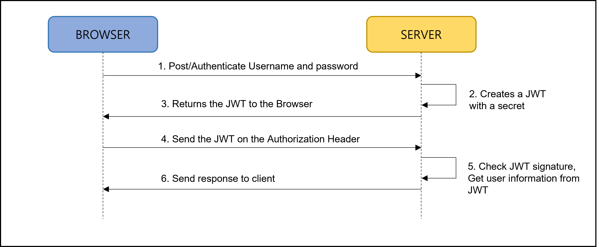

<div id="page">

<div id="main" class="aui-page-panel">

<div id="main-header">

<div id="breadcrumb-section">

1.  [Programming](README.md)
2.  [Programming](Programming_98307.md)
3.  [Spring](Spring_120848385.md)
4.  [Spring Boot](Spring-Boot_223477765.md)
5.  [Spring Boot Security](Spring-Boot-Security_392724483.md)

</div>

# <span id="title-text"> Programming : 6. JWT(Json Web Token) 인증WT </span>

</div>

<div id="content" class="view">

<div class="page-metadata">

Created by <span class="author"> Dongwook Han</span>, last modified on 5월 08, 2023

</div>

<div id="main-content" class="wiki-content group">

# 개요

- `JWT(JSON Web Token)는 당사자 간에 JSON 개체로 정보를 안전하게 전송하는 간결하고 독립적인 방법을 지정하는 개방형 표준(RFC 7519)입니다. `

- `이 정보는 디지털 서명되었으므로 확인하고 신뢰할 수 있습니다. `

- `또한 서비스 공급자가 각 요청에 대한 사용자 역할 및 권한을 확인하기 위해 데이터베이스에 액세스할 필요가 없도록 권한 부여 정보와 같은 모든 사용자의 클레임을 보유할 수 있습니다. `

- `데이터는 토큰에서 추출됩니다.`

## JWT workflow

<span class="confluence-embedded-file-wrapper image-center-wrapper"></span>

1.  `고객은 공급자에게 자격 증명을 제출하여 로그인합니다.`

2.  `인증에 성공하면 서비스에 액세스하기 위한 사용자 세부 정보 및 권한이 포함된 JWT를 생성하고 페이로드에 JWT 만료 날짜를 설정합니다.`

3.  `서버는 필요한 경우 JWT에 서명 및 암호화하고 초기 요청에 대한 자격 증명과 함께 응답으로 클라이언트에 보냅니다.`

4.  `서버에서 설정한 만료 시간에 따라 고객/클라이언트는 제한된 시간 또는 무한한 시간 동안 JWT를 저장합니다.`

5.  `클라이언트는 모든 후속 요청에 대해 헤더에 이 JWT 토큰을 보냅니다.`

6.  `클라이언트는 이 토큰으로 사용자를 인증합니다. 따라서 각 인증 프로세스 동안 클라이언트가 서버에 사용자 이름과 암호를 보낼 필요가 없지만 서버가 클라이언트에 JWT를 한 번만 보낼 수 있습니다.`

## JWT 구조

<div class="code panel pdl" style="border-width: 1px;">

<div class="codeContent panelContent pdl">

``` syntaxhighlighter-pre
# header
{
  "alg": "HS256",
  "typ": "JWT"
}
# Paylod
{
  "sub": "1234",
  "name" : "janny",
  "iat" : 15342345
}
# Verify Signature
HMACSHA256 (
  base64UrlEncode(header)  + "."
  base64UrlEncode(payload),
  your-256-bit-secret
)
```

</div>

</div>

- Header는 2 필드로 구성

  - typ는 값이 JWT 인 것을 뜻하고 alg 는 사용할 헤싱 알고리즘 의미

- payload : Claims로 표현되는 PAYLOAD 데이터로 구성됨. 객체 내의 Claim 이름은 고유해야 함.

- `Signature는 HEADER에서 지정한 해싱 알고리즘을 사용하여 헤더와 페이로드의 해시 값과 서버에만 알려진 비밀입니다.`

- `sub` 키: 인증 주체(subject)

- `iss` 키: 토큰 발급처

- `typ` 키: 토큰의 유형(type)

- `alg` 키: 서명 알고리즘(algorithm)

- `iat` 키: 발급 시각(issued at)

- `exp` 키: 말료 시작(expiration time)

- `aud` 키: 클라이언트(audience)

## JWT Token 생성

- 다음 사이트에서 JWT Token 생성 가능

  - <a href="http://jwtbuilder.jamiekurtz.com/" class="external-link" data-card-appearance="inline" rel="nofollow">http://jwtbuilder.jamiekurtz.com/</a>

  - JWT가 어떻게 생성되는지 구조 확인용

# Spring Boot Security + JWT 인증 구현

- JWT의 기본 구조 및 흐름을 익히기 위해 LDAP 이나 DB 에서 사용자 정보를 조회해서 인증하는 것이 **Java source 내에 정의된 사용자 정보로 인증**하도록 구현

- REST API를 보호하기 위해 JWT 인증을 사용하는 Spring Boot 애플리케이션 구현

- JWT Spring Security 사용

- REST POST API를 사용하여 유효한 JSON Web Token을 받을 사용자를 매핑/인증처리

- 유효한 토큰이 있는 사용자만 api/welcome 엑세스 하도록 구현

## 프로젝트 정의

### Gradle

<div class="code panel pdl" style="border-width: 1px;">

<div class="codeContent panelContent pdl">

``` syntaxhighlighter-pre
dependencies {
    implementation 'org.springframework.boot:spring-boot-starter-web'
    implementation 'org.springframework.boot:spring-boot-starter-security'
    implementation 'io.jsonwebtoken:jjwt-api:0.11.5'
    implementation 'io.jsonwebtoken:jjwt-impl:0.11.5'
    implementation 'io.jsonwebtoken:jjwt-jackson:0.11.5'
    compileOnly 'org.projectlombok:lombok'
    annotationProcessor 'org.projectlombok:lombok'
    testImplementation 'org.springframework.boot:spring-boot-starter-test'
}
```

</div>

</div>

## 프로그램 구현

- JWT를 사용하기 위해 다음 주요 기능을 구현(Spring Security와 JWT 생성 및 검증)

  1.  JWT 생성 : username와 password를 사용하여 JSON WEB TOKEN을 생성하기 위해 authenticate POST endpotint 사용

  2.  JWT 검증 : JWT를 유효한지 확인하기 위해 /greeting GET endpoint 사용

### JWT Token Utility 구현

<div class="code panel pdl" style="border-width: 1px;">

<div class="codeContent panelContent pdl">

``` syntaxhighlighter-pre
@Component
public class JwtTokenUtil implements Serializable {
    private static final long serialVersionUID = -1;

//    5시간 유효시간 정의
    public static final long JWT_TOKEN_VALIDITY = 5*60*60;

    @Value("${jwt.secret}")
    private String secret;

    public String getUsernameFromToken(String token) {
        return getClaimFromToken(token, Claims::getSubject);
    }

    public Date getIssuedAtDateFromToken(String token) {
        return getClaimFromToken(token, Claims::getIssuedAt);
    }

    public Date getExpirationDateFromToken(String token) {
        return getClaimFromToken(token, Claims::getExpiration);
    }

    public <T> T getClaimFromToken(String token, Function<Claims, T> claimsResolver) {
        final Claims claims = getAllClaimsFromToken(token);
        return claimsResolver.apply(claims);
    }

    private Claims getAllClaimsFromToken(String token) {
        return Jwts.parser().setSigningKey(secret).parseClaimsJws(token).getBody();
    }

    private Boolean isTokenExpired(String token) {
        final Date expiration = getExpirationDateFromToken(token);
        return expiration.before(new Date());
    }

    private Boolean ignoreTokenExpiration(String token) {
        return false;
    }

    public String generateToken(UserDetails userDetails) {
        Map<String, Object> claims = new HashMap<>();
        return doGenerateToken(claims, userDetails.getUsername());
    }

    private String doGenerateToken(Map<String, Object> claims, String subject) {
        return Jwts.builder().setClaims(claims).setSubject(subject).setIssuedAt(new Date(System.currentTimeMillis()))
                .setExpiration(new Date(System.currentTimeMillis() + JWT_TOKEN_VALIDITY*1000)).signWith(SignatureAlgorithm.HS512, secret).compact();
    }

    public Boolean canTokenBeRefreshed(String token) {
        return (!isTokenExpired(token) || ignoreTokenExpiration(token));
    }

    public boolean validateToken(String token, UserDetails userDetails) {
        final String username = getUsernameFromToken(token);
        return (username.equals(userDetails.getUsername()) && !isTokenExpired(token));
    }
}
```

</div>

</div>

### 사용자 계정 패스워드 정보 get

- Spring Security의 UserDetailsService interface사용

- interface의 loadUserByUserName 메소드 구현

- BCrypt 패스워드 암호화 처리

- 예제

  <div class="code panel pdl" style="border-width: 1px;">

  <div class="codeContent panelContent pdl">

  ``` syntaxhighlighter-pre
  @Service
  public class JwtUserDetailsService implements UserDetailsService {
      @Override
      public UserDetails loadUserByUsername(String username) throws UsernameNotFoundException {
  //        password 는 "password" 임
          if("nettoall".equals(username)) {
              return new User("nettoall", "$2a$10$slYQmyNdGzTn7ZLBXBChFOC9f6kFjAqPhccnP6DxlWXx2lPk1C3G6", new ArrayList<>());
          } else {
              throw new UsernameNotFoundException("User not found with username : " + username);
          }
      }
  }
  ```

  </div>

  </div>

  - username과 password를 고정 (nettoall 과 password 로)

  - 이 메소드를 수정하여 DB로부터 사용자 정보를 가져올 수 있도록 수정 가능

### JWT 인증처리 Controller

- /authenticate POST API 를 사용자 인증하는데 사용

- 사용자가 인증이 되면 JWTTokenUtil 로 생성한 JWT Token을 리턴

  <div class="code panel pdl" style="border-width: 1px;">

  <div class="codeContent panelContent pdl">

  ``` syntaxhighlighter-pre
  @RestController
  @CrossOrigin
  public class JwtAuthenticationController {

      @Autowired
      private AuthenticationManager authenticationManager;

      @Autowired
      private JwtTokenUtil jwtTokenUtil;

      @Autowired
      private UserDetailsService jwtInMemoryUserDetailsService;

      @RequestMapping(value="/authenticate", method= RequestMethod.POST)
      public ResponseEntity<?> generateAuthenticationToken(@RequestBody JwtRequest authenticationRequest) throws Exception {
          authenticate(authenticationRequest.getUsername(), authenticationRequest.getPassword());

          final UserDetails userDetails = jwtInMemoryUserDetailsService
                  .loadUserByUsername(authenticationRequest.getUsername());
          final String token = jwtTokenUtil.generateToken(userDetails);

          return ResponseEntity.ok(new JwtResponse(token));
      }

      private void authenticate(String username, String password) throws Exception {
          Objects.requireNonNull(username);
          Objects.requireNonNull(password);
          try{
              authenticationManager.authenticate(new UsernamePasswordAuthenticationToken(username, password));
          } catch(DisabledException e) {
              throw new Exception("USER_DISABLED", e);
          } catch(BadCredentialsException e) {
              throw new Exception("INVALID_CREDENTIALS", e);
          }
      }
  }
  ```

  </div>

  </div>

### JWT Request, Response

- Request와 Response를 왜 만들어야 하는지 의문임

- 예제(JwtRequest)

  <div class="code panel pdl" style="border-width: 1px;">

  <div class="codeContent panelContent pdl">

  ``` syntaxhighlighter-pre
  @Data
  @NoArgsConstructor
  @AllArgsConstructor
  public class JwtRequest implements Serializable {
      private static final long serialVersionUID = -1L;

      private String username;
      private String password;
  }
  ```

  </div>

  </div>

- 예제(JwtResponse)

  <div class="code panel pdl" style="border-width: 1px;">

  <div class="codeContent panelContent pdl">

  ``` syntaxhighlighter-pre
  @AllArgsConstructor
  @Getter
  public class JwtResponse implements Serializable {
      private static final long serialVersionUID = -1;

      private final String jwttoken;
  }
  ```

  </div>

  </div>

### JwtRequestFilter

- `JwtRequestFilter 클래스는 들어오는 모든 요청에 ​​대해 실행되고 요청에서 JWT의 유효성을 검사하고 로그인한 사용자가 인증되었음을 나타내도록 컨텍스트에서 설정합니다.`

- 코드

  <div class="code panel pdl" style="border-width: 1px;">

  <div class="codeContent panelContent pdl">

  ``` syntaxhighlighter-pre
  @Component
  public class JwtRequestFilter extends OncePerRequestFilter  {
      @Autowired
      private JwtUserDetailsService jwtUserDetailsService;

      @Autowired
      private JwtTokenUtil jwtTokenUtil;

      @Override
      protected void doFilterInternal(HttpServletRequest request, HttpServletResponse response, FilterChain chain)
          throws ServletException, IOException {
          final String requestTokenHeader = request.getHeader("Authorization");

          String username = null;
          String jwtToken = null;

          if(requestTokenHeader != null && requestTokenHeader.startsWith("Bearer ")) {
              jwtToken = requestTokenHeader.substring(7);
              try{
                  username = jwtTokenUtil.getUsernameFromToken(jwtToken);
              } catch(IllegalArgumentException e) {
                  System.out.println("Unabled to get JWT Token");
              } catch(ExpiredJwtException e){
                  System.out.println("JWT Token has expired");
              }
          } else {
              logger.warn("JWT Token does not begin with Bearer String");
          }

          //Once we get the token validate it.
          if(username != null && SecurityContextHolder.getContext().getAuthentication() == null) {
              UserDetails userDetails = this.jwtUserDetailsService.loadUserByUsername(username);

              if(jwtTokenUtil.validateToken(jwtToken, userDetails)) {
                  UsernamePasswordAuthenticationToken usernamePasswordAuthenticationToken = new UsernamePasswordAuthenticationToken(
                          userDetails, null, userDetails.getAuthorities()
                  );
                  usernamePasswordAuthenticationToken.setDetails(new WebAuthenticationDetailsSource().buildDetails(request));
                  // After setting the Authentication in the context, we specify
                  // that the current user is authenticated. So it passes the Spring Security Configurations successfully.
                  SecurityContextHolder.getContext().setAuthentication(usernamePasswordAuthenticationToken);
              }
          }
          chain.doFilter(request,response);
      }
  }
  ```

  </div>

  </div>

### JwtAuthenticationEntryPoint

- `이 클래스는 인증되지 않은 요청을 거부하고 오류 코드 401을 보냅니다.`

- 코드

  <div class="code panel pdl" style="border-width: 1px;">

  <div class="codeContent panelContent pdl">

  ``` syntaxhighlighter-pre
  @Component
  public class JwtAuthenticationEntryPoint implements AuthenticationEntryPoint, Serializable  {
      private static final long serialVersionUID = -1L;

      @Override
      public void commence(HttpServletRequest request, HttpServletResponse response,
                           AuthenticationException authException) throws IOException {
          response.sendError(HttpServletResponse.SC_UNAUTHORIZED, "Unauthorized");
      }
  }
  ```

  </div>

  </div>

### Configuration

- WebSecurityConfigurerAdapter를 상속받아 구현

- WebSecurity와 HttpSecurity를 커스터마이징

- 코드

  <div class="code panel pdl" style="border-width: 1px;">

  <div class="codeContent panelContent pdl">

  ``` syntaxhighlighter-pre
  @Configuration
  @EnableWebSecurity
  @EnableGlobalMethodSecurity(prePostEnabled = true)
  public class WebSecurityConfig extends WebSecurityConfigurerAdapter {

      @Autowired
      private JwtAuthenticationEntryPoint jwtAuthenticationEntryPoint;

      @Autowired
      private UserDetailsService jwtUserDetailsService;

      @Autowired
      private JwtRequestFilter jwtRequestFilter;

      @Autowired
      public void configureGlobal(AuthenticationManagerBuilder auth) throws Exception {
          // configure AuthenticationManager so theat is knows from where to load
          // user for matching credentials
          // User BCryptPasswordEncoder
          auth.userDetailsService(jwtUserDetailsService).passwordEncoder(passwordEncoder());
      }

      @Bean
      public PasswordEncoder passwordEncoder(){
          return new BCryptPasswordEncoder();
      }

      @Bean
      @Override
      public AuthenticationManager authenticationManagerBean() throws Exception {
          return super.authenticationManagerBean();
      }

      @Override
      protected  void configure(HttpSecurity httpSecurity) throws Exception {
          httpSecurity.csrf().disable()
                  .authorizeRequests().antMatchers("/authenticate").permitAll()
                  .anyRequest().authenticated()
                  .and()
                  .exceptionHandling().authenticationEntryPoint(jwtAuthenticationEntryPoint)
                  .and()
                  .sessionManagement().sessionCreationPolicy(SessionCreationPolicy.STATELESS);
          httpSecurity.addFilterBefore(jwtRequestFilter, UsernamePasswordAuthenticationFilter.class);
      }
  }
  ```

  </div>

  </div>

## 테스트

- postman 같은 클라이언트로 테스트

- JWT 토큰 얻기

  - POST 로 <a href="http://localhost:8080/authenticate" class="external-link" rel="nofollow">http://localhost:8080/authenticate</a>

  - body : raw( JSON)

  - body 내용

    <div class="code panel pdl" style="border-width: 1px;">

    <div class="codeContent panelContent pdl">

    ``` syntaxhighlighter-pre
    {
        "username" : "nettoall",
        "password" : "password"
    }
    ```

    </div>

    </div>

- 리턴받은 JWT 토큰 검증

  - GET 방식으로 <a href="http://localhost:8080/greeting" class="external-link" rel="nofollow">http://localhost:8080/greeting</a> 전송

  - Authorization Type : Bearer Token

  - Token : 발급받은 JWT 토큰 복사

# DB에서 사용자 정보 조회하여 JWT 인증

## 구현 순서

1.  Spring Boot Project 생성

2.  dependency 정의

    - Spring Security

    - jjwt 버전 별로 사용하는 라이브러리가 상이함 (0.11.5 버전 기준으로 설명)

    - mysql

    - jpa

3.  Database 연결 구성 정보 추가

4.  사용자 추가 API 구현

5.  등록된 사용자에 대해 jwt token 생성하는 API 구현

6.  jwt token 생성 테스트

## Spring Boot Project 생성

### Gradle 정의

<div class="code panel pdl" style="border-width: 1px;">

<div class="codeContent panelContent pdl">

``` syntaxhighlighter-pre
dependencies {
    implementation 'org.springframework.boot:spring-boot-starter-data-jpa'
    implementation 'org.springframework.boot:spring-boot-starter-security'
    implementation 'org.springframework.boot:spring-boot-starter-web'
    implementation 'io.jsonwebtoken:jjwt-api:0.11.5'
    implementation 'io.jsonwebtoken:jjwt-impl:0.11.5'
    implementation 'io.jsonwebtoken:jjwt-jackson:0.11.5'
    compileOnly 'org.projectlombok:lombok'
    runtimeOnly 'com.mysql:mysql-connector-j'
    annotationProcessor 'org.projectlombok:lombok'
    testImplementation 'org.springframework.boot:spring-boot-starter-test'
    testImplementation 'org.springframework.security:spring-security-test'
}
```

</div>

</div>

### Application.yml 정의

- DB Connection 정보 등 정의

  <div class="code panel pdl" style="border-width: 1px;">

  <div class="codeContent panelContent pdl">

  ``` syntaxhighlighter-pre
  # spring.security.oauth2.resourceserver.jwt 항목이 있음
  jwt:
    secret: howlongsizetoinsertintosecretkeyisnotcurrentmercymankindisnotonlyanimalonearthotherareassure
  # spring datasource
  spring:
    datasource:
      url: jdbc:mysql://192.168.0.3:3307/notesdb?createDatabaseIfNotExist=true&allowPublicKeyRetrieval=true&useSSL=false
      username: root
      password: 923149Han!
    # hibernate Properties
    # The SQL dialect makes Hibernate generate better SQL for the shosen database
    jpa:
      properties:
        hibernate:
          dialect: org.hibernate.dialect.MySQL8Dialect
      # Hibernate ddl auth (create, create-drop, validate, update)
      hibernate:
        ddl-auto: create-drop
    main:
      allow-circular-references: true
  ```

  </div>

  </div>

  - Spring Boot 2.6 부터는 WebSecurityConfig 클래스가 WebSecurityConfigurerAdapter를 상속받아 구현하게 하였는데 해당 클래스는 deprecated됨. 추정: 순환참조를 하기 때문에 deprecated 된 것으로… 따라서 application.yml 에 spring.main.allow-circular-references = true 로 설정하는 이유임

  - **2.6버전부터 어떤 클래스를 상속받아 어떻게 구현해야 하는지 확인 필요**

## 클래스 구현

- 앞에서 설명한 JWT 인증에 DB 접속 및 정보를 가져오는 부분을 추가한다.

### Entity 구현

- User Entity를 정의

- 코드

  <div class="code panel pdl" style="border-width: 1px;">

  <div class="codeContent panelContent pdl">

  ``` syntaxhighlighter-pre
  @Getter
  @Setter
  @Entity
  @Table(name = "user")
  public class UserEntity {
      @Id
      @GeneratedValue(strategy = GenerationType.IDENTITY)
      private long id;
      @Column
      private String username;
      @Column
      @JsonIgnore
      private String password;
  }
  ```

  </div>

  </div>

### User DTO 구현

- 간단한 필드(username, password)와 get, set 메소드 정의

- 코드

  <div class="code panel pdl" style="border-width: 1px;">

  <div class="codeContent panelContent pdl">

  ``` syntaxhighlighter-pre
  @Getter
  @Setter
  public class UserDto {
      private String username;
      private String password;
  }
  ```

  </div>

  </div>

### JPA Crud Repository 구현

- 사용자 정보를 저장하고 조회하는 JPA Repository interface를 정의

- username 으로 사용자 정보를 조회하기 위해 findByUsername 메소드 추가 정의

- 코드

  <div class="code panel pdl" style="border-width: 1px;">

  <div class="codeContent panelContent pdl">

  ``` syntaxhighlighter-pre
  public interface UserRepository extends CrudRepository<UserEntity, Integer> {
      UserEntity findByUsername(String username);
  }
  ```

  </div>

  </div>

### UserDetailsService 구현

- Spring Security 에서 사용자 정보를 가져오는 UserDetailsService 를 수정

- JWT 인증에서는 하드 코딩된 사용자 정보와 비교하여 인증처리를 했다면 이 예제에서는 DB에서 사용자 정보를 조회하여 비교한 뒤 인증 처리하도록 한다.

- 코드

  <div class="code panel pdl" style="border-width: 1px;">

  <div class="codeContent panelContent pdl">

  ``` syntaxhighlighter-pre
  @Service
  public class JwtUserDetailsService implements UserDetailsService {

      @Autowired
      private UserRepository userRepository;

      @Autowired
      private PasswordEncoder passwordEncoder;

      @Override
      public UserDetails loadUserByUsername(String username) throws UsernameNotFoundException {
          UserEntity user = userRepository.findByUsername(username);
  //        password 는 "password" 임
          if(user == null) {
              throw new UsernameNotFoundException("User not found with username: " + username);
          }
          return new User(user.getUsername(), user.getPassword(), new ArrayList<>());
      }

      public UserEntity save(UserDto user) {
          UserEntity newUser = new UserEntity();
          newUser.setUsername(user.getUsername());
          newUser.setPassword(passwordEncoder.encode(user.getPassword()));
          return userRepository.save(newUser);
      }
  }
  ```

  </div>

  </div>

  - JPA UserRepository 에서 username 으로 사용자 조회

  - userRepository.save(user) 메소드로 사용자 저장 구현

### Controller 구현

- 사용자를 등록하고, 사용자에 대해 JWT 토큰 생성, JWT 토큰 검증하는 메소드를 구현

- 코드

  <div class="code panel pdl" style="border-width: 1px;">

  <div class="codeContent panelContent pdl">

  ``` syntaxhighlighter-pre
  @RestController
  @CrossOrigin
  public class JwtAuthenticationController {

      @Autowired
      private AuthenticationManager authenticationManager;

      @Autowired
      private JwtTokenUtil jwtTokenUtil;

      @Autowired
      private JwtUserDetailsService jwtUserDetailsService;

      @RequestMapping(value="/authenticate", method= RequestMethod.POST)
      public ResponseEntity<?> generateAuthenticationToken(@RequestBody JwtRequest authenticationRequest) throws Exception {
          authenticate(authenticationRequest.getUsername(), authenticationRequest.getPassword());

          final UserDetails userDetails = jwtUserDetailsService
                  .loadUserByUsername(authenticationRequest.getUsername());
          final String token = jwtTokenUtil.generateToken(userDetails);

          return ResponseEntity.ok(new JwtResponse(token));
      }

      @RequestMapping(value="/register", method= RequestMethod.POST)
      public ResponseEntity<?> saveUser(@RequestBody UserDto user) throws Exception {
          return ResponseEntity.ok(jwtUserDetailsService.save(user));
      }

      private void authenticate(String username, String password) throws Exception {
          try{
              authenticationManager.authenticate(new UsernamePasswordAuthenticationToken(username, password));
          } catch(DisabledException e) {
              throw new Exception("USER_DISABLED", e);
          } catch(BadCredentialsException e) {
              throw new Exception("INVALID_CREDENTIALS", e);
          }
      }
  }
  ```

  </div>

  </div>

- JWT Token 을 검증하는 /greeting 처리하는 Controller 예제

  <div class="code panel pdl" style="border-width: 1px;">

  <div class="codeContent panelContent pdl">

  ``` syntaxhighlighter-pre
  @RestController
  @CrossOrigin()
  public class EmployeeController {
      @RequestMapping(value="/greeting", method = RequestMethod.GET)
      public String getEmployees() {
          return "Welcome!";
      }
  }
  ```

  </div>

  </div>

### WebSecurityConfig 구현

- /register url 추가

- JWT 인증과 동일

- 코드

  <div class="code panel pdl" style="border-width: 1px;">

  <div class="codeContent panelContent pdl">

  ``` syntaxhighlighter-pre
      @Override
      protected  void configure(HttpSecurity httpSecurity) throws Exception {
          httpSecurity.csrf().disable()
                  .authorizeRequests().antMatchers("/authenticate", "/register").permitAll()
                  .anyRequest().authenticated()
                  .and()
                  .exceptionHandling().authenticationEntryPoint(jwtAuthenticationEntryPoint)
                  .and()
                  .sessionManagement().sessionCreationPolicy(SessionCreationPolicy.STATELESS);
          httpSecurity.addFilterBefore(jwtRequestFilter, UsernamePasswordAuthenticationFilter.class);
      }
  ```

  </div>

  </div>

## 테스트

- postman 같은 클라이언트로 테스트

- 사용자 등록하기

  - POST로 http://localhost:8080/register

  - body : raw(JSON)

  - body 내용

    <div class="code panel pdl" style="border-width: 1px;">

    <div class="codeContent panelContent pdl">

    ``` syntaxhighlighter-pre
    {
        "username" : "nettoall",
        "password" : "password"
    }
    ```

    </div>

    </div>

- JWT 토큰 얻기

  - POST 로 <a href="http://localhost:8080/authenticate" class="external-link" rel="nofollow">http://localhost:8080/authenticate</a>

  - body : raw( JSON)

  - body 내용

    <div class="code panel pdl" style="border-width: 1px;">

    <div class="codeContent panelContent pdl">

    ``` syntaxhighlighter-pre
    {
        "username" : "nettoall",
        "password" : "password"
    }
    ```

    </div>

    </div>

- 리턴받은 JWT 토큰 검증

  - GET 방식으로 <a href="http://localhost:8080/greeting" class="external-link" rel="nofollow">http://localhost:8080/greeting</a> 전송

  - Authorization Type : Bearer Token

  - Token : 발급받은 JWT 토큰 복사

</div>

<div class="pageSection group">

<div class="pageSectionHeader">

## Attachments:

</div>

<div class="greybox" align="left">

 [JWT_Workflow.png](attachments/394264688/394199226.png) (image/png)\

</div>

</div>

</div>

</div>

<div id="footer" role="contentinfo">

<div class="section footer-body">

Document generated by Confluence on 4월 05, 2026 17:57


</div>

</div>

</div>
