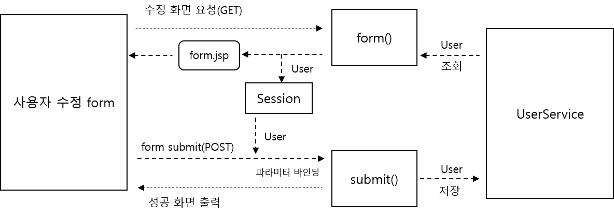

<div id="page">

<div id="main" class="aui-page-panel">

<div id="main-header">

<div id="breadcrumb-section">

1.  [Programming](index.html)
2.  [Programming](Programming_98307.html)
3.  [Spring](Spring_120848385.html)
4.  [토비의 Spring 정리](376569861.html)
5.  [Ch04.Spring @MVC](Ch04.Spring-@MVC_373129217.html)

</div>

# <span id="title-text"> Programming : 4.2 @Controller </span>

</div>

<div id="content" class="view">

<div class="page-metadata">

Created by <span class="author"> Dongwook Han</span>, last modified on 3월 27, 2023

</div>

<div id="main-content" class="wiki-content group">

<div class="contentLayout2">

<div class="columnLayout two-left-sidebar" layout="two-left-sidebar">

<div class="cell aside" data-type="aside">

<div class="innerCell">

------------------------------------------------------------------------

<div class="toc-macro rbtoc1775379454190">

- [@Controller](#id-4.2@Controller-@Controller)
- [메소드 파라미터의 종류](#id-4.2@Controller-메소드파라미터의종류)
  - [HttpServletRequest, HttpServletResponse](#id-4.2@Controller-HttpServletRequest,HttpServletResponse)
  - [HttpSession](#id-4.2@Controller-HttpSession)
  - [WebRequest, NativeWebRequest](#id-4.2@Controller-WebRequest,NativeWebRequest)
  - [Locale](#id-4.2@Controller-Locale)
  - [InputStream, Reader](#id-4.2@Controller-InputStream,Reader)
  - [OutputStream, Writer](#id-4.2@Controller-OutputStream,Writer)
  - [@PathVariable](#id-4.2@Controller-@PathVariable)
  - [@RequestParam](#id-4.2@Controller-@RequestParam)
  - [@CookieValue](#id-4.2@Controller-@CookieValue)
  - [@RequestHeader](#id-4.2@Controller-@RequestHeader)
  - [Map, Model, ModelMap](#id-4.2@Controller-Map,Model,ModelMap)
  - [@ModelAttribute](#id-4.2@Controller-@ModelAttribute)
  - [Errors, BindingResult](#id-4.2@Controller-Errors,BindingResult)
  - [@SessionStatus](#id-4.2@Controller-@SessionStatus)
  - [@RequestBody](#id-4.2@Controller-@RequestBody)
  - [@Value](#id-4.2@Controller-@Value)
  - [@Valid](#id-4.2@Controller-@Valid)
- [리턴 타입의 종류](#id-4.2@Controller-리턴타입의종류)
  - [자동 추가 모델 오브젝트](#id-4.2@Controller-자동추가모델오브젝트)
    - [@ModelAttribute 모델 오브젝트 또는 커맨드 오브젝트](#id-4.2@Controller-@ModelAttribute모델오브젝트또는커맨드오브젝트)
    - [Map, Model ModelMap 파라미터](#id-4.2@Controller-Map,ModelModelMap파라미터)
    - [@ModelAttribute 메소드](#id-4.2@Controller-@ModelAttribute메소드)
    - [BindingResult](#id-4.2@Controller-BindingResult)
  - [자동 생성 뷰 이름](#id-4.2@Controller-자동생성뷰이름)
  - [ModelAndView](#id-4.2@Controller-ModelAndView)
  - [String](#id-4.2@Controller-String)
  - [void](#id-4.2@Controller-void)
  - [모델 오브젝트](#id-4.2@Controller-모델오브젝트)
  - [Map/Model/ModelMap](#id-4.2@Controller-Map/Model/ModelMap)
  - [View](#id-4.2@Controller-View)
  - [@ResponseBody](#id-4.2@Controller-@ResponseBody)
- [@SessionAttribute와 SessionStatus](#id-4.2@Controller-@SessionAttribute와SessionStatus)
  - [도메인 중심 프로그래밍 모델과 상태 유지를 위한 세션 도입의 필요성](#id-4.2@Controller-도메인중심프로그래밍모델과상태유지를위한세션도입의필요성)
  - [@SessionAttributes](#id-4.2@Controller-@SessionAttributes)
  - [SessionStatus](#id-4.2@Controller-SessionStatus)
  - [등록Form을 위한 @SessionAttributes 사용](#id-4.2@Controller-등록Form을위한@SessionAttributes사용)
  - [Spring Mock, AbstractDispatcherSerlvetTest 를 이용한 세션 테스트](#id-4.2@Controller-SpringMock,AbstractDispatcherSerlvetTest를이용한세션테스트)

</div>

------------------------------------------------------------------------

</div>

</div>

<div class="cell normal" data-type="normal">

<div class="innerCell">

## @Controller

- DefaultAnnotationHandlerMapping : request를 @RequestMapping 정보를 활용해 Controller의 method에 매핑

- AnnotationMethodHandlerAdapter는 매핑된 method를 실제 호출

- 다른 HandlerAdapter라는 건 Annotation 이외의 default 메소드가 정의된 controller를 호출하는 adapter를 지칭

  - HttpRequestHandlerAdapter : HttpRequestHandler interface를 상속받아 Controller 생성

  - SimpleControllerHandlerAdapter : Controller interface를 상속받아 Controller 생성

- 다른 Handler Adapter에서는 입력과 출력이 어느 정도 정해져 있었으나 : 세세하게 설정할 필요 없이 정의도니 형식으로 전달하면 자동으로 처리하는 편의성이 있으나, 컨트롤러에 따라서 파일 업로드라든지, 쿠키나 Http 헤더 처리 등이 필요 =\> 유연하면서도 ModelAndView로 자동 처리하는 등의 편의성을 지원하는 방법이 필요함.

- @Controller 를 사용하면 가능하다고 서적에서는 소개함

  - 컨트롤러 역할을 담당하는 메소드의 파라미터 개수와 타입, 리턴 타입 등을 자유롭게 결정 가능

- 결국 Spring 3.0 이후로@MVC와 @Controller를 사용하는 추세이다.

- 간단한 예제

  - 파라미터도 없고 리턴값도 없는 단순한 메소드

  - 리턴값이 없으면 spring은 비어 있는 model object와 view 이름을 돌려줌

  - view 이름은 RequestToViewNameTranslator에 의해 URL에 따라 hello 라고 자동으로 생성됨

    <div class="code panel pdl" style="border-width: 1px;">

    <div class="codeContent panelContent pdl">

    ``` syntaxhighlighter-pre
    @RequestMapping("/hello")
    public void hello(){...}
    ```

    </div>

    </div>

- 복잡한 예제

  - name 요청 파라미터, auth 쿠키값

  - 작업 결과 model에 넣어서 view 로 전달. view 이름은 코드에서 정의

    <div class="code panel pdl" style="border-width: 1px;">

    <div class="codeContent panelContent pdl">

    ``` syntaxhighlighter-pre
    @RequestMapping("/complaex")
    public String complex(@RequestParam("name") String name, @CookieValue("auth") Stirng auth,
    ModelMap model) {
      model.put("info", name + "/" + auth);
      return "myview";
    }
    ```

    </div>

    </div>

## 메소드 파라미터의 종류

### HttpServletRequest, HttpServletResponse

- HttpServletRequest

- HttpServletResponse

- ServletRequest

- ServletResponse

### HttpSession

- HttpServletRequest로부터 가져올 수도 있고, HttpSession 타입 파라미터를 선언해서 사용 가능

- 부가 정보 : 서버에 따라 멀티스레드 환경에서 안정성 보장 안됨. HttpSessoin을 안전하게 사용하려면 HandlerAdapter의 snchronizzeOnsession 프로퍼티를 true로 설정

### WebRequest, NativeWebRequest

- WebRequest : HttpServletReqeust의 요청 정보를 그대로 가지고 있는 서블릿 API에 종속적이지 않은 object 타입(종속적이지 않다는 의미가?)

- 서블릿과 포틀릿 환경 양쪽에 모두 적용 가능한 범용적인 Handler Interceptor를 만들때 활용하기 위해 만들어짐

- NativeWebRequest : WebRequest 내부에 감쳐진 HttpServletRequest와 같은 환경 종속적인 Object를 가져올 수 있는 메소드 추가됨

### Locale

- java.util.Locale 타입으로 DispatcherSerlvet의 LocaleResolver가 결정한 Locale Object를 받음

### InputStream, Reader

- HttpServletRequest의 getInputStream() 을 통해 받을 수 있는 content stream 또는 Reader 타입의 Object

### OutputStream, Writer

- HttpServletResponse의 getOutputStream(), Writer 타입의 Object

### @PathVariable

- @RequestMapping의 URL에 {} 로 들어가는 Path variable

- 요청 파라미터를 URL의 쿼리 스트링으로 보내는 대신 URL 패스로 풀어 쓰는 방식을 쓰는 경우 유용

- url의 query String 이 /user/view?id=10 인 케이스를 파라미터를 url 경로에 포함시키는 방식으로 변경시 /user/view/10 으로 사용 가능

- URL을 특정 controller에 매핑하는 방법과 URL 중 파라미터에 해당하는 값을 Controller에서 참조하도록 설정 하는 방법을 지원

  <div class="code panel pdl" style="border-width: 1px;">

  <div class="codeContent panelContent pdl">

  ``` syntaxhighlighter-pre
  @RequestMapping("/user/view/{id}")
  public String view(@PathVariable("id") int id){
    ...
  }
  ```

  </div>

  </div>

- URL의 {} 에 Path variable 정의. 이 이름을 @PathVariable 애노테이션의 값으로 넣어서 method 파라미터에 부여

- 여러 Path variable 선언 예

  <div class="code panel pdl" style="border-width: 1px;">

  <div class="codeContent panelContent pdl">

  ``` syntaxhighlighter-pre
  @RequestMapping("/member/{membercode}/order/{orderid}")
  public String lookup(@PathVariable("membercode") String code,
                       @PathVariable("orderid") int orderid) {
    ...
  }
  ```

  </div>

  </div>

### @RequestParam

- 단일 HTTP 요청 파라미터를 메소드 파라미터에 넣어주는 annotation

- 예제

  <div class="code panel pdl" style="border-width: 1px;">

  <div class="codeContent panelContent pdl">

  ``` syntaxhighlighter-pre
  public String view(@RequestParam("id") int id) {...}

  public String view(@RequestParam("id") int id, @RequestParam("name") String name, 
       @RequestParam("file") MultipartFile file) {...}
  ```

  </div>

  </div>

- 모든 reqeust parameter를 Map으로 받기

  <div class="code panel pdl" style="border-width: 1px;">

  <div class="codeContent panelContent pdl">

  ``` syntaxhighlighter-pre
  public Stirng add(@RequestParam<String, String> params){...}
  ```

  </div>

  </div>

- 메소드 파라미터를 필수여야 하며 선택시 정의 (required=false)

  <div class="code panel pdl" style="border-width: 1px;">

  <div class="codeContent panelContent pdl">

  ``` syntaxhighlighter-pre
  public void view(@RequestParam(value="id", required=false, defaultValut="-1") int id) {...}
  ```

  </div>

  </div>

- 메소드 파라미터 이름과 요청 파라미터 이름 일치시 생략 가능

  <div class="code panel pdl" style="border-width: 1px;">

  <div class="codeContent panelContent pdl">

  ``` syntaxhighlighter-pre
  public String view(@RequestParam int id){...}
  ```

  </div>

  </div>

- String, int 같은 단순 타입은 @RequestParam 생략 가능(메소드 파라미터와 요청 파라미터가 일치)

### @CookieValue

- 전달된 쿠키 값을 메소드 파라미터에 넣어주도록 선언

- @CookieValue 정의시 쿠키값은 필수

- 기본 예제

  <div class="code panel pdl" style="border-width: 1px;">

  <div class="codeContent panelContent pdl">

  ``` syntaxhighlighter-pre
  public String check(@CookieValue("auth") String auth){... }
  ```

  </div>

  </div>

- 쿠키값 선택 정의

  <div class="code panel pdl" style="border-width: 1px;">

  <div class="codeContent panelContent pdl">

  ``` syntaxhighlighter-pre
  public String check(@CookieValue(value="auth", required=false, defaultValue="NONE") String auth){...}
  ```

  </div>

  </div>

### @RequestHeader

- request header 정보를 메소드 파라미터에 넣어주는 annotation

- @RequestHeader 정의시 값은 필수. 선택시 required와 defaultValue 로 정의

- 예제

  <div class="code panel pdl" style="border-width: 1px;">

  <div class="codeContent panelContent pdl">

  ``` syntaxhighlighter-pre
  public void header(@RequestHeader("Host") String host, 
                    @RequestHeader("Keep-Alive") long keepAlive){ ...}
  ```

  </div>

  </div>

### Map, Model, ModelMap

- java.util.Map, org.springframework.ui.Model, org.springframework.ui.ModelMap

- 모델정보를 담는데 사용할 수 있는 오브젝트 전달

- addAttribute() 메소드 사용하여 추가

  <div class="code panel pdl" style="border-width: 1px;">

  <div class="codeContent panelContent pdl">

  ``` syntaxhighlighter-pre
  @RequestMapping(...)
  public void hello(ModelMap model) {
    User user = new User(1, "Spring");
    model.addAttribute(user);
  }
  ```

  </div>

  </div>

### @ModelAttribute

- Model로 사용되는 오브젝트

- 컨트롤러가 View에 전달하는 Model Object는 하나가 아님. 그래서 Map 형태의 Collection을 이용해 여러 개의 Model Object 담아서 전달

- @ModelAttribute는 model map에 담겨서 view에 전달되는 model object의 한 가지

- 일반적으로 model은 컨트롤러가 생성해서 뷰에 전달

- 컨트롤러가 사용하는 모델 중에는 클라이언트로부터 받은 HTTP 요청 정보를 이용해 생성되는 것도 있음

- 웹 페이지의 폼 정보처럼 일단 컨트롤러가 전달받아서 내부 로직에 사용하고 필요에 다라 다시 화면에 출력하기도 하는 요청정보도 있음

- 이렇게 클라이언트로부터 컨트롤러가 받는 요청 정보중에서 하나 이상의 값을 가진 오브젝트 형태로 만드 수 있는 구조적인 정보를 @ModelAttribute 모델 이라고 함

- @ModelAttribute 는 컨트롤러가 전달받는 오브젝트 형태의 정보를 가리킴

- 사용자가 제공하는 정보 중에서 @RequestParam이 아니라 @ModelAttribute를 사용해서 모델로 받는 거는 도메인 오브젝트나 DTO의 프로퍼티에 요청 파라미터를 바인딩해서 한번에 받는 경우

- 쉽게 설명하자면 검색 조건이 유동적으로 변경될 수 있는 경우, 메소드 파라미터를 그때마다 추가하거나 변경하는 것보다는 VO 형태로 객체를 선언해서 메소드 파라미터를 정의하는게 좋은 경우 해당 vo를 @ModelAttribute로 정의해서 사용

  <div class="code panel pdl" style="border-width: 1px;">

  <div class="codeContent panelContent pdl">

  ``` syntaxhighlighter-pre
  @RequestMapping("/user/search")
  public String search(@ModelAttribute UserSearch userSearch) {
    List<User> list = userService.search(userSearch);
    model.addAttribute("userList",list);
  }
  ```

  </div>

  </div>

- @ModelAttribute를 생략해도 DTO가 메소드 파라미터로 정의가 되어 있으면 동작하지만 되도록 이면 @ModelAttribute를 정의하자

- 컨트롤러가 리턴하는 Model에 파라미터로 전달한 Object(DTO) 를 자동으로 추가해줌.

  - 모델은 이름 자동으로 클래스 이름이며 별도의 이름을 지정할 경우 다음과 같이 정의

    <div class="code panel pdl" style="border-width: 1px;">

    <div class="codeContent panelContent pdl">

    ``` syntaxhighlighter-pre
    public void update(@ModelAttribute("currentUser") User user)
    ```

    </div>

    </div>

### Errors, BindingResult

- @RequestParam 사용시 타입이 다른 값이 전달되면 변환작업이 실패하여 예외 발생되고 클라이언트에 에러 전달

- @ModelAttribute는 내부적으로 타입 검증을 처리하며 클라이언트에 에러 전달하지 않음. 컨트롤러에서 처리하도록 해야 함. → 잘못된 값인 경우에도 그냥 진행됨. 예외 처리 필수임

- org.springframework.validation.Errors, org.springframework.validation.BindingResult 파라미터 제공

- 정의 예제

  <div class="code panel pdl" style="border-width: 1px;">

  <div class="codeContent panelContent pdl">

  ``` syntaxhighlighter-pre
  @RequestMapping(value="add", method=RequestMethod.POST)
  public String add(@ModelAttribute User user, BindingResult bindingResult){...}
  ```

  </div>

  </div>

### @SessionStatus

- Model Object를 세션에 저장 및 삭제 지원

### @RequestBody

- @RequestBody 가 붙은 파라미터는 HTTP 요청의 body 부분이 그대로 전달됨

- XML, JSON 기반의 메시지 사용하는 요청시 유용

- AnnotationMethodHandlerAdapter에 등록된 HttpMessageConverter 가 @RequestBody 붙은 파라미터 만날시 HTTP Request의 media type와 parameter type 확인하여 변환 후 메소드 파라미터 전달

- StringHttpMessageConverter, MarshallingHttpMessageConverter, MappingJacksonHttpMessageConverter 는 각각 String, XML, JSON 이 변환된 Object를 전달받을 수 있도록 처리함

### @Value

- Controller 메소드 파라미터에 사용 가능

- DI 에서 프로퍼티나 필드, 초기화 메소드 파라미터에 @Value 사용하는 것과 동일

- 예제

  <div class="code panel pdl" style="border-width: 1px;">

  <div class="codeContent panelContent pdl">

  ``` syntaxhighlighter-pre
  @RequestMapping(...)
  public String hello(@Value("#{systemProperties['os.name']}") String osName) {....}
  ```

  </div>

  </div>

### @Valid

- JSR-303의 빈 검증기를 이용해서 Model Object를 검증하도록 지시하는 지시자

- Model Object의 검증 방법을 지정하는데 사용하는 annotation

- @ModelAttribute과 같이 사용

## 리턴 타입의 종류

- Controller 가 DispatcherServlet에 전달하는 정보는 Model 과 View (ModalAndView Type으로 전달)

- HttpServletResponse로 결과 리턴도 가능

### 자동 추가 모델 오브젝트

- ModelAndView 에 추가 정의 안 해도 자동으로 추가되는 Object 종류

#### @ModelAttribute 모델 오브젝트 또는 커맨드 오브젝트

- @ModelAttribute 를 선언하였거나, Command Object(DTO, 도메인 오브젝트?)로 처리되는 object 는 ModelAndView에 자동 추가

- 기본적으로 Model Object 의 이름은 파라미터 타입 이름을 따름

- 예제(user 라는 이름으로 user 파라미터 오브젝트를 모델에 추가)

  <div class="code panel pdl" style="border-width: 1px;">

  <div class="codeContent panelContent pdl">

  ``` syntaxhighlighter-pre
  public void add(@ModelAttribute("user") User user)
  public void add(@ModelAttribute User user)
  public void add(User user)
  ```

  </div>

  </div>

#### Map, Model ModelMap 파라미터

- Controller method에서 사용하는 Map, Model, ModelMap 타입의 parameter 자동 추가

#### @ModelAttribute 메소드

- @ModelAttribute 는 메소드에도 부여 가능

- View에서 참고 정보(<u>코드 정보</u> 등)로 사용되는 Model Object를 생성하는 메소드 지정

- @ModelAttribute가 붙은 메소드는 Controller 클래스안에서 선언. @RequestMapping과 같이 사용 안 됨

- 예제

  <div class="code panel pdl" style="border-width: 1px;">

  <div class="codeContent panelContent pdl">

  ``` syntaxhighlighter-pre
  @ModelAttribute("codes")
  public List<Code> codes() {
    return codeService.getAllCodes();
  }
  ```

  </div>

  </div>

  - codes 라는 이름으로 다른 컨트롤러 실행시 모델에 자동 추가

- 같은 클래스내 모든 컨트롤러 메소드에서 공통적으로 활용하는 정보를 자동 추가

- 참고 정보의 종류가 많다면 여러 @ModelAttribute 메소드 적용

#### BindingResult

- BindingResult 타입의 Object 도 모델에 자동 추가됨

- 모델 키 : org.springframework.validation.BindingResult.모델이름

  - 모델 이름 user : org.springframework.validation.BindingResult.user 모델 추가

- Spring jsp나 freemarker, velocity 등이 뷰에서 사용되는 커스텀 태그나 매크로에서 사용하기 때문에 자동으로 추가됨

### 자동 생성 뷰 이름

- 컨트롤러에서 뷰정보 제공 안 할 시 RequestToViewNameTranslator 전략에 의해 뷰이름 자동 생성됨

- ModelAndView 타입의 오브젝트 리턴했을 경우에도 view 으로 지정 안 되었을 시 뷰이름 자동 생성됨

### ModelAndView

- 컨트롤러가 리턴해야 하는 정보를 담고 있는 가장 대표적인 타입

- @Controller 에서는 ModelAndView 를 이용하는 것보다 편리한 방법이 많아 자주 사용 안 됨

- 3.0 이전 사용한 Controller 를 @MVC 방식으로 포팅할 경우 각 단계별 변환 과정

  - 이전 사용 Controller

    <div class="code panel pdl" style="border-width: 1px;">

    <div class="codeContent panelContent pdl">

    ``` syntaxhighlighter-pre
    public class HelloController implements Controller {
      public ModelAndView handleRequest(HttpServletRequest request, 
                     HttpServletResponse response) throws Exception {
           String name = request.getParameter("hello");
           return new ModelAndView("hello.jsp").addObject("name",name);          
      }
    }
    ```

    </div>

    </div>

  - @MVC 스타일 Controller 로 변환

    <div class="code panel pdl" style="border-width: 1px;">

    <div class="codeContent panelContent pdl">

    ``` syntaxhighlighter-pre
    @Controller
    public class HelloController {  // implements 생략, @Controller 정의 
      @RequestMapping("/hello")
      public ModelAndView handleRequest(HttpServletRequest request, 
                      HttpServletResponse response) {
        String name = request.getParameter("name");
        return new ModelAndView("hello").addObject("name", name);
      }
    }
    ```

    </div>

    </div>

  - HttpServletRequest 대신 @RequestParam 사용

    <div class="code panel pdl" style="border-width: 1px;">

    <div class="codeContent panelContent pdl">

    ``` syntaxhighlighter-pre
    @RequestMapping("hello")
    public ModelAndView hello(@RequestParam String name) {  // request 대신 @RequestParam 사용
      return new ModelAndView("hello").addObject("name", name);
    }
    ```

    </div>

    </div>

  - ModelAndView.addObject() 대신 Model 사용

    <div class="code panel pdl" style="border-width: 1px;">

    <div class="codeContent panelContent pdl">

    ``` syntaxhighlighter-pre
    @RequestMapping("/hello")
    public ModelAndView hello(@RequestParam String name, Model model) {
      model.addAttribute("name", name);
      return new ModelAndView("hello");
    }
    ```

    </div>

    </div>

### String

- 메소드의 리턴 타입이 String 이면 뷰 이름으로 사용됨

- Model 정보는 Model Map 파라미터를 가져와 추가해 줌

<div class="code panel pdl" style="border-width: 1px;">

<div class="codeContent panelContent pdl">

``` syntaxhighlighter-pre
@RequestMapping("/hello")
public String hello(@RequestParam String name, Model model) {
  model.addAttribute("name", name);  // 모델 정보 설정
  return "hello"; // 뷰 이름
}
```

</div>

</div>

### void

- 메소드 리턴 타입이 void 일 때 RequestToViewNameResolver 전략을 통해 자동 생성되는 뷰 이름 사용

<div class="code panel pdl" style="border-width: 1px;">

<div class="codeContent panelContent pdl">

``` syntaxhighlighter-pre
@RequestMapping("/hello")
public void hello(@RequestParam String name, Model model) {
  model.addAttribute("name", name);
}
```

</div>

</div>

- URL을 따라서 뷰 이름을 hello 로 생성

- View Resolver 설정에 prefix, suffix 가 있다면 붙여서 뷰 이름 생성함 (ex : /WEB-INF/jsp/hello.jsp)

### 모델 오브젝트

- Model에 추가할 Object가 하나 뿐이라면 Model에 파라미터를 받아 저장하는 대신 Model Object를 바로 리턴

- 예제

  <div class="code panel pdl" style="border-width: 1px;">

  <div class="codeContent panelContent pdl">

  ``` syntaxhighlighter-pre
  @RequestMapping("/view")
  public User view(@RequestParam int id) {
    return userService.getUser(id);
  }
  ```

  </div>

  </div>

  - 메소드 리턴 타입 User 로 선언 → Model에 추가할 Object가 User 하나임(리턴타입 Model 정의 필요 없음)

  - user 라는 이름으로 Model 에 추가

  - 클래스 이름과 다른 모델 이름 사용시 메소드 레벨의 @ModelAttribute 를 사용해 모델 이름 직접 지정

### Map/Model/ModelMap

- 메소드 코드에서 Map/Model/ModelMap 오브젝트를 직접 정의하여 리턴시 Model 로 사용

- 자주 사용하지 않는 방법

- 메소드 리턴값으로 Map을 지정하면 값으로서의 Map 이 아닌 Model Map 을 의미(Map\<Model\> 와 같은 의미. 다음 예제와 같이 사용하면 오류 발생

  <div class="code panel pdl" style="border-width: 1px;">

  <div class="codeContent panelContent pdl">

  ``` syntaxhighlighter-pre
  @RequestMapping("/view")
  public Map view(@RequestParam int id) {  // return Map 은 Model Map 임. map 요소 하나가 model
    Map userMap = userService.getUserMap(id);
    return userMap; // 오류 발생 
  }

  @RequestMapping("/view")
  public void view(@RequestParam int id, Model model) {
    model.addAttribute("userMap", userService.getUserMap(id)); // model 에 추가해서 리턴해야함
  }
  ```

  </div>

  </div>

### View

- View Object 사용시 정의

  <div class="code panel pdl" style="border-width: 1px;">

  <div class="codeContent panelContent pdl">

  ``` syntaxhighlighter-pre
  public class UserController {
    @Autowired MarshallingView userXmlView;
    
    @RequestMapping("/user/xml") 
    public View userXml(@RequestParam int id) {
      ...
      return this.userXmlView;
    }
  }
  ```

  </div>

  </div>

### @ResponseBody

- 메시지 컨버터를 통해 HTTP response의 메시지 본문으로 전환

  <div class="code panel pdl" style="border-width: 1px;">

  <div class="codeContent panelContent pdl">

  ``` syntaxhighlighter-pre
  @RequestMapping("/hello")
  @ResponseBody
  public String hello() {
    return "<html><body>Hello Spring</body></html>"
  }
  ```

  </div>

  </div>

## @SessionAttribute와 SessionStatus

- 세션정보 관리

### 도메인 중심 프로그래밍 모델과 상태 유지를 위한 세션 도입의 필요성

- DTO를 사용하는 프로그래밍에서 사용자 정보 수정시,

  1.  ID로 사용자 모든 정보를 가져와서 수정 form에 보여주기

  2.  수정 form 에서 변경할 부분을 저장해서 DB 반영하는 절차 수행

- 만약 사용자 권한이나 기타 이유 등으로 <u>수정하는 대상이 제한되어 있는 경우</u>, 수정Form에서 수정한 데이터를 DTO에 전달하는 과정에서 DTO에 정의되는 필드가 한정적일 수 있음(수정된 건만 설정될 수도 있음)

- 대상이 아닌 필드에 값이 없거나 공백이 들어갈 경우, DB 업데이트시 오류를 발생할 수 있어 다음과 같이 처리해 오고 있었음

- 히든 필드를 선언하여 모든 값을 저장해 놓거나 (HTML 보기 등을 통한 보안 취약점 존재)

- DB 재조회를 하여 수정시 조회한 값 위에 수정된 값을 갱신하여 DB에 업데이트 → 매번 재조회해야 해서 DB 부담 증가

- 계층 사이의 강한 결합 → 일반 사용자의 사용자 수정, 관리자의 사용자 수정 등, Controller-Service-Dao 에 걸쳐 각 권한별 사용자 수정시 필요한 필드만을 수정하도록 하는 강한 결합을 가진 Layer 를 구성

  - 각 기능별, 권한별 별도의 메소드, 기능을 정의해서 구현해야 하므로 점점 더 복잡해짐

- 결국 이러한 문제에 대한 Spring의 해결 방안은 Session 등을 사용하여 데이터의 상태 유지 방법임

### @SessionAttributes

- Spring session 정의

  <div class="code panel pdl" style="border-width: 1px;">

  <div class="codeContent panelContent pdl">

  ``` syntaxhighlighter-pre
  @Controller
  @SessionAttributes("user")
  public class UserController {
    ...
    @RequestMapping(value="/user/edit", method=RequestMethod.GET)
    public String form(@RequestParam int id, Model model) {
      model.addAttribute("user", userService.getUser(id)); // user 정보 세션에 저장 
      return "user/edit";
    }
    
    @RequestMapping(value="/user/edit", method=RequestMethod.POST)
    public String submit(@ModelAttribute User user) {...} // user 에 세션 정보를 바인딩 
  }
  ```

  </div>

  </div>

  - Controller method 가 생성하는 Model 정보 중 @SessionAttributes 에 지정한 이름과 동일한 이름이 있으면 Session 에 저장 ( ex: user)

  - method 중 @ModelAttribute 가 @SessionAttributes 에 지정한 이름과 동일한 이름이 있을 경우 세션에서 User 정보를 가져와 @ModelAttribute 로 선언된 user에서 변경된 파라미터만 바인딩 해서 메소드 내부에 전달

<span class="confluence-embedded-file-wrapper image-center-wrapper"></span>

### SessionStatus

- @SessionAttributes 에 의해 저장된 오브젝트를 제거

- 세션에 저장된 오브젝트 사용 후 setComplete() 메소드 호출해서 명시적으로 세션 오브젝트 제거를 호출

  <div class="code panel pdl" style="border-width: 1px;">

  <div class="codeContent panelContent pdl">

  ``` syntaxhighlighter-pre
  @RequestMapping(value="/user/edit", method=RequestMethod.POST)
  pbulic String submit(@ModelAttribute User user, SessionStatus sessionStatus) {
    this.userService.updateUser(user);
    sessionStatus.setComplete();  // 현재 controller에 의해 세션에 저장된 정보 모두 제거
    return "user/editsuccess";
  }
  ```

  </div>

  </div>

### 등록Form을 위한 @SessionAttributes 사용

- 등록시에 복잡한 필드에 대한 초기값 설정을 위해 @SessionAttributes 에 사전에 초기값 설정하여 사용 가능

- 또는 입력값에 오류가 있을 시 입력한 값을 저장하여 재입력하도록 처리

- Spring의 Form 태그를 사용. Form을 띄우는 컨트롤러 메소드에서 Bean Object 라고 Model 을 만들어서 돌려주는 것인 전형적인 Spring MVC form 처리 방식

- 예제

  <div class="code panel pdl" style="border-width: 1px;">

  <div class="codeContent panelContent pdl">

  ``` syntaxhighlighter-pre
  @Controller
  @SessionAttributes("user")
  public class UserController {
    @RequestMapping(value="/user/add", method=RequestMethod.GET)
    public String addForm(Model model) {
      User user = new User();
      user.setSerialNo(createNewSerialNo()); // 등록 form에서 사용할 User 오브젝트 생성
      ...
      model.addAttribute("user", user); // 생성된 User 오브젝트를 model로 등록해서 세션에 저장
      return "user/edit";
    }
    
    @RequestMapping(value="/user/add", method=RequestMethod.POST)
    public String addSubmit(@ModelAttribute User user){...}
  }
  ```

  </div>

  </div>

  - SessionAttributes 를 선언하여 user 를 관리하도록 정의

  - Model 에 user 를 저장함과 동시에 session에 초기값 설정된 user를 저장

  - 초기값 설정 및 입력값에 오류가 있을 시 session에 저장된 값을 가져와 사용

- 상태 유지 개념을 본격적으로 사용하려면 **Spring SWF**를 검토

### Spring Mock, AbstractDispatcherSerlvetTest 를 이용한 세션 테스트

- 세션 테스트 예제

  <div class="code panel pdl" style="border-width: 1px;">

  <div class="codeContent panelContent pdl">

  ``` syntaxhighlighter-pre
  public class SessionAttributesTest extends AbstractDispatcherServletTest {
    @Test
    public void sessionAttr() throws ServletException, IOException {
      setClasses(UserController.class);
      // GET 요청 - form()
      initRequest("/user/edit").addParameter("id","1");
      runService();
      
      HttpSession session = request.getSession();
      // 모델로 리턴된 user와 HttpSession에 저장된 user가 동일한 객체인지 확인
      assertThat(session.getAttribute("user"), is(getModelAndView().getModel().get("user")));
      
      // POST 요청
      initRequest("/user/edit", "POST").addParameter("id", "1").addParameter("name", "Spring2");
      // 앞 요청의 세션을 가져와 설정해서 세션 상태가 유지된 채로 다음 요청을 보냄
      request.setSession(session);
      runService();
      / 두번째 요청의 파라미터로는 전달되지 않았지만 세션에 저장되어 있던 user의 email 확인
      assertThat(((User)getModelAndView().getModel().get("user")).getEmail(), is("mail@spring.com"));
      // SessionStatus를 통해 세션에 저장된 user가 제거되었는지 확인
      assertThat(sesison.getAttribute("user"), is(nullValue()));
    }
    
    @Controller
    @SessionAttributes("user")
    static class UserController {
      @RequestMapping(value="/user/edit", method=RequestMethod.GET)
      public User form(@RequestParam int id) {
        return new User(1, "Spring", "mail@spring.com");
      }
      
      @RequestMapping(value="/user/edit", method=RequestMethod.POST)
      public void submit(@ModelAttribute User user, SessionStatus sessionStatus) {
        sessionStatus.setComplete();
      }
    }
    
    static class User {
      int id;
      String name;
      String email;
      
      public User(int id, String name, String email) {
        this.id = id;
        this.name = name;
        this.email = email;
      }
      public User(){}
      public int getId(){ return id;}
      public void setId(int id){thid.id = id;}
      public String getName() { return name;}
      public void setName(String name){this.name = name;}
      public Stirng getEmail(){return email;}
      publi void setEmail(String email){this.email = email;}
    }
  }
  ```

  </div>

  </div>

</div>

</div>

</div>

</div>

</div>

<div class="pageSection group">

<div class="pageSectionHeader">

## Attachments:

</div>

<div class="greybox" align="left">

 [session_model.png](attachments/382566460/382533652.png) (image/png)\

</div>

</div>

</div>

</div>

<div id="footer" role="contentinfo">

<div class="section footer-body">

Document generated by Confluence on 4월 05, 2026 17:57

<div id="footer-logo">

[Atlassian](http://www.atlassian.com/)

</div>

</div>

</div>

</div>
