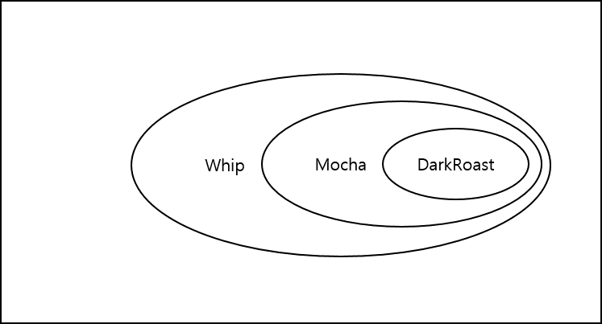
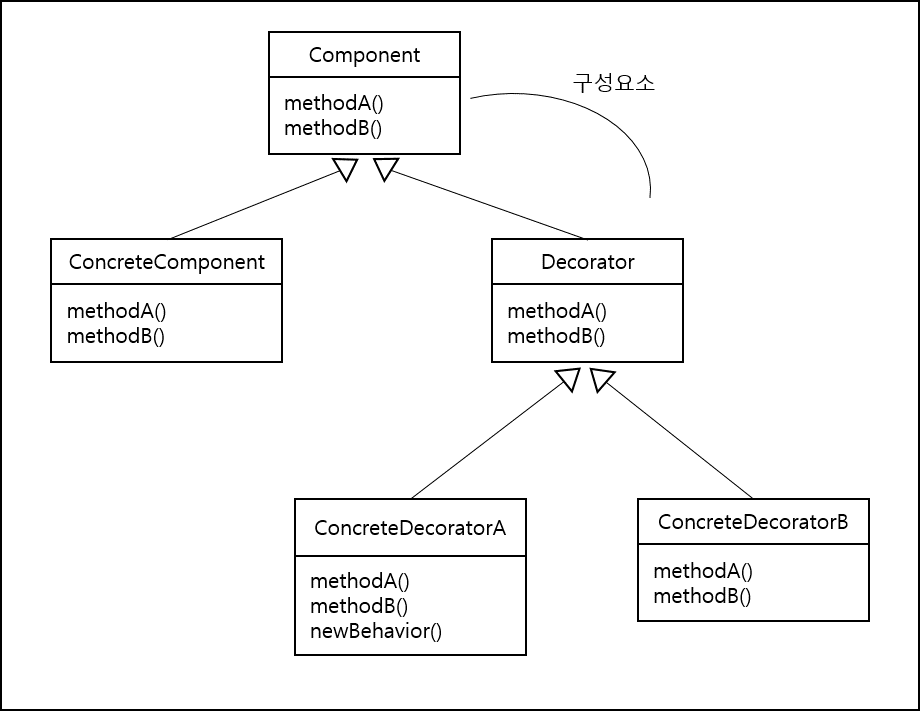
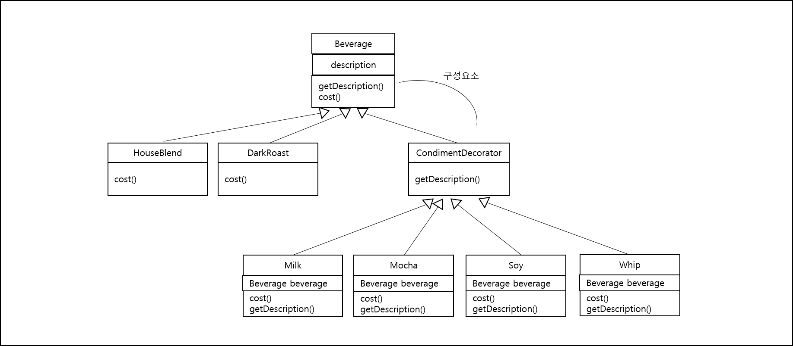

<div id="page">

<div id="main" class="aui-page-panel">

<div id="main-header">

<div id="breadcrumb-section">

1.  [Programming](index.html)
2.  [Programming](Programming_98307.html)
3.  [Java](Java_25001989.html)
4.  [Java Pattern](Java-Pattern_25002575.html)

</div>

# <span id="title-text"> Programming : Decorator pattern </span>

</div>

<div id="content" class="view">

<div class="page-metadata">

Created by <span class="author"> Dongwook Han</span>, last modified on 3월 22, 2023

</div>

<div id="main-content" class="wiki-content group">

# 작동구조

- 실행 중에 클래스를 꾸미는 패턴

- 상속보다는 구성을 통해 객체의 행동을 확장

- OCP(Open-Closed Principle) : 클래스는 확장에 대해서는 열려 있어야 하지만 코드 변경에 대해서는 닫혀 있어야 한다. =\> 기존 코드는 건드리지 않은 채로 확장을 통해서 새로운 행동을 간단하게 추가할 수 있도록 하는게 목표

- 객체로부터 시작 → 새로운 객체로 감쌈 → 또 추가가 되면 해당 객체를 생성해서 기존 객체를 감쌈

- 예: 커피점에서 커피 메뉴(Dark Roast 커피에 Mocha 추가, Whip 크림 추가 등)

<span class="confluence-embedded-file-wrapper image-center-wrapper"></span>

# 정의

- 객체에 추가적인 요건을 동적으로 첨가한다.

- 데이레이터는 서브 클래스를 만드는 것을 통해서 기능을 유연하게 확장할 수 있는 방법을 제공

- Decorator는 자신이 장식할 구성 요소(Component) 와 같은 인터페이스 또는 추상 클래스를 구현

- ConcreteDecorator 는 component를 확장

<span class="confluence-embedded-file-wrapper image-center-wrapper"></span>

- 커피 예제 다이어그램

<span class="confluence-embedded-file-wrapper image-center-wrapper"></span>

# 구현

## Beverage (구성요소)

<div class="code panel pdl" style="border-width: 1px;">

<div class="codeContent panelContent pdl">

``` syntaxhighlighter-pre
public abstract class Beverage {
  String description = "커피명없음";
  
  public String getDescription(){
    return description;
  }
  
  public abstract double cost();
}
```

</div>

</div>

## decorator

<div class="code panel pdl" style="border-width: 1px;">

<div class="codeContent panelContent pdl">

``` syntaxhighlighter-pre
public abstract class CondimentDecorator extends Beverage {
  public abstract String getDescription();
}
```

</div>

</div>

## 실제 음료 구현

<div class="code panel pdl" style="border-width: 1px;">

<div class="codeContent panelContent pdl">

``` syntaxhighlighter-pre
public class HouseBlend extends Beverage{
  public HouseBlend() {
    description = "하우스 블렌드 커피";
  }
  
  public double cost() {
    return .89;
  }
}
```

</div>

</div>

<div class="code panel pdl" style="border-width: 1px;">

<div class="codeContent panelContent pdl">

``` syntaxhighlighter-pre
public class DarkRoast extends Beverage{
  public DarkRoast() {
    description = "다크 로스트 커피";
  }
  
  public double cost() {
    return .79;
  }
}
```

</div>

</div>

Decorator를 상속 받은 첨가물용 코드

<div class="code panel pdl" style="border-width: 1px;">

<div class="codeContent panelContent pdl">

``` syntaxhighlighter-pre
public class Mocha extends CondimentDecorator {
  Beverage beverage;
  
  public Mocha(Beverage beverage) {
    this.beverage = beverage;
  }
  
  public String getDescription() {
    return beverage.getDescription() + ", 모카";
  }
  
  public double cose() {
    return .20 + beverage.cose();
  }
}
```

</div>

</div>

<div class="code panel pdl" style="border-width: 1px;">

<div class="codeContent panelContent pdl">

``` syntaxhighlighter-pre
public class Whip extends CondimentDecorator {
  Beverage beverage;
  
  public Whip(Beverage beverage) {
    this.beverage = beverage;
  }
  
  public String getDescription() {
    return beverage.getDescription() + ", 휘핑 크림";
  }
  
  public double cose() {
    return .30 + beverage.cose();
  }
}
```

</div>

</div>

## 실행 코드

<div class="code panel pdl" style="border-width: 1px;">

<div class="codeContent panelContent pdl">

``` syntaxhighlighter-pre
public class StarbuzzCoffee {
  public static void main(String[] args){
    Beverage beverage = new HouseBlend();
    System.out.println(beverage.getDesciption() + " $" + beverage.cose());
    
    Beverage beverage2 = new DarkRoast();
    beverage2 = new Mocha(beverage2);
    beverage2 = new Whip(beverage2);
    System.out.println(beverage2.getDesciption() + " $" + beverage2.cose());
  }
}
```

</div>

</div>

- 예제에서 데코레이터는 Beverage의 cost() 와 description() 을 확장하기 위해 사용 되었음

- 데코레이터는 데코레이터가 감싸고 있는 **객체에 행동을 추가하기 위한 용도**로 만들어진 것

- 데코레이터만 사용하는 것보다는 다른 패턴과 같이 사용해서 적용하는게 좋음

- Java IO가 데코레이터가 적용된 사례임

</div>

<div class="pageSection group">

<div class="pageSectionHeader">

## Attachments:

</div>

<div class="greybox" align="left">

 [pattern_decorator01.png](attachments/386203651/385908762.png) (image/png)\
 [pattern_decorator02.png](attachments/386203651/386236427.png) (image/png)\
 [pattern_decorator03.png](attachments/386203651/386236433.png) (image/png)\

</div>

</div>

</div>

</div>

<div id="footer" role="contentinfo">

<div class="section footer-body">

Document generated by Confluence on 4월 05, 2026 17:57

<div id="footer-logo">

[Atlassian](http://www.atlassian.com/)

</div>

</div>

</div>

</div>
