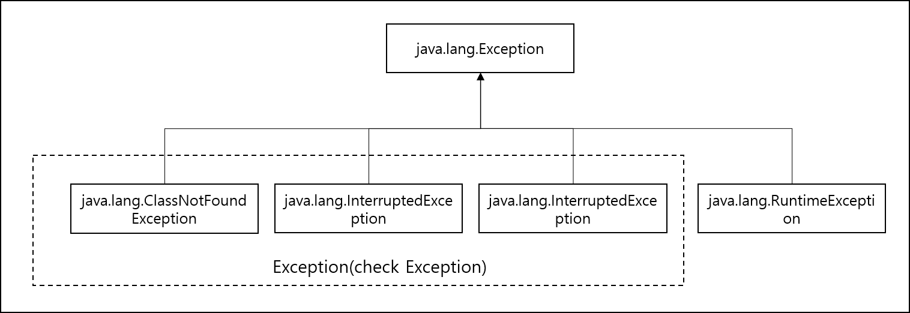
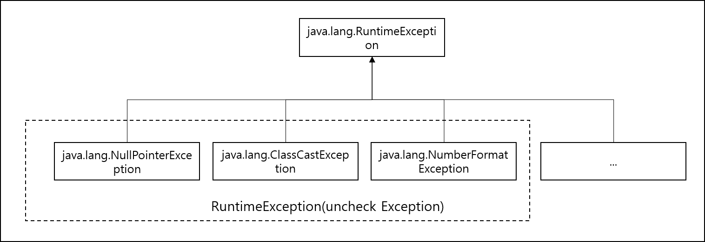

<div id="page">

<div id="main" class="aui-page-panel">

<div id="main-header">

<div id="breadcrumb-section">

1.  [Programming](README.md)
2.  [Programming](Programming_98307.md)
3.  [Java](Java_25001989.md)
4.  [Java Basic](Java-Basic_399278081.md)

</div>

# <span id="title-text"> Programming : Exception </span>

</div>

<div id="content" class="view">

<div class="page-metadata">

Created by <span class="author"> Dongwook Han</span>, last modified on 3월 15, 2024

</div>

<div id="main-content" class="wiki-content group">

<div class="aui-dialog2 aui-layer" style="top: 160.0px;right: 20.0px;display: block;left: 200.0px;overflow: hidden;visibility: hidden;z-index: 1;">

<div style="width: 260.0px;float: right;text-align: left;overflow: hidden;visibility: visible;">

<div id="ap-com.binguo.confluence.headingfree.easy-heading-free__easy-heading-dynamic6014505093636481823" class="ap-container">

<div id="embedded-com.binguo.confluence.headingfree.easy-heading-free__easy-heading-dynamic6014505093636481823" class="ap-content">

</div>

</div>

</div>

</div>

# Exception 정의 및 분류

- Error 와 Exception

  - Error : 오동작, 고장으로 인한 응용 프로그램 실행 오류, java.lang.Error 하위 클래스

  - Exception : 사용자의 잘못된 조작 또는 개발자의 잘못된 코딩으로 인해 발생하는 프로그램 오류

- Java 에서의 Exception 분류

  - Exception : 일반 예외

  - RuntimeException 실행 예외

- 프로그래밍시 예외 처리를 필수로 해야 하는 checked Exception

  - checked exception

    - 반드시 예외 처리

    - 컴파일 단계에서 확인 가능

    - 예외 발생시 트랜잭션 roll back하지 않음

    - RuntimeException을 제외한 Exception의 하위 클래스

  - 예외 처리를 프레임워크나 프로그램 맡김

    - unchecked Exception

    - 명시적 예외 처리를 강제하지 않음

    - 실행 단계에서 확인 가능

    - 예외 발생시 transaction roll back

    - RuntimeException의 하위 클래스

- 예외처리 방법

  - 예외 복구

    - 예외 상황을 파악하고 문제를 해결해서 정상 상태로 돌려 놓는 방법

  - 예외 처리 회피

    - 예외 처리를 자신이 담당하지 않고 호출한 쪽으로 던짐 (throw)

  - 예외 전환

    - 어떤 예외 상황에 대해 의미가 좀 더 명확한 예외로 재정의하여 throw

- Exception

  - Java Soucre 컴파일 하는 과정에서 예외 처리 코드가 필요한지 검사 : Compile check Exception(Checked Exception)

  - 일반 예외 클래스는 Exception을 상속 받으나 RuntimeException을 상속 받지 않은 클래스

    <span class="confluence-embedded-file-wrapper image-center-wrapper"></span>

- RuntimeException

  - 컴파일 과정에서 예외처리코드 검사하지 않는 예외 : Unchecked Exception

  - 실행예외 클래스는 RuntimeException을 상속받은 클래스

    <span class="confluence-embedded-file-wrapper image-center-wrapper"></span>

  - 컴파일러가 예외를 체크하지 않기 때문에 **개발자가 예외처리 코드 삽입 필요**

## 예외처리 방법

### try-catch-finally 처리

- 프로그램에서 예외 발생시 프로그램의 갑작스런 종료를 막고, 정상 실행을 유지하도록 처리하는 코드 : 예외 처리 코드

- 형식 : try-catch-finally 블록 사용

- Checked Exception 처리

  <div class="code panel pdl" style="border-width: 1px;">

  <div class="codeContent panelContent pdl">

  ``` syntaxhighlighter-pre
  public class TryCatchFinallyExample {
    public static void main(String[] args) {
      try {
        Class clazz = Class.forName("java.lang.String2");
      } catch(ClassNotFoundException e ) {
        System.out.println("클래스가 존재하지 않습니다. " );
      }
    }
  }
  ```

  </div>

  </div>

  - 코드를 구현할 때 Compile가 예외처리 코드를 작성할 것을 요구함

<!-- -->

- Unchecked Exception 처리

  <div class="code panel pdl" style="border-width: 1px;">

  <div class="codeContent panelContent pdl">

  ``` syntaxhighlighter-pre
  public class TryCatchFinallyRuntimeExceptionExample {
    public static void main(String[] args) {
      String data1 = null;
      Strinng data2 = null;
      try {
        data1 = args[0];
        data2 = args[1]
      } catch(ArrayIndexOutOfBoundException e ) {
        System.out.println("실행 매개값의 수가 부족합니다." );
        System.out.println("[실행방법]" );
        System.out.println("java TryCatchFinallyRuntimeExceptionExample num1 num2" );
        return;
      }
      
      try {
        int value1 = Integer.parseInt(data1);
        int value2 = Integer.parseInt(data2);
        int result = value1 + value2;
        System.out.println(data1 + "+" + data2 + "=" + result);
      } catch(NumberFormatException e) {
         System.out.println("숫자로 변환할 수 없습니다.");
      } finally {
        System.out.println("다시 실행하세요");
      }
    }
  }
  ```

  </div>

  </div>

  - 개발자가 RuntimeException 에 대해 경험 또는 예외를 예측에서 코드를 구현

### 예외 떠넘기기

- 메소드를 호출한 곳으로 예외를 넘기기

- 발생할 수 있는 예외의 종류별로 thorws 뒤에 나열하는 것이 일반적 (throws Exception1, Exception2)

- thows Exception 만으로 모든 예외를 간단히 넘길 수 있음 (최상위 Exception 클래스 )

- throws 정의된 메소드는 try {} catch 블록에서 처리해야 함 : 처리 안 하면 컴파일 오류 발생

  <div class="code panel pdl" style="border-width: 1px;">

  <div class="codeContent panelContent pdl">

  ``` syntaxhighlighter-pre
  public void method1() {
    try {
      method2();  // try-catch 블록 안에서 throws 처리한 메소드 호출
    } catch(ClassNotFoundException e) {
      System.out.println("클래스가 존재하지 않습니다.");
    }
  }

  public void method2() throws ClassNotFoundException {
    Class clazz = Class.forName("java.lang.String2");
  }
  ```

  </div>

  </div>

### 자동 리소스 닫기

- try-with-resources : 예외 발생 여부와 상관없이 사용했던 리소스(스트림, 소캣, 채널 등)객체 닫기

- 리소스 객체가 java.lang.AutoCloseable interface를 구현한 객체로 한정

  <div class="code panel pdl" style="border-width: 1px;">

  <div class="codeContent panelContent pdl">

  ``` syntaxhighlighter-pre
  try (
      FileInputStream fis = new FileInputStream("file1.txt");
      FileOutputStream fos = new FileOutputStream("file2.txt")
  ) {
    ...
  } catch(IOException e) {
    ...
  }
  ```

  </div>

  </div>

## 예외 종류에 따른 처리

### 다중 Catch

- 다양한 종류의 예외 처리를 정의. 한번에 하나의 예외만 처리됨

- 상위 예외 클래스는 맨 나중에 정의함

- 먼저 발생한 예외가 처리됨

  <div class="code panel pdl" style="border-width: 1px;">

  <div class="codeContent panelContent pdl">

  ``` syntaxhighlighter-pre
  try {
    ArrayIndexOutOfBoundException 발생
    
    NumberFormatException 발생
  } catch(ArrayIndexOutOfBoundException e) {
    예외처리1
  } catch(NumberFormatException e){
    예외처리2
  } catch(Exception e) {  // 최상위 예외 클래스 
    예외처리3
  }
  ```

  </div>

  </div>

### 멀티 catch

- 하나의 catch 블록에서 여러 개의 예외를 처리

- 파이프로 Exception 를 연결해서 정의

  <div class="code panel pdl" style="border-width: 1px;">

  <div class="codeContent panelContent pdl">

  ``` syntaxhighlighter-pre
  try {
    ArrayIndexOutOfBoundException 발생
    
    NumberFormatException 발생
  } catch(ArrayIndexOutOfBoundException | NumberFormatException e) {
    예외처리1
  } catch(Exception e) {  // 최상위 예외 클래스 
    예외처리3
  }
  ```

  </div>

  </div>

## 사용자 정의 예외

- 자바에 정의된 예외 클래스외에 예외 클래스를 정의

- 예외를 CheckedException, UncheckedException 로 구분하여 정의

- Exception 생성자는 기본적으로 기본 생성자와 message 를 갖는 생성자를 정의함

  <div class="code panel pdl" style="border-width: 1px;">

  <div class="codeContent panelContent pdl">

  ``` syntaxhighlighter-pre
  public class XXXException extends [Exception | RunntimeException ] {
    public XXXException() {}
    public XXXException(String message) { super(message); }
  }
  ```

  </div>

  </div>

## 예외 발생시키기

- 강제로 예외 발생시킬 때 코드에 throw Exception 정의

  <div class="code panel pdl" style="border-width: 1px;">

  <div class="codeContent panelContent pdl">

  ``` syntaxhighlighter-pre
  public void method() throws XXXException {
    throw new XXXException("메시지");
  }
  ```

  </div>

  </div>

- 조건에 따라 예외를 발생시켜서 처리할 수 있음

## 예외 정보 얻기

- Exception 에 정의된 메소드들을 모든 예외 객체에서 사용 가능

- getMessage(), printStackTrace() 등 예외의 상세 정보를 얻을 수 있음

</div>

<div class="pageSection group">

<div class="pageSectionHeader">

## Attachments:

</div>

<div class="greybox" align="left">

 [exception_arch.png](attachments/384073729/384434177.png) (image/png)\
 [exception_arch.png](attachments/384073729/384368641.png) (image/png)\
 [runtimeexception_arch.png](attachments/384073729/384466947.png) (image/png)\

</div>

</div>

</div>

</div>

<div id="footer" role="contentinfo">

<div class="section footer-body">

Document generated by Confluence on 4월 05, 2026 17:57


</div>

</div>

</div>
