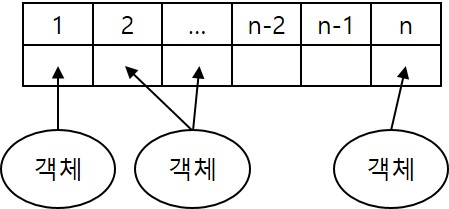
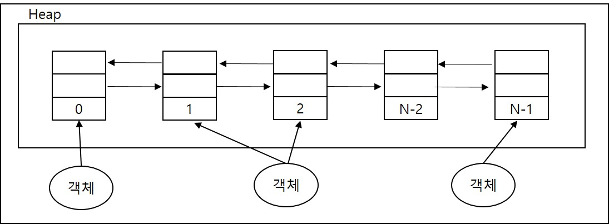

<div id="page">

<div id="main" class="aui-page-panel">

<div id="main-header">

<div id="breadcrumb-section">

1.  [Programming](README.md)
2.  [Programming](Programming_98307.md)
3.  [Java](Java_25001989.md)
4.  [Java Basic](Java-Basic_399278081.md)
5.  [Collections](Collections_25002006.md)

</div>

# <span id="title-text"> Programming : List Collections </span>

</div>

<div id="content" class="view">

<div class="page-metadata">

Created by <span class="author"> Dongwook Han</span>, last modified on 3월 15, 2024

</div>

<div id="main-content" class="wiki-content group">

<div class="aui-dialog2 aui-layer" style="top: 160.0px;right: 20.0px;display: block;left: 200.0px;overflow: hidden;visibility: hidden;z-index: 1;">

<div style="width: 240.0px;float: right;text-align: left;overflow: hidden;visibility: visible;">

<div id="ap-com.binguo.confluence.headingfree.easy-heading-free__easy-heading-dynamic4755869602214206950" class="ap-container">

<div id="embedded-com.binguo.confluence.headingfree.easy-heading-free__easy-heading-dynamic4755869602214206950" class="ap-content">

</div>

</div>

</div>

</div>

# List

- 객체를 인덱스로 관리

- 객체의 번지 참조

- 중복 허용, 순서 보장

- 길이 동적 변화

- ArrayList, Vector, LinkedList

- 빈번한 객체 삭제나 삽입이 일어날 경우 LinkedList 사용 권장

  

<span class="confluence-embedded-file-wrapper image-center-wrapper"></span>

- List 공통 Method

<div class="table-wrap">

<table class="confluenceTable" data-layout="default">
<tbody>
<tr>
<th class="confluenceTh"><p><strong>기능</strong></p></th>
<th class="confluenceTh"><p><strong>메소드</strong></p></th>
<th class="confluenceTh"><p><strong>설명</strong></p></th>
</tr>
&#10;<tr>
<td rowspan="3" class="confluenceTd"><p>객체 추가</p></td>
<td class="confluenceTd"><p>boolean add(E e)</p></td>
<td class="confluenceTd"><p>주어진 객체를 맨 끝에 추가</p></td>
</tr>
<tr>
<td class="confluenceTd"><p>void add(int index, E e)</p></td>
<td class="confluenceTd"><p>주어진 인덱스에 객체 추가</p></td>
</tr>
<tr>
<td class="confluenceTd"><p>set(int index, E e)</p></td>
<td class="confluenceTd"><p>주어진 인덱스에 객체 변경</p></td>
</tr>
<tr>
<td rowspan="4" class="confluenceTd"><p>객체 검색</p></td>
<td class="confluenceTd"><p>boolean contains(Object o)</p></td>
<td class="confluenceTd"><p>객체 포함여부</p></td>
</tr>
<tr>
<td class="confluenceTd"><p>E get(int index)</p></td>
<td class="confluenceTd"><p>주어진 인덱스의 객체 리턴</p></td>
</tr>
<tr>
<td class="confluenceTd"><p>isEmpty()</p></td>
<td class="confluenceTd"><p>컬렉션이 비었는지 여부</p></td>
</tr>
<tr>
<td class="confluenceTd"><p>int size()</p></td>
<td class="confluenceTd"><p>저장된 전체 객체수</p></td>
</tr>
<tr>
<td rowspan="3" class="confluenceTd"><p>객체 삭제</p></td>
<td class="confluenceTd"><p>void clear()</p></td>
<td class="confluenceTd"><p>모든 객체 삭제</p></td>
</tr>
<tr>
<td class="confluenceTd"><p>E remove(int index)</p></td>
<td class="confluenceTd"><p>주어진 인덱스 객체 삭제</p></td>
</tr>
<tr>
<td class="confluenceTd"><p>boolean remove(Object o)</p></td>
<td class="confluenceTd"><p>주어진 객체 삭제</p></td>
</tr>
</tbody>
</table>

</div>

## ArrayList

# 특징

- 배열은 생성시 크기 고정,

- ArrayList는 저장 용량 초과시 자동으로 저장 용량 증가

- 기본 생성(10개의 객체를 저장할 수 잇는 초기 용량 할당)\
  List\<String\> list = new ArrayList\<String\>();

- ArrayList에 객체 추가시 add(int index, E e) 사용시 해당 index 부터 마지막 인덱스까지 1씩 밀려남

- remove(int index, E e) 사용시 해당 인덱스부터 끝까지 1씩 당겨짐

- 동적인 객체 추가가 아닌 고정된 수의 객체 추가시 다음과 같이 정의\
  List\<T\> list = ArrayList.asList(T… a);\

  <div class="code panel pdl" style="border-width: 1px;">

  <div class="codeContent panelContent pdl">

  ``` syntaxhighlighter-pre
  List<String> list = ArrayList.asList("테스트1","테스트2");
  ```

  </div>

  </div>

## Vector

- 생성\
  List\<E\> list = new Vector\<E\>();

- synchronized 메소드로 구성되어 Thread-safe 함 → Thread 사용시 공유 Collection 선언시 사용

## LinkedList

- ArrayList(내부 배열에 객체를 저장해서 인덱스로 관리) vs LinkedList(인접 참조를 링크해서 체인처럼 관리)

- 구조

<span class="confluence-embedded-file-wrapper image-center-wrapper"></span>

- 특정 인덱스의 객체 삭제시 앞뒤 링크만 변경됨

- 특정 인덱스의 객체 추가시 앞뒤 링크만 변경됨

- 잦은 객체 삽입/삭제 시 LinkedList가 ArrayList보다 나으나,ArrayList 끝에서만 객체 추가/삭제시에는 LinkedList보다 빠름

</div>

<div class="pageSection group">

<div class="pageSectionHeader">

## Attachments:

</div>

<div class="greybox" align="left">

 [List.jpg](attachments/25002021/25002040.jpg) (image/jpeg)\
 [LinkedList.jpg](attachments/25002021/25067558.jpg) (image/jpeg)\

</div>

</div>

</div>

</div>

<div id="footer" role="contentinfo">

<div class="section footer-body">

Document generated by Confluence on 4월 05, 2026 17:57


</div>

</div>

</div>
