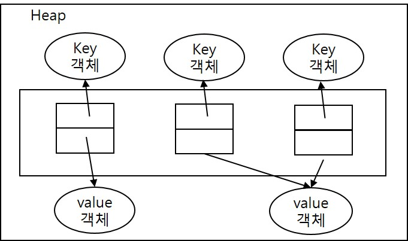

<div id="page">

<div id="main" class="aui-page-panel">

<div id="main-header">

<div id="breadcrumb-section">

1.  [Programming](README.md)
2.  [Programming](Programming_98307.md)
3.  [Java](Java_25001989.md)
4.  [Java Basic](Java-Basic_399278081.md)
5.  [Collections](Collections_25002006.md)

</div>

# <span id="title-text"> Programming : Map Collection </span>

</div>

<div id="content" class="view">

<div class="page-metadata">

Created by <span class="author"> Dongwook Han</span>, last modified on 5월 21, 2023

</div>

<div id="main-content" class="wiki-content group">

# 개념

- **key, value 로 구성된 Entry 객체** 저장

- **key 중복 안됨, value는 중복저장 가능**

- 동일한 key 사용시 덮어씀

- 종류 : HashMap, HashTable, LinkedListHashMap, Properties, TreeMap

# 구조

<span class="confluence-embedded-file-wrapper image-center-wrapper"></span>

- 공통 메소드

<div class="table-wrap">

<table class="confluenceTable" data-layout="default" data-local-id="1f451d33-417e-4863-8c66-8c9ba1e43db4">
<tbody>
<tr>
<th class="confluenceTh"><p><strong>기능</strong></p></th>
<th class="confluenceTh"><p><strong>메소드</strong></p></th>
<th class="confluenceTh"><p><strong>설명</strong></p></th>
</tr>
&#10;<tr>
<td class="confluenceTd"><p>객체 추가</p></td>
<td class="confluenceTd"><p>V put(Key key, Value value)</p></td>
<td class="confluenceTd"><p>주어진 키와 값을 추가, 저장되면 값을 리턴</p></td>
</tr>
<tr>
<td rowspan="8" class="confluenceTd"><p>객체 검색</p></td>
<td class="confluenceTd"><p>boolean containsKey(Object key)</p></td>
<td class="confluenceTd"><p>주어진 키가 있는지 여부</p></td>
</tr>
<tr>
<td class="confluenceTd"><p>boolean containsValue(Object value)</p></td>
<td class="confluenceTd"><p>주어진 값이 있는지 여부</p></td>
</tr>
<tr>
<td class="confluenceTd"><p>Set&lt;Map.Entry(key, value&gt;&gt; entrySet()</p></td>
<td class="confluenceTd"><p>키와 값의 쌍으로 구성된 모든 Map.Entry 객체를 Set에 담아 리턴</p></td>
</tr>
<tr>
<td class="confluenceTd"><p>V get(Object key)</p></td>
<td class="confluenceTd"><p>주어진 key가 있는 값 리턴</p></td>
</tr>
<tr>
<td class="confluenceTd"><p>boolean isEmpty()</p></td>
<td class="confluenceTd"><p>비어 있는지 여부</p></td>
</tr>
<tr>
<td class="confluenceTd"><p>Set&lt;K&gt; keySet()</p></td>
<td class="confluenceTd"><p>모든 키를 set 객체로 리턴</p></td>
</tr>
<tr>
<td class="confluenceTd"><p>int size()</p></td>
<td class="confluenceTd"><p>저장된 키의 총 수</p></td>
</tr>
<tr>
<td class="confluenceTd"><p>Collection&lt;v&gt; values()</p></td>
<td class="confluenceTd"><p>저장된 모든 values</p></td>
</tr>
<tr>
<td rowspan="2" class="confluenceTd"><p>객체 삭제</p></td>
<td class="confluenceTd"><p>void clear()</p></td>
<td class="confluenceTd"><p>모든 Map.Entry 삭제</p></td>
</tr>
<tr>
<td class="confluenceTd"><p>V remove(Object key)</p></td>
<td class="confluenceTd"><p>주어진 키와 일치하는 Map.Entry를 삭제하고 값 리턴</p></td>
</tr>
</tbody>
</table>

</div>

- 에제 : 저장된 전체 객체를 대상으로 값 얻기\

  <div class="code panel pdl" style="border-width: 1px;">

  <div class="codeContent panelContent pdl">

  ``` syntaxhighlighter-pre
  Set<Map.Entry<Key, Value>> entrySet = map.entrySet();
  Iterator,Map.Entry<Key,Value>> entryIterator = entrySet.iterator();
  whihle(entryIterator.hasNext()){
    Map.Entry<Key,Value> entry = entryiterator.next();
    Key key = entry.getKey();
    Value value = entry.getValue();
  }
  ```

  </div>

  </div>

  <div class="code panel pdl" style="border-width: 1px;">

  <div class="codeContent panelContent pdl">

  ``` syntaxhighlighter-pre
  Map<Key,Value> map = ...;
  Set<Key> keySet = map.keySet();
  Iterator<Key> iterator = keySet.iterator();
  while(iterator.hasNext()){
     Key key = iterator.next();
     Value value = map.get(key);
  }
  ```

  </div>

  </div>

# HashMap

- hashcode() 와 equals() 메소드 재정의해서 동등객체 조건 정의 가능

- 동일한 키가 될 조건은 hashcode()의 리턴값이 같음

- 키와 값 타입은 기본 타입(int, long, double)은 안 되고 클래스와 인터페이스만 가능

## 키 클래스 재정의 예제

<div class="code panel pdl" style="border-width: 1px;">

<div class="codeContent panelContent pdl">

``` syntaxhighlighter-pre
class Student{
  public int sno;
  public String name;
  
  public Student(int sno, String name){
    this.sno = sno;
    this.name = name;  
  }
  
  public boolean equals(Object obj){
    if(obj instanceof Student){
      Student student = (Student)obj;
      return (sno == student.sno) && (name.equals(student.name));
    }else{
      return false;
    }
  }
  
  public int hashCode(){
    return sno + name.hashCode();
  }
}
```

</div>

</div>

## 비교 예제

<div class="code panel pdl" style="border-width: 1px;">

<div class="codeContent panelContent pdl">

``` syntaxhighlighter-pre
public class Example{
  public static void main(String[] args){
    Map<Student, Integer> map = new HashMap<>();
    map.put(new Student(1,"홍길동")), 95);
    map.put(new Student(1,'홍길동')), 95);
    System.out.println("총 entry 수 : " + map.size());
  }
}
```

</div>

</div>

# Hashtable

- HashMap과 동일한 내부 구조

- 키로 사용할 객체는 hashCode(), equals() 메소드 재정의 해서 동등객체가 될 조건 정의

- synchronized 메소드로 구성(HashMap과의 차이)

- 멀티 스레드 환경에서 안전하게 객체 추가, 삭제(thread-safe)

<!-- -->

- 생성\

  <div class="code panel pdl" style="border-width: 1px;">

  <div class="codeContent panelContent pdl">

  ``` syntaxhighlighter-pre
  Map<Key, Value> map = new Hashtable<Key,Value>();
  ```

  </div>

  </div>

# Properties

- Hashtable의 하위 클래스

- Hashtable의 모든 특징을 갖춤

- 키와 값을 String type 으로 제한

- ISO8859-1 문자셋으로 저장. 한글은 unicode로 변환 저장

- 한글이 포함된 properties 파일을 java\bin\native2ascii.exe 로 iso8859-1 파일로 변환

- properties 파일은 key=value 로 형태로 저장

<!-- -->

- 생성\

  <div class="code panel pdl" style="border-width: 1px;">

  <div class="codeContent panelContent pdl">

  ``` syntaxhighlighter-pre
  Properteis properties = new Properties();
  properties.load(new FileReader("C;/temp/database.properties));
  ```

  </div>

  </div>

- 일반적으로 클래스 파일과 같은 경로에 함께 저장

- 상대 경로 사용시 class의 getResource() 메소드 사용\

  <div class="code panel pdl" style="border-width: 1px;">

  <div class="codeContent panelContent pdl">

  ``` syntaxhighlighter-pre
  String path = Sample.class.getResource("../database.properties").getPath();
  path = URLDecoder.decode(path, "UTF-8"); // 경로에 한글이 있을 경우 한글 복원
  ```

  </div>

  </div>

- Properties 객체 내 키 값 읽을 때 getProperty() 사용\

  <div class="code panel pdl" style="border-width: 1px;">

  <div class="codeContent panelContent pdl">

  ``` syntaxhighlighter-pre
  String value = properteis.getProperty("key");
  ```

  </div>

  </div>

</div>

<div class="pageSection group">

<div class="pageSectionHeader">

## Attachments:

</div>

<div class="greybox" align="left">

 [Map.jpg](attachments/25002126/25002136.jpg) (image/jpeg)\

</div>

</div>

</div>

</div>

<div id="footer" role="contentinfo">

<div class="section footer-body">

Document generated by Confluence on 4월 05, 2026 17:57

<div id="footer-logo">

[Atlassian](http://www.atlassian.com/)

</div>

</div>

</div>

</div>
