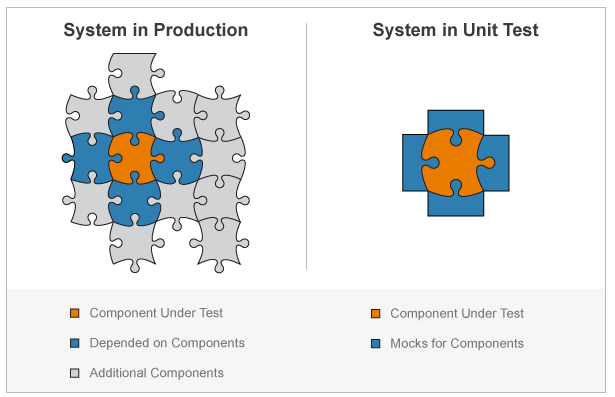
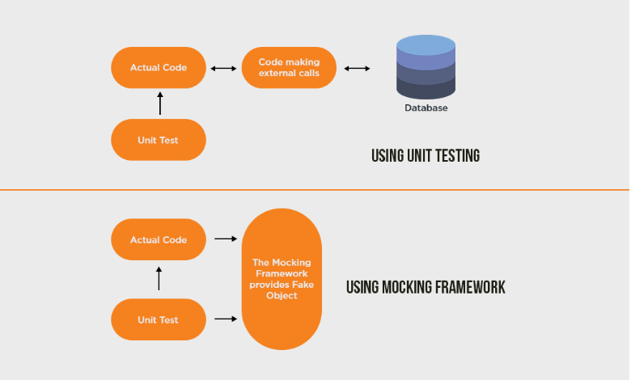

1.  [Programming](README.md)
2.  [Programming](Programming_98307.md)
3.  [테스트](366379129.md)

#  Programming : Mock 

Created by  Dongwook Han, last modified on 5월 06, 2021

- [개념](#Mock-개념)
- [Mock 객체 요구사항](#Mock-Mock객체요구사항)
- [기본 개념](#Mock-기본개념)
- [Mock 프레임워크](#Mock-Mock프레임워크)
  - [EasyMock](#Mock-EasyMock)
  - [jMock](#Mock-jMock)
  - [Mockito](#Mock-Mockito)
- [Mock 사용시 유의 사항](#Mock-Mock사용시유의사항)

# 개념

- 단위 테스트를 하고자 하는 메소드가 여러 리소스(DB, 네트워크) 를 사용하고 있을시 가짜 객체를 만들어 사용하는 방법

- 참고 <a href="https://redskelt.github.io/junit/mockito/2017/06/19/junit01.md" class="external-link" data-card-appearance="inline" rel="nofollow">https://redskelt.github.io/junit/mockito/2017/06/19/junit01.md</a>

- mockito :<a href="https://github.com/mockito/mockito/wiki/Mockito-features-in-Korean" class="external-link" data-card-appearance="inline" rel="nofollow">https://github.com/mockito/mockito/wiki/Mockito-features-in-Korean</a>

# Mock 객체 요구사항

- 테스트 작성을 위한 환경 구축이 어려운 경우

  - DB, Web Server, WAS Server, FTP 등

- 테스트가 특정 경우나 순간에 의존적인 경우

- 테스트 시간이 오래 걸리는 경우

- 테스트 환경으로 인한 지연 요소가 있을 시 시간 단축

# 기본 개념

1.  Test Double

    - 테스트를 진행하기 어려운 경우 이를 대신해 테스트를 진행할 수 있도록 만들어주는 객체

    - Mock 객체와 유사한 의미이며 테스트 더블이 좀더 상위 개념으로 사용

2.  Dummy Object

    - 단순히 인스턴스화될 수 있는 수준으로 객체 구현

    - 인스턴스화된 객체만 필요하고 기능까지 필요하지 않는 경우 사용

3.  Test Stub

    - 더미 객체보다 좀더 구현된 객체

    - 더미 객체가 마치 실제로 동작하는 것처럼 보이게 만든 객체

    - 객체의 특정 상태를 가정해서 만들어 특정 값을 리턴하거나 특정 메시지 출력

    - 특정 상태를 가정해서 하드코딩된 형태로 로직에 따른 값 변경 테스트 불가

4.  Fake Object

    - 여러 상태를 대표할 수 있도록 구현된 객체로 실제 로직이 구현된 것처럼 보이게함

    - 실제 DB 접속해서 비교할 때와 동일하도록 객체 내부를 구현

      - 테스트 케이스 작성을 위해서 다른 객체들과의 의존성을 제겅하기 위해 사용

      - 페이크 객체를 만들때 적절한 수준에서 구현하거나 Mock 프레임워크 사용

      - 페이크 객체를 생성하기 위한 노력이 많이 필요한 경우 실제 객체를 가져와 테스트

    - 

5.  Test Spy

    - 테스트에 사용되는 객체, 메소드의 사용 여부 및 정상 호출 여부를 기록, 요청시 알려줌

    - 테스트 더블로 구현된 객체에 자기 자신이 호출되었을 때 확인이 필요한 부분을 기록, 구현

    - 특정 테스트 메소드가 몇번 호출되었는지 필요한 경우 전역 변수로 관리, 특정 테스트 메소드에 카운드 리턴 메소드 추가

    - 특정 메소드가 호출 되었을 때 또 다른 메소드가 실행되어야 하는 행위 기반 테스트가 필요한 경우 사용

6.  Mock Object

    - 행위를 검증하기 위해 사용되는 객체를 지칭, 실제 구현 및 프레임워크로 구현

    - 행위 기반 테스트는 복잡도나 정확성 등 작성하기 어려운 경우 상태 기반 테스트는 구현하지 않음

    - Mock 객체는 테스트 더블 하위 객체로서 좁은 의미와 테스트 더블을 포함한 넓은 의미로도 사용

Mock Object는 행위 검증(behavior verification)에 사용하고 Stub은 상태 검증(State Verification)에 사용

# Mock 프레임워크

- 동적으로 mock 객체를 만들어 주는 프레임워크

- Mock 객체를 명시적으로 생성하지 않아도 됨

- 행위 기반 테스트 가능

## EasyMock

- 가장 오래된 Mock 프레임워크, 탐 프리스 구현

- http;<a href="https://never4got10.atlassian.net//easymock.org" rel="nofollow">//easymock.org</a>

- 일반적으로 Mock 프레임워크는 인터페이스를 통해 객체를 생성하나 EasyMock Class Extension이라는 기능을 통해 구현 클래스를 통하여 객체 생성하도록 지원

- 기본적으로 4단계를 통하여 동작, 각 단계는 생략 가능

  - CreateMock : 인터페이스에 해당하는 Mock 객체 생성

  - Record : Mock 객체 메소드의 예상되는 동작을 기록

  - Replay : 예정된 상태로 재생

    - Verify : 예정된 행위가 발생했는지 검증

## jMock

- 스티프 프리만, 냇 프라이스가 만든 프레임워크

- 테스트 표현의 확대와 가독성이 좋음

- <a href="http://www.jmock.org" class="external-link" data-card-appearance="inline" rel="nofollow">http://www.jmock.org</a>

- 연쇄호출(call-chain) 지원

  - 동일한 객체에 여러 개의 메시지를 보낼 수 있다.

  - void로 선언된 메소드로 플로우를 만들어 순차 호출 가능

- 전용 Macher 사용 : 기본적으로 Hamcrest Macher 라이브러리 사용

- 작동 단계

  - CreateMock : 인터페이스에 해당하는 Mock 객체 생성

  - Expect : Mock 객체의 예상되는 동작을 미리 지정

  - Excercise : 테스트 메소드 내에서 Mock 객체 사용

  - Verify : 예상한 행위가 발생했는지 검증, 프레임워크가 자동으로 판단

## Mockito

- 간편한 사용법으로 빠르게 확산, 상태 기반 테스트 지원

- https;<a href="https://never4got10.atlassian.net//code.google.com/p/mockito" rel="nofollow">//code.google.com/p/mockito</a>

- 특징

  - 사용법 단순

  - call(“getName”) 처럼 이름이 호출하지 않는다.

  - 읽기 어려운 anonymous inner 클래스 사용 안함

  - 쉬운 리팩토링

  - 쉬운 작성

  - 테스트 스텁 구현과 검증을 분리

  - Mock 작성 방법을 단일화

  - 쉬운 테스트 스텁 생성

  - 간단한 API

  - 실패시 스택 트레이스 깔끔

- 작동 단계

  - CreateMock :인터페이스에 해당되는 Mock 객체 ㄱ현

  - Stub : 테스트에 필요한 Mock 객체의 동작 지정

  - Excercise : 테스트 메소드 내에서 Mock 객체 사용

  - Verify : 메소드가 예상대로 호출되었는지 검증

# Mock 사용시 유의 사항

- Mock 프레임워크가 정말 필요한지 확인

- Mock을 사용하는 경우 테스트 케이스 유지에 복잡성이 더해지기 때문에 Mock이 없는 의존성 적은 구조로 프로그래밍

- 어떤 Mock 프레임워크를 사용하느냐는 핵심 문제가 아님

- Mock 객체는 Mock일 뿐

- 실제 객체로 작동을 해보았을 대 잘 작동 않할 수 있음. Mock 객체는 흉내를 내는 객체임

출처 : <a href="http://www.incodom.kr/Mock" class="external-link" data-card-appearance="inline" rel="nofollow">http://www.incodom.kr/Mock</a>

<a href="https://github.com/mockito/mockito/wiki/Mockito-features-in-Korean" class="external-link" rel="nofollow">https://github.com/mockito/mockito/wiki/Mockito-features-in-Korean</a>

## Attachments:

 [image-20210505-094413.png](attachments/232947763/232947775.png) (image/png)\
 [image-20210505-095243.png](attachments/232947763/233046109.png) (image/png)\

Document generated by Confluence on 4월 05, 2026 17:57

