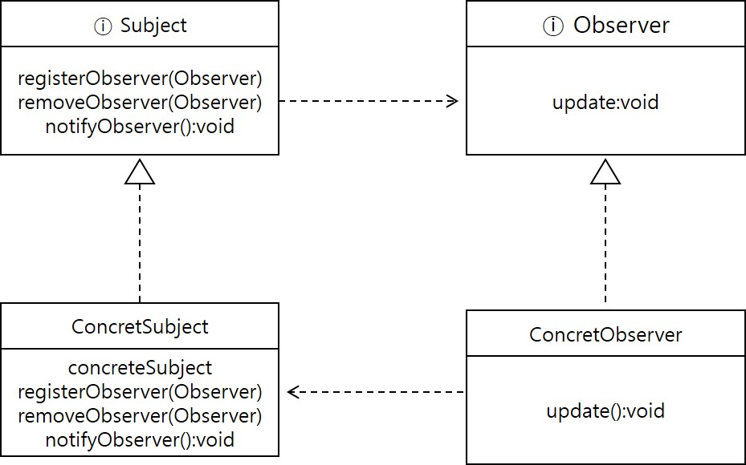

<div id="page">

<div id="main" class="aui-page-panel">

<div id="main-header">

<div id="breadcrumb-section">

1.  [Programming](README.md)
2.  [Programming](Programming_98307.md)
3.  [Java](Java_25001989.md)
4.  [Java Pattern](Java-Pattern_25002575.md)

</div>

# <span id="title-text"> Programming : Observable </span>

</div>

<div id="content" class="view">

<div class="page-metadata">

Created by <span class="author"> Dongwook Han</span>, last modified on 3월 22, 2023

</div>

<div id="main-content" class="wiki-content group">

# Observer Pattern

- 한 객체의 상태가 바뀌면 그 객체에 의존하는 다른 객체들한테 연락이 가동 자동으로 내용이 갱신되는 방식으로 일대다(one-to-many) 의존성을 정의

# 구현방법

- 상태를 저장하고 있는 주제, 인터페이스를 구현한 하나의 주제 객체

- 주체 객체에 의존하고 있는 observer 인터페이스를 구현한 여러 개의 observer 객체

## 데이터 전달 방식

- 주제 객체에서 observer 로 데이터를 보내는 방식(push)

- observer 에서 주제 객체이 데이터를 가져가는 방식(pull)

<span class="confluence-embedded-file-wrapper image-center-wrapper"></span>

## 샘플 구현 코드

### interface 예제

<div class="code panel pdl" style="border-width: 1px;">

<div class="codeContent panelContent pdl">

``` syntaxhighlighter-pre
public interface Subject{
  void registerObserver(Observer observer);
  void removeObserver(Observer observer);
  void notifyObservers();
}
```

</div>

</div>

<div class="code panel pdl" style="border-width: 1px;">

<div class="codeContent panelContent pdl">

``` syntaxhighlighter-pre
public interface Observer{
  void update(float temperature, float humidity, float pressure);
}
```

</div>

</div>

<div class="code panel pdl" style="border-width: 1px;">

<div class="codeContent panelContent pdl">

``` syntaxhighlighter-pre
public interface DisplayElement{
  void display();
}
```

</div>

</div>

### subject class 예제

<div class="code panel pdl" style="border-width: 1px;">

<div class="codeContent panelContent pdl">

``` syntaxhighlighter-pre
public class WeatherData implements Subject{
  private List<Observer> observers;
  private float temperature;
  private float humidity;
  private float pressure;
  
  {
    this.observers = new ArrayList<>();
  }
  
  public void measurementsChanged(){
    this.notifyObservers();
  }
  
  public void setMeasurementsChanged(float temperature, float humidity, float pressure){
    this.temperature = temperature;
    this.humidity = humidity;
    this.pressure = pressure;
    this.measurementsChanged();
  }
  
  @Override
  public void notifyObservers(){
    for(Observer observer: observers){
      observer.update(this.temperature, this.humidity, this.pressure);
    }
  }
  
  @Override
  public void registerObserver(Observer observer){
    this.observers.add(observer);
  }
  
  @Override
  public void removeObserver(Observer observer){
    if(observers.contains(observer)) observers.remove(observer);
  }
}
```

</div>

</div>

### Observer class 예제

<div class="code panel pdl" style="border-width: 1px;">

<div class="codeContent panelContent pdl">

``` syntaxhighlighter-pre
public class CurrentConditions implements Observer,DisplayElement{
  private float temperature;
  private float humidity;
  private Subject weatherData;
  
  public CurrentConditions(Subject weatherData){
    this.weatherData = weatherData;
    this.weatherData.registerObserver(this); // observer 등록
  }
  
  @Override
  public void display(){
    System.out.println("Current conditions : " + temperature + " , " + humidity);
  }
  
  @Override
  public void upate(float temperature, float humidity, float pressure){
    this.temperature = temperature;
    this.humidity = humidity;
    this.display();
  }
}
```

</div>

</div>

<div class="code panel pdl" style="border-width: 1px;">

<div class="codeContent panelContent pdl">

``` syntaxhighlighter-pre
public class ForecastDisplay implements Observer,DisplayElement{
  private float temperature;
  private float humidity;
  private Subject weatherData;
  
  public ForecastDisplay(Subject weatherData){
    this.weatherData = weatherData;
    this.weatherData.registerObserver(this); // observer 등록
  }
  
  @Override
  public void display(){
    System.out.println("Forecast : " + temperature + " , " + humidity);
  }
  
  @Override
  public void upate(float temperature, float humidity, float pressure){
    this.temperature = temperature;
    this.humidity = humidity;
    this.display();
  }
}
```

</div>

</div>

### 실행예제

<div class="code panel pdl" style="border-width: 1px;">

<div class="codeContent panelContent pdl">

``` syntaxhighlighter-pre
public class WeatherStation{
  public static void main(String[] args){
    WeatherData weatherData = new WeatherData();
    
    CurrentConditions currentConditions = new CurrentConditions(weatherData);
    StatisticsDisplay statisticsDisplay = new StatisticsDispaly(weatherData);
    ForecastDisplay forecastDisplay = new ForecastDisplay(weatherData);
    
    weatherData.setMeasurementsChanged(85,62,36.7f);
  }
}
```

</div>

</div>

## Java 객체를 이용한 예제

- WeatherData 구현

  <div class="code panel pdl" style="border-width: 1px;">

  <div class="codeContent panelContent pdl">

  ``` syntaxhighlighter-pre
  import java.util.Observable;
  import java.util.Observver;

  public class WeatherData extends Observable {
    private float temperature;
    private float humidity;
    private float pressure;
    
    public WeatherData(){}
    
    public void measurementsChanged(){
      setChanged();
      notifyObservers();
    }
    
    public void setMeasurementsChanged(float temperature, float humidity, float pressure){
      this.temperature = temperature;
      this.humidity = humidity;
      this.pressure = pressure;
      measurementsChanged();
    }
    public float getTemperature(){
      return temperature;
    }
    
    public float getHumidity(){
      return humidity;
    }
    
    public float getPressure() {
      return pressure;
    }
  }
  ```

  </div>

  </div>

- CurrentConfitionsDisplay

  <div class="code panel pdl" style="border-width: 1px;">

  <div class="codeContent panelContent pdl">

  ``` syntaxhighlighter-pre
  import java.util.Observable;
  import java.uril.Observer;

  public class CurrentConditionsDisplay implements Observer,DisplayElement{
    Observable observable;
    private float temperature;
    private float humidity;
    
    public CurrentConditionsDisplay(Observable observable){
      this.observable = observable;
      observable.addObserver(this);
    }

    public void upate(Observable obs, Object arg){
      if(obs instanceof WeatherData) {
        WeatherData weatherData = (WeatherData) obs;
        this.temperature = weatherData.getTemperature();
        this.humidity = weatherData.getHumidity();
        display();
      }
    }
    
    public void display(){
      System.out.println("Current conditions: " + temperature + " F degrees and " + humidity + "% humidity");
    }
  }
  ```

  </div>

  </div>

</div>

<div class="pageSection group">

<div class="pageSectionHeader">

## Attachments:

</div>

<div class="greybox" align="left">

 [Observer_interface.jpg](attachments/25002592/25002608.jpg) (image/jpeg)\

</div>

</div>

</div>

</div>

<div id="footer" role="contentinfo">

<div class="section footer-body">

Document generated by Confluence on 4월 05, 2026 17:57

<div id="footer-logo">

[Atlassian](http://www.atlassian.com/)

</div>

</div>

</div>

</div>
