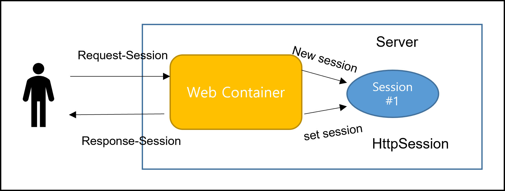

<div id="page">

<div id="main" class="aui-page-panel">

<div id="main-header">

<div id="breadcrumb-section">

1.  [Programming](README.md)
2.  [Programming](Programming_98307.md)
3.  [Spring](Spring_120848385.md)
4.  [Spring Boot](Spring-Boot_223477765.md)

</div>

# <span id="title-text"> Programming : Spring Boot Session </span>

</div>

<div id="content" class="view">

<div class="page-metadata">

Created by <span class="author"> Dongwook Han</span> on 5월 01, 2023

</div>

<div id="main-content" class="wiki-content group">

# Session 정의

- `세션 관리는 웹 기반 애플리케이션 또는 서비스에 대한 단일 사용자 또는 엔티티의 여러 요청을 안전하게 처리하는 프로세스입니다. `

- `HTTP는 웹사이트와 브라우저 간의 통신에 사용되며 세션은 동일한 사용자가 생성한 일련의 HTTP 요청 및 트랜잭션입니다. `

- `세션 관리 구현은 사용자와 웹 애플리케이션 간에 세션 ID를 공유하고 지속적으로 교환하는 프로세스를 지정합니다.`

- `HTTP 프로토콜은 Stateless 라 접속한 사용자를 추적하기 위해 세션 관리 필요 `

- `세션 관리는 특정 사용자의 세션 데이터를 저장`

- 세션을 다루는 방법

  1.  `쿠키 : 웹 사이트에서 전송되고 사용자가 탐색할 때 사용자의 컴퓨터에 사용자의 웹 브라우저에 의해 저장되는 데이터입니다.`

  2.  숨겨진 form field : `숨겨진 데이터로 사용자에게 표시되지 않으며 수정할 수 없습니다. 그러나 사용자가 양식을 제출하면 숨겨진 데이터가 전송됩니다.`

  3.  `URL Rewriting : URL 매개변수를 수정하는 방법입니다.`

  4.  `HttpSession : 데이터를 개별 방문자와 연결할 수 있습니다.`

- `사용자 세션 관리는 대부분의 웹 애플리케이션에서 매우 중요합니다. 주로 클러스터 환경에서 사용자 세션 데이터를 서버 노드 앞에 로드 밸런서로 유지하여 그에 따라 트래픽을 분산시켜 왔습니다. 따라서 프로덕션에서와 같이 세션 환경을 관리하는 것이 매우 중요합니다. 분산 환경에서는 아래와 같은 방식으로 세션을 관리할 수 있습니다.`

  - Sticky Session : `이 유형의 세션에서 로드 밸런서는 항상 동일한 클라이언트 요청을 동일한 노드로 라우팅합니다. 그러나 여기서 해당 노드가 다운되면 세션도 사라집니다.`

  - Session Replication : `고정 세션 문제를 극복하기 위해 세션 복제는 세션 데이터를 여러 서버에 복제합니다. 따라서 노드가 다운되는 경우 세션 데이터는 항상 다른 노드에서 사용할 수 있습니다.`

  - Session Data in a Persistent DataStore : `이 경우 세션은 서버 메모리에 저장되지 않고 대신 SESSION_ID라는 고유 ID로 데이터베이스(RDBMS, Redis, HazelCast, MongoDB 등)에 저장됩니다.`

# Spring Session

- `다음 모듈은 Spring 세션에 포함됩니다.`

  1.  Spring Session Core

      - Spring Session Core Apis

  2.  Spring Session Data Redis

      - `Redis 데이터베이스 세션 관리를 위한 세션 저장소 제공`

  3.  Spring Session JDBC

      - `MYSQL 등의 세션 관리와 같은 관계형 데이터베이스를 위한 세션 저장소 제공`

  4.  Spring Session Hazelcast

      - `Hazelcast 세션 관리를 위한 세션 저장소를 제공합니다.`

- `기본적으로 Apache Tomcat은 HTTP 세션 관리를 위해 개체를 메모리에 저장합니다. 또한 Spring Boot 세션 관리를 위해 HTTPSession은 Spring Session JDBC를 사용하여 영구 저장소(Mysql)에 세션 정보를 저장하는 데 사용됩니다.`

- `이 튜토리얼에서는 JDBC 세션을 사용하여 Spring Boot 세션 관리를 사용하는 방법을 볼 것입니다.`

<span class="confluence-embedded-file-wrapper image-center-wrapper"></span>

## Spring Session With Redis

### 예제

- gradle 선언

  <div class="code panel pdl" style="border-width: 1px;">

  <div class="codeContent panelContent pdl">

  ``` syntaxhighlighter-pre
  dependencies {
      implementation 'org.springframework.boot:spring-boot-starter-data-redis'
      implementation 'org.springframework.boot:spring-boot-starter-thymeleaf'
      implementation 'org.springframework.boot:spring-boot-starter-web'
      implementation 'org.springframework.session:spring-session-data-redis'
      testImplementation 'org.springframework.boot:spring-boot-starter-test'
  }
  ```

  </div>

  </div>

- application.yml 정의

  <div class="code panel pdl" style="border-width: 1px;">

  <div class="codeContent panelContent pdl">

  ``` syntaxhighlighter-pre
  spring:
    session:
      store-type: redis
    redis:
      host: localhost
      port: 6379
  ```

  </div>

  </div>

  - spring.session.store-type : redis 로 정의

- Controller

  <div class="code panel pdl" style="border-width: 1px;">

  <div class="codeContent panelContent pdl">

  ``` syntaxhighlighter-pre
  @Controller
  public class SpringBootSessionController {
      @PostMapping("/addNote")
      public String addNote(@RequestParam("note") String note, HttpServletRequest request) {
  //        session 정보 가져오기
          List<String> notes = (List<String>) request.getSession().getAttribute("NOTES_SESSION");

  //        session 정보가 없으면 session 정보 저장
          if(notes == null) {
              notes = new ArrayList<>();
              request.getSession().setAttribute("NOTES_SESSION", notes);
          }

          notes.add(note);
          request.getSession().setAttribute("NOTES_SESSION", notes);
          return "redirect:/home";
      }

      @GetMapping("/home")
      public String home(Model model, HttpSession session) {
          List<String> notes = (List<String>)session.getAttribute("NOTES_SESSION");
          model.addAttribute("notesSession", notes != null ? notes:new ArrayList<>());
          return "home";
      }

      @PostMapping("/invalidate/session")
      public String destroySession(HttpServletRequest request) {
  //        세션 정보가 invalidata 하면 세션 설정 데이타베이스에서 데이터 클리어(Mysql/redis/hazelcast 등)
          request.getSession().invalidate();
          return "redirect:/home";
      }
  }
  ```

  </div>

  </div>

- html

  <div class="code panel pdl" style="border-width: 1px;">

  <div class="codeContent panelContent pdl">

  ``` syntaxhighlighter-pre
  <!DOCTYPE html>
  <html>
  <head>
      <title>Spring Boot Session Management Example</title>
      <meta http-equiv="Content-Type" content="text/html; charset=UTF-8">
  </head>
  <body>
      <div>
          <form th:action="@{/addNote}" method="post">
              <textarea name="note" cols="40" rows="2"></textarea>
              <br><input type="submit" value="Add Note" />
          </form>
      </div>
      <div>
          <form th:action="@{/invalidate/session}" method="post">
              <input type="submit" value="Destroy Session"  />
          </form>
      </div>
      <div>
          <h2>Notes</h2>
          <ul th:each="note : ${notesSession} " >
              <li th:text="${note}">note</li>
          </ul>
      </div>

  </body>
  </html>
  ```

  </div>

  </div>

### 테스트

- <a href="http://localhost:8080/home" class="external-link" rel="nofollow">http://localhost:8080/home</a> 으로 접속

- redis client 를 설치하여 테스트

  1.  Redis Desktop Manager : 상용, 트라이얼 버전 14일 사용 가능

  2.  Command Line Interface (CLI) 사용

      - Redis 서버 설치 경로에서 redis-cli.exe 실행

      - “monitor” 명령 실행하면 이후 발생하는 이벤트 모니터링 가능

      - 보기가 힘듬

        <div class="code panel pdl" style="border-width: 1px;">

        <div class="codeContent panelContent pdl">

        ``` syntaxhighlighter-pre
        1682918087.956221 [0 127.0.0.1:2454] "HMSET" "spring:session:sessions:c11e0b73-45b7-4338-afb2-6190772e8eb9" "lastAccessedTime" "\xac\xed\x00\x05sr\x00\x0ejava.lang.Long;\x8b\xe4\x90\xcc\x8f#\xdf\x02\x00\x01J\x00\x05valuexr\x00\x10java.lang.Number\x86\xac\x95\x1d\x0b\x94\xe0\x8b\x02\x00\x00xp\x00\x00\x01\x87\xd5\xbc\x1d\x10" "sessionAttr:NOTES_SESSION" "\xac\xed\x00\x05sr\x00\x13java.util.ArrayListx\x81\xd2\x1d\x99\xc7a\x9d\x03\x00\x01I\x00\x04sizexp\x00\x00\x00\x03w\x04\x00\x00\x00\x03t\x00\x05note1t\x00\x05note2t\x00\x05note3x"
        ```

        </div>

        </div>

      - 기타 : redis 서버 메모리 설정 : “redis-server.exe -maxheap 1024M”

  3.  RDB Tool : GUI tool, 상용

## Spring Session With DB

### 예제

- gradle 선언

  <div class="code panel pdl" style="border-width: 1px;">

  <div class="codeContent panelContent pdl">

  ``` syntaxhighlighter-pre
  dependencies {
      implementation 'org.springframework.boot:spring-boot-starter-web'
  //    spring sesion 추가
      implementation 'org.springframework.boot:spring-boot-starter-jdbc' // jdbc-api
      implementation 'org.springframework.boot:spring-boot-starter-thymeleaf'
      implementation 'org.springframework.session:spring-session-jdbc'
      developmentOnly 'org.springframework.boot:spring-boot-devtools'
      runtimeOnly 'com.mysql:mysql-connector-j'
      testImplementation 'org.springframework.boot:spring-boot-starter-test'
  }
  ```

  </div>

  </div>

- application.yml 정의

  <div class="code panel pdl" style="border-width: 1px;">

  <div class="codeContent panelContent pdl">

  ``` syntaxhighlighter-pre
  spring:
    datasource:
      driver-class-name: com.mysql.cj.jdbc.Driver
      url: jdbc:mysql://localhost:3306/testdb?createDatabaseIfNotExist=true&userSSL=false
      username: root
      password: 923149Han!

    session:
      store-type: jdbc
      jdbc:
        initialize-schema: always
      timeout: 600
    h2:
      console:
        enabled: true
  ```

  </div>

  </div>

  - spring.session.store-type : jdbc

  - spring.session.jdbc.initialize-shema

- Controller : redis와 동일

- html : redis와 동일

## Spring Session With Hazelcast

### Hazelcast

- `Hazelcast는 자주 사용되는 데이터에 대한 메모리 내 액세스를 통해 그리고 탄력적으로 확장 가능한 데이터 그리드를 통해 애플리케이션의 예측 가능한 중앙 확장을 제공합니다. 이러한 기술은 데이터베이스의 쿼리 부하를 줄이고 속도를 향상시킵니다.`

</div>

<div class="pageSection group">

<div class="pageSectionHeader">

## Attachments:

</div>

<div class="greybox" align="left">

 [spring_session_01.png](attachments/393248769/393445381.png) (image/png)\

</div>

</div>

</div>

</div>

<div id="footer" role="contentinfo">

<div class="section footer-body">

Document generated by Confluence on 4월 05, 2026 17:57


</div>

</div>

</div>
