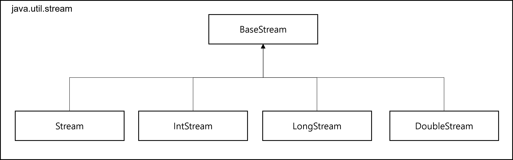

<div id="page">

<div id="main" class="aui-page-panel">

<div id="main-header">

<div id="breadcrumb-section">

1.  [Programming](index.html)
2.  [Programming](Programming_98307.html)
3.  [Java](Java_25001989.html)
4.  [Java Basic](Java-Basic_399278081.html)

</div>

# <span id="title-text"> Programming : Stream </span>

</div>

<div id="content" class="view">

<div class="page-metadata">

Created by <span class="author"> Dongwook Han</span>, last modified on 12월 22, 2023

</div>

<div id="main-content" class="wiki-content group">

<div class="aui-dialog2 aui-layer" style="top: 160.0px;right: 20.0px;display: block;left: 200.0px;overflow: hidden;visibility: hidden;z-index: 1;">

<div style="width: 260.0px;float: right;text-align: left;overflow: hidden;visibility: visible;">

<div id="ap-com.binguo.confluence.headingfree.easy-heading-free__easy-heading-dynamic5382168157317676346" class="ap-container">

<div id="embedded-com.binguo.confluence.headingfree.easy-heading-free__easy-heading-dynamic5382168157317676346" class="ap-content">

</div>

</div>

</div>

</div>

# 개요

- Collection에서도 DB와 같이 질의(query)를 통해 원하는 내용을 표현하는 것을 요구

- 개념적으로는 Collection도 테이블과 유사

- 선언형(질의)로 Collection Data 처리

- Stream 사용 형식 : 원하는 filter, group 등을 나열

  <div class="code panel pdl" style="border-width: 1px;">

  <div class="codeContent panelContent pdl">

  ``` syntaxhighlighter-pre
  List<String> lowCaloricDishesName = 
      menu.stream()
          .filter(d -> d.getCalories() < 400)
          .sorted(comparing(Dish::getCalories))
          .map(Dish::getName)
          .collect(toList());
  ```

  </div>

  </div>

  - 선언형 코드와 동작 파라미터화를 활용하여 처리 (선언형 코드 - filter, sorted)

  - filter → sorted → map → collect로 이루어지는 데이터 처리 파이프라인

  - filter 같은 연산은 high-level building block으로 이루어져 있다고 함(고수준 빌딩 블럭이란 : 데이터 처리 과정을 병렬화하면서 thread와 lock을 걱정할 필요 없음)

- 예) Stream을 사용하지 않은 Java Code

  <div class="code panel pdl" style="border-width: 1px;">

  <div class="codeContent panelContent pdl">

  ``` syntaxhighlighter-pre
  List<Dish> lowCaloricDishes = new ArrayList<>();

  for(Dish dish : menu) {
      if(dish.getCalories() < 400) {
          logCaloricDishes.add(dish);
      }
  }

  Collections.sort(lowCaloricDishes, new Comparator<Dish>() {
      public int compare(Dish dish1, Dish dish2) {
          return Integer.compare(dish1.getCalories(), dish2.getCalories());
      }
  });

  List<String> lowCaloricDishesName = new ArrayList<>();
  for(Dish dish: lowCaloricDishes){
    lowCaloricDishesName.add(dish.getName());
  }
  ```

  </div>

  </div>

- 참고 (Collection을 제어하는 Open Source)

  - Guava는 Multimp, Multiset 등 Collection을 제어하는 컨테이너 클래스 제공

  - Apache Common Collections

  - lambdaj 선언형으로 Collection을 제어하는 다양한 Utility 제공

- Stream API 특징

  - 선언형 : 간결하고 가독성 좋음

  - 조립할 수 있음 : 유연성이 좋아짐

  - 병렬화 : 성능 향상

# Stream 정의

- 자바8부터 추가된 **Collection의 저장 요소를 하나씩 참조하여 람다식(functional-style) 로 처리할 수 있도록 해주는 반복자**

- 데이터 처리 연산을 지원하도록 Source 에서 추출된 연속된 요소(sequence of elements) 를 filter, map, reduce 등 연산을 지원하도록 Collection 등에서 추출된 요소(Modern Java in Action)

- **자바7 이전**까지는 **iterator 등을 사용하여 Collection에서 요소들 순차적으로 처리**

  <div class="code panel pdl" style="border-width: 1px;">

  <div class="codeContent panelContent pdl">

  ``` syntaxhighlighter-pre
  List<String> list = Arrays.asList("홍길동","김자바","바야자");
  Iterator<String> iterator = list.iterator();
  while(iterator.hasNext()) {
    String name = iterator.next();
    System.out.println(name);
  }
  ```

  </div>

  </div>

- stream 예제

  <div class="code panel pdl" style="border-width: 1px;">

  <div class="codeContent panelContent pdl">

  ``` syntaxhighlighter-pre
  List<String> list = Arrays.asList("홍길동","김자바","바야자");
  Stream<String> stream = list.stream();
  stream.forEach(name -> System.out.println(name));
  ```

  </div>

  </div>

# Stream 특징

- 람다식으로 요소 처리 코드 제공

- **<u>내부 반복자를 사용하므로 병렬 처리가 쉬움</u>**

  - iterator 처럼 hasNext() 로 반복여부체크하고, next()로 값 가져오는 방식처럼 반복자 정의 안 해도 됨

- 중간처리와 최종 처리 작업을 수행

- pipeling

## 람다식으로 요소 처리 코드 제공

- **<u>함수적 인터페이스 매개 타입</u>**을 가진 **<u>요소 처리 메소드</u>** → 람다식 또는 메소드 참조를 이용하여 요소 처리 내용을 매개값으로 전달 =\> 메소드의 매개변수로 각 요소가 처리되는 형식을 전달 가능

  - s → { Strig name = s.getName(); int score = s.getScore(); System.out.println(name + “-” + score);} 와 같이 요소가 처리되는 형식을 메소드 매개변수로 전달

- 예 : forEach() : Consumer 함수적 인터페이스 타입의 매개값 가짐 → 매개변수로 람다식으로 정의된 요소 처리 코드를 가질 수 있음

  <div class="code panel pdl" style="border-width: 1px;">

  <div class="codeContent panelContent pdl">

  ``` syntaxhighlighter-pre
  void forEach(Consumer<T> action)
  ```

  </div>

  </div>

- 람다식 처리 예제

  <div class="code panel pdl" style="border-width: 1px;">

  <div class="codeContent panelContent pdl">

  ``` syntaxhighlighter-pre
  public class LambdaExpressionExample {
    public static void main(String[] args){
      List<Student> list = Arrays.asList(
        new Student("홍길동", 90),
        new Student("김자바", 88),
        new Student("바야바", 94)
      );
      
      Stream<Student> stream = list.stream();
      // 람다식 표현, stream.forEach() 가 Consumer 함수적 인터페이스 유형
      stream.forEach( s -> {
        String name = s.getName();
        int score = s.getScore();
        System.out.println(name + "-" + score);
      });
    }
  }

  public class Student{
    private String name;
    private int score;
    
    public Student(String name, int score) {
      this.name = name;
      this.score = score;
    }
    
    public String getName() {
      return name;
    }
    
    public int getScore(){
      return score;
    }
  }
  ```

  </div>

  </div>

## 내부 반복자 사용으로 병렬 처리 쉬움

- **외부 반복자** : 개발자가 직접 Collection의 요소를 가져오는 코드(ex: collection을 iterator로 정의하고 i.hasNext()로 반복여부 체크하면서 하나씩 가져오는 형식) - for, while 등 사용

- **내부 반복자** : Collection 내부에서 요소 들 반복 → **stream은 내부 반복자**

- 일반적으로 collection에서 요소를 가져올 때, 요소를 반복해서 가져오는 코드와 요소를 처리하는 코드로 이루어짐

  - 요소를 반복해서 가져오는 코드를 개발자를 코딩을 하면 외부 반복자(for, while 등)

  - 요소를 반복하는 것을 collection에서 처리하는 것을 내부 반복자라함

- 내부 반복자를 사용하면 개발자는 **<u>요소를 처리하는 로직만 코딩</u>** 함

- stream에서 **요소의 병렬 처리가 collection 내부에서 처리**됨

- 예제

  <div class="code panel pdl" style="border-width: 1px;">

  <div class="codeContent panelContent pdl">

  ``` syntaxhighlighter-pre
  public class ParallelExample {
    public static void main(String[] args) {
      List<String> list = Arrays.asList("홍길동", "임꺽정", "이순신",
      "정약용", "강감찬");
      
      // 순차 처리 list.stream() 선언
      Stream<String> stream = list.stream();
      stream.forEach(ParallelExample::print);
      System.out.println();  // Thread main만 출력
      
      // 병렬처리 list.parallelStream() 선언
      Stream<String> parallelStream = list.parallelStream(); // parallelStream() 메소드 정의
      parallelStream.forEach(ParallelExample::print);  // 내부 반복. 반복 thread 출력
    }
    
    public static void print(String str) {
      System.out.println(str + " : " + Thread.currentThread().getName());
    }
  }
  ```

  </div>

  </div>

## 스트림은 중간 처리와 최종 처리 가능

- Collection의 요소 들에 대해 중간 처리와 최종 처리 가능

- 중간 처리 : **mapping, filtering, sort** 수행

- 최종처리 : **반복, 카운팅, 평균, 총합 등 집계 처리** 수행

- 예제

  <div class="code panel pdl" style="border-width: 1px;">

  <div class="codeContent panelContent pdl">

  ``` syntaxhighlighter-pre
  public class MapAndReduceExample {
    public static void main(String[] args) {
      List<Student> list = Arrays.asList(
          new Student("홍길동", 10),
          new Student("임꺽정", 20),
          new Student("이순신", 30),
          new Student("정약용", 40),
          new Student("강감찬", 50)
          );
      
      double avg = studentList.stream()
      // 중간처리(학생 객체를 점수로 매핑)
      .mapToInt(Student::getScore)
      // 최종처리
      .average()
      .getAsDouble();
      
      System.out.println("평균 점수 : " + avg);
    }
  }
  ```

  </div>

  </div>

# Stream 과 Collection

- Collection, Stream 모두 연속된 요소 형식의 값을 저장하는 자료 구조의 인터페이스 제공 → 연속된의 의미를 순차적으로 값에 접근한다는 의미

- 데이터를 언제 계산하느냐 : Collection와 Stream의 큰 차이

  - Collection

    - Collection은 현재 자료 구조가 포함하는 모든 값을 메모리에 저장

    - Collection의 모든 요소는 Collection에 추가하기 전에 계산되어야 함(A Collection is an in-memory data structure that holds all the values the data structure currently has -every elements in the collectino has to be computed before it can be added to the collection.

    - Collection 은 supplier-driven

    - 외부 반복(for-each, iterator)

  - Stream

    - Stream은 요청할때마다 요소를 계산하는 고정된 자료 구조

    - A conceptually fixed data structure (you can’t add or remove elements from it) whoe elements are computed on demand.

    - Stream은 한번만 탐색 가능. 다시 탐색하려면 Source로부터 Stream을 얻어 와야 함

    - 내부 반복

      - menu.stream().map(Dish::getName).collect(toList()); // 명시적으로 반복자 정의 필요 없음

      - filter(), map() 같은 반복을 숨겨주는 연산 리스트가 필요

# Stream 의 종류

- java.util.stream 패키지에 stream api

- BaseStream 인터페이스가 부모, stream 공통 메소드 정의됨

  <span class="confluence-embedded-file-wrapper image-center-wrapper"></span>

- Stream 구현 객체 얻기

  - java.util.stream.Stream interface 에서 연산 정의

  - 중간연산, 최종 연산으로 구성

  - 컬렉션에서 stream 얻기 : Stream\<T\> Collection.stream()

    <div class="code panel pdl" style="border-width: 1px;">

    <div class="codeContent panelContent pdl">

    ``` syntaxhighlighter-pre
    List<Student> list = Arrays.asList(
            new Student("홍길동", 10),
            new Student("임꺽정", 20),
            new Student("이순신", 30),
            new Student("정약용", 40),
            new Student("강감찬", 50)
            );
    Stream<Student> stream = list.stream();
    ```

    </div>

    </div>

  - Stream\<T\> Collection.paralleStream()

  - 배열에서 stream 얻기 : Stream\<T\> Arrays.stream(T\[\])

    <div class="code panel pdl" style="border-width: 1px;">

    <div class="codeContent panelContent pdl">

    ``` syntaxhighlighter-pre
    String[] strArray = {"홍길동","임꺽정", "이순신"};
    Stream<String> strStream = Arrays.stream(strArray);
    ```

    </div>

    </div>

  - Stream\<T\> Stream.of(T\[\])

  - 숫자에서 stream 얻기 : IntStream Arrays.stream(int\[\])

    <div class="code panel pdl" style="border-width: 1px;">

    <div class="codeContent panelContent pdl">

    ``` syntaxhighlighter-pre
    int[] intArray = {1, 2, 3, 4, 5};
    IntStream intStream = Arrays.stream(intArray);
    ```

    </div>

    </div>

  - IntStream IntStream.of(int\[\])

  - LongStream Arrays.stream(long\[\])

  - LongStream LongStream.of(long\[\])

  - DoubleStream Arrays.stream(double\[\])

  - DoubleStream DoubleStream.of(double\[\])

  - IntStream IntStream.range(int, int)

  - 숫자 범위(range)에서 stream 얻기 : IntStream IntStream.rangeClosed(int, int)

    <div class="code panel pdl" style="border-width: 1px;">

    <div class="codeContent panelContent pdl">

    ``` syntaxhighlighter-pre
    IntStream stream = IntStream.rangeClose(1, 100);
    ```

    </div>

    </div>

  - LongStream LongStream.range(long, long)

  - LongStream LongStream.rangeClosed(long, long)

  - Stream\<Path\> Files.find(Path, int, BiPredicate, FileVisitOption)

  - directory에서 stream 얻기 : Stream\<Path\> Files.list(Path)

    <div class="code panel pdl" style="border-width: 1px;">

    <div class="codeContent panelContent pdl">

    ``` syntaxhighlighter-pre
    Path path = Paths.get("src/main/java");
    Stream<Path> stream = Files.list(path);
    ```

    </div>

    </div>

  - 파일에서 stream 얻기 : Stream\<String\> Files.lines(Path, Charset)

    <div class="code panel pdl" style="border-width: 1px;">

    <div class="codeContent panelContent pdl">

    ``` syntaxhighlighter-pre
    Path path = Paths.get("src/main/java/stream/stream.txt");
    Stream<String> stream;
    stream = Files.lines(path, Charset.defaultCharset());
    ```

    </div>

    </div>

  - Stream\<String\> BufferedReader.lines()

    <div class="code panel pdl" style="border-width: 1px;">

    <div class="codeContent panelContent pdl">

    ``` syntaxhighlighter-pre
    Path path = Paths.get("src/main/java/stream/stream.txt");
    Stream<String> stream;
    File file = path.toFile();
    FileReader fileReader = new FileReader(file);
    BufferedReader br = new BufferedReader(fileReader);
    stream = br.lines();
    ```

    </div>

    </div>

  - DoubleStream Random.doubles(…)

  - IntStream Random.ints()

  - LongStream Random.longs()

# Stream pipeline

- 대량의 데이터를 가공해서 축소하는 것을 리덕션(Reduction) : 합계, 평균값, 카운팅, 최대값, 최소값 등

- Collection의 요소를 집계하기 좋게 중간처리가 필요(필터링, 매핑, 정렬, 그룹핑 등)

## 중간처리와 최종 처리

- stream은 중간처리와 최종 처리를 pipeline 으로 해결

- **<u>pipeline 은 여러 개의 stream이 연결되어 있는 구조</u>**

- pipeline에서 최종 처리를 제외하고는 모두 중간 처리 stream 임

- **중간 Stream이 생성될 때** 요소 들이 바로 중간 처리 되는 것이 아닌 **최종 처리가 시작되기 전까지 지연**(lazy) 됨

- 최종 처리가 시작되면 중간 스트림에서 처리되고 최종 처리까지 완료

- 예제

  <div class="code panel pdl" style="border-width: 1px;">

  <div class="codeContent panelContent pdl">

  ``` syntaxhighlighter-pre
  Stream<Member> maleFemaleStream = list.stream();
  Stream<Member> maleStream = maleFemaleStream.filter(m -> m.getSex() == Member.MALE);
  IntStream ageStream = maleStream.mapToInt(Member::getAge);
  OptionalDouble optionalDouble = ageStream.average();
  double ageAvg = optionalDouble.getAsDouble();
  ```

  </div>

  </div>

- 로컬변수 생략하고 연결 예제

  <div class="code panel pdl" style="border-width: 1px;">

  <div class="codeContent panelContent pdl">

  ``` syntaxhighlighter-pre
  double ageAvg = list.stream()
        .filter(m -> m.getSex() == Member.MALE)
        .mapToInt(Member::getAge)
        .average()
        .getAsDouble();
  ```

  </div>

  </div>

- 메소드 종류

<div class="table-wrap">

<table class="confluenceTable" data-table-width="760" data-layout="default" data-local-id="252437f9-cfd8-4076-99b6-62142b57de8c">
<tbody>
<tr>
<th class="confluenceTh"><p><strong>종류</strong></p></th>
<th class="confluenceTh"></th>
<th class="confluenceTh"><p><strong>리턴 타입</strong></p></th>
<th class="confluenceTh"><p><strong>메소드(매개변수)</strong></p></th>
<th class="confluenceTh"><p><strong>소속된 인터페이스</strong></p></th>
</tr>
&#10;<tr>
<td rowspan="16" class="confluenceTd"><p>중간처리</p></td>
<td rowspan="2" class="confluenceTd"><p>필터링</p></td>
<td rowspan="16" class="confluenceTd"><p>Stream</p>
<p>IntStream</p>
<p>LongStream</p>
<p>DoubleStream</p></td>
<td class="confluenceTd"><p>distinct()</p></td>
<td class="confluenceTd"><p>공통</p></td>
</tr>
<tr>
<td class="confluenceTd"><p>filter(…)</p></td>
<td class="confluenceTd"><p>공통</p></td>
</tr>
<tr>
<td rowspan="12" class="confluenceTd"><p>매핑</p></td>
<td class="confluenceTd"><p>flatMap(…)</p></td>
<td class="confluenceTd"><p>공통</p></td>
</tr>
<tr>
<td class="confluenceTd"><p>flatMapToDouble(…)</p></td>
<td class="confluenceTd"><p>Stream</p></td>
</tr>
<tr>
<td class="confluenceTd"><p>flatMapToInt(…)</p></td>
<td class="confluenceTd"><p>Stream</p></td>
</tr>
<tr>
<td class="confluenceTd"><p>FlatMapToLong(…)</p></td>
<td class="confluenceTd"><p>Stream</p></td>
</tr>
<tr>
<td class="confluenceTd"><p>map(…)</p></td>
<td class="confluenceTd"><p>공통</p></td>
</tr>
<tr>
<td class="confluenceTd"><p>mapToDouble(…)</p></td>
<td class="confluenceTd"><p>Stream, IntStream, LongStream</p></td>
</tr>
<tr>
<td class="confluenceTd"><p>mapToInt(…)</p></td>
<td class="confluenceTd"><p>Stream, LongStream, DoubleStream</p></td>
</tr>
<tr>
<td class="confluenceTd"><p>mapToLong(…)</p></td>
<td class="confluenceTd"><p>Stream, IntStream, DoubleStream</p></td>
</tr>
<tr>
<td class="confluenceTd"><p>mapToObj(…)</p></td>
<td class="confluenceTd"><p>IntStream, LongStream, DoubleStream</p></td>
</tr>
<tr>
<td class="confluenceTd"><p>asDoubleStream()</p></td>
<td class="confluenceTd"><p>IntStream, LongStream</p></td>
</tr>
<tr>
<td class="confluenceTd"><p>asLongStream()</p></td>
<td class="confluenceTd"><p>IntStream</p></td>
</tr>
<tr>
<td class="confluenceTd"><p>boxed()</p></td>
<td class="confluenceTd"><p>IntStream, LongStream, DoubleStream</p></td>
</tr>
<tr>
<td class="confluenceTd"><p>정렬</p></td>
<td class="confluenceTd"><p>sorted(…)</p></td>
<td class="confluenceTd"><p>공통</p></td>
</tr>
<tr>
<td class="confluenceTd"><p>Looping</p></td>
<td class="confluenceTd"><p>peek(…)</p></td>
<td class="confluenceTd"><p>공통</p></td>
</tr>
<tr>
<td rowspan="12" class="confluenceTd"><p>최종처리</p></td>
<td rowspan="3" class="confluenceTd"><p>matching</p></td>
<td class="confluenceTd"><p>boolean</p></td>
<td class="confluenceTd"><p>allMatch(…)</p></td>
<td class="confluenceTd"><p>공통</p></td>
</tr>
<tr>
<td class="confluenceTd"><p>boolean</p></td>
<td class="confluenceTd"><p>anyMatch(…)</p></td>
<td class="confluenceTd"><p>공통</p></td>
</tr>
<tr>
<td class="confluenceTd"><p>boolean</p></td>
<td class="confluenceTd"><p>noneMatch(…)</p></td>
<td class="confluenceTd"><p>공통</p></td>
</tr>
<tr>
<td rowspan="7" class="confluenceTd"><p>집계</p></td>
<td class="confluenceTd"><p>long</p></td>
<td class="confluenceTd"><p>count()</p></td>
<td class="confluenceTd"><p>공통</p></td>
</tr>
<tr>
<td class="confluenceTd"><p>OptionalXXX</p></td>
<td class="confluenceTd"><p>findFirst()</p></td>
<td class="confluenceTd"><p>공통</p></td>
</tr>
<tr>
<td class="confluenceTd"><p>OptionalXXX</p></td>
<td class="confluenceTd"><p>max(…)</p></td>
<td class="confluenceTd"><p>공통</p></td>
</tr>
<tr>
<td class="confluenceTd"><p>OptionalXXX</p></td>
<td class="confluenceTd"><p>min(…)</p></td>
<td class="confluenceTd"><p>공통</p></td>
</tr>
<tr>
<td class="confluenceTd"><p>OptionalDouble</p></td>
<td class="confluenceTd"><p>average()</p></td>
<td class="confluenceTd"><p>IntStream, LongStream, DoubleStream</p></td>
</tr>
<tr>
<td class="confluenceTd"><p>OptionalXXX</p></td>
<td class="confluenceTd"><p>reduce(…)</p></td>
<td class="confluenceTd"><p>공통</p></td>
</tr>
<tr>
<td class="confluenceTd"><p>int, long, double</p></td>
<td class="confluenceTd"><p>sum()</p></td>
<td class="confluenceTd"><p>IntStream, LongStream, DoubleStream</p></td>
</tr>
<tr>
<td class="confluenceTd"><p>Looping</p></td>
<td class="confluenceTd"><p>void</p></td>
<td class="confluenceTd"><p>forEach(…)</p></td>
<td class="confluenceTd"><p>공통</p></td>
</tr>
<tr>
<td class="confluenceTd"><p>수집</p></td>
<td class="confluenceTd"><p>R</p></td>
<td class="confluenceTd"><p>collect(…)</p></td>
<td class="confluenceTd"><p>공통</p></td>
</tr>
</tbody>
</table>

</div>

- 메소드의 리턴 타입이 Stream이면 중간처리 메소드, 기본 타입이거나 OpotionalXXX이면 최종 처리

- 소속된 인터페이스 공통의 의미는 Stream, IntStream, LongStream, DoubleStream 에서 모두 제공

## 필터링

- distinct(), filter() : 요소를 걸러내는 역할

<div class="table-wrap">

<table class="confluenceTable" data-table-width="760" data-layout="default" data-local-id="5b184939-658d-4f54-b81f-6f9c353a38c7">
<tbody>
<tr>
<th class="confluenceTh"><p><strong>리턴 타입</strong></p></th>
<th class="confluenceTh"><p><strong>메소드(매개 변수)</strong></p></th>
<th class="confluenceTh"><p><strong>설명</strong></p></th>
</tr>
&#10;<tr>
<td rowspan="5" class="confluenceTd"><p>Stream</p>
<p>IntStream</p>
<p>LongStream</p>
<p>DoubleStream</p></td>
<td class="confluenceTd"><p>distinct()</p></td>
<td class="confluenceTd"><p>중복 제거</p></td>
</tr>
<tr>
<td class="confluenceTd"><p>filter(Predicate)</p></td>
<td rowspan="4" class="confluenceTd"><p>조건 필터링</p></td>
</tr>
<tr>
<td class="confluenceTd"><p>filter(IntPredicate)</p></td>
</tr>
<tr>
<td class="confluenceTd"><p>filter(LonngPredicate)</p></td>
</tr>
<tr>
<td class="confluenceTd"><p>filter(DoublePredicate)</p></td>
</tr>
</tbody>
</table>

</div>

- filter 는 Predicate 매개변수가 true를 리턴하는 요소만 필터링

- 예제

  <div class="code panel pdl" style="border-width: 1px;">

  <div class="codeContent panelContent pdl">

  ``` syntaxhighlighter-pre
  public class FilteringExample {
    public static void main(String[] args) {
      List<String> names = Arrays.asList("홍길동","임꺽정","춘향이","심청이","향단이","임꺽정");
      
      names.stream()
        .distinct()                // 중복 제거 
        .forEach(n -> System.out.println(n));
      System.out.println();
      
      names.stream()
        .filter(n -> n.startsWith("심"))   // 이름이 "심" 으로 시작되는 요소 필터링
        .forEach(n -> System.out.println(n)); 
      System.out.println();
      
      names.stream()
        .distinct()             // 중복 제거 후 필터링 
        .filter(n -> n.startWith("심"))
        .forEach(n -> System.out.println(n));
    }
  }
  ```

  </div>

  </div>

## Mapping

- 스트림의 요소를 다른 요소로 대체

- flatMapXXX(), mapXXX(), asXXXStream(), boxed() , XXX 는 Int, Double, Long 등

### flatMapXXX() 메소드

- 요소를 대체하는 복수 개의 요소들로 구성된 새로운 스트림 리턴

<div class="table-wrap">

|  |  |  |
|----|----|----|
| **리턴 타입** | **메소드(매개변수)** | **요소-\> 대체 요소** |
| Stream\<R\> | flatMap(Function\<T, Stream\<R\>\>) | T-\>Stream\<R\> |
| DoubleStream | flatMap(DoubleFunction\<DoubleStream\>) | double -\>DoubleStream |
| IntStream | flatMap(IntFunction\<IntStream\>) | int → IntStream |
| LongStream | flatMap(LongFunction\<LongStream\>) | long → LongStream |
| DoubleStream | flatMapToDouble(Function\<T, DoubleStream\>) | T → DoubleStream |
| IntStream | flatMapToInt(Function\<T, IntStream\>) | T → IntStream |
| LongStream | flatMapToLong(Function\<T, LongStream\>) | T → LongStream |

</div>

- 예제

  <div class="code panel pdl" style="border-width: 1px;">

  <div class="codeContent panelContent pdl">

  ``` syntaxhighlighter-pre
  public class FlatMapExample {
    public static void main(String[] args) {
      List<String> inputList1 = Arrays.asList("java8 lambda", "stream mapping");
      inputList1.stream()
        .flatMap(data -> Arrays.stream(data.split(" ")))  // 공백으로 word를 나눠서 대체 
        .forEach(word -> System.out.println(word)); // java8 lambda stream mapping 네 요소로 출력
      System.out.println();
      
      List<String> inputList2 = Arrays.asList("10, 20, 30","40, 50, 60");
      inputList2.stream()
        .flatMapToInt(data -> {    // "," 로 분리한 요소들을 int 배열로 대체 
          String[] strArr = data.split(",");
          int[] intArr = new int[strArr.length];
          for(int i = 0; i < strArr.length; i++) {
            intArr[i] = Integer.parseInt(strArr[i].trim());
          }
          return Arrays.stream(intArr);
        })
        .forEach(number -> System.out.println(number));
    }
  }
  ```

  </div>

  </div>

### mapXXX() 메소드

- 요소를 대체하는 요소로 구성된 새로운 스트림 리턴(단수개의 )

<div class="table-wrap">

|               |                                     |                       |
|---------------|-------------------------------------|-----------------------|
| **리턴 타입** | **메소드(매개변수)**                | **요소-\> 대체 요소** |
| Stream\<R\>   | map(Function\<T,R)                  | T-\>R                 |
| DoubleStream  | mapToDouble\*ToDoubleFunction\<T\>) | T → double            |
| IntStream     | mapToInt(ToIntFunction\<T\>)        | T → int               |
| LongStream    | mapToLong(ToLongFunction\<T\>)      | T → long              |
| DoubleStream  | map(DoubleUnaryOperator)            | double → double       |
| IntStream     | mapToInt(DoubleToIntFunction)       | double → int          |
| LongStream    | mapToLong(DoubleToLongFunction)     | double → long         |
| Stream\<U\>   | mapToObj(DoubleFunction\<U\>)       | double → U            |
| IntStream     | map(IntUnaryOperator)               | int → int             |
| DoubleStream  | mapToDouble(IntToDoubleFunction)    | int → double          |
| LongStream    | mapToLong(IntToLongFunction)        | int → long            |
| Stream\<U\>   | mapToObj(IntFunction\<U\>)          | int → U               |
| LongStream    | map(LongUnaryOperator)              | long → long           |
| DoubleStream  | mapToDouble(LongToDoubleFunction)   | long → double         |
| IntStream     | mapToInt(LongFunction)              | long → int            |
| Stream\<U\>   | mapToObj(LongFunction\<U\>)         | long → U              |

</div>

- 예제

  <div class="code panel pdl" style="border-width: 1px;">

  <div class="codeContent panelContent pdl">

  ``` syntaxhighlighter-pre
  public class MapExample {
    public static void main(String[] args) {
      List<Student> studentList = Arrays.asList(
        new Student("홍길동", 10),
        new Student("심춘향", 20),
        new Student("이향단", 30)
      );
      
      studentList.stream()
        .mapToInt(Student::getScore)
        .forExch(score -> System.out.println(score));
    }
  }

  public class Student {
    private String name;
    private int score;
    
    public Student(String name, int score) {
      this.name =name;
      this.score = score;
    }
    
    public String getName(){return name;}
    public int getScore(){return score;}
  }
  ```

  </div>

  </div>

### asDoubleStream(), asLongStream(), boxed()

- IntStream 이나 LongStream의 요소를 double element로 타입변환하여 DoubleStream 생성 : asDoubleStream()

- IntStream 이나 DoubleStream의 요소를 long element로 타입변환하여 LongStream 생성 : asLongStream()

- int, long, double 요소를 Integer, Long, Double 요소로 boxing 하여 stream 생성 : boxed()

- 예제

  <div class="code panel pdl" style="border-width: 1px;">

  <div class="codeContent panelContent pdl">

  ``` syntaxhighlighter-pre
  public class AsDoubleStreamAndBoxedExample {
    public static void main(String[] args) {
      int[] intArray = {1, 2, 3, 4, 5};
      
      IntStream intStream = Arrays.stream(intArray);
      // asDoubleStream() 예제
      intStream
         .asDoubleStream()
         .forEach(d -> System.out.println(d));
         
      System.out.println();
      
      intStream = Arrays.stream(intArray);
      // boxed 예제
      intStream
         .boxed()
         .forEach(obj -> System.out.println(obj.intValue()));
    }
  }
  ```

  </div>

  </div>

## 정렬(sorted)

- element라 최종 처리되기 전에 중간단계에서 요소 정렬

- Stream\<T\> sorted() : 클래그가 Comparable을 구현했을 때

- Stream\<T\> sorted(Comparator\<T\>) : element를 Comparator에 따라 정렬

- DoubleStream, IntStream, LongStream : sorted() 오름차순으로 정렬

- 예제(Comparable 클래스 선언)

  <div class="code panel pdl" style="border-width: 1px;">

  <div class="codeContent panelContent pdl">

  ``` syntaxhighlighter-pre
  public class Student implements Comparable<Student> {
    private String name;
    private int score;
    
    public Student(Stirng name, int score) {
      this.name = name;
      this.score = score;
    }
    
    public String getName() { return name;}
    public int getScore() { return score; }
    
    @Override
    public int compareTo(Student o) {
      return Integer.compare(score, o.score);
    }
  }
  ```

  </div>

  </div>

- Student가 Comparable을 구현한 상태에서 정렬

  - 기본 비교 방법으로 정렬

    <div class="code panel pdl" style="border-width: 1px;">

    <div class="codeContent panelContent pdl">

    ``` syntaxhighlighter-pre
    sorted();
    sorted( (a,b) -> a.compareTo(b));
    sorted( Comparator.naturalOrder());
    ```

    </div>

    </div>

  - 역정렬

    <div class="code panel pdl" style="border-width: 1px;">

    <div class="codeContent panelContent pdl">

    ``` syntaxhighlighter-pre
    sorted( (a,b) -> b.compareTo(a));
    sorted( Comparator.reverseOrder());
    ```

    </div>

    </div>

  - Comparable을 구현하지 않았을 때에는 Comparator를 매개값으로 갖는 sorted 메소드 사용

    <div class="code panel pdl" style="border-width: 1px;">

    <div class="codeContent panelContent pdl">

    ``` syntaxhighlighter-pre
    sorted( (a,b) -> {...})
    ```

    </div>

    </div>

- 정렬 예제

  <div class="code panel pdl" style="border-width: 1px;">

  <div class="codeContent panelContent pdl">

  ``` syntaxhighlighter-pre
  public class SortingExample {
    public static void main(String[] args) {
      IntStream intStream = Arrays.stream(new int[] {5, 3, 2, 1, 4});
      // 숫자 정렬
      intStream
        .sorted()
        .forEach(n -> System.out.print(n + ","));
      System.out.println();
      
      // 객체 정렬
      List<Student> studentList = Arrays.asList(
        new Student("홍길동", 30),
        new Student("임꺽정", 20),
        new Student("고길동", 10)
      );
      
      studentList.stream()
        .sorted()
        .forEach(s -> System.out.print(s.getScore() + ","));
      System.out.println();
      
      // 내림차순 정렬
      studentList.stream()
        .sorted( Comparator.reverseOrder())
        .forEach( s -> System.out.print(s.getScore() + ","));
    }
  }
  ```

  </div>

  </div>

## Looping (peek(), forEach())

- 요소 전체를 반복

- peek() : 중간처리 메소드, 최종처리 메소드가 호출되기 전까지는 지연됨

- forEach() : 최종처리메소드

- 예제

## Matching

- element가 특정 조건에 만족하는지 조사

- allMatch : 모든 element가 매개값으로 주어진 Predicate의 조건에 맞는지 조사

- anymatch() : 최소한 한 개의 요소가 predicate의 조건에 맞는지 조사

- nonMatch() : 모든 요소가 predicate 조건에 만족하지 않는지 조사

- 메소드

<div class="table-wrap">

<table class="confluenceTable" data-table-width="760" data-layout="default" data-local-id="584ffe7c-8087-408a-9646-c7fdff294676">
<tbody>
<tr>
<th class="confluenceTh"><p><strong>리턴타입</strong></p></th>
<th class="confluenceTh"><p><strong>메소드</strong></p></th>
<th class="confluenceTh"><p><strong>인터페이스</strong></p></th>
</tr>
&#10;<tr>
<td class="confluenceTd"><p>boolean</p></td>
<td class="confluenceTd"><p>allMatch(Predicate&lt;T&gt; predicate</p>
<p>anyMatch(Predicate&lt;T&gt; predicate)</p>
<p>nonMatch(Predicate&lt;T&gt; predicate)</p></td>
<td class="confluenceTd"><p>Stream</p></td>
</tr>
<tr>
<td class="confluenceTd"><p>boolean</p></td>
<td class="confluenceTd"><p>allMatch(IntPredicate predicate</p>
<p>anyMatch(IntPredicate predicate)</p>
<p>nonMatch(IntPredicate predicate)</p></td>
<td class="confluenceTd"><p>IntStream</p></td>
</tr>
<tr>
<td class="confluenceTd"><p>boolean</p></td>
<td class="confluenceTd"><p>allMatch(LongPredicate predicate</p>
<p>anyMatch(LongPredicate predicate)</p>
<p>nonMatch(LongPredicate predicate)</p></td>
<td class="confluenceTd"><p>LongStream</p></td>
</tr>
<tr>
<td class="confluenceTd"><p>boolean</p></td>
<td class="confluenceTd"><p>allMatch(DoublePredicate predicate</p>
<p>anyMatch(DoublePredicate predicate)</p>
<p>nonMatch(DoublePredicate predicate)</p></td>
<td class="confluenceTd"><p>DoubleStream</p></td>
</tr>
</tbody>
</table>

</div>

- 예제

  <div class="code panel pdl" style="border-width: 1px;">

  <div class="codeContent panelContent pdl">

  ``` syntaxhighlighter-pre
  public class MatchExample {
    public static void main(String[] args) {
      int[] intArr = {2, 4, 6};
      
      boolean result = Arrays.stream(intArr)
        .allMatch( a -> a%2 == 0);
      System.out.println("모두 2의 배수인가? " + result);
      
      result = Arrays.stream(intArr)
        .anyMatch( a -> a%3 == 0);
      System.out.println("하나라도 3의 배수가 있는가? " + result);
      
      result = Arrays.stream(intArr)
        .noneMatch( a -> a%3 == 0);
      System.out.println("3의 배수가 없는가? " + result);
    }
  }
  ```

  </div>

  </div>

## 기본 집계

- 최종 처리 기능

- element를 처리해서 카운팅, 합계, 평균값, 최대값, 최소값 등과 같이 하나의 값을 산출

- 대량의 데이터를 가공해서 축소하는 Reduction

### 기본 집계메소드

<div class="table-wrap">

<table class="confluenceTable" data-table-width="760" data-layout="default" data-local-id="80a332f6-1e70-4e1b-8885-9082723db089">
<colgroup>
<col style="width: 33%" />
<col style="width: 33%" />
<col style="width: 33%" />
</colgroup>
<tbody>
<tr>
<th class="confluenceTh"><p><strong>리턴 타입</strong></p></th>
<th class="confluenceTh"><p><strong>메소드</strong></p></th>
<th class="confluenceTh"><p><strong>설명</strong></p></th>
</tr>
&#10;<tr>
<td class="confluenceTd"><p>long</p></td>
<td class="confluenceTd"><p>count()</p></td>
<td class="confluenceTd"><p>요소 개수</p></td>
</tr>
<tr>
<td class="confluenceTd"><p>OptionalXXX</p></td>
<td class="confluenceTd"><p>findFirst()</p></td>
<td class="confluenceTd"><p>첫번째 요소</p></td>
</tr>
<tr>
<td class="confluenceTd"><p>Optioinal&lt;T&gt;</p>
<p>OptionalXXX</p></td>
<td class="confluenceTd"><p>max(Comparator&lt;T&gt;)</p>
<p>max()</p></td>
<td class="confluenceTd"><p>최대 요소</p></td>
</tr>
<tr>
<td class="confluenceTd"><p>Optional&lt;T&gt;</p>
<p>OptionalXXX</p></td>
<td class="confluenceTd"><p>min(Comparator&lt;T&gt;)</p>
<p>min()</p></td>
<td class="confluenceTd"><p>최소 요소</p></td>
</tr>
<tr>
<td class="confluenceTd"><p>OptionalDouble</p></td>
<td class="confluenceTd"><p>average()</p></td>
<td class="confluenceTd"><p>요소 평균</p></td>
</tr>
<tr>
<td class="confluenceTd"><p>int, long, double</p></td>
<td class="confluenceTd"><p>sum()</p></td>
<td class="confluenceTd"><p>요소 총합</p></td>
</tr>
</tbody>
</table>

</div>

- 집계 예제

  <div class="code panel pdl" style="border-width: 1px;">

  <div class="codeContent panelContent pdl">

  ``` syntaxhighlighter-pre
  public class AggretateExample {
    public static void main(String[] args) {
      long count = Arrays.stream(new int[] {1, 2, 3, 4, 5})
        .filter(n -> n%2 == 0)
        .count();
      System.out.println("2의 배수 개수: " + count);
      
      long sum = Arrays.stream(new int[] {1, 2, 3, 4, 5})
        .filter(n -> n%2 == 0)
        .sum();
      System.out.println("2의 배수의 합 : " + sum);
      
      doublg avg = Arrays.stream(new int[] {1, 2, 3, 4, 5})
        .filter(n -> n%2 == 0)
        .average()
        .getAsDouble();
      System.out.println("2의 배수의 평균 : " + avg);
      
      int max = Arrays.stream(new int[] {1, 2, 3, 4, 5})
        .filter(n -> n%2 == 0)
        .max()
        .getAsInt();
      System.out.println("최대값 : " + max);
      
      int min = Arrays.stream(new int[] {1, 2, 3, 4, 5})
        .filter(n -> n%2 == 0)
        .min()
        .getAsInt();
      System.out.println("최소값 : " + min);
      
      int first = Arrays.stream(new int[] {1, 2, 3, 4, 5})
        .filter(n -> n%3 == 0)
        .findFirst()
        .getAsInt();
      System.out.println("첫번째 3의 배수 : " + first);
    }
  }
  ```

  </div>

  </div>

### Optional 클래스

- 값 저장 및 값이 존재하지 않을 경우 디폴트 값 설정.

- 값을 처리하는 Consumer 등록

- 메소드

<div class="table-wrap">

<table class="confluenceTable" data-table-width="760" data-layout="default" data-local-id="f4098362-6e8a-4924-9bcf-04c529cb2cc5">
<colgroup>
<col style="width: 33%" />
<col style="width: 33%" />
<col style="width: 33%" />
</colgroup>
<tbody>
<tr>
<th class="confluenceTh"><p><strong>리턴타입</strong></p></th>
<th class="confluenceTh"><p><strong>메소드</strong></p></th>
<th class="confluenceTh"><p><strong>설명</strong></p></th>
</tr>
&#10;<tr>
<td class="confluenceTd"><p>boolean</p></td>
<td class="confluenceTd"><p>isPresent()</p></td>
<td class="confluenceTd"><p>값 저장되었는지 여부</p></td>
</tr>
<tr>
<td class="confluenceTd"><p>T</p>
<p>double</p>
<p>int</p>
<p>long</p></td>
<td class="confluenceTd"><p>orElse(T)</p>
<p>orElse(double)</p>
<p>orElse(int)</p>
<p>orElse(long)</p></td>
<td class="confluenceTd"><p>값이 저장되어 있지 않을 경우 디폴트 값 지정</p></td>
</tr>
<tr>
<td class="confluenceTd"><p>void</p></td>
<td class="confluenceTd"><p>ifPresent(Consumer)</p>
<p>ifPresent(DoubleConsumer)</p>
<p>ifPresent(IntConsumer)</p>
<p>ifPresent(LongConsumer)</p></td>
<td class="confluenceTd"><p>값이 저장되어 있을 경우 Consumer에서 처리</p></td>
</tr>
</tbody>
</table>

</div>

- Collection의 element가 없을 경우 처리

  - Optional 객체의 isPresent() 로 확인

    <div class="code panel pdl" style="border-width: 1px;">

    <div class="codeContent panelContent pdl">

    ``` syntaxhighlighter-pre
    OptionalDouble optinal = list.stream()
      .mapToInt(Integer::intValue)
      .average();

    if(optional.isPresent()) {  // 값 존재여부 체크
      System.out.println("평균: " + optinal.getAsDouble());
    } else {
      System.out.println("평균: 0.0" );
    }
    ```

    </div>

    </div>

  - orElse() 로 디폴트 값 지정

    <div class="code panel pdl" style="border-width: 1px;">

    <div class="codeContent panelContent pdl">

    ``` syntaxhighlighter-pre
    double avg = list.stream()
      .mapToInt(Integer::intValue)
      .average()
      .orElse(0.0);  // 디폴트값 지정
    System.out.println("평균: " + avg);
    ```

    </div>

    </div>

  - ifPresent()로 값일 있을 경우에만 값을 이용하는 람다식 실행

    <div class="code panel pdl" style="border-width: 1px;">

    <div class="codeContent panelContent pdl">

    ``` syntaxhighlighter-pre
    list.stream()
      .mapToInt(Integer::intValue)
      .average()
      .ifPresent( a -> System.out.println("평균: " + a));
    ```

    </div>

    </div>

### 커스텀 집계(reduce())

- 커스텀 집계 구현

- 다양한 집계를 할 수 있도록 reduce() 메소드 지원

- reduce(Operator), reduce(identity, Operator) 형식으로 사용

- 스트림에 element가 없을 경우에는 디폴트값 identity가 리턴

- XXXOperator에는 집계처리를 위한 람다식을 대입

- 예제

  <div class="code panel pdl" style="border-width: 1px;">

  <div class="codeContent panelContent pdl">

  ``` syntaxhighlighter-pre
  public class ReductionExample {
    public static void main(String[] args) {
      List<Student> studentList = Arrays.asList(
        new Student("홍길동", 92),
        new Student("임꺽정", 88),
        new Student("고길동", 99)
      );
      
      int sum1 = studentList.stream()
        .mapToInt(Student::getScore)
        .sum();
      
      // reduce(Operator) 에 람다식 대입
      int sum2 = studentList.stream()
        .map(Student::getScore)
        .reduce((a,b) -> a+ b)
        .get();
        
      // default 값 0, operator에 람다식 대입
      int sum3 = studentList.stream()
        .map(Student::getScore)
        .reduct(0, (a,b) -> a+ b);
      
      System.out.println("sum1 : "+ sum1);
      System.out.println("sum2 : "+ sum2);
      System.out.println("sum3 : "+ sum3);
    }
  }
  ```

  </div>

  </div>

- 인터페이스

<div class="table-wrap">

<table class="confluenceTable" data-table-width="760" data-layout="default" data-local-id="a3220cb6-cc81-40f0-a5d9-0998f2cdd33d">
<tbody>
<tr>
<th class="confluenceTh"><p><strong>인터페이스</strong></p></th>
<th class="confluenceTh"><p><strong>리턴 타입</strong></p></th>
<th class="confluenceTh"><p><strong>메소드</strong></p></th>
</tr>
&#10;<tr>
<td rowspan="2" class="confluenceTd"><p>Stream</p></td>
<td class="confluenceTd"><p>Optional&lt;T&gt;</p></td>
<td class="confluenceTd"><p>reduce(BinaryOperator&lt;T&gt; accumulator</p></td>
</tr>
<tr>
<td class="confluenceTd"><p>T</p></td>
<td class="confluenceTd"><p>reduce(T identity, BinaryOperator&lt;T&gt; accumulator)</p></td>
</tr>
<tr>
<td rowspan="2" class="confluenceTd"><p>IntStream</p></td>
<td class="confluenceTd"><p>OptionalInt</p></td>
<td class="confluenceTd"><p>reduce(IntBinaryOperator op)</p></td>
</tr>
<tr>
<td class="confluenceTd"><p>Int</p></td>
<td class="confluenceTd"><p>reduce(int identity, IntBinaryOperator op)</p></td>
</tr>
<tr>
<td rowspan="2" class="confluenceTd"><p>LongStream</p></td>
<td class="confluenceTd"><p>OptinalLong</p></td>
<td class="confluenceTd"><p>reduce(LogBinaryOperator op)</p></td>
</tr>
<tr>
<td class="confluenceTd"><p>long</p></td>
<td class="confluenceTd"><p>reduce(long identity, LongBinaryOperator op)</p></td>
</tr>
<tr>
<td rowspan="2" class="confluenceTd"><p>DoubleStream</p></td>
<td class="confluenceTd"><p>OptinalDouble</p></td>
<td class="confluenceTd"><p>reduce(DoubleBinaryOperator op)</p></td>
</tr>
<tr>
<td class="confluenceTd"><p>double</p></td>
<td class="confluenceTd"><p>reduce(double identity, DoubleBinaryOperator op)</p></td>
</tr>
</tbody>
</table>

</div>

## 수집(Collect)

- element를 필터링 또는 매핑한 후 element를 수집하는 최종 처리 메소드(collect())

- 필요한 element만 원하는 collection에 수집

- element를 그룹핑한 후 집계(reduce) 가능

### filtering한 element 수집

- R collect(Collector\<T,A,R) collector)

- collector는 어떤 element를 어떤 collection에 수집할 것인지 결정

- T는 element, A는 누적기(accumulator), R은 element가 저장될 collection

<div class="table-wrap">

<table class="confluenceTable" data-table-width="760" data-layout="default" data-local-id="3877a0bb-9322-46ec-9595-3aec04b6bf55">
<tbody>
<tr>
<th class="confluenceTh"><p><strong>리턴타입</strong></p></th>
<th class="confluenceTh"><p><strong>Collectors의 정적 메소드</strong></p></th>
<th class="confluenceTh"><p><strong>설명</strong></p></th>
</tr>
&#10;<tr>
<td class="confluenceTd"><p>Collector&lt;T, ?, List&lt;T&gt;)</p></td>
<td class="confluenceTd"><p>toList()</p></td>
<td class="confluenceTd"><p>T를 List에 저장</p></td>
</tr>
<tr>
<td class="confluenceTd"><p>Collector&lt;T, ?, Set&lt;T&gt;)</p></td>
<td class="confluenceTd"><p>toSet()</p></td>
<td class="confluenceTd"><p>T를 Set에 저장</p></td>
</tr>
<tr>
<td class="confluenceTd"><p>Collector&lt;T, ?, Collection&lt;T&gt;)</p></td>
<td class="confluenceTd"><p>toCollection(Supplier&lt;Collection&lt;T&gt;&gt;)</p></td>
<td class="confluenceTd"><p>T를 Supplier가 제공한 Collection에 저장</p></td>
</tr>
<tr>
<td class="confluenceTd"><p>Collector&lt;T, ?, Map&lt;K,U&gt;&gt;</p></td>
<td class="confluenceTd"><p>toMap(</p>
<p>Function&lt;T,K&gt; keyMapper, Function(T,U) valueMapper)</p></td>
<td class="confluenceTd"><p>T를 K와 U로 매핑해서 K를 키로 U를 value로 Map에 저장</p></td>
</tr>
<tr>
<td class="confluenceTd"><p>Collector,T,?, ConcurrentMap&lt;K,U&gt;&gt;</p></td>
<td class="confluenceTd"><p>toConcurrentMap(</p>
<p>Function&lt;T,K&gt; keyMapper,</p>
<p>Function&lt;T,U&gt; valueMapper)</p></td>
<td class="confluenceTd"><p>T를 K와 U로 매핑해서 K를 key로 U를 value로 ConcurrentMap에 저장</p></td>
</tr>
</tbody>
</table>

</div>

- 예제

  <div class="code panel pdl" style="border-width: 1px;">

  <div class="codeContent panelContent pdl">

  ``` syntaxhighlighter-pre
  Stream<Student> totalStream = totalList.stream(); // totalList를 stream 처리
  Stream<Student> maleStream = totalStream.filter(s -> s.getSex() == Student::Sex.MALE); // 남성인 학생만 stream에 저장
  Collector<Student, ?, List<Student>> collector = Collectors.toList(); // Collector 얻기
  List<Student> maleList = maleStream.collect(collector);
  ```

  </div>

  </div>

- 예제2

  <div class="code panel pdl" style="border-width: 1px;">

  <div class="codeContent panelContent pdl">

  ``` syntaxhighlighter-pre
  public class ToListExample {
    public static void main(String[] args) {
      List<Student> totalList = Arrays.asList(
        new Student("홍길동", 10, Student.Sex.MALE),
        new Student("장화홍련", 6, Student.Sex.FEMALE),
        new Student("임꺽정", 10, Student.Sex.MALE),
        new Studnet("이은주", 6, Student.Sex.FEMALE)
      );
      
      // 남학생만 List 로 collect
      List<Student> maleList = totalList.stream()
        .filter(s -> s.getSex() == Student.Sex.MALE)
        .collect(Collectors.toList());
      maleStream()
        .forEach(s -> System.out.println(s.getName()));
      
      System.out.println();
      
      // 여학생만 HashSet 생성
      List<Student> femaleSet = totalList.stream()
        filter(s -> s.getSex() == Student.Sex.FEMALE)
        .collect(Collectors.toCollection(HashSet::new));
      femaleSet.Stream()
        .forEach(s -> System.out.println(s.getName()));
    }
  }

  public class Student {
    public enum Sex {MALE, FEMALE}
    public enum City {Seoul, Pusan}
    
    private String name;
    private int score;
    private Sex sex;
    private City city;
    
    public Student(String name, int score, Sex sex) {
      this.name = name;
      this.score = score;
      this.sex = sex;
    }
    
    public Student(String name, int socre, Sex sex, City city) {
      this.name = name;
      this.score = score;
      this.sex = sex;
      this.city = city;
    }
    
    public String getName() {return name;}
    public int getScore() { return score;}
    public Sex getSex() {return sex;}
    public City getCity() {return city;}
  }
  ```

  </div>

  </div>

### 사용자 정의 컨테이너 수집

- 사용자 정의 컨테이너 :

- collect(Supplier\<R\>, BiConsumer\<R, ? super T\>, BiConsumer\<R,R\>) :

  - Supplier\<R\> : R 요소들이 수집될 컨테이너 객체

    - 순차 처리(Single Thread) : 단 한번 Supplier가 실행되고 하나의 컨테이너 객체를 생성

    - 병렬 처리(Multi Thread) : 여러 번 Supplier가 실행되고 Thread 별로 여러 개의 컨테이너 객체를 생성, 작업이 끝나면 하나의 컨테이너 객체로 결함

  - 두번 째 Consumer는 컨테이너 객체(R)에 요소(T)를 수집하는 역할

  - 세번 째 BiConsumer는 컨테이너 객체(R) 을 결합하는 역할

- 예제(남학생이 저장되는 컨테이너 객체 정의)

  <div class="code panel pdl" style="border-width: 1px;">

  <div class="codeContent panelContent pdl">

  ``` syntaxhighlighter-pre
  public class MaleStudent {
    private List<Student> list;  // 요소를 저장할 컬렉션
    
    public MaleStudent() {
      list = new ArrayList<Student>();
      System.out.println("[" + Thread.currentThread().getName() + "] MaleStudent()");
    }
    
    public void accumulate(Student student) {
      list.add(student);
      System.out.println("[" + Thread.currentThread().getName() + "] accumulate()");
    }
    
    public void combine(MaleStudent other) {
      list.addAll(other.getList());
      System.out.println("[" + Thread.currentThread().getName() + "] combine()");
    }
    
    public List<Student> getList() {
      return list;
    }
  }
  ```

  </div>

  </div>

- 예제

  <div class="code panel pdl" style="border-width: 1px;">

  <div class="codeContent panelContent pdl">

  ``` syntaxhighlighter-pre
  Stream<Student> totalStream = totalList.stream();
  Stream<Student> maleStream = totalStream.filters(s -> s.getSex() == Student.Sex.MALE;

  Supplier<MaleStudent> supplier = () -> new MaleStudent(); // 사용자 정의 컨테이너
  BiConsumer<MaleStudent, Student> accumulator = (ms, s) -> ms.accumulate(s);
  BiConsumer<MaleStudent, MaleStudent> combiner = (ms1, ms2) -> ms1.combine(ms2);

  MaleStudent maleStudent = maleStream.collect(supplier, accumulator, combine);

  // 간략화
  MaleStudent maleStudent = totalList.stream()
    .filter(s -> s.getSex() == Student.Sex.MALE)
    .collect(
      () -> new MaleStudent(),
      (r,t) -> r.accumulate(t),
      (r1, r2) -> r1.combine(r2)
     );
     
  // 람다식
  MaleStudent maleStudent = totalList.stream()
    .filter(s -> s.getSex() == Student.Sex.MALE)
    .collect(MaleStudent::new, MaleStudent::accumulate, MaleStudent::combine);
  ```

  </div>

  </div>

- 유형별 메소드

<div class="table-wrap">

|  |  |  |
|----|----|----|
| **인터페이스** | **리턴 타입** | **메소드** |
| Stream | R | collect(Supplier\<R\>, BiConsumer\<R, ? super T\>, BiConsumer\<R,R\>) |
| IntStream | R | collect(Supplier\<R\>, ObjIntConsumer\<R, ? super T\>, BiConsumer\<R,R\>) |
| LongStream | R | collect(Supplier\<R\>, ObjLongConsumer\<R, ? super T\>, BiConsumer\<R,R\>) |
| DoubleStream | R | collect(Supplier\<R\>, ObjDoubleConsumer\<R, ? super T\>, BiConsumer\<R,R\>) |

</div>

### 요소를 그룹핑해서 수집

- collect() 메소드는 element를 그룹핑해서 Map 객체를 생성하는 기능도 제공

- collect() 호출시 collector의 groupingBy() 또는 groupingByConcurrent()가 리턴하는 Collector를 매개값으로 대입

- groupingBy()는 Thread에 안전하지 않은 Map 생성

- groupingByConccurent()는 Thread에 안전한 ConcurrentMap 생성

<div class="table-wrap">

<table class="confluenceTable" data-table-width="760" data-layout="default" data-local-id="73b3a1f5-9fa3-49a9-9cf9-123dac4af557">
<tbody>
<tr>
<th class="confluenceTh"><p><strong>리턴 타입</strong></p></th>
<th class="confluenceTh"><p><strong>Collectors의 정적 메소드</strong></p></th>
<th class="confluenceTh"><p><strong>설명</strong></p></th>
</tr>
&#10;<tr>
<td class="confluenceTd"><p>Collector&lt;T, ?, Map&lt;K, List&lt;T&gt;&gt;&gt;</p></td>
<td class="confluenceTd"><p>groupingBy(function&lt;T,K&gt; classifier)</p></td>
<td rowspan="2" class="confluenceTd"><p>T를 K로 매핑하고 K 키에 저장된 List에 T를 저장한 Map 생성(K로 분류될 수 있는 T(object) collection을 최종적으로 K 라는 key에 List&lt;T&gt; 라는 value로 저장한 map 생성</p></td>
</tr>
<tr>
<td class="confluenceTd"><p>Collector&lt;T, ?, ConcurrentMap&lt;K, List&lt;T&gt;&gt;&gt;</p></td>
<td class="confluenceTd"><p>groupingByConcurrent(Function&lt;T, K&gt; classifier)</p></td>
</tr>
<tr>
<td class="confluenceTd"><p>Collector&lt;T, ?, Map&lt;K, D&gt;&gt;</p></td>
<td class="confluenceTd"><p>groupingBy(Function&lt;T, K&gt; classifier, Collector&lt;T, A, D&gt; collector)</p></td>
<td rowspan="2" class="confluenceTd"><p>T를 K로 매핑하고 K키에 저장된 D 객체에 T를 누적한 Map 생성</p></td>
</tr>
<tr>
<td class="confluenceTd"><p>Collector&lt;T, ?, ConcurrentMap&lt;K, D&gt;&gt;</p></td>
<td class="confluenceTd"><p>groupingByConcurrent(Function&lt;T, K&gt; classifier, Collector&lt;T,A,D&gt; collector)</p></td>
</tr>
<tr>
<td class="confluenceTd"><p>Collector&lt;T,?,Map&lt;K,D&gt;&gt;</p></td>
<td class="confluenceTd"><p>groupingBy(Function&lt;T,K&gt; classifier, Supplier&lt;Map&lt;K,D&gt;&gt; mapFactory, Collector&lt;T,A,D&gt; collector)</p></td>
<td rowspan="2" class="confluenceTd"><p>T를 K 로 매핑하고 Supplier가 제공하는 Map에서 K키에 저장된 D객체에 T를 누적</p></td>
</tr>
<tr>
<td class="confluenceTd"><p>Collector&lt;T, ?, ConcurrentMap&lt;K, D&gt;&gt;</p></td>
<td class="confluenceTd"><p>groupingByConcurrent(Function&lt;T,K&gt; classifier, Supplier&lt;ConcurrentMap&lt;K,D&gt;&gt; mapFactory, Collector&lt;T,A,D&gt; collector)</p></td>
</tr>
</tbody>
</table>

</div>

- 예제1(학생을 성별로 그룹핑하고 나서 같은 그룹에 속한 학생 생성 후 Map 생성)

  <div class="code panel pdl" style="border-width: 1px;">

  <div class="codeContent panelContent pdl">

  ``` syntaxhighlighter-pre
  Stream<Student> totalStream = totalList.stream();

  // element를 grouping 하기 위해 사전에 선언해야 하는 함수(객체)
  Function<Student, Student.Sex> classifier = Student::getSex; // Student를 Student.Sex로 매핑하는 Function 얻기
  Collector<Student, ?, Map<Student.Sex, List<Student>>> collector = Collectors.groupingBy(classifier); // Student.Sex가 키가 되고 value가 List<Student> 인 Map 생성하는 Collector 얻기
  // grouping 된 map 생성 
  Map<Student.Sex, List<Student>> mapBySex = totalStream.collect(collector);
  ```

  </div>

  </div>

  - element를 구분하기 위한 Funtion 을 정의, Function으로 groupingBy 처리

  - 변수를 생략하여 간략하게 정의시

    <div class="code panel pdl" style="border-width: 1px;">

    <div class="codeContent panelContent pdl">

    ``` syntaxhighlighter-pre
    Map<Student.Sex, List<Student>> mapBySex = totalList.stream()
      .collect(Collectors.groupingBy(Student::getSex));
    ```

    </div>

    </div>

- 예제2( 거주 도시별로 그룹핑한 후, 같은 그룹에 속한 학생들의 이름을 List로 Map 생성)

  <div class="code panel pdl" style="border-width: 1px;">

  <div class="codeContent panelContent pdl">

  ``` syntaxhighlighter-pre
  Stream<Student> totalStream = totalList.stream();
  // Student 를 Student.City로 매핑하는 Function 얻기
  Function<Student, Student.City> classifier = Student:getCity;

  // Student를 이름으로 매핑하는 Function 얻기
  Function<Student, String> mapper = Student::getName;
  // Collector
  Collector<String, ?, List<String>> collector1 = Collectors.toList();
  Collector<Student, ?, List<String>> collector2 = Collectors.mapping(mapper, collector1); // collector2에 학생 이름으로 key, List 

  // 학생을 도시별로 학생이름 List를 가진 Map 으로 생성 
  Collector<Student, ? Map<Student.City, List<String>>> collector3 = Collectors.groupingBy(classifier, collector2);

  Map<Student.City, List<String>> mapByCity = totalStream.collect(collector3);
  ```

  </div>

  </div>

  - Collectors.toList() 는 Collector 생성

  - Collectors.mapping(mapper, collector1) 의 의미는?

  - 변수를 없애고 간략히 정리

    <div class="code panel pdl" style="border-width: 1px;">

    <div class="codeContent panelContent pdl">

    ``` syntaxhighlighter-pre
    Map<Student.City, List<String>> mapByCity = totalList.stream()
      .collect(Collectors.groupingBy(Student::getCity, 
      TreeMap::new,
      Collectors.mapping(Student::getName, Collectors.toList())
      )
    );
    ```

    </div>

    </div>

  - TreeMap 객체 생성 예제 (supplier 사용)

    <div class="code panel pdl" style="border-width: 1px;">

    <div class="codeContent panelContent pdl">

    ``` syntaxhighlighter-pre
    Map<Student.City, List<String>> mapByCity = totalList.stream()
      .collect(Collectors.groupingBy(Student::getCity, 
      Collectors.mapping(Student::getName, Collectors.toList())
      )
    );
    ```

    </div>

    </div>

- 예제 전체 소스

  <div class="code panel pdl" style="border-width: 1px;">

  <div class="codeContent panelContent pdl">

  ``` syntaxhighlighter-pre
  public class GroupingByExample {
    public static void main(String[] args) {
      List<Student> totalList = Arrays.asList(
        new Student("홍길동", 10, Student.Sex.MALE, Student.City.Seoul),
        new Student("장화홍련", 6, Student.Sex.FEMALE, Student.City.Pusan),
        new Student("임꺽정", 10, Student.Sex.MALE, Student.City.Pusan),
        new Studnet("이은주", 6, Student.Sex.FEMALE, Student.City.Seoul)
      );
      
      // 남학생만 List 로 collect
      Map<Student.Sex, List<Student>> mapBySex  = totalList.stream()
        .collect(Collectors.groupingBy(Student::getSex));
      
      System.out.print("[남학생] ");
      mapBySex.get(Student.Sex.MALE).stream()
        .forEach(s-> System.out.print(s.getName() + " "));
      
      System.out.print("[여학생] ");
      mapBySex.get(Student.Sex.FEMALE).stream()
        .forEach(s-> System.out.print(s.getName() + " "));
      
      System.out.println();
      
      Map<Student.City, List<String>> mapByCity = totalList.stream()
        .collect(
          Collectors.groupingBy(
            Student::getCity,
            Collectors.mapping(Student:getName, Collectors.toList())
          )
        );
      
      System.out.println("\n[서울] ");
      mapByCisy.get(Student.City.Seoul).stream().forEach(s -> System.out.println(s + " "));
      
      System.out.println("\n[부산] ");
      mapByCisy.get(Student.City.Pusan).stream().forEach(s -> System.out.println(s + " "));
      
    }
  }
  ```

  </div>

  </div>

### 그룹핑 후 매핑 및 집계

- Collectors.groupingBy() 메소드는 그룹핑 후, 매핑이나 집계를 할 수 있도록 두 번째 매개값으로 Collector 를 가질 수 있음

- Collectors는 mapping() 메소드 외에도 집계를 위해 다양한 Collector를 리턴하는 메소드 제공

<div class="table-wrap">

<table class="confluenceTable" data-table-width="760" data-layout="default" data-local-id="89d6a6da-1f08-4a05-be24-7d381a3e6c91">
<colgroup>
<col style="width: 33%" />
<col style="width: 33%" />
<col style="width: 33%" />
</colgroup>
<tbody>
<tr>
<th class="confluenceTh"><p><strong>리턴 타입</strong></p></th>
<th class="confluenceTh"><p><strong>메소드</strong></p></th>
<th class="confluenceTh"><p><strong>설명</strong></p></th>
</tr>
&#10;<tr>
<td class="confluenceTd"><p>Collector&lt;T,?,R&gt;</p></td>
<td class="confluenceTd"><p>mapping(</p>
<p>Function&lt;T, U&gt; mapper,</p>
<p>Collector&lt;U,A,R&gt; collector)</p></td>
<td class="confluenceTd"><p>T element를 U key로 매핑한 후, U를 R collection에 수집</p></td>
</tr>
<tr>
<td class="confluenceTd"><p>Collector&lt;T, ?, Double&gt;</p></td>
<td class="confluenceTd"><p>averagingDouble(</p>
<p>ToDoubleFunction&lt;T&gt; mapper)</p></td>
<td class="confluenceTd"><p>T를 Double로 매핑한 후, Double의 평균값을 산출</p></td>
</tr>
<tr>
<td class="confluenceTd"><p>Collector&lt;T, ?, Long&gt;</p></td>
<td class="confluenceTd"><p>counting()</p></td>
<td class="confluenceTd"><p>T의 카운팅 수를 산출</p></td>
</tr>
<tr>
<td class="confluenceTd"><p>Collector&lt;CharSequence, ?, String&gt;</p></td>
<td class="confluenceTd"><p>joining(CharSequence delimiter)</p></td>
<td class="confluenceTd"><p>CharSequence를 구분자(delimiter)로 연결한 String을 산출</p></td>
</tr>
<tr>
<td class="confluenceTd"><p>Collector&lt;T,?,Optional&lt;T&gt;</p></td>
<td class="confluenceTd"><p>maxBy(</p>
<p>Comparator&lt;T&gt; comparator)</p></td>
<td class="confluenceTd"><p>Comparator를 이용해서 최대 T를 산출</p></td>
</tr>
<tr>
<td class="confluenceTd"><p>Collector&lt;T, ?, Optional&lt;T&gt;&gt;</p></td>
<td class="confluenceTd"><p>minBy(</p>
<p>Comparator&lt;T&gt; comparator)</p></td>
<td class="confluenceTd"><p>Comparator를 이용해서 최소 T를 산출</p></td>
</tr>
<tr>
<td class="confluenceTd"><p>Collector&lt;T, ?, Integer&gt;</p></td>
<td class="confluenceTd"><p>summingInt(ToIntFunction)</p>
<p>summingLong(ToLongFunction)</p>
<p>summingDouble(ToDoubleFunction)</p></td>
<td class="confluenceTd"><p>Int, Long, Double 타입의 합계 산출</p></td>
</tr>
</tbody>
</table>

</div>

- 예제

  <div class="code panel pdl" style="border-width: 1px;">

  <div class="codeContent panelContent pdl">

  ``` syntaxhighlighter-pre
  public class GroupingAndReductionExample {
    public static void main(String[] args) {
      List<Student> totalList = Arrays.asList(
        new Student("홍길동", 10, Student.Sex.MALE),
        new Student("장화홍련", 6, Student.Sex.FEMALE),
        new Student("임꺽정", 10, Student.Sex.MALE),
        new Studnet("이은주", 6, Student.Sex.FEMALE)
      );
      
      Stream<Student> totalStream = totalList.stream();
      Function<Student, Student.Sex> classfier = Student::getSex;
      ToDoubleFunction<Student> mapper = Student::getScore;
      Collector<Student, ?, Double> collector1 = Collectors.averagingDouble(mapper);
      
      Collector<Student, ?, Map<Student.Sex, Double>> collector2 = Collectors.groupingBy(classifier, collector1);
      Map<Student.Sex, Double> mapBySex = totalStream.collect(collector2);
      
      // 성별로 평균 점수를 저장하는 map 얻기
      Map<Student.Sex, Double> mapBySex  = totalList.stream()
        .collect(
          Collectors.groupingBy(
            Student::getSex,
            Collectors.averagingDouble(Student::getScore)
          )
        );
      
      System.out.println("남학생 평균 점수: " + mapBySex.get(Student.Sex.MALE));
      System.out.println("여학생 평균 점수: " + mapBySex.get(Student.Sex.FEMALE));
      
      //설별을 쉼표로 구분한 이름을 저장하는 Map 얻기
      Map<Student.Sex, String> mapBySex  = totalList.stream()
        .collect(
          Collectors.groupingBy(
            Student::getSex,
            Collectors.mapping(
              Student:: getName,
              Collectors.joining(",")
            )
          )
        );
      
      System.out.println("남학생 전체 이름: " + mapByName.get(Student.Sex.MALE));
      System.out.println("여학생 전체 이름: " + mapByName.get(Student.Sex.FEMALE));
      
    }
  }
  ```

  </div>

  </div>

## 병렬처리

- Java8부터 요소를 병렬처리할 수 있도록 병렬 스트림 제공

### Concurrency와 Parallelism

- Concurrency(동시성) : 멀티 작업을 위해 멀티 thread가 번갈아가면 실행

- Parallelism(병렬성) : 멀티 작업을 위해 멀티 코어를 이용해서 동시에 실행

  - Data parallelism : 전체 데이터를 쪼개어 서브 데이터들로 만들고 이 서브 데이터들을 병렬 처리해서 작업을 빨리 끝냄

  - Task parallelism : 서로 다른 작업을 병렬 처리 (ex : 웹서버)

### ForkJoin Framework

- 병렬 스트림은 요소들을 병렬 처리하기 위해 ForkJoin Framework 사용

- 런타임 시에 ForkJoin Framework 동작

  - Fork 단계에서 전체 데이터를 서브 데이터로 분리

  - 서브 데이터를 멀티 코어에서 병렬로 처리

  - Join 단계에서 서브 결과를 결합해서 최종 결과 생성

- ForkJoin Framework는 ExecutorService의 구현 객체인 ForkJoinPool을 사용하여 작업 thread 관리

### 병렬 스트림 생성

- 병렬 처리를 위해 ForkJoin Framework를 직접 사용하여 구현도 가능

- 병렬 스트림을 사용할 경우 <u>background에서 ForkJoin Framework가 사용됨</u>.

- 병렬 스트림 사용

<div class="table-wrap">

<table class="confluenceTable" data-table-width="760" data-layout="default" data-local-id="59318fce-adb4-444a-a76f-4a6539b81c86">
<tbody>
<tr>
<th class="confluenceTh"><p><strong>인터페이스</strong></p></th>
<th class="confluenceTh"><p><strong>리턴 타입</strong></p></th>
<th class="confluenceTh"><p><strong>메소드</strong></p></th>
</tr>
&#10;<tr>
<td class="confluenceTd"><p>java.util.Collection</p></td>
<td class="confluenceTd"><p>Stream</p></td>
<td class="confluenceTd"><p>parallelStream()</p></td>
</tr>
<tr>
<td class="confluenceTd"><p>java.util.Stream.Stream</p></td>
<td class="confluenceTd"><p>Stream</p></td>
<td rowspan="4" class="confluenceTd"><p>parallel()</p></td>
</tr>
<tr>
<td class="confluenceTd"><p>java.util.Stream.IntStream</p></td>
<td class="confluenceTd"><p>IntStream</p></td>
</tr>
<tr>
<td class="confluenceTd"><p>java.util.Stream.LongStream</p></td>
<td class="confluenceTd"><p>LongStream</p></td>
</tr>
<tr>
<td class="confluenceTd"><p>java.util.Stream.DoubleStream</p></td>
<td class="confluenceTd"><p>DoubleStream</p></td>
</tr>
</tbody>
</table>

</div>

- 병렬처리 예제

  <div class="code panel pdl" style="border-width: 1px;">

  <div class="codeContent panelContent pdl">

  ``` syntaxhighlighter-pre
  public class MaleStudentExample {
    public static void main(String[] args) {
      List<Student> totalList = Arrays.asList(
        new Student("홍길동", 10, Student.Sex.MALE),
        new Student("장화홍련", 6, Student.Sex.FEMALE),
        new Student("임꺽정", 10, Student.Sex.MALE),
        new Studnet("이은주", 6, Student.Sex.FEMALE)
      );
      
      // Single Thread 처리
      MaleStudent maleStudent = totalList.stream()
        .filter(s - > s.getSex() == Student.Sex.MALE)
        .collect(MaleStudent::new, MaleStudent::accumulate, MaleStudent::combine);
      
      // 병렬처리
      MaleStudnet maleStudent = totalList.parallelStream()
        .filter(s -> s.getSex() == Student.Sex.MALE)
        .collect(MaleStudent::new, MaleStudent::accumulate, MaleStudent:combine);
      
      maleStudent.getList().stream()
        .forEach(s -> System.out.println(s.getname()));
    }
  }
  ```

  </div>

  </div>

### 병렬처리 성능

- 병렬처리에 영향을 미치는 3가지 요인

  - 요소의 수와 요소당 처리 시간

    - 병렬처리는 Thread Pool 생성, Thread 생성이라는 추가적인 비용 발생

    - 요소의 수가 적고 요소당 처리 시간이 짧으면 순차처리가 빠름

  - 스트림 소스의 종류

    - ArrayList, 배열은 인덱스로 요소를 관리 → Fork 단계에서 요소를 쉽게 분리 가능해서 병렬처리시간 절약

    - HashSet, TreeSet, LinkedList는 요소 분리가 쉽지 않음

  - Core의 수

- 순차처리와 병렬처리 성능 비교 예제

  <div class="code panel pdl" style="border-width: 1px;">

  <div class="codeContent panelContent pdl">

  ``` syntaxhighlighter-pre
  public class SequencialVsParallelExample{
    // 요소 처리, sleep 값이 적을 수록 순차 처리가 빠름
    public static void work(int value) {
      try { Thread.sleep( 100); } catch(InterruptedException e){}
    }
    
    // 순차 처리
    public static long testSequencial(List<Integer> list){
      long start = System.nanoTime();
      list.stream().forEach((a) -> work(a));
      long end = System.nanoTime();
      long runTime = end - start;
      return runTime;
    }
    
    // 병렬처리
    public static long testParallel(List<Integer> list) {
      long start = System.nanoTime();
      list.stream().parallel().forEach((a) -> work(a));
      long end = System.nanoTime();
      long runTime = end - start;
      return runTime;
    }
    
    public static void main(String[] args) {
      // 소스 collection
      List<Integer> list = Arrays.asList(0, 1, 2, 3, 4, 5, 6, 7, 8, 9);
      
      //순차 스트림 처리 시간 구하기
      long timeSequencial = testSequencial(list);
      
      //병렬 스트림 처리 시간 구하기
      long timeParallel = testParallel(list);
      
      if(timeSequencial < timeParallel) {
        System.out.println("성능 테스트 결과: 순차 처리가 더 빠름");
      } else {
        Systme.out.println("성능 테스트 결과: 병렬 처리가 더 빠름");
      }
    }
  }
  ```

  </div>

  </div>

- 성능 비교 예제2

  <div class="code panel pdl" style="border-width: 1px;">

  <div class="codeContent panelContent pdl">

  ``` syntaxhighlighter-pre
  public class ArrayListVsLinkedListExample{
    // 요소 처리, sleep 값이 적을 수록 순차 처리가 빠름
    public static void work(int value) {
    }
    
    // 순차 처리
    public static long testSequencial(List<Integer> list){
      long start = System.nanoTime();
      list.stream().forEach((a) -> work(a));
      long end = System.nanoTime();
      long runTime = end - start;
      return runTime;
    }
    
    // 병렬처리
    public static long testParallel(List<Integer> list) {
      long start = System.nanoTime();
      list.stream().parallel().forEach((a) -> work(a));
      long end = System.nanoTime();
      long runTime = end - start;
      return runTime;
    }
    
    public static void main(String[] args) {
      // 소스 collection
      List<Integer> arrayList = new ArrayList<Integer>();
      List<Integer> linkedList = new LinkedList<Integer>();
      for(int i = 0; i < 1000000; i++){
        arrayList.add(i);
        linkedList.add(i);
      }
      
      // 워밍업
      long arrayListListParallel = testParallel(arrayList);
      long linkedListParallel = testParallel(linkedList);
      
      // 병렬 스트림 처리 시간 구하기
      arrayListListParallel = testParallel(arrayList);
      linkedListParallel = testParallel(linkedList);
      
      if(arrayListListParallel < linkedListParallel) {
        System.out.println("성능 테스트 결과: ArrayList 처리가 더 빠름");
      } else {
        Systme.out.println("성능 테스트 결과: LinkedList 처리가 더 빠름");
      }
    }
  }
  ```

  </div>

  </div>

# Stream 정리

## Stream 활용

- toList() 메소드 사용시 Collecotors import static 으로 정의

- 외부 반복을 내부 반복 변경 예제

  <div class="code panel pdl" style="border-width: 1px;">

  <div class="codeContent panelContent pdl">

  ``` syntaxhighlighter-pre
  List<Dish> vegetarianDishes = new ArrayList<>();

  for(Dish d: menu) {
      if(d.isVegetarian()) {
          vegetarianDishes.add(d);
      }
  }

  // 내부 반복 
  List<Dish> vegetarianDishes = 
      menu.stream()
          .filter(Dish::isVegetarian)
          .collect(toList());
  ```

  </div>

  </div>

## Filtering

- filter : predicate(boolean을 반환하는 함수) 를 인수로 받아 predicate와 일치하는 모든 요소를 포함하는 Stream 반환

- 사용 예 ) filter(Dish.isVegetarian)

- distinct : 고유 요소로 이루어진 Stream 반환(중복 필터링)

- 사용 예) .distinct()

## Slicing

- Stream의 요소를 선택하거나 스킵하는 다양한 방법

- predicate 이용, Stream의 몇개의 요소를 무시하기, 또는 특정 크기로 Stream 줄이기 등 처리

### takeWhile, dropWhile

#### takeWhile

- 전제 조건 : 비교하고자 하는 요소들이 정렬되어 있어야 함

- 비교하고자 하는 요소가 정렬이 되어 있다면 특정 조건을 만족하는 순간이 올 때 그 이후로는 체크를 할 필요가 없기 때문에 최적화할 수 있음

  <div class="code panel pdl" style="border-width: 1px;">

  <div class="codeContent panelContent pdl">

  ``` syntaxhighlighter-pre
  List<Dish> specialMenu = Arrays.asList(
      new Dish("seasonal fruit", true, 120, Dish.Type.OTHER),
      new Dish("prawns", false, 300, Dish.Type.FISH),
      new Dish("rice", true, 350, Dish.Type.OTHER),
      new Dish("chicken", false, 400, Dish.Type.MEAT),
      new Dish("french fries", true, 530, Dish.Type.OTHER)
  )

  // 320 칼로리 이하 요리 선택
  List<Dish> filteredMenu = 
      specialMenu.stream()
                 .filter(dish -> dish.getCalories() < 320)
                 .collect(toList());
  ```

  </div>

  </div>

- specialMenu가 calories 순으로 정의가 되어 있기 때문에 320의 조건이 맞지 않은 Dish부터는 반복할 필요 없음 → 현재 로직은 Collection 끝까지 내부 반복 처리함

- takeWhile을 사용하여 이미 정렬된 요소에 대해 특정 조건이 맞을 경우, 조건이 맞을 경우 더 이상 내부 반복을 수행하지 않도록 함(정렬된 것을 인지하건, Stream을 정렬한 후, takeWhie 적용)

  <div class="code panel pdl" style="border-width: 1px;">

  <div class="codeContent panelContent pdl">

  ``` syntaxhighlighter-pre
  List<Dish> sliceMenu = 
      specialMenu.stream()
                 .takeWhile(dish -> dish.getCalories() < 320)
                 .collect(toList());
  ```

  </div>

  </div>

- takeWhile로 선택된 대상 외 선택시

  <div class="code panel pdl" style="border-width: 1px;">

  <div class="codeContent panelContent pdl">

  ``` syntaxhighlighter-pre
  List<Dish> sliceMenu = 
      specialMenu.stream()
                 .dropWhile(dish -> dish.getCalories() < 320)
                 .collect(toList());
  ```

  </div>

  </div>

### Stream 축소

- 주어진 값 이하의 크기를 갖는 새로운 Stream 반환 : limit(n)

- 예제)

  <div class="code panel pdl" style="border-width: 1px;">

  <div class="codeContent panelContent pdl">

  ``` syntaxhighlighter-pre
  List<Dish> sliceMenu = 
      specialMenu.stream()
                 .dropWhile(dish -> dish.getCalories() < 320)
                 .limit(3) // 3개만 선택
                 .collect(toList());
  ```

  </div>

  </div>

### element skip

- 처음 n개 요소를 제외한 Stream 반환 : skip(n)

- 예제)

  <div class="code panel pdl" style="border-width: 1px;">

  <div class="codeContent panelContent pdl">

  ``` syntaxhighlighter-pre
  List<Dish> sliceMenu = 
      specialMenu.stream()
                 .dropWhile(dish -> dish.getCalories() < 320)
                 .skip(2) // 앞의 2요소 제외
                 .collect(toList());
  ```

  </div>

  </div>

## Mapping

- 특정 객체에서 특정 데이터를 선택

- map, flatMap

### Stream 요소에 map 함수 적용

- 함수를 인수로 받는 map 메소드 지원

- 각 요소에 함수를 적용하여 그 결과 값을 새로운 요소로 매핑(새로운 버전을 만드는 것으로 transforming에 가까운 Mapping 이라고 함)

- 예제1) 메뉴명을 가져오는 Stream

  <div class="code panel pdl" style="border-width: 1px;">

  <div class="codeContent panelContent pdl">

  ``` syntaxhighlighter-pre
  List<Dish> dishNames = 
      menu.stream()
          .map(Dish::getName) // Dish.getName() 요소를 이름으로 변환
          .collect(toList());
  ```

  </div>

  </div>

- 예제 1-2) 메뉴명의 길이를 가져오는 Stream

  <div class="code panel pdl" style="border-width: 1px;">

  <div class="codeContent panelContent pdl">

  ``` syntaxhighlighter-pre
  List<Dish> dishNames = 
      menu.stream()
          .map(Dish::getName) // Dish.getName() 요소를 이름으로 변환
          .map(String::length) // length 로 변환
          .collect(toList());
  ```

  </div>

  </div>

- 예제2) 배열로 주어진 단어의 길이를 알아내기

  <div class="code panel pdl" style="border-width: 1px;">

  <div class="codeContent panelContent pdl">

  ``` syntaxhighlighter-pre
  List<String> words = Arrays.asList("Modern","In","Java","Action");

  List<Integer> wordLengths = 
      word.stream()
          .map(String::length) 
          .collect(toList());
  ```

  </div>

  </div>

### Stream의 평면화?

- flatmap의 정확한 의미 및 정의 필요

- map을 이용해서 리스트에서 문자의 중복되지 않는 Character를 가져오는 프로그램을 구현

- 배열 스트림 대신 문자열 스트림 필요

- 예제)

  <div class="code panel pdl" style="border-width: 1px;">

  <div class="codeContent panelContent pdl">

  ``` syntaxhighlighter-pre
  List<String> words = Arrays.asList("Modern","In","Java","Action");

  List<Integer> wordLengths = 
      word.stream()
          .map(s -> s.split("")  // Stream<String[]> 로변환됨 
          .distinct()
          .collect(toList());
  ```

  </div>

  </div>

- 참고

  <div class="code panel pdl" style="border-width: 1px;">

  <div class="codeContent panelContent pdl">

  ``` syntaxhighlighter-pre
  String[] arrayOfWords = ["Goodbye","World"];
  Stream<String> streamOfWords = Arrays.stream(arrayOfWords); // 배열을 Stream 으로 처리

  words.stream()
       .map(s -> s.split(""))  // 결과가 Stream<String[]>
       .map(Arrays::stream)    // 각 배열을 별도의 Stream 으로 생성한 Stream<String[]> 로 변환
       .distinct()
       .collect(toList());    // List<Stream<String>>  을 반환

  // flatMap 사용
  words.stream()
       .map(s -> s.split(""))  // 결과가 Stream<String[]>
       .flatMap(Arrays::stream)    // 각 배열을 Stream<String> 로 변환
       .distinct()
       .collect(toList());  // List<String>을 반환
  ```

  </div>

  </div>

## 검색과 매칭

- 특정 소석이 데이터 집합에 있는지 여부를 검색하는 데이터 처리

- allMath, anyMatch, noneMatch, findFirst, findAny

- 적어도 한 요소와 일치 검색 : anyMatch

<div class="code panel pdl" style="border-width: 1px;">

<div class="codeContent panelContent pdl">

``` syntaxhighlighter-pre
menu.stream().anyMatch(Dish::isVegetarian)
```

</div>

</div>

- 모든 요소와 일치 : allMatch

<div class="code panel pdl" style="border-width: 1px;">

<div class="codeContent panelContent pdl">

``` syntaxhighlighter-pre
menu.stream().allMatch(Dish::isVegetarian)
```

</div>

</div>

- 요소가 일치하지 않는 것 검색 : noneMatch

<div class="code panel pdl" style="border-width: 1px;">

<div class="codeContent panelContent pdl">

``` syntaxhighlighter-pre
menu.stream().noneMatch(Dish::isVegetarian)
```

</div>

</div>

- anyMatch, allMatch, noneMatch 메소드는 Stream short-circuit 기법을 활용( 논리적으로 AND, OR 의미)

- short-circuit 평가란 논리 연산에 의해 하나의 조건이 만족할 때 전체 스트림을 처리하지 않았더라고 결과를 반환. 즉, 표현식에서 하나라도 거짓이라는 결과가 나오면 AND 연산에서는 나머지 표현식의 결과와 상관없이 전체 결과도 거짓이 되는 상황

- anyMatch, allMatch, noneMatch 는 모든 Stream의 요소를 처리하지 않고도 결과를 반환 가능하므로 short-circuit 기법 사용이라함. 또한 무한한 요소를 가진 stream을 유한한 크기로 줄일 수 있는 연산임

### 요소 검색

- findAny : 임의의 요소 반환

- 예제)

  <div class="code panel pdl" style="border-width: 1px;">

  <div class="codeContent panelContent pdl">

  ``` syntaxhighlighter-pre
  Optional<Dish> dish = 
      menu.stream()
          .filter(Dish::isVegetarian) 
          .findAny();
  ```

  </div>

  </div>

#### Optional\<T\> 의 사용

- 값의 존재나 부재 여부를 표현하는 컨테이너 클래스

- null 처리를 하기 위해 유용함

- 메소드

  - isPresent() : 값 존재여부

  - ifPresent(Consumer\<T\> block) : 값이 있으면 block 실행

  - T get() : 값이 존재하면 값 반환, 없으면 NoSuchElementException 던짐

  - T orElse(T other) : 값이 있으면 값 반환, 없으면 기본값 반환

- 예제)

  <div class="code panel pdl" style="border-width: 1px;">

  <div class="codeContent panelContent pdl">

  ``` syntaxhighlighter-pre
  Optional<Dish> dish = 
      menu.stream()
          .filter(Dish::isVegetarian) 
          .findAny()
          .ifPresend(dish -> System.out.println(dish.getName())); // 값이 있으면 출력, 없으면 아무 일도 안 함
  ```

  </div>

  </div>

### 첫번째 요소 찾기

- 리스트 또는 정렬된 연속 데이터로부터의 Stream 에서 논리적 조건에 맞는 첫번째 요소 찾기

- 예제1)

  <div class="code panel pdl" style="border-width: 1px;">

  <div class="codeContent panelContent pdl">

  ``` syntaxhighlighter-pre
  List<Integer> someNumbers = Arrays.asList(1, 2, 3, 4, 5);

  Optional<Integer> fisrtSquareDivisibleByThree = 
      someNumbers.stream()
          .map(n -> n * n(
          .filter(n -> n % 3 == 0)  // 3으로 나누었을 때 나머지가 0인 
          .findFirst();
  ```

  </div>

  </div>

- findFirst, findAny 가 모든 필요한 이유 : 두 메소드가 결과가 비슷해 보이지만 병렬 실행에서 첫번째 요소를 찾기 어려움. 따라서 병렬 처리에서는 findAny를 사용해 첫번째 요소 찾음

## Reducing

- reduce 함수를 사용해서 Stream 요소를 조합하여 더 복잡한 질의를 표한하는 방법

### 요소의 합

- Stream 이 하나의 값으로 줄어들 때까지 lambda는 각 요소를 반복해서 조합

- 예제)

  <div class="code panel pdl" style="border-width: 1px;">

  <div class="codeContent panelContent pdl">

  ``` syntaxhighlighter-pre
  List<Integer> numbers = Arrays.asList(1, 2, 3, 4, 5);

  int sum = numbers.stream().reduce(0, (a,b) -> a + b);
  ```

  </div>

  </div>

- 예제) 메소드 참조를 통해 간결하게 표현

  <div class="code panel pdl" style="border-width: 1px;">

  <div class="codeContent panelContent pdl">

  ``` syntaxhighlighter-pre
  List<Integer> numbers = Arrays.asList(1, 2, 3, 4, 5);

  int sum = numbers.stream().reduce(0, Integer::sum);
  ```

  </div>

  </div>

- 초깃값 없음

  - 초깃값을 받지 않도록 overload된 reduce는 Optional 객체 반환

  - 예제)

    <div class="code panel pdl" style="border-width: 1px;">

    <div class="codeContent panelContent pdl">

    ``` syntaxhighlighter-pre
    Optional<Integer> sum = numbers.stream().reduce(0, (a,b) -> a + b);
    ```

    </div>

    </div>

  - 초깃값이 없으면 합계를 반환할 수 없으므로 Optional 객체로 감싼 결과를 반환

### 최댓값, 최소값

- 예제

  <div class="code panel pdl" style="border-width: 1px;">

  <div class="codeContent panelContent pdl">

  ``` syntaxhighlighter-pre
  Optional<Integer> max = numbers.stream().reduce(Integer::max);
  Optional<Integer> min = numbers.stream().reduce(Integer::min);
  ```

  </div>

  </div>

### 참고

- reduce를 이용하면 내부 반복이 추상화되면서 내부 구현에서 병렬로 reduce를 실행할수 있게 됨

- Modern Java In Action page 174 참고

## Stateless, Stateful

- Stateless 연산

  - map, filter

- Stateful 연산

  - 결과를 누적한 내부 상태 필요 : reduce, sum, max, min

- 내부 상태를 갖는 연산

  - sorted, distinct : 모든 요소가 버퍼에 추가되어 있어 비교하거라 정렬함

## 테스트

- 거래자 리스트와 트랜잭션 리스트 사용

- 예제 정의)

  <div class="code panel pdl" style="border-width: 1px;">

  <div class="codeContent panelContent pdl">

  ``` syntaxhighlighter-pre
  Trader raoul = new Trader("Raoul", "Cambridge");
  Trader mario = new Trader("Mario", "Milan");
  Trader alan = new Trader("Alan", "Cambridge");
  Trader brian = new Trader("Brian", "Cambridge");

  List<Transaction> transactions = Arrays.asList(
      new Transaction(brian, 2011, 300),
      new Transaction(raoul, 2012, 1000),
      new Transaction(raoul, 2011, 400),
      new Transaction(mario, 2012, 710),
      new Transaction(mario, 2012, 700),
      new Transaction(alan, 2012, 950),
  )
  ```

  </div>

  </div>

- 문제

  1.  2011년에 일어나 모든 트랜재션을 찾아 값을 오름차순으로 정렬

  2.  거래자가 근무하는 모든 도시를 중복없이 나열

  3.  케임브리지에 근무하는 모든 거래자를 찾아서 이름순으로 정렬

  4.  모든 거래자의 이름을 알파벳순으로 정렬

  5.  밀라노에 거래자가 있는가?

  6.  케임브리지에 거주하는 거래자의 모든 트랜잭션값을 출력

  7.  전체 트랜잭션 중 최대값

  8.  전체 트랜잭션 중 최소값

## 숫자형 Stream

- Stream 연산을 하고 결과를 primitive 값으로 반환할 때가 있음 → 항상 Class 타입으로 반환해야 하는 boxing 비용이 소요됨

- primitive 을 처리할 수 있는 primitive Stream specializatoin 제공

- IntStream, DoubleStream, LongStream

- Stream을 숫자 Stream 반환 메소드 : mapToInt, mapToDouble, mapToLong

- 사용 예

  <div class="code panel pdl" style="border-width: 1px;">

  <div class="codeContent panelContent pdl">

  ``` syntaxhighlighter-pre
  int calories = menu.stream()
                     .mapToInt(Dish::getCalories)
                     .sum();
  ```

  </div>

  </div>

- IntStream 은 sum, min, max, average 등 다양한 메소드 지원

### 숫자 Stream → Object Stream 변환

- boxed() 메소드

- 예제)

  <div class="code panel pdl" style="border-width: 1px;">

  <div class="codeContent panelContent pdl">

  ``` syntaxhighlighter-pre
  IntStream intStream = menu.stream.mapToInt(Dish::getCalories);
  Stream<Integer> stream = intStream.boxed();
  ```

  </div>

  </div>

### 기본값 : OptionalInt

- Int에서 값이 없어도 0, 값이 0인 경우도 0. 기본값이 0

- 기본값으로 인해 값이 없을 때 반환되는 잘못된 케이스를 방지하기 위해 OptionalInt 사용

- Optional의 primitive에 맞춘 특화 버전

- 예제

  <div class="code panel pdl" style="border-width: 1px;">

  <div class="codeContent panelContent pdl">

  ``` syntaxhighlighter-pre
  IntStream evenNumbers = IntStream.rangeClosed(1, 100)
                            .filter(n -> n % 2 == 0);
  System.out.println(evenNumbers.count());
  ```

  </div>

  </div>

### 숫자범위

- 특정 범위의 숫자를 이용해야 하는 상황 예) 1부터 100까지의 숫자 생성 등

- range와 rangeClosed 메소드 제공

- range : 시작값과 종료값이 결과에 포함 안 됨

- rangeClosed : 시작값과 종료값이 결과에 포함됨

- 예제)

### 숫자 Stream 활용 예 : 피타고라스 수

- 피타 고라스 수 : a \* a + b \* b = c \* c의 공식을 만족하는 세 개의 정수가 존재

- 피타 고라스의 수를 그림으로 그리면 직각 삼각형이 만들어짐

- 절차

  1.  세 수 정의 : int\[\] 로 정의

      <div class="code panel pdl" style="border-width: 1px;">

      <div class="codeContent panelContent pdl">

      ``` syntaxhighlighter-pre
      new int[] {a, b, c}
      ```

      </div>

      </div>

  2.  가정) 두 수만 제공했을 경우, 피타 고라스의 수의 정의에 일치하려면 a \* a + b \* b 의 결과의 제곱근이 정수이면 c 의 값을 구하게 됨

      <div class="code panel pdl" style="border-width: 1px;">

      <div class="codeContent panelContent pdl">

      ``` syntaxhighlighter-pre
      // 제곱근 공식 Math.sqrt(a * a + b * b) % 1 == 0;
      .filter(b -> Math.sqrt(a*a+b*b)%1 == 0)  // a 값이 주어지고 b값은 stream 으로 제공될 시
      ```

      </div>

      </div>

  3.  집합 생성. 마지막 세번째 수를 구하기 위해 처리 map 함수로 실제 값 생성

      <div class="code panel pdl" style="border-width: 1px;">

      <div class="codeContent panelContent pdl">

      ``` syntaxhighlighter-pre
      stream.filter(b -> Math.sqrt(a*a + b*b) %1 == 0)
            .map(b -> new int[]{a, b, (int)Math.sqrt(a*a + b*b)});
      ```

      </div>

      </div>

  4.  b 값 생성. rangeClosed()로 범위의 수 생성

      <div class="code panel pdl" style="border-width: 1px;">

      <div class="codeContent panelContent pdl">

      ``` syntaxhighlighter-pre
      IntStream.rangeClosed(1,100)
               .filter(b -> Math.sqrt(a*a + b*b) %1 == 0)
               .boxed()  // Integer로 복원
               .map(b -> new int[]{a, b, (int)Math.sqrt(a*a + b*b)});
               // map은 Stream의 각 요소를 int 로 변환
               // mapToObject를 사용하여 개체값 Stream 반환하도록 처리(이유는???)
               
      // 수정된 코드 
      IntStream.rangeClosed(1,100)
               .filter(b -> Math.sqrt(a*a + b*b) %1 == 0)
               .boxed()  // Integer로 복원
               .mapToObj(b -> new int[]{a, b, (int)Math.sqrt(a*a + b*b)});
      ```

      </div>

      </div>

  5.  a 값 생성

      <div class="code panel pdl" style="border-width: 1px;">

      <div class="codeContent panelContent pdl">

      ``` syntaxhighlighter-pre
      Stream<Int[]> pythagoreanTriples = 
          IntStream.rangeClosed(1,100)
                   .boxed()
                   .flatMap( a -> 
                       IntStream.rangeClosed(1,100)
                           .filter(b -> Math.sqrt(a*a + b*b) %1 == 0)
                           .mapToObj(b -> new int[]{a, b, (int)Math.sqrt(a*a + b*b)})
                    );
      ```

      </div>

      </div>

  6.  코드 실행

      <div class="code panel pdl" style="border-width: 1px;">

      <div class="codeContent panelContent pdl">

      ``` syntaxhighlighter-pre
      pythagoreanTriple.limit(5)
                  .forEach(t -> 
                      System.out.println(t[0] + ", " + t[1] + ", " + t[2] ));
      ```

      </div>

      </div>

- 중복된 항목을 제거한 코드 개선

  <div class="code panel pdl" style="border-width: 1px;">

  <div class="codeContent panelContent pdl">

  ``` syntaxhighlighter-pre
  Stream<double[]> pythagoreanTriples2 = 
      IntStream.rangeClosed(1,100)
               .boxed()
               .flatMap( a -> 
                   IntStream.rangeClosed(1,100)
                       .mapToObj(b -> new double[]{a, b, Math.sqrt(a*a + b*b)})
                       .filter(t -> t[2] % 1 == 0)
                );
  ```

  </div>

  </div>

## Collectors

- Stream 요소들을 List, Set, Map 자료형으로 변환

- Stream 요소들의 결합(joining) 처리

- Stream 요소들의 통계(최소, 최대, 평균값 등)

- Stream 요소들의 그룹화와 분할 처리

- 가독성을 높이기 위해 import staic java.util.stream.Collectors.toList; 값이 정적 메소드 선언

### 메소드

- toList()

- toSet()

- toCollections() : 특정 자료형으로 제어시 ex) toCollection(LinkedList::new)

- toMap()

- collectingAndThen() : 수집이 끝난 직수 결과에 대해 다른 작업을 수행

- joining() : 요소 결합. 구분자 추가 가능

- counting(): 요소 개수 세기

- summarizingDouble(), summarizingLong(), sumarizingInt() : 숫자 데이터에 대한 통계 정보 반환

- maxBy(), minBy() : 최대/최소 값 반환

- groupingBy() : 속성별로 그룹화하고 결과를 Collection 객체에 저장

- partitinoningBy() : predicate 로 분할 처리

### Collector interface

- reduce 연산을 어떻게 구현할지 제공하는 메소드 집합으로 구성

- Collectors의 메소드 리턴값은 Collectos\<T, A, R\>

  - T : Generic

  - A : Accumulator

  - R : 결과

### joining

- 예제

  <div class="code panel pdl" style="border-width: 1px;">

  <div class="codeContent panelContent pdl">

  ``` syntaxhighlighter-pre
  char[] charArray = {'j','a','v','a'};

  // stream 메소드가 없는 Array 등 처리
  String str = Stream.of(charArray)
      .map(arr -> new String(arr))
      .collect(Collectors.joining());
  System.out.println("Stream.of sample: " + str);

  List<Character> chars = Arrays.asList('S','t','r','e','a','m');

  String str2 = chars.stream()
                     .map(String::valueOf)
                     .collect(Collectors.joining());
  System.out.println("Stream sample: " + str2);

  // StringBuilder 로 처리한 샘플
  StringBuilder sb = new StringBuilder();
  for(Character cs : chars) {
      sb.append(cs);
  }
  System.out.println("StringBuilder sample: " + sb.toString());

  /delimiter 사용 예제
  List<String> colors = Arrays.asList("BLUE","YELLOW","RED","WHITE","BLACK");

  String joind = colors.stream()
                       .collect(Collectors.joining(","));
  System.out.println("with delimiter: " + joind);

  // delimiter, prefix, postfix 적용
  String joind2 = colors.stream()
                        .collect(Collectors.joining(",", "{", "}"));
  System.out.println("with prefix/postfix: " + joind2);
  ```

  </div>

  </div>

## Stream 만들기

- 다양한 방식으로 Stream 만드는 방법

### 값으로 Stream 생성

- Stream.of 사용

- Stream.of 으로 만들 수 있는 범위 ? String 나열, 배열, Object ?

- 예제)

  <div class="code panel pdl" style="border-width: 1px;">

  <div class="codeContent panelContent pdl">

  ``` syntaxhighlighter-pre
  Stream<String> stream = Stream.of("Modern", "Java", "In", "Action");

  // Stream 비우기
  Stream<String> streams = Stream.empty();
  ```

  </div>

  </div>

### null이 될 수 있는 개체로 Stream 만들기

- Java 9 에 추가

- 값이 없을 경우 null을 객체로 Stream할 필요에 의해 추가됨

- 예제)

  <div class="code panel pdl" style="border-width: 1px;">

  <div class="codeContent panelContent pdl">

  ``` syntaxhighlighter-pre
  String homeValue = System.getProperty("home");
  Stream<String> homeValueStream = homeVaue == null ? Stream.empty():Stream.of(value);

  // ofNullable 사용
  Stream<String> homeValueStream = Stream.ofNullable(System.getProperty("home"));

  // null이 될 수 있는 개체를 포함한 Stream값을 flatMap과 함께 사용하는 상황
  Stream<String> values = 
     Stream.of("config","home","user")
          .flatMap(key -> stream.ofNullable(System.getProperty(key)));
  ```

  </div>

  </div>

### 배열로 Stream 생성

- Arrays.stream 사용

- 예제)

  <div class="code panel pdl" style="border-width: 1px;">

  <div class="codeContent panelContent pdl">

  ``` syntaxhighlighter-pre
  int[] numbers = [2, 3, 5, 7, 88];
  int sum = Arrays.stream(numbers).sum();
  ```

  </div>

  </div>

### 파일로 Stream 생성

- NIO API 도 Stream API 활용 가능

- java.nio.file.Files가 정적 메소드 stream 반환

- 예제)

  <div class="code panel pdl" style="border-width: 1px;">

  <div class="codeContent panelContent pdl">

  ``` syntaxhighlighter-pre
  long uniqueWords = 0;
  try(Stream<String> lines = 
         Files.lines(Path.get("data.txt", Charset.defaultCharset())) {
             uniqueWords = line.flatMap(line -> Arrays.stream(line.split(" ")))
                               .distinct()
                               .count()
         } catch(IOException e){
         })
  ```

  </div>

  </div>

### 함수로 무한 Stream 생성

- 함수에서 Stream을 만들 수 있는 정적 메소드 Stream.iterate, Stream.generate 제공

- 크기가 고정되지 않은 Stream : 무한 Stream 생성 가능

- limit(n) 과 함께 사용 → 무한 Stream에 제한을 두기 위해

- 예제)

  <div class="code panel pdl" style="border-width: 1px;">

  <div class="codeContent panelContent pdl">

  ``` syntaxhighlighter-pre
  // iterate
  Stream.iterate(0, n -> n + 2)
        .limit(10)
        .forEach(System.out::println)
  // 초기값 0부터 시작해서 n -> n + 2 로 계산되어 계속 무한 반복 Stream 만듬
  ```

  </div>

  </div>

- 무한 스트림을 만드는 Stream을 Unbound Stream 이라 함

#### 무한 Stream을 이용해 복잡한 문제 해결 예제

- 피보나치 수열 집합 만들기

- 0, 1, 1, 2, 3, 5, 8, 13, 21, 34, 55.. 등 처음에는 0, 1로 시작하여 이후의 숫자는 이전 두 숫자를 더한 값이 나열됨

- 피보나치 수열의 집합 (0,1), (1,1), (1,2), (2,3), (3,5) 등 앞자리 숫자와 앞자리숫자+뒷자리 숫자 의 구성

- UnaryOperator\<T\>를 이수로 받는 iterate 메소드를 이용해서 (0,1) 같은 집합을 만듬

  <div class="code panel pdl" style="border-width: 1px;">

  <div class="codeContent panelContent pdl">

  ``` syntaxhighlighter-pre
  Stream.iterate(new int[] {0,1}, t -> new int[] { t[0], t[0] + t[1]})
       .limit(20)
       .forEach(t -> System.out.println("(" + t[0] + "," + t[1] + ")");
  ```

  </div>

  </div>

- java9의 iterate 메소드는 predicate 지원(참/거짓 으로 분할)

  - 0부터 시작해서 100보다 크면 숫자 생성 중단하는 코드 구현 가능

    <div class="code panel pdl" style="border-width: 1px;">

    <div class="codeContent panelContent pdl">

    ``` syntaxhighlighter-pre
    IntStream.iterate(0, n -> n < 100, n -> n + 4)
             .forEach(System.out::println)
             
    IntStream.iterate(0, n -> n + 4)
             .filter(n -> n < 100)
             .forEach(System.out::println);  // filter가 작동 안함
             
    IntStream.iterate(0, n -> n + 4)
             .takeWhile(n -> n < 100)
             .forEach(System.out::println);  // Short-circuit를 지원하는 takeWhile 사용
    ```

    </div>

    </div>

### generate 메소드

- 요구할 때 값을 계산하는 무한 스트림 생성

- iterate와 달리 생산된 각 값을 연속적으로 계산하지 않음

- supplier\<T\> 를 인수로 받아 새로운 값 생산

- 예제

  <div class="code panel pdl" style="border-width: 1px;">

  <div class="codeContent panelContent pdl">

  ``` syntaxhighlighter-pre
  Stream.generate(Math::random)   // Math.random() 값을 받아 5개의 값을 만듬
      .limit(5)       // limit가 없으면 unboundStream 상태가 됨
      .forEach(System.out::println);
  ```

  </div>

  </div>

### 피보나치 수열 생성

- iterate와 같이 피보나치 수열 계산 가능하나 이전 값을 갖는 일종의 상태를 가져야 함

- 일반적으로 supplier가 상태가 있으면 병렬 처리시 문제가 발생. 따라서 Supplier는 상태를 가지지 않는 것을 권장

- 예제) 각 primitive Stream 마다 primitive Supplier 사용

  <div class="code panel pdl" style="border-width: 1px;">

  <div class="codeContent panelContent pdl">

  ``` syntaxhighlighter-pre
  IntStream ones = IntStream.generate(() -> 1);
  ```

  </div>

  </div>

- 예제) 람다로 함수형 인터페이스의 인스턴스를 바로 만들어 전달할 수 있음 (Ch.3에 언급)

  <div class="code panel pdl" style="border-width: 1px;">

  <div class="codeContent panelContent pdl">

  ``` syntaxhighlighter-pre
  IntStream twos = IntStream.generate(new IntSupplier() {
      public int getAsInt() {
          return 2;
      }
  });
  ```

  </div>

  </div>

  - generate는 IntSupplier의 getAsInt() 를 호출하여 매번 2를 반환받음

  - 익명 클래스와 람다는 비슷한 연산을 수행하지만 익명 클래스는 getAsInt 메소드를 커스터마이징할 수 있는 상태 필드 정의 가능 → 병렬 처리시 문제 요소가 있음

  - 람다는 상태를 바꾸지 않음 (람다 보충 이해 필요)

- 피보나티 수열을 생성하기 위해 익명 클래스가 상태를 저장하고 getAsInt() 가 다음 요소를 계산하도록 해야 함

  <div class="code panel pdl" style="border-width: 1px;">

  <div class="codeContent panelContent pdl">

  ``` syntaxhighlighter-pre
  IntStream fib = new IntSUpplier() {
      private int previous = 0;   // 상태 저장용 변수
      private int current - 1;    // 인스턴스 변수에 값이 변경되면서 추적되므로 mutable 상태
      public int getAsInt() {
          int oldPrevious = this.previous;
          int newxValue = this.previous + this.current;
          this.previous = this.current;
          this.current = nextValue;
          return oldPrevious;
      }
  };

  IntStream.generate(fib).limit(10).forEach(System.out::println);
  ```

  </div>

  </div>

  - iterate를 사용하면 기존 상태를 변경하지 않는 immutable 상태를 유지하므로 병렬 처리시 좋음 → 스트림을 병렬 처리하면서 올바른 결과를 얻으려면 불변 상태 기법을 고수해야함.

- 무한 스트림을 사용할 때에는 limit로 명시적으로 stream의 크리를 제한해야함.

## Stream 으로 데이터 수집

- Stream 은 중간 연산과 최종 연산으로 구성

- 중간 연산 : Stream을 다른 Stream 으로 변환, 여러 연산 연결 가능

- 최종 연산 : Stream의 요소를 소비해서 최종 결과 도출

- collect로 다양한 요소 누적 방식을 요소로 받아 Stream을 최종 결과로 도출하는 reducing 연산을 수행할 수 있음을 설명

  - 구현 예제

    - 통화별로 트랜잭션을 그룹화한 다음에 해당 통화로 일어나 모든 트랜잭션 합계 계산(Map\<Current, Integer\> 반환)

    - 트랜잭션을 비싼 트랜잭션와 저렴한 트랜잭션 두 그룹으로 분류 (Map\<Boolean, List\<Transaction\>)

    - 트랜잭션을 도시 등 다 수준으로 그룹화, 그리고 트랜잭션이 비싼지, 저렴한지 구분 (Map\<String, Map\<Boolean, List\<Transaction\>\>\> 반환)

- 통화별로 트랜잭션을 그룹화한 코드

  - 일반 Java 코드 (명령형 코드라 부르기도 함)

    <div class="code panel pdl" style="border-width: 1px;">

    <div class="codeContent panelContent pdl">

    ``` syntaxhighlighter-pre
    Map<Currency, List<Transaction>> transactionsByCurrencies = new HashMap<>;

    for(Transaction transaction: transactions) {
        Currency currency = transaction.getCurrency();
        List<Transaction> transactionsForCurrency = transactionsByCurrencies.get(currency);
        if(transactionsForCurrency == null ) {
            transactionsForCurrency = new ArrayList<>;
            transactionsByCurrencies.put(currency, transactionsForCurrency);
        }
        transactionsForCurrency.add(transaction);
    }
    ```

    </div>

    </div>

  - 함수형 프로그래밍으로 변환

    <div class="code panel pdl" style="border-width: 1px;">

    <div class="codeContent panelContent pdl">

    ``` syntaxhighlighter-pre
    Map<Currency, List<Transaction>> transactionsByCurrencies = 
        transactions.stream().collect(groupingBy(Transaction:getCurrency));
    ```

    </div>

    </div>

### Collector

- Collector interface의 구현은 Stream의 요소를 어떤 식으로 (List, Map 등 ) 도출할지 지정

- multilevel로 그룹화를 수행할 때 명령형 코드는 문제를 해결하는 과정에서 다중 루프의 조건문을 추가하여 가독성과 유지보수성이 떨어짐

- 함수형 프로그래밍에서 필요한 Collector를 쉽게 추가할 수 있음 (즉, Stream의 요소를 원하는 형태로 만들기가 쉽다 라는 말?)

#### 고급 Reducing 기능 수행

- 함수형 API의 장점 : 높은 수준의 조합성과 재사용성 → collect로 결과를 수집하는 과정은 간단하면서, 유연한 방식으로 정의 가능

- 위의 예제에서 봤듯이 명령형 코드에서 함수형 프로그래밍으로 변환시 명령형 코드에서 구현한 작업들이 함수형 프로그래밍에서 구현할 필요 없이 자동으로 수행됨 → Reducing 됨

- 예제)

  <div class="code panel pdl" style="border-width: 1px;">

  <div class="codeContent panelContent pdl">

  ``` syntaxhighlighter-pre
  List<Transaction> transactions = 
      transactionStrea.collect(Collectors.toList());
  ```

  </div>

  </div>

#### 미리 정의된 Collector

- Collectors 클래스에서 제공하는 Factory Method 기능 설명(groupingBy 등)

  - stream 요소를 하나의 값으로 reduce하고 요약

  - 요소 그룹화

  - 요소 분할

### Reducing과 요약

- Collector로 Stream의 요소를 Collection 으로 재구성 가능

- 예제

  <div class="code panel pdl" style="border-width: 1px;">

  <div class="codeContent panelContent pdl">

  ``` syntaxhighlighter-pre
  import static java.util.stream.Collectos.*; 

  // long 으로 변환
  long howManyDishes = menu.stream().collect(Collectors.counting());
  // reducing
  long howManyDisher = menu.stream().count();
  ```

  </div>

  </div>

#### 최대값, 최소값

- 최대, 최소를 계산하는 Collectos.maxBy, Collectos.minBy 는 Stream의 요소를 비교하는데 사용할 Comparator를 인수로 받음

- calory로 요리를 비교하는 Comparator 구현

  <div class="code panel pdl" style="border-width: 1px;">

  <div class="codeContent panelContent pdl">

  ``` syntaxhighlighter-pre
  Comparator<Dish< dishCaloriesComparator = Comparator.comparingInt(Dish::getCalories);
  ```

  </div>

  </div>

- 칼로리 최대값을 구현

  <div class="code panel pdl" style="border-width: 1px;">

  <div class="codeContent panelContent pdl">

  ``` syntaxhighlighter-pre
  Optional<Dish< mostCalorieDish = menu.stream().collect(maxBy(disCaloriesComparator);)
  ```

  </div>

  </div>

- Stream에 있는 객체의 숫자 필드의 합계나 평균 등을 반환하는 연산에도 reducing 기능이 자주 사용됨 → 요약 연산(summarization) 이라 불림

#### 요약 연산

- 요소들의 합계, 평균값으로 변환하는 연산을 요약 기능이라 함

- Collectors 클래스는 Collectors.summingInt 메소드 제공

- summingInt는 <u>객체를 int로 매핑하는 함수(객체의 속성을 int 로 반환하는)</u>를 인수로 받음(함수를 객체를 int로 매핑한 Collector를 반환)

  <div class="code panel pdl" style="border-width: 1px;">

  <div class="codeContent panelContent pdl">

  ``` syntaxhighlighter-pre
  // summintInt - 요소들의 합을 구하는 메소드
  int totalCalories = menu.stream()
      .collect(summingInt(Dish::getCalories));
  ```

  </div>

  </div>

- summingDouble, summingLong, averagingInt, averagingDouble, averagingLong 요약 연산

- 모든 요약 연산 값을 제공하는 Collector : IntSummaryStatistics : 개수, 합계, 최소, 최대, 평균 값 제공

  <div class="code panel pdl" style="border-width: 1px;">

  <div class="codeContent panelContent pdl">

  ``` syntaxhighlighter-pre
  IntSummaryStatistics menuStatistics = 
      menu.stream().collect(summarizingInt(Dish::getCalories));
  ```

  </div>

  </div>

- primitivie type에 따라 LongSummaryStatistics, DoubleSummaryStatistics 사용

#### 문자열 연결

- Collecor 에 joining factory method 이용하면 Stream 각 객체에 toString() 호출하여 모든 문자열을 하나의 문자열로 연결하여 반환

  <div class="code panel pdl" style="border-width: 1px;">

  <div class="codeContent panelContent pdl">

  ``` syntaxhighlighter-pre
  String shortMenu = 
      menu.stream().map(Dish::getName).collect(joining());
  ```

  </div>

  </div>

- 구분자 추가

  <div class="code panel pdl" style="border-width: 1px;">

  <div class="codeContent panelContent pdl">

  ``` syntaxhighlighter-pre
  String shortMenu = 
      menu.stream().map(Dish::getName).collect(joining(", "));
  ```

  </div>

  </div>

#### 범용 reducing 요약 연산

- 지금까지 설명한 모든 Collector를 reducing factory method 로도 정의 가능 - 앞의 예제는 프로그래밍의 편의성을 위해 사용

- Collector.reducing 으로 구현

- 예제) 모든 메뉴의 칼로리 합계 ( Collector. summingInt 대체)

  <div class="code panel pdl" style="border-width: 1px;">

  <div class="codeContent panelContent pdl">

  ``` syntaxhighlighter-pre
  int totalCalories = menu.stream()
      .collect(reducing(0, Dish::getCalories, (i, k) -> i + j);  // 시작값(반환값), 변환함수, BinaryOperator
  ```

  </div>

  </div>

- 

<a href="https://mangkyu.tistory.com/112" class="external-link" data-card-appearance="inline" rel="nofollow">https://mangkyu.tistory.com/112</a>

<a href="https://winterbe.com/posts/2014/07/31/java8-stream-tutorial-examples/" class="external-link" data-card-appearance="inline" rel="nofollow">https://winterbe.com/posts/2014/07/31/java8-stream-tutorial-examples/</a>

</div>

<div class="pageSection group">

<div class="pageSectionHeader">

## Attachments:

</div>

<div class="greybox" align="left">

 [java_stream01.png](attachments/383746188/389873691.png) (image/png)\

</div>

</div>

</div>

</div>

<div id="footer" role="contentinfo">

<div class="section footer-body">

Document generated by Confluence on 4월 05, 2026 17:57

<div id="footer-logo">

[Atlassian](http://www.atlassian.com/)

</div>

</div>

</div>

</div>
