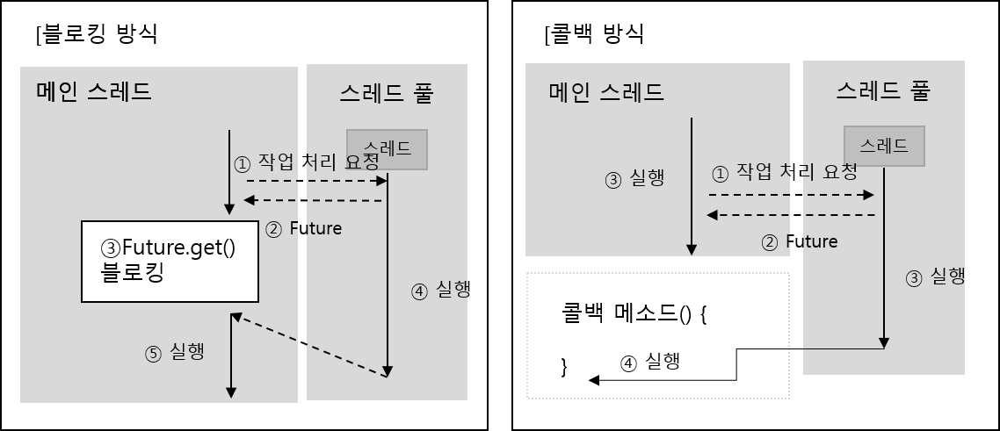

<div id="page">

<div id="main" class="aui-page-panel">

<div id="main-header">

<div id="breadcrumb-section">

1.  [Programming](README.md)
2.  [Programming](Programming_98307.md)
3.  [Java](Java_25001989.md)
4.  [Java Basic](Java-Basic_399278081.md)
5.  [Thread](Thread_40042767.md)

</div>

# <span id="title-text"> Programming : Thread Pool </span>

</div>

<div id="content" class="view">

<div class="page-metadata">

Created by <span class="author"> Dongwook Han</span>, last modified on 6월 16, 2023

</div>

<div id="main-content" class="wiki-content group">

# 스레드 풀(Thread Pool)

- 병렬 작업 처리가 많아져서 스레드 개수가 증가되면 CPU busy, memory 사용량 증가 → 어플리케이션 성능 저하

- 갑작스런 병렬 작업의 폭증으로 인한 **<u>스레드의 폭증 방지</u>** → 스레드풀 사용

- Thread Pool 제공 interface 와 클래스 : ExecutorService, Executors

## 스레드 풀 생성 및 종료

### 스레드 풀 생성

- ExecutorService 구현 객체는 Executors 클래스의 다음 두 가지 메소드 중 하나를 이용해서 생성

  - newCahcedThreadPool() : 초기 스레드, 코어 스레드 수 0, Integer.MAX_VALUE 만큼 스레드 생성(운영체제의 성능과 상황에 따라 결정)

    <div class="code panel pdl" style="border-width: 1px;">

    <div class="codeContent panelContent pdl">

    ``` syntaxhighlighter-pre
    ExecutorService executorService = Executors.newCachedThreadPool();
    ```

    </div>

    </div>

  - newFixedThreadPool(int nThreads) : 초기 스레드 수 0, 코어 스레드 수 nThreads, 최대 스레드 수 nThreads

    <div class="code panel pdl" style="border-width: 1px;">

    <div class="codeContent panelContent pdl">

    ``` syntaxhighlighter-pre
    ExecutorService executorService = Executors.newFixedThreadPool(
      Runtime.getRuntime().availableProcessors()  // cpu 코어의 수만큼 최대 스레드 수 사용
    );
    ```

    </div>

    </div>

- ThreadPoolExecutor 객체 생성하여 스레드 풀 생성

  - 코어 스레드 개수, 최대 스레드 개수 지정 가능

  - newCachedThreadPool(), newFixedThreadPool() 도 내부적으로 ThreadPoolExecutor 사용하여 생성됨

  - 예제

    <div class="code panel pdl" style="border-width: 1px;">

    <div class="codeContent panelContent pdl">

    ``` syntaxhighlighter-pre
    ExecutorService threadPool = new ThreadPoolExecutor(
      3, // 코어 스레드 개수
      100, // 최대 스레드 개수
      120L, // 놀고 있는 시간
      TimeUnit.SECONDS, // 놀고 있는 시간 단위
      new SynchronousQueueMRunnable>() // 작업 큐
      );
    ```

    </div>

    </div>

### 스레드 풀 종료

- 스레드 풀의 스레드는 기본적으로 데몬 스레드가 아니므로 main 스레드 종료 후에도 실행 상태로 남음

- 스레드풀을 종료시켜 스레드들을 종료상태가 되도록 처리

- ExecutorService 제공 종료 메소드

<div class="table-wrap">

|  |  |  |
|----|----|----|
| **리턴타입** | **메소드명** | **설명** |
| void | shutdown() | 현재 처리중인 작업뿐만 아니라 작업 큐에 대기하고 있는 모든 작업을 처리한 뒤에 스레드풀 종료 |
| List\<Runnable\> | shutdownNow() | 현재 작업 처리 중인 스레드를 interrupt 해서 작업 중지를 시도하고 스레드풀을 종료. 리턴 값은 작업 큐에 있는 미처리된 작업(Runnale) 의 목록 |
| boolean | awaitTermination(long timeout, TimeUnit unit) | shutdown() 메소드 호출 이후, 모든 작업 처리를 timeout 시간 내에 완료하면 true 리턴, 완료하지 못하면 작업 처리 중인 스레드를 interrupt 하고 false 리턴 |

</div>

- 예제

  <div class="code panel pdl" style="border-width: 1px;">

  <div class="codeContent panelContent pdl">

  ``` syntaxhighlighter-pre
  executorService.shutdown();

  executorService.shutdownNow();
  ```

  </div>

  </div>

## 작업 생성과 처리 요청

### 작업 생성

- 하나의 작업은 Runnable 또는 Callable 구현 클래스로 표현

- 작업 처리 완료 후 리턴 값이 있느냐 없느냐의 차이 : Runnable, Callable

- 코드 예제

  <div class="code panel pdl" style="border-width: 1px;">

  <div class="codeContent panelContent pdl">

  ``` syntaxhighlighter-pre
  // Runnable  구현 클래스
  Runnable task = new Runnable(){
    @Override
    public void run() {
      // 스레드가 처리할 작업 내용
    }
  }

  // Callable 구현 클래스
  Callable<T> task = new Callable<T>() {
    @Override
    public T call() throws Exception {
      // 스레드가 처리할 작업 내용
      return T;
    }
  }
  ```

  </div>

  </div>

### 작업 처리 요청

- ExecutorService 의 작업 큐에 Runnable 또는 Callable 객체 넣은 행위

  - void execute(Runnable command) : Runnable 을 작업 큐에 저장, 작업 처리 결과를 받지 못함

  - Future\<?\> submit(Runnable task) : Runnable 또는 Callable을 작업 큐에 저장, 리턴된 Future를 통해 작업 처리 결과를 얻을 수 있음

  - Future\<V\> submit(Runnable task, V result) : submit() 메소드와 동일

  - Future\<V\> submit(Callable\<V\> task) : submit() 메소드와 동일

  - execute() 작업 처리 도중 예외 발생시 스레드 종료 및 해당 스레드 스레드 풀에서 제거됨 -\> 스레드 풀에서 새로운 스레드 생성

  - submit() 작업처리 도중 예외 발생시 스레드 종료 되지 않고 다음 작업을 위해 재사용됨 → 스레드의 생성 오버헤드 줄이는 효과

- execute() 코드 예제

  <div class="code panel pdl" style="border-width: 1px;">

  <div class="codeContent panelContent pdl">

  ``` syntaxhighlighter-pre
  public class ExecuteExample {
    public static void main(String[] args) throws Exception {
      ExecutorService executorService = Executors.newFixedThreadPol(2); // 최대 스레드 2인 풀 생성
      
      for(int i = 0; i < 10; i++) {
        Runnable runnable = new Runnable(){
          @Override
          public void run() {
            ThreadPoolExecutor threadPoolExecutor = (ThreadPoolExecutor)executorService;
            int poolSize = threadPoolExecutor.getPoolSize();
            String threadname = Thread.currentThread().getName();
            System.out.println("[총 스레드 개수: " + poolSize + "] 작업 스레드 이름: " + threadName);
            // 예외 발생 시킴
            int value = Integer.parseInt("삼");
          }
        };
        executorService.execute(runnable); 
        // executorService.submit(runnable);
        Thread.sleep(10);  // 콘솔에 출력 시간을 주기 위해 0.01 초 일시 정지시킴
      }
      executorService.shudown();  // 스레드풀 종료
    }
  }
  ```

  </div>

  </div>

## 블로킹 방식의 작업 완료 통보

- ExecutorService.submit() 사용하여 Future 객체 리턴

- Future 지연 완료 객체 : 작업이 완료 될 때까지 기다렸다가 최종 결과를 얻음

- Future의 get() 메소드 호출시 스레드가 작업 완료될때까지 블로킹되었다가 처리 결과 리턴 : 블로킹을 이용한 작업 완료 통보 방식

  - V get() : 작업이 완료될 때까지 블로킹되었다가 처리 결과 V를 리턴

  - V get(long timeout, TimeUnit unit) : timeout 시간 전에 작업이 완료되면 결과 V를 리턴하지만, 작업이 완료되지 않으면 TimeoutException을 발생 시킴

- 주의 사항 : get() 메소드를 호출하는 스레드는 새로운 스레드이거나 스레드 풀의 또 다른 스레드여야 함. 작업 결과를 가져올 때까지 블로킹 되므로

### 리턴값이 없는 작업 완료 통보

- 리턴값이 없는 작업일 경우 Runnable 객체로 생성하면 됨

- 예제 코드

  <div class="code panel pdl" style="border-width: 1px;">

  <div class="codeContent panelContent pdl">

  ``` syntaxhighlighter-pre
  public class NoResultExample {
    public static void main(String[] args){
      ExecutorService executorService = Executors.newFixedThreadPool(Runtime.getRuntime().availableProcessors());
      
      System.out.println("작업 처리 요청");
      Runnable runnable = new Runnable() {
        @Override
        public void run() {
          int sum = 0;
          for(int i = 1; i <= 10; i++) {
             sum += i;
          }
          System.out.println("[처리 결과] " + sum);
        }
      };
      Future future = executorService.submit(runnable);
      
      try {
        future.get();
        System.out.println("[작업 처리 완료]");
      } catch(Exception e){
        System.out.println("[실행 예외 발생함] " + e.getMessage());
      }
      executorService.shutdown();
    }
  }
  ```

  </div>

  </div>

### 리턴값이 있는 작업 완료 통보

- 작업 객체를 Callable로 생성

- Generic Type 파라미터 T는 call() 메소드가 리턴하는 타입이 되도록 주의

- 코드 예제

  <div class="code panel pdl" style="border-width: 1px;">

  <div class="codeContent panelContent pdl">

  ``` syntaxhighlighter-pre
  public class ResultByCallableExample {
    public static void main(String[] args){
      ExecutorService executorService = Executors.newFixedThreadPool(Runtime.getRuntime().availableProcessors());
      
      System.out.println("작업 처리 요청");
      Callable<Integer> task = new Callable<Integer>() {
        @Override
        public Integer call() throws Exception {
          int sum = 0;
          for(int i = 1; i <= 10; i++) {
             sum += i;
          }
          return sum;
        }
      };
      Future<Integer> future = executorService.submit(task);
      
      try {
        int sum = future.get();
        System.out.println("[처리 결과] " + sum);
        System.out.println("[작업 처리 완료]");
      } catch(Exception e){
        System.out.println("[실행 예외 발생함] " + e.getMessage());
      }
      executorService.shutdown();  // 스레드 풀 종료
    }
  }
  ```

  </div>

  </div>

### 작업 처리 결과를 외부 객체에 저장

- 상황에 따라 스레드가 작업한 결과를 외부 객체에 저장

- 각 스레드들의 작업 결과를 취합할 수도 있으므로 외부 객체는 공유 객체가 될 수 있음

- ExecutorService.submit(Runnable task, v result) 사용 가능

- 외부 Result 객체를 생성자를 통해 주입받아야 함.

- 코드 예제

  <div class="code panel pdl" style="border-width: 1px;">

  <div class="codeContent panelContent pdl">

  ``` syntaxhighlighter-pre
  public class ResultByRunnableExample {
    public static void main(String[] args){
      ExecutorService executorService = Executors.newFixedThreadPool(Runtime.getRuntime().availableProcessors());
      
      System.out.println("작업 처리 요청");
      class Task implements Runnable {
        Result result;
        Task(Result result) {
          this.result = result;    // 외부 Result 객체를 필드에 저장
        }
        
        @Override
        public void run() {
          int sum = 0;
          for(int i = 1; i <= 10; i++) {
             sum += i;
          }
          result.addValue(sum);    //. Result 객체에 작업 결과 저장
        }
      }
      
      Result result = new Result();
      Runnable task1 = new Task(result);
      Runnable task2 = new Task(result);
      Future<Result> future1 = executorService.submit(task1, result);
      Future<Result> future2 = executorService.submit(task2, result);
      
      try {
        result = future1.get();
        result = future2.get();
        int sum = future.get();
        System.out.println("[처리 결과] " + result.accumValue);
        System.out.println("[작업 처리 완료]");
      } catch(Exception e){
        System.out.println("[실행 예외 발생함] " + e.getMessage());
      }
      executorService.shutdown();  // 스레드 풀 종료
    }
  }

  class Result {
    int accumValue;
    synchronized void addValue(int value) {
      accumValue += value;
    }
  }
  ```

  </div>

  </div>

### 작업 완료 순으로 통보

- 작업 처리가 완료된 것부터 결과를 얻어 이용

- 스레드 풀에서 작업 처리가 완료된 것만 통보 받는 방법 : CompletionService 이용

- poll(), task() 메소드 사용

- 샘플 예제

  <div class="code panel pdl" style="border-width: 1px;">

  <div class="codeContent panelContent pdl">

  ``` syntaxhighlighter-pre
  public class CompletionServiceExample extends Thread{
    public static void main(String[] args){
      ExecutorService executorService = Executors.newFixedThreadPool(Runtime.getRuntime().availableProcessors());
      
      CompletionService<Integer> completionService = new ExecutorCompletionService<Integer>(executorService);
      
      System.out.println("작업 처리 요청");
      for(int i = 1; i <= 3; i++) {
        completionService.submit(new Callable<Integer>() {
          @Override
          public Integer call() throws Exception {
            jint sum = 0;
            for(int i = 1; i <= 10; i++) {
              sum += i;
            }
            return sum;
          }
        });
      }
    
      System.out.println("[처리 완료된 작업 확인] ");
      executorService.submit(new Runnable() {
        @Override
        public void run() {
          while(true) {
            try {
              Future<Integer> future = completionService.take();
              int value = future.get();
              System.out.println("[처리 결과] " + value);
            } catch(Exception e) {
              break;
            }
          }
        }
      });
      
      try {
        Thread.sleep(3000);
      } catch(InterruptedException e){
      }
      executorService.shutdown();
    }
  }
  ```

  </div>

  </div>

## 콜백 방식의 작업 완료 통보

- 콜백 방식을 이용해서 작업 완료 통보를 받는 방법

- 스레드가 작업을 완료하면 특정 메소드(콜백 메소드)를 자동 실행하는 기법

<span class="confluence-embedded-file-wrapper image-center-wrapper"></span>

- 블로킹 방식 : 작업 처리를 요청한 후 작업이 완료될 때까지 블로킹 됨

- 콜백 방식 : 작업 처리를 요청한 후 다른 작업 수행 가능, 결과는 콜백 메소드로 전달됨

- ExecutorService 에는 콜백을 위한 별도의 기능 제공 안 함

- Runnable 구현 클래스 작성할 때 콜백 기능 구현

- 콜백 기능 구현 예제

  <div class="code panel pdl" style="border-width: 1px;">

  <div class="codeContent panelContent pdl">

  ``` syntaxhighlighter-pre
  // CompletionHandler 를 사용하여 콜백 메소드 구현
  CompletionHandler<V, A> callback = new CompletionHandler<V, A> () {
    // 작업 정상 처리시 호출
    @Override
    public void completed(V result, A attachment){}
    
    // 작업 처리 도중 예외 발생시 호출
    @Override
    public void failed(Throwable exc, A attachment){}
  };

  // 콜백 메소드를 호출하는 Runnable 객체 구현
  Runnable task = new Runnable() {
    @Override
    public void run() {
      try {
        // 작업처리
        V result = ...;
        callback.completed(result, null);  // 첨부값 지정 안 할 시 null 로 설정
      } catch(Exception e) {
        callback.failed(e, null);
      }
    }
  }
  ```

  </div>

  </div>

- 콜백 방식의 작업 완료 통보 받는 예제

  <div class="code panel pdl" style="border-width: 1px;">

  <div class="codeContent panelContent pdl">

  ``` syntaxhighlighter-pre
  public class CallbackExample {
    private ExecutorService executorService;
    
    public CallbackExample() {
      executorService = Executors.newFixedThreadPool(
        Runtime.getRuntime().availableProcessors();
      );
    }
    
    // callback 정의하기 
    private CompletionHandler<Integer, Void> callback = 
    new CompletionHandler<Integer, Void>() {
      @Override
      public void completed(Integer result, Void attachment) {
        System.out.println("completed() 실행; " + result);
      }
      
      @Override
      public void failed(Throwable exc, Void attachment) {
        System.out.println("failed() 실행 : " + exc.toString());
      }
    };
    
    public void doWork(final String x, final String y) {
      Runnable task = new Runnable()  {
        @Override
        public void run() {
          try {
            int intX = Integer.parseInt(x);
            int intY = Integer.parseInt(y);
            int result = intX + intY;
            callback.completed(result, null);  // 정상처리시 호출
          } catch(NumberFormatException e) {
            callback.failed(e, null);          // 예외 발생시 호출
          }
        }
      };
      executorService.submit(task);
    }
    
    public void finish() {
      executorService.shutdown();
    }
    
    public static void main(String[] args) {
      CallbackExample example = new CallbackExample();
      example.doWork("3","3");
      example.doWork("3","삼");
      example.finish();
    }
  }
  ```

  </div>

  </div>

### Executors

#### 개요

- Concurrency API가 소개하는 ExecutorService는 Thread를 직접 사용하는 것을 대체하는 개념으로 제공

- Executors는 비동기 task를 실행하고 thread pool을 관리하므로 thread를 수동적으로 생성할 필요가 없음.

- Executors의 내부 pool의 모든 Thread는 revenant 작업을 위해 내부에서 재사용되므로 하나의 executor Service에서 어플리케이션 수명주기동안 많은 동시 작업을 수행할 수 있음.

- Executor 예제

  <div class="code panel pdl" style="border-width: 1px;">

  <div class="codeContent panelContent pdl">

  ``` syntaxhighlighter-pre
  ExecutorService executor = Executors.newSingleThreadExecutor();
  executor.submit(() -> {
    String threadName = Thread.currentThread().getName();
    System.out.println("Hello " + threadName);
  });
  // => Hello pool-1-thread-1
  ```

  </div>

  </div>

- 위의 Thread 예제와 달리 Executors는 명시적으로 종료정의를 해주지 않으면 새로운 Task를 대기하면서 기다린다.

- ExecutorService를 종료하기 위해 shutdown() - task가 끝날때까지 기다림, shutdownNow() - 실행 중인 모든 task를 즉시 종료 , 두 메소드를 제공

  <div class="code panel pdl" style="border-width: 1px;">

  <div class="codeContent panelContent pdl">

  ``` syntaxhighlighter-pre
  try{
    System.out.println("attempt to shutdown executor");
    executor.shutdown();
    executor.awaitTermination(5, TimeUnit.SECONDS);
  }catch(InterruptedException e){
    System.err.println("tasks interrupted");
  }finally{
    if(!executor.isTerminated()){
      System.err.println("cancel non-finished tasks"));
    }
    executor.shutdownNow();
    System.out.println("shutdown finished");
  }
  ```

  </div>

  </div>

#### Callables and Futures

- executors는 Callable 이라는 task를 지원하는데 Runnable을 구현한 void task와 달리 결과값을 리턴한다.

  <div class="code panel pdl" style="border-width: 1px;">

  <div class="codeContent panelContent pdl">

  ``` syntaxhighlighter-pre
  Callable<Integer> task = () -> {
    try{
      TimeUnit.SECONDS.sleep(1);
      return 123;
    }catch(InterruptedException e){
      throw new IllegalStateException("task interrupted",e);
    }
  }
  ```

  </div>

  </div>

- Callable은 Runnable task와 같이 Executor Service에 submit 되어진다.(executorService.submit() 으로 실행). submit() 메소드는 task이 끝날 때까지 기다리지 않고 executorservice는 값을 직접 리턴하지 않음.

- executor가 Future 유형의 결과를 리턴하는 대신 나중에 실제 결과값을 조회해 온다.

  <div class="code panel pdl" style="border-width: 1px;">

  <div class="codeContent panelContent pdl">

  ``` syntaxhighlighter-pre
  ExecutorService executor = Executors.newFixedThreadPool(1);
  Future<Integer> future = executor.submit(task);

  System.out.println("future done? " + future.isDone());

  Integer result = future.get();

  System.out.println("future done? " + future.isDone());
  System.out.println("result : " + result);
  ```

  </div>

  </div>

- callable task를 실행 한 후, future.isDone() 메소드로 실행이 끝났는지 확인

- future.get() 메소드는 현재 스레드를 블록하고 결과를 받기 전까지 callable task가 완료되기까지 기다린다.

- future.get() 하기 전에 executorService 를 shutdownNow() 하면 오류가 발생

#### Timeouts

- future.get() 호출을 하게 되면 블럭킹하고 대기하게 되는데 안 좋을 경우, 영원히 대기할 수 있음

- 이런 것을 방지하고자 timeout 시간을 설정

  <div class="code panel pdl" style="border-width: 1px;">

  <div class="codeContent panelContent pdl">

  ``` syntaxhighlighter-pre
  ExecutorService executor = Executors.newFixedThreadPool(1);

  Future<Integer> future = executor.submit(() -> {
    try {
      TimeUnit.SECONDS.sleep(2);  // 테스트를 하기위해 2초간 sleep 처리
      return 123;
    } catch(InterruptedException e) {
      throw new IllegalStateExceptoin("task innterrupted", e);
    }
  });
  future.get(1, TimeUnit.SECONDES); // timeout 1초 설정하여 TimeoutException 발생시킴
  ```

  </div>

  </div>

#### InvokeAll

- 여러개의 callable에 대한 일괄 처리를 Executor가 지원

- invokeAll() 메소드는 callable의 collection 을 받아 들이고 결과로 future list 반환함

  <div class="code panel pdl" style="border-width: 1px;">

  <div class="codeContent panelContent pdl">

  ``` syntaxhighlighter-pre
  ExecutorService executor = Executors.newWorkStealingPool();

  List<Callable<String>> callables = Arrays.asList(
    () -> "task1",
    () -> "task2",
    () -> "task3");
    executor.invokeAll(calables)
      .stream()
      .map(future -> {
        try {
          return future.get();
        } catch(Exception e) {
          thro new IllegalStateException(e);
        }
      })
      .forEach(System.out::println);
  )
  ```

  </div>

  </div>

#### InvokeAny

- Callable을 일괄 제출(처리)하는 다른 방법은 invokeAny() 메소드 사용

- invokeAll() 와 약간 다름. Future 객체들을 반환하는 대신 invokeAny()는 첫번째 호출 가능 항목이 종료되고 해당 호출의 결과가 리턴될 때까지 블럭킹됨(최초 하나가 리턴 될 때까지 블럭킹)

- 테스트 예제

  <div class="code panel pdl" style="border-width: 1px;">

  <div class="codeContent panelContent pdl">

  ``` syntaxhighlighter-pre
  // 결과를 리턴하기 전에 일정 시간동안 sleep 하는 Callable 객체 정의
  Callable<String> callable(String result, long sleepSeconds) {
    return () -> {
      TimeUnit.SECONDS.sleep(sleepSeconds();
      return result;
    };
  }

  // invokeAny 예제
  ExecutorService executor = Executors.newWorkStealingPool();

  List<Callable<String>> callables = Arrays.asList(
    callable("task1", 2),
    callable("task2", 1),
    callable("task3", 3)
  );

  String result = executor.innvokeAny(callables);
  System.out.println(result);

  // => task2
  ```

  </div>

  </div>

  - **newWorkStealingPool()** 이라는 다른 타입의 executor 생성.

  - **ForkJoinPool** 을 만드는데 기존 스레드풀과는 약간 다름

### Scheduled Executors

- 주기적으로 수행하기 위해 스케줄 스레드 풀을 사용

- ScheduledExecutorService 는 주기적으로 작업을 스케줄링하거나 어느 정도 시간이 지난 후 수행하고도 함

- 샘플 예제

  <div class="code panel pdl" style="border-width: 1px;">

  <div class="codeContent panelContent pdl">

  ``` syntaxhighlighter-pre
  ScheduledExecutorService executor = Executors.newScheduledThreadPool(1);

  Runnable task = () -> System.out.println("Scheduling: " + System.nanoTime());
  // ScheduledFuture 사용 
  ScheduledFuture<?> future = executor.schedule(task, 3, TimeUnit.SECONDS);

  TimeUnit.MILLISECONDS.sleep(1337);

  long remainingDelay = future.getDelay(TimeUnit.MILLISECONDS);
  System.out.println("Remaining Delay: %sms", remainingDelay);
  ```

  </div>

  </div>

  - 작업을 스케쥴링할 때 그 결과로 SheduledFuture 를 다룬다.

  - getDelay() 메소드는 남아 있는 시간을 측정?

- 주기적으로 작업을 수행하기 위해서 excutor는 scheduleAtFixedRate() 와 scheduleWithFixedDealy() 메소드 제공

- scheduleAtFixedRate() : 고정된 시간 비율로 작업 수행

- 매 초마다 주기적으로 console에 출력하는 수행하는 예제

  <div class="code panel pdl" style="border-width: 1px;">

  <div class="codeContent panelContent pdl">

  ``` syntaxhighlighter-pre
  ScheduledExecutorService executor = Executors.newScheduledThreadPool();

  Runnable task = () -> System.out.println("Scheduling: " + System.nanotime());

  int initialDeply = 0;
  innt period = 1;
  executor.scheduleAtFixedRate(task, initialDelay, period, TimeUnit.SECONDS);
  ```

  </div>

  </div>

- 이 작업은 처음 시작하기 전까지의 지연시간은 허용함

- scheduleAtFixedRate() 은 작업의 수행 시간을 고려하지 않기 때문에, 만약 수행이 2초가 걸리는 작업을 1초마다 수행하도록 하면 스레드풀은 최대 용량으로 작동함 =\> 이 경우는 scheduleWithFixedDealy() 사용을 고려

- scheduleWithFixedDelay() 작업 종료와 다음 작업 시작 사이에 대기 시간이 적용됨

  <div class="code panel pdl" style="border-width: 1px;">

  <div class="codeContent panelContent pdl">

  ``` syntaxhighlighter-pre
  ScheduledExecutorService executor = Executors.newScheduledThreadPool();

  Runnable task = () -> {
    try {
      TimeUnit.SECONDS.sleep(2);
      System.out.println("Scheduling: " + System.nanoTime());
    } catch(InterruptedException e) {
      System.err.println("task interrupted");
    }
  };

  executor.schedulWithFixedDelay(task, 0, 1, TieUnit.SECONDS);  // 스레드가 종료되고 다시 시작하기 까지 1초의 시간 설정 
  ```

  </div>

  </div>

### Synchronized

- 여러 스레드에서 동시에 공유 가변 변수에 엑세스 할 때

- 다음 예제의 increment() 메소드를 여러 스레드가 같이 사용할 때 문제가 발생됨

  <div class="code panel pdl" style="border-width: 1px;">

  <div class="codeContent panelContent pdl">

  ``` syntaxhighlighter-pre
  int count = 0;
   
   void increment() {
    count = count + 1;
   }
  ```

  </div>

  </div>

- 다음과 같이 thread pool 에서 사용시 실제 결과를 10000이 아닌 실행할 때마다 다른 결과를 보게 된다.

  <div class="code panel pdl" style="border-width: 1px;">

  <div class="codeContent panelContent pdl">

  ``` syntaxhighlighter-pre
  ExecutorService executor = Executors.newFixedThreadPool(2);

  IntStream.range(0, 10000)
     .forEach(i -> executor.submit(this::increment));
  stop(executor);

  System.out.println(count);
  ```

  </div>

  </div>

- 경합 상태를 초래하는 이 변수에 대한 엑세스를 동기화 하지 않고 서로 다른 스레드에서 공유하기 때문에 값이 그때 그때 달라짐

- 다음과 같이 공유 객체에 동기화를 적용하여 스레드 동기화를 지원

  <div class="code panel pdl" style="border-width: 1px;">

  <div class="codeContent panelContent pdl">

  ``` syntaxhighlighter-pre
  synchronized void incrementSync() {
    count = count + 1;
  }
  ```

  </div>

  </div>

- incrementSync()를 실행할 때마다 원하는 결과 10000을 얻게 됨. 더 이상 경합 상태가 아님

  <div class="code panel pdl" style="border-width: 1px;">

  <div class="codeContent panelContent pdl">

  ``` syntaxhighlighter-pre
  ExecutorService executor = Executors.newFixedThreadPool(2);

  IntStream.range(0, 10000)
     .forEach(i -> executor.submit(this::incrementSync));
  stop(executor);

  System.out.println(count);
  ```

  </div>

  </div>

- synchronized 키워드를 메소드가 아닌 블럭에도 사용 가능하다.

  <div class="code panel pdl" style="border-width: 1px;">

  <div class="codeContent panelContent pdl">

  ``` syntaxhighlighter-pre
  void incrementSync() {
    synchronized(this) {
      count = count + 1;
    }
  }
  ```

  </div>

  </div>

- 내부적으로 java는 동기화를 관리하기 위해 monitor lock 도는 intrinsic lock 이라는 모니터를 사용

- 이 monitor는 개체에 바인딩 됨

- 동기화된 메서드를 사용할 때 각 메서드는 해당 개체의 동일한 모니터를 공유한다.

- 모든 암시적인 모니터를 공유 객체에 재진입(접근) 할 수 있는 특성을 가진다?

- 재진입은 현재 스레드에 대해 공유 객체가 잠긴다는 의미 → 다른 스레드는 접근을 못한다

- 따라서 스레드는 공유 객체에 대해 자신만이 접근할 수 있으므로 교착상태에 빠지지 않고 여러번 접근 가능

### Locks

- sychronizzed 키워드를 사용해서 공유 객체에 접근하는 것을 암시적 잠금을 사용한다고 표현함

- Concurrency API 는 Lock interface를 제공하여 명시적으로 잠금을 지원

- 암시적 잠금보다 낫다고 함.

#### ReentrantLock

- ReentrantLock 클래스는 synchronized 키워드를 통해 엑세스되는 암시적 모니터와 기본 동작이 동일

- 암시적 모니터보다 기능이 확장된 상호 배제 잠금

  <div class="code panel pdl" style="border-width: 1px;">

  <div class="codeContent panelContent pdl">

  ``` syntaxhighlighter-pre
  ReentrantLock lock = new ReentrantLock();
  int count = 0;

  void increment() {
    lock.lock(); // 명시적으로 잠금을 선언
    try {
      count++;
    } finally {
      lock.unlock(); // 잠금 해제 선언 
    }
  }
  ```

  </div>

  </div>

- 명시적으로 잠금 선언과 잠금 해제를 구현하며 예외 발생시를 고려하여 finally 에 잠금 해제를 구현

- 이미 잠금 선언이 되어 있을 경우에 다른 스레드가 잠금 선언을 하더라도 대기하고 현재 잠금 상태가 해제 될때까지 중지함.

- 세밀한 제어를 위한 Locks 이 지원하는 여러 메소드 예제

  <div class="code panel pdl" style="border-width: 1px;">

  <div class="codeContent panelContent pdl">

  ``` syntaxhighlighter-pre
  ExecutorService executor = Executors.newFixedThreadPool(2);
  ReentrantLock lock = new ReentrantLock();

  executor.submit(() -> {
    lock.lock();   // 잠금 선언
    try{
      sleep(1);
    } finally {
      lock.unlock();   // 잠금 해제 선언 
    }
  });

  executor.submit(() -> {
    System.out.println("Locked: " + lock.isLocked());   // 잠금 여부 체크 
    System.out.println("Held by me: " + lock.isHeldByCurrentThread());  // 현재 어떤 스레드가 잠금했는지 여부
    boolean locked = lock.tryLock();
    System.out.println("Lock acquired: " + locked);
  });

  stop(executor);
  ```

  </div>

  </div>

  - 첫번째 스레드가 1초 동안 잠금처리할 동안 두번째 스레드가 잠금의 현재 상태에 대한 정보를 얻어서 출력하는 예제

  - tryLock() 메서드는 현재 스레드를 일시 중지하지 않고 잠금을 획득하려고 시도

  - locked 결과는 공유 객체를 엑세스하기 전에 잠금을 실제 획득되었는지 확인할 때 사용됨

#### ReadWriteLock

- ReadWriteLock interface 는 읽기 및 쓰기 엑세스를 위한 잠금을 정의

- 쓰기 잠금을 하는 스레드가 없는 한 여러 스레드가 읽기 잠금을 동시에 유지

- 읽기가 더 자주 발생하는 경우 성능과 처리량이 향상

  <div class="code panel pdl" style="border-width: 1px;">

  <div class="codeContent panelContent pdl">

  ``` syntaxhighlighter-pre
  ExecutorService executor = Executors.newFixedThreadPool(2);
  Map<String, String> map = new HashMap<>();
  ReadWriteLock lock = new ReentrantReadWriteLock();  // 읽기쓰기 lock 선언 

  executor.submit(() -> {
    lock.writeLock().lock();
    try{
      sleep(1);
      map.put("foo", "bar");
    } finally {
      lock.writeLock().unlock();
    }
  });
  ```

  </div>

  </div>

- 쓰기 lock 을 갖는 예제

- 다음 읽기 lock을 갖는 스레드는 쓰기 lock 이 끝날 때까지 대기한 후, 동시에 읽는다.

  <div class="code panel pdl" style="border-width: 1px;">

  <div class="codeContent panelContent pdl">

  ``` syntaxhighlighter-pre
  Runnable readTask = () -> {
    lock.readLock().lock();
    try{
      System.out.println(map.get("foo"));
      sleep(1);
    } finally {
      lock.readLock().unlock();
    }
  };

  executor.submit(readTask);
  executor.submit(readTask);

  stop(executor);
  ```

  </div>

  </div>

- 읽기 쓰레드는 동시에 안전하게 읽기 잠금을 획득하여 처리

#### StampedLock

- java 8 에서는 읽기와 쓰기 잠금도 지원하는 새로운 종류의 잠금인 StampedLock 제공

- StampedLock의 잠금 메서드는 긴 값으로 표시되는 stemp를 반환함

- 이 stamp 를 사용하여 잠금을 해제하거나 유효한지 확인

- 또한 Stamped locks 는 낙관적 잠금이라는 다른 잠금 모드를 지원

- 읽기쓰기 잠금 예제를 StampedLock 으로 변경한 예제

  <div class="code panel pdl" style="border-width: 1px;">

  <div class="codeContent panelContent pdl">

  ``` syntaxhighlighter-pre
  ExecutorService executor = Executors.newFixedThreadPool(2);
  Map<String, String> map = new HashMap<>();
  StampedLock lock = new StampedLock();

  executor.submit(() -> {
    long stamp = lock.writeLock();
    try{
      sleep(1);
      map.put("foo", "bar");
    } finally {
      lock.unlockWrite(stamp);   // 앞서 stamp 가 동일한 것인지 체크?
    }
  });

  Runnable readTask = () -> {
    long stamp = lock.readLock();
    try{
      System.out.println(map.get("foo"));
      sleep(1);
    } finally {
      lock.unlockRead(stamp);
    }
  };

  executor.submit(readTask);
  executor.submit(readTask);

  stop(executor);
  ```

  </div>

  </div>

- readLock(), writeLock() 을 통해 나중에 잠금 해제에 사용되는 stamp을 얻음

- 낙관적 잠금 예제

  <div class="code panel pdl" style="border-width: 1px;">

  <div class="codeContent panelContent pdl">

  ``` syntaxhighlighter-pre
  ExecutorService executor = Executors.newFixedThreadPool(2);
  StampedLock lock = new StampedLock();

  executor.submit(() -> {
    long stamp = lock.tryOptimisticRead();  // stamp 정보 가져오기 
    try{
      System.out.println("Optimistic Lock Valid: "+ lock.validate(stamp));
      sleep(1);
      System.out.println("Optimistic Lock Valid: "+ lock.validate(stamp));
      sleep(2);
      System.out.println("Optimistic Lock Valid: "+ lock.validate(stamp));
    } finally {
      lock.unlock(stamp);   // 앞서 stamp 가 동일한 것인지 체크?
    }
  });

  executor.submit(() -> {
    long stamp = lock.writeLock();
    try{
      System.out.println("Write Lock acquired");
      sleep(2);
    } finally {
      lock.unlock(stamp);
      System.out.println("Write done");
    }
  });

  stop(executor);
  ```

  </div>

  </div>

- 낙관적 읽기 잠금은 잠금이 실제로 사용 가능한지 여부에 관계 없이 항상 현재 스레드를 차단하지 않고 stamp를 반환하는 tryOptimisticRead() 를 호출

- 이미 쓰기 잠금이 활성화된 경우 stamp 의 값은 0

- lock.validate(stamp) 를 호출하여 stamp가 유효한지 항상 확인

- 앞의 예제의 결과 값은 다음과 같음

  <div class="code panel pdl" style="border-width: 1px;">

  <div class="codeContent panelContent pdl">

  ``` syntaxhighlighter-pre
  Optimistic Lock Valid : true
  Write Lock acquired
  Optimistic Lock Valid : false
  Write done
  Optimistic Lock Valid : false
  ```

  </div>

  </div>

- 낙관적 잠금은 잠금을 획득한 직후에 유효

- 가끔은 잠금을 해제했다가 잠그지 않고 읽기 잠금을 쓰기 잠금으로 변환하는 것이 유용

- 예제코드

  <div class="code panel pdl" style="border-width: 1px;">

  <div class="codeContent panelContent pdl">

  ``` syntaxhighlighter-pre
  ExecutorService executor = Executors.newFixedThreadPool(2);
  StampedLock lock = new StampedLock();

  executor.submit(() -> {
    long stamp = lock.readLock();  // stamp 정보 가져오기 
    try{
      if(count == 0) {
        stamp = lock.tryConvertToWriteLock(stamp);
        if(stamp == 0L) {
          System.out.println("Could not convert to write lock");
          stemp = lock.writeLock();
        }
        count = 23;
      }
      System.out.println(count);
    } finally {
      lock.unlock(stamp);   
    }
  });

  stop(executor);
  ```

  </div>

  </div>

<a href="https://winterbe.com/posts/2015/04/30/java8-concurrency-tutorial-synchronized-locks-examples/" class="external-link" data-card-appearance="inline" rel="nofollow">https://winterbe.com/posts/2015/04/30/java8-concurrency-tutorial-synchronized-locks-examples/</a>

StampedLock 보충 필요

### Semaphores

- Concurrency API 는 세마포도 지원

- lock 은 변수 또는 리소스에 대한 배타적 엑세스 권한을 부여

- 세모포어는 모든 허가 집합을 유지 → 어플리케이션의 특정 부분을 동시에 허가하는 양을 제한하고자 할 때 유용함

- 장기 실행 작업에 대한 엑세스를 제한하는 예제

  <div class="code panel pdl" style="border-width: 1px;">

  <div class="codeContent panelContent pdl">

  ``` syntaxhighlighter-pre
  ExecutorService executor = Executors.newFixedThreadPool(10);

  Semaphore semaphore = new Semaphore(5);

  Runnable longRunningTask = () -> {
    boolean permit = false;
    try {
      permit = semaphore.tryAcquire(1, TimeUnit.SECONDS);
      if(permit) {
        System.out.println("Semaphore acquired");
        sleep(5);
      } else {
        System.out.println("Could not acquire semaphore");
      }
    } catch(InterruptedException e) {
      throw new IllegalStateException(e);
    } finally {
      if(permit) {
        semaphore.release();
      }
    }
  }

  IntStream.range(0, 10)
      .forEach(i -> executor.submit(longRunningTask));

  stop(executor);
  ```

  </div>

  </div>

- 스레드 풀은 동시에 10개의 작업을 실행할 수 있지만 크기 5인 세마포어를 사용하므로 동시 엑세스를 5로 제한

- finally 에 세마포어를 적절하게 해제하도록 정의

<a href="https://winterbe.com/posts/2015/05/22/java8-concurrency-tutorial-atomic-concurrent-map-examples/" class="external-link" data-card-appearance="inline" rel="nofollow">https://winterbe.com/posts/2015/05/22/java8-concurrency-tutorial-atomic-concurrent-map-examples/</a>

## CompletableFuture

- Java5에서 Future 추가됨 → 비동기 작업에 대한 결과값을 리턴 받을 수 있음

- 그러나 다음과 같은 한계점 존재

  - 외부에서 완료시킬 수 없음, get 메소드의 타임아웃 설정으로만 완료 가능

  - blocking code(get)을 통해서만 이후의 결과 처리 가능

  - 여러 Future를 조합할 수 없음 ex) 회원 정보를 가조여고 나서 알림을 발송하는 등

  - 여러 작업을 조합하거나 예외 처리할 수 없음

- 위와 같은 한계를 해결한 CompletableFuture 등장

- 비동기 작업 실행, 작업 콜백, 작업 조합, 예외처리 등 가능

- 작업 유형

  - runAsync() : 반환값이 없는 경우, 비동기로 작업 실행

    <div class="code panel pdl" style="border-width: 1px;">

    <div class="codeContent panelContent pdl">

    ``` syntaxhighlighter-pre
    @Test
    void runAsync() throws ExecutionException, InterruptedException {
      CompletableFuture<Void> future = CompletableFuture.runAsync(() -> {
        System.out.println("Thread : " + Thread.currentThread().getName());
      });
      future.get();
      System.out.println("Thread: " + Thread.currentThread().getName());
    }
    ```

    </div>

    </div>

  - supplyAsync() : 반환값이 있는 경우, 비동기로 작업 실행

    <div class="code panel pdl" style="border-width: 1px;">

    <div class="codeContent panelContent pdl">

    ``` syntaxhighlighter-pre
    @Test
    void supplyAsync() throws ExecutionException, InterruptedException {
      CompletableFuture<String> future = CompletableFuture.supplyAsync(() -> {
        System.out.println("Thread : " + Thread.currentThread().getName());
      });
      System.out.println(future.get());
      System.out.println("Thread: " + Thread.currentThread().getName());
    }
    ```

    </div>

    </div>

  - runAsync와 supplyAsync는 자바7에 추가된 ForkJoinPool의 commonPool을 사용해 작업을 실행할 스레드를 얻어 사용. 필요한 경우 ExecutorService를 파라미터로 넘겨주어서 사용

  - 작업 콜백

    - thenApply : 반환값을 받아 다른 값을 반환

    - 함수형 인터페이스 Fuction을 파라미터로 받음

      <div class="code panel pdl" style="border-width: 1px;">

      <div class="codeContent panelContent pdl">

      ``` syntaxhighlighter-pre
      @Test
      void thenApply() throws ExecutionException, InterruptedException {
        CompletableFuture<String> future = CompletableFuture.supplyAsync(() -> {
          System.out.println("Thread : " + Thread.currentThread().getName());
        }).thenApply(s -> {
          return s.toUpperCase();
        });
        System.out.println(future.get());
      }
      ```

      </div>

      </div>

    - thenAccept : 반환 값을 받아 처리하고 값을 반환하지 않음

    - 함수형 인터페이스 Consumer를 파라미터로 받음

      <div class="code panel pdl" style="border-width: 1px;">

      <div class="codeContent panelContent pdl">

      ``` syntaxhighlighter-pre
      @Test
      void thenAccept() throws ExecutionException, InterruptedException {
        CompletableFuture<String> future = CompletableFuture.supplyAsync(() -> {
          System.out.println("Thread : " + Thread.currentThread().getName());
        }).thenAccept(s -> {
          return s.toUpperCase();
        });
        System.out.println(future.get());
      }
      ```

      </div>

      </div>

    - thenRun : 반환 값을 받지 않고 다른 작업 실행

    - 함수형 인터페이스 Runnable을 파라미터로 받음

      <div class="code panel pdl" style="border-width: 1px;">

      <div class="codeContent panelContent pdl">

      ``` syntaxhighlighter-pre
      @Test
      void thenRun() throws ExecutionException, InterruptedException {
        CompletableFuture<String> future = CompletableFuture.supplyAsync(() -> {
          System.out.println("Thread : " + Thread.currentThread().getName());
        }).thenRun(s -> {
          System.out.println("Thread : " + Thread.currentThread().getName());
        });
        future.get();
      }
      ```

      </div>

      </div>

  - 작업 조합

    - thenCompose

      - 두 작업이 이어서 실행하도록 조합하여 앞선 작업의 결과를 받아 사용

      - 함수형 인터페이스 Function 파라미터 인자

        <div class="code panel pdl" style="border-width: 1px;">

        <div class="codeContent panelContent pdl">

        ``` syntaxhighlighter-pre
        @Test
        void thenCompose() throws ExecutionException, InterruptedException {
          CompletableFuture<String> hello = CompletableFuture.supplyAsync(() -> {
            return "hello";
          });
          
          // Future 간에 연관관계가 있는 경우 
          CompletableFuture<String> future = hello.thenCompose(this::mangkyu);
          System.out.println(future.get());
        }

        private CompletableFuture<String> mangkyu(String message) {
          return CompletableFuture.supplyAsync(() -> {
            return message + "" + "Mangkyu";
          });
        }
        ```

        </div>

        </div>

    - thenCombine

      - 두 작업을 독립적으로 실행하고, 둘 다 완료되었을 때 콜백 실행

      - 함수형 인터페이스 Function 파라미터 인자

        <div class="code panel pdl" style="border-width: 1px;">

        <div class="codeContent panelContent pdl">

        ``` syntaxhighlighter-pre
        @Test
        void thenCombine() throws ExecutionException, InterruptedException {
          CompletableFuture<String> hello = CompletableFuture.supplyAsync(() -> {
            return "hello";
          });
          
          CompletableFuture<String> mangkyu = CompletableFuture.supplyAsync(() -> {
            return "mangkyu";
          });
          
          CompletableFuture<String> future = hello.thenCombine(mangkyu, (h,w) -> h + " " + w);
          System.out.println(future.get());
        }
        ```

        </div>

        </div>

    - allOf : 여러 작업들을 동시에 실행하고 모든 작업 결과에 콜백 실행

      <div class="code panel pdl" style="border-width: 1px;">

      <div class="codeContent panelContent pdl">

      ``` syntaxhighlighter-pre
      @Test
      void allOf() throws ExecutionException, InterruptedException {
        CompletableFuture<String> hello = CompletableFuture.supplyAsync(() -> {
          return "hello";
        });
        
        CompletableFuture<String> mangkyu = CompletableFuture.supplyAsync(() -> {
          return "mangkyu";
        });
        
        List<CompletableFuture<String>> futures = List.of(hello, mangkyu);
        
        CompletableFuture<List<String>> result = CompletableFuture.allOf(future.toArray(new CompletableFuture[futures.size]))
            .thenApply( v -> futures.stream()
                             .map(CompletableFuture::join)
                             .collect(Collecotrs.toList()));
        result.get().forEach(System.out::println);
      }
      ```

      </div>

      </div>

    - anyOf : 여러 작업들 중에서 가장 빨리 끝난 하나의 결과에 콜백을 실행

      <div class="code panel pdl" style="border-width: 1px;">

      <div class="codeContent panelContent pdl">

      ``` syntaxhighlighter-pre
      @Test
      void anyOf() throws ExecutionException, InterruptedException {
        CompletableFuture<String> hello = CompletableFuture.supplyAsync(() -> {
          try {
            Thread.sleep(1000L);
          } catch(InterruptedException e){
            throw new RuntimeException(e);
          }
          return "hello";
        });
        
        CompletableFuture<String> mangkyu = CompletableFuture.supplyAsync(() -> {
          return "mangkyu";
        });
        
        CompletableFuture<String> future = hello.anyOf(hello, mangkyu).thenAccept(System.out::println);
        future.get();
      }
      ```

      </div>

      </div>

  - 예외처리

    - exceptionally : 발생한 에러를 받아서 처리

      <div class="code panel pdl" style="border-width: 1px;">

      <div class="codeContent panelContent pdl">

      ``` syntaxhighlighter-pre
      @ParameterizedTest // 동일한 테스트를 다른 파라미터로 여러 번 실행할 수 있도록 처리
      @jValueSource(booleans = {true, false})
      void exceptionally(boolean doThrow) throws ExecutionException, InterruptedException {
        CompletableFuture<String> future = CompletableFuture.supplyAsync(() -> {
          if(doThrow) {
            throw new IllegalArgumentException("Invalid Argument");
          }
          return "Thread : " + Thread.currentThread().getName();
        }).exceptionally( e -> {
          return e.getMessage();
        });
        System.out.println(future.get());
      }
      ```

      </div>

      </div>

    - handler, handleAsync : (결과값, 에러) 를 반환받아 둘 다 처리

      <div class="code panel pdl" style="border-width: 1px;">

      <div class="codeContent panelContent pdl">

      ``` syntaxhighlighter-pre
      @ParameterizedTest // 동일한 테스트를 다른 파라미터로 여러 번 실행할 수 있도록 처리
      @jValueSource(booleans = {true, false})
      void handle(boolean doThrow) throws ExecutionException, InterruptedException {
        CompletableFuture<String> future = CompletableFuture.supplyAsync(() -> {
          if(doThrow) {
            throw new IllegalArgumentException("Invalid Argument");
          }
          return "Thread : " + Thread.currentThread().getName();
        }).handle(result, e -> {
          return e == null ? result : e.getMessage();
        });
        System.out.println(future.get());
      }
      ```

      </div>

      </div>

</div>

<div class="pageSection group">

<div class="pageSectionHeader">

## Attachments:

</div>

<div class="greybox" align="left">

 [blocking_callback.png](attachments/399147055/399179792.png) (image/png)\

</div>

</div>

</div>

</div>

<div id="footer" role="contentinfo">

<div class="section footer-body">

Document generated by Confluence on 4월 05, 2026 17:57

<div id="footer-logo">

[Atlassian](http://www.atlassian.com/)

</div>

</div>

</div>

</div>
