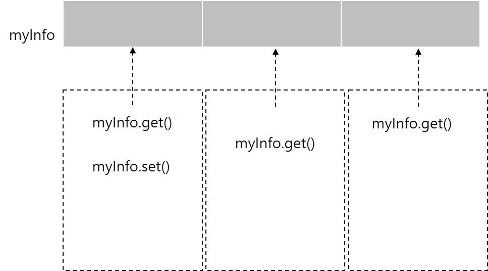
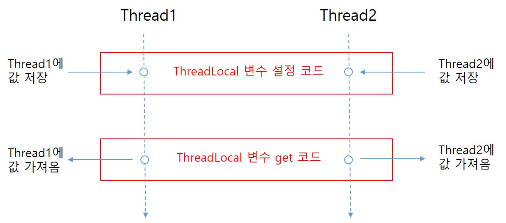

<div id="page">

<div id="main" class="aui-page-panel">

<div id="main-header">

<div id="breadcrumb-section">

1.  [Programming](README.md)
2.  [Programming](Programming_98307.md)
3.  [Java](Java_25001989.md)
4.  [Java Tech & Advanced](98462.md)

</div>

# <span id="title-text"> Programming : ThreadLocal </span>

</div>

<div id="content" class="view">

<div class="page-metadata">

Created by <span class="author"> Dongwook Han</span>, last modified on 8월 24, 2020

</div>

<div id="main-content" class="wiki-content group">

- 멀티 스레드 수행시 공유 리소스로의 접근 제어가 중요함

- 특정 변수값을 설정하고 읽는 과정을 동기화하여 사용

# 공유자원 접근 제어 방법

- synchronized 키워드로 메소드, 코드 블록 동기화

- ThreadLocal 로 각 스레드가 자신만의 전역 변수를 만들어 사용

ThreadLocal 사용\
=================

- 예제

  <div class="code panel pdl" style="border-width: 1px;">

  <div class="codeContent panelContent pdl">

  ``` syntaxhighlighter-pre
  package com.nettoall.thread.threadlocal;

  public class ThreadLocalTest implements Runnable {

      static class MyInfo {
          private String value;

          public MyInfo(String value) {
              this.value = value;
          }

          public String getValue() {
              return value;
          }
      }

      private static final ThreadLocal<MyInfo> myInfo = new ThreadLocal<MyInfo>() {
          @Override
          protected MyInfo initialValue() {
              return new MyInfo("defaultName");
          }
      };

      public void run() {
          System.out.println(
                  "Start Thread name " + Thread.currentThread().getName() + ", myInfo=" + myInfo.get().getValue());

          myInfo.set(new MyInfo("new Value From " + Thread.currentThread().getName()));
          System.out.println(
                  "End Thread name " + Thread.currentThread().getName() + ", ThreadLocal=" + myInfo.get().getValue());
      }

      public static void main(String[] args) {
          ThreadLocalTest runnable = new ThreadLocalTest();
          for (int i = 0; i < 10; i++) {
              Thread t = new Thread(runnable, "" + i);
              t.start();
          }
      }
  }
  ```

  </div>

  </div>

- MyInfo를 static 선언하여 여러 스레드가 접근 가능하도록 함

<span class="confluence-embedded-file-wrapper image-center-wrapper"></span>

- 각 Thread 마다 private static final ThreadLocal\<MyInfo\> myInfo 로 정의

- 각 Thread 는 자신에게 할당된 myInfo 정보에 접근

- ThreadLocal의 initialValue() 는 설정된 값이 없는 경우, 기본 값을 설정하기 위해 호출

- ThreadLocal 변수는 Thread 객체에 정보를 달아놔서 Thread가 동기화를 원천적으로 필요없게 만들어 놓은 방법

- 변수는 특정 코드 블럭 범위 내에서 유효

<span class="confluence-embedded-file-wrapper image-center-wrapper"></span>

- ThreadLocal은 Thread 영역에 변수를 설정하고 특정 Thread가 실행하는 모든 코드에서는 Thread에 설정된 변수가 사용 가능

# ThreadLocal 변수 초기화

- ThreadLocal 변수는 각 Thread 만 설정하고, 사용할 수 있기에 쓰레드 로컬의 initialValue() 메소드를 오버라이딩하는 방법으로 초기값 설정\

  <div class="code panel pdl" style="border-width: 1px;">

  <div class="codeContent panelContent pdl">

  ``` syntaxhighlighter-pre
  private ThreadLocal myThreadLocal = new ThreadLocal<String>(){
    @Override
    protected String initialValue(){
      return "This is initialValue";
    }
  }
  ```

  </div>

  </div>

# ThreadLocal 다루기

- ThreadLocal은 get,set 메소드를 통해 다룬다.\

  <div class="code panel pdl" style="border-width: 1px;">

  <div class="codeContent panelContent pdl">

  ``` syntaxhighlighter-pre
  myThreadLocal.set("A ThreadLocal value");
  String threadLocalValue = (String) myThreadLocal.get();
  ```

  </div>

  </div>

</div>

<div class="pageSection group">

<div class="pageSectionHeader">

## Attachments:

</div>

<div class="greybox" align="left">

 [ThreadLocal.jpg](attachments/25002461/25002507.jpg) (image/jpeg)\
 [ThreadLocal2.jpg](attachments/25002461/25067728.jpg) (image/jpeg)\

</div>

</div>

</div>

</div>

<div id="footer" role="contentinfo">

<div class="section footer-body">

Document generated by Confluence on 4월 05, 2026 17:57


</div>

</div>

</div>
