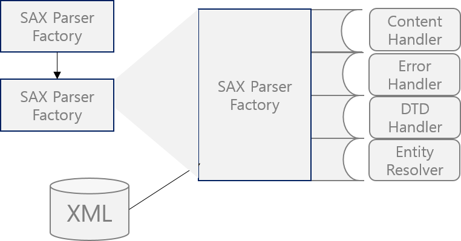

<div id="page">

<div id="main" class="aui-page-panel">

<div id="main-header">

<div id="breadcrumb-section">

1.  [Programming](README.md)
2.  [Programming](Programming_98307.md)

</div>

# <span id="title-text"> Programming : Xml </span>

</div>

<div id="content" class="view">

<div class="page-metadata">

Created by <span class="author"> Dongwook Han</span>, last modified on 4월 12, 2022

</div>

<div id="main-content" class="wiki-content group">

parsing

<a href="http://contents.kocw.or.kr/document/02-06-XML_Parser.pdf" class="external-link" rel="nofollow">http://contents.kocw.or.kr/document/02-06-XML_Parser.pdf</a>

Java API for XML Processing(JAXP)

- version 1.4 (JDK8)

- Java xml 처리 방식

  - Simple API for XML(SAX)

  - Document Object Model(DOM)

- Data와 XML 다루는 방법, Object의 표현력(표시) or 이벤트 스트림으로 다루거나 XML Data, XML 형태를 빌린 데이터, 이 데이터를 자바 프로그램이 사용하기 위한 방법을 제공

- 스타일 시트 Extensible Stylesheet Language Transformations(XSLT)

  - XML Data 를 표현하는 방법도 제공 - HTML 등으로 변환 가능

  - Namespace support로 제공하여 DTD도 작업 가능

  - JAXP는 Streaming API for XML(StAx)표준도 제공

  - JAXP는 유영하게 어떤 Xml-Compliant parser 라도 사용 가능

- Package

  - javax.xml.parsers : JAXP APIS, sAX, DOM Parsers,DOM, SAX에 대한 공통 인터페이스 제공(다른 벤더들을 위해)

  - <a href="http://org.w3c.do" class="external-link" rel="nofollow">org.w3c.do</a>m : DOM과 관련된 API

  - org.xml.SAX : SAX API 정의

  - javax.xml.transform : XSLT API 제공

  - javax.xml.stream : StAX API 제공

- SAX

  - event-driven, serial access 메커니듬

  - element by element processing

  - data repositorysk web에서 XML을 읽거나 쓰기 위해 서버와 고성능의 어플리케이션에서는 일부부만을 이해

  - XML DATA 전체가 아닌 일부만을 사용 → 메모리에 전체 Loading 안 하고 필요한 부분만 사용

  - Parser 설정

<div class="code panel pdl" style="border-width: 1px;">

<div class="codeContent panelContent pdl">

``` syntaxhighlighter-pre
SAXParserFactory spf = SAXParserFactory.newInstance();
spf.setNamespaceAware(true);
SAXParser saxParser = psf.newSAXParser();
XMLReader xmlReader = saxParser.getXMLReader();
xmlReader.setContentHandler(new SAXLocalNameCount());
xmlREaader.parse(convertToFileURL(filename));
```

</div>

</div>

- error handleing

  - fatal error의 경우 정의하지 않아도 default error-event handler가 exception 처리

  - non-fatal, warning 은 정의 안 하면 처리 못함

  - error hanlder 설정

<div class="code panel pdl" style="border-width: 1px;">

<div class="codeContent panelContent pdl">

``` syntaxhighlighter-pre
xmlReader.setErrorHandler(new MyErrorHandler(System.err));
```

</div>

</div>

- SAXParserFactory는 defualt로 사용되며 다른 벤더의 factory를 사용하려면 command line의 args를 설정

  - java -Djavax.xml.parsers.SAXParserFactory = yourfactoryHere…..

- DOM(Document Object Model APIS

  - 사용하기 가장 쉬운 API

  - DocumentBuilderFactory → DocumentBuilder

  - Object의 tree 구조를 제공

  - 모든 Ojbect model이 메모리에 적재

  - 이와 같은 이유로 서버 사이드나 in-memory representation을 제공하지 않는 application 에서는 SAX 사용

  - package

    - org.w3c.dom

    - javax.xml.parsers (DocumentBuilderFactory 등)

- XSLT(eXtensible Stylesheet Language Transformations APIs)

  - XML 데이터를 파일이나 다른 형식으로 변환 지원

  - package

    - javax.xml.transform : TransformerFactory, Transformer

    - javax.xml.transform.dom : input, output, DOM 으로부터 생성

    - javax.xml.transform.sax : SAX로부터 input, output 생성

    - javax.xml.transform,stream : IO stream으로부터 input, output 생성

- StAX

  - 스트리밍 제공, Event-Driven, Pull-parsing API 제공

  - StAX는 SAX 나 DOM 보다 간단하고 메모리 효율적임

  - streaming xml 처리에 대한 표준, 양방향 pull parser 인터페이스 제공

  - package

    - javax.xml.stream : XMLStreamReader 인터페이스 정의

    - javax.xml.transform.stax

- Simple API for XML APIs(SAX)

<span class="confluence-embedded-file-wrapper image-center-wrapper"></span>

- SAXParserFactory : SaxParser 생성

- SaxParser는 SaxReader Object를 감싼다. parse() 메소드가 호출되면 각 어플리케이션에 구현된 callback() 호출

- 해당 메소드는 ContentHandler, ErrorHandler, DTDHandler, EntityResolver 등이다.

- SAXParserFactory : 시스템 속석에 의해 정의되는 parser 인스턴스 생성

- SAXParser : 인터페이스 parse() 메소드

- SAXReader : SAX Event Handler SaxParser에 감싸 있으나 getXMLReader를 정의해서 설정해야 함 =\> SAX Event Handler가 설정한 XMLReader와 소통한다.

- DefaultHander : ContentHandler, ErrorHandler, DTDHandler, EntityResolver 인터페이스를 구현, 그 중의 하나만 Overried 하면된

- ContentHander : XML Tag를 읽고 다루는 Hander

- ErrorHander : error(), fatalError(), warning() 등 파싱 에러 처리

- DTDHandler : DTD 처리

- EntityResolver : resolveEntity() URI로 인식된 데이터를 parser가 인식하고자 할 때 호출됨. document를 찾기 위해 public URL (or URI) 대신 사용하기 위한 identifier 호출

- SAX는 서블릿 네트워크 송수신시 자주 사용 =\> 빠르고 적은 메모리 사용

  - SAX는 State independent processing

  - StAX 는 State dependent processing

  - 예를 들어 SAX 구문 분석기가 요소 테크가 발견되면 어플리케이션에서 하나의 메소드를 호출하고 텍스트가 발견되면 다른 메소드를 호출, 수행중인 처리가 상태 독립적

</div>

<div class="pageSection group">

<div class="pageSectionHeader">

## Attachments:

</div>

<div class="greybox" align="left">

 [sax001.png](attachments/213123097/352321562.png) (image/png)\

</div>

</div>

</div>

</div>

<div id="footer" role="contentinfo">

<div class="section footer-body">

Document generated by Confluence on 4월 05, 2026 17:57


</div>

</div>

</div>
